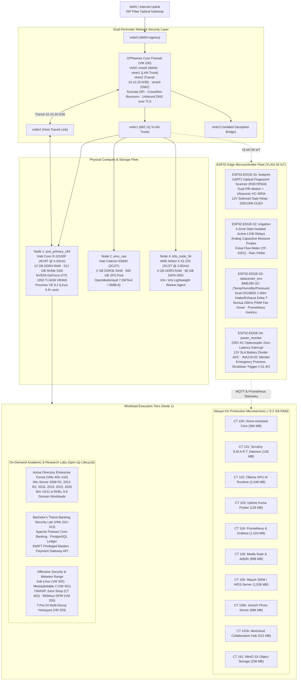

# Enterprise Platform Architecture & Hybrid Cloud Blueprint

<div align="center">

[](#)
[](https://www.proxmox.com)
[](https://opnsense.org)
[](#network-architecture)
[](https://wazuh.com)
[](esp32/README.md)
[](policy/cloud/zero_cost_policy.rego)
[](https://github.com/stefanutc1)
[](https://feaa.ucv.ro)

</div>

---

## Executive Summary

The `stefanutc1/infrastructure` platform serves as the central hybrid datacenter, private cloud, and offensive/defensive cybersecurity laboratory engineered by **Moană Ștefănuț-Cornel** (`@stefanutc1`). Designed on the tenets of **Software-Defined Infrastructure (IaC)**, **Zero-Trust Network Segmentation (802.1Q)**, **Empirical Resource Grounding ("No Fake Enterprise")**, and **Preventative Zero-Cost Cloud Guardrails**, this infrastructure unifies:

1. **24/7 Production Services**: Household automation, media streaming with Intel QSV/NVENC hardware transcoding, federated identity, and automated disaster-resilient backups.
2. **Academic Research Testbeds**: Multi-generation Active Directory domain forests (Windows Server 2008 R2 through 2025), a full-scale Core-Banking simulation (Apache Fineract, PostgreSQL ledger, SWIFT jumpbox) supporting Bachelor's Thesis research at **Universitatea din Craiova (FEAA — Informatică Economică, 2024–2027)**, and published competitive CTF writeups (100% solve rate on InvataCyber.ro CTF).
3. **Edge Microcontroller Fleet**: Four bare-metal ESP32 microcontrollers executing custom C++ firmware for physical perimeter access control, weather-aware 4-zone irrigation, datacenter rack environmental telemetry (BME280, dual DS18B20 1-Wire, Noctua 25kHz PWM fan control), and 230V mains/battery power monitoring with emergency Proxmox shutdown triggers.
4. **Zero-Cost Preventative Cloud Architecture**: Declarative multi-cloud Terraform modules (AWS, GCP, Azure) subjected to automated OPA/Conftest policy-as-code and static analyzer guardrails in CI/CD, guaranteeing strictly **$0.00 / free-tier operation** with zero accidental cloud billing.

```text
Physical Hardware ──> Type-1 Proxmox VE ──> OPNsense Firewall ──> Zero-Trust VLANs ──> GitOps IaC ──> Telemetry & Edge IoT
```

---

## 1. High-Level Architectural Blueprints

### 1.1 Physical, Edge & Logical Topology



---

## 2. Core Architectural Principles

### 2.1 Empirical Reality & "No Fake Enterprise"
Every architectural component, compute specification, and workload documented in this repository observes strict empirical reality:
1. **`DEPLOYED`**: Workloads actively executing on physical bare-metal hardware, validated by live network endpoints, process IDs, and healthcheck probes.
2. **`DECLARED`**: Production-ready code and configurations declared in Terraform (`terraform/`), Ansible (`ansible/`), or Proxmox `.conf` templates, awaiting on-demand execution.
3. **`PROPOSED`**: Target blueprints and architectural roadmaps clearly marked as non-deployed concepts.
4. **`DEFERRED`**: Technologies intentionally evaluated and rejected or postponed due to hardware resource constraints (e.g., dual-CPU requirements, enterprise SANs).

### 2.2 Strict Physical Memory Governance
Node 1 possesses exactly 12,288 MB (12 GB) of physical DDR4 RAM:
- The **Always-On Runtime Tier** consumes approximately **9,280 MB (~75% capacity)**, guaranteeing ~3,000 MB of permanent headroom for host kernel caching, ZFS ARC, and transient operational bursts.
- **On-Demand Research Labs** (Active Directory: 35 GB total declared, Bachelor's Thesis: 14 GB total declared, Security Onion: 8 GB) are strictly governed by automated startup gates (`scripts/licenta-lab-start.sh`, `scripts/ad-lab-start.sh`). Only 1 to 2 isolated lab nodes can be booted simultaneously, leveraging VirtIO memory ballooning to release inactive pages.

### 2.3 Preventative Zero-Cost Cloud Guardrails
All hybrid cloud assets (AWS, GCP, Azure) are codified under a strict **$0.00 / Free-Tier Only policy**:
- Whitelisted free-tier compute instances only: `t2.micro`, `t3.micro`, `t4g.small` (AWS), `e2-micro` (GCP), `Standard_B1s` (Azure).
- Strictly forbidden: NAT Gateways, paid Application Load Balancers, provisioned IOPS (`io1`, `io2`), and billable managed services.
- Continuous automated static policy enforcement via `scripts/verify_zero_cloud_cost.py` and Open Policy Agent (OPA) / Conftest (`policy/cloud/zero_cost_policy.rego`) integrated directly into GitHub Actions CI/CD.

---

## 3. Subsystem Architecture Specifications

### 3.1 Network & Dual-Perimeter Security
- **Perimeter Firewall**: FreeBSD-based OPNsense deployed in KVM VM 200 with VirtIO network acceleration.
- **Point-to-Point Host Transit Bus**: `vmbr2` assigns `10.10.20.1/30` (OPNsense) and `10.10.20.2/30` (Proxmox VE host), enabling line-rate inter-firewall telemetry and packet inspection without transiting physical switch ports.
- **802.1Q Segmentation**: Strict layer-2 microsegmentation across VLAN 10 (Management), VLAN 20 (Core Production), VLAN 30 (CyberLab Quarantine), VLAN 40 (Deception DMZ), and VLAN 50 (IoT Microcontrollers).
- **Intrusion Detection**: Inline Suricata deep packet inspection on LAN and WAN interfaces with custom financial fraud and lateral movement detection rules.
- **Threat Reputation**: CrowdSec firewall bouncers automatically inject malicious scanning IPs into OPNsense pf tables.
- **Encrypted DNS**: Unbound resolves recursive queries using DNS-over-TLS (DoT) upstream to Quad9 (`9.9.9.9`), enforcing local authoritative resolution for `.lan` and sinkholing malicious domains from the Romanian National Cyber Security Directorate (DNSC) blocklist.

### 3.2 Compute & Virtualization Density
- **Proxmox VE 9.2**: Type-1 bare-metal hypervisor running on the Linux 6.8+ kernel with unprivileged LXC containerization and KVM hardware virtualization.
- **LXC Container Density**: Production microservices execute in unprivileged user namespaces (`UID 100000+`), cutting RAM footprint by >80% compared to traditional virtual machines.
- **Dynamic VirtIO Memory Ballooning**: KVM guest drivers automatically return idle memory pages to the host hypervisor during low-load intervals.

### 3.3 Disaggregated Storage & 3-2-1 Data Protection
- **Tier 1 (High-IOPS Local NVMe)**: Internal 512 GB PCIe NVMe SSD formatted as LVM-thin (`local-lvm`) hosting container root filesystems, PostgreSQL ledgers, and active VM virtual disks.
- **Tier 2 (Capacity & Backup Storage Pool)**: Remote 500 GB ZFS pool (`omv_tank`) hosted on Node 2 (`omv_nas`) exported over gigabit Ethernet via NFSv4 for Proxmox vzdump archives and SMBv3 for network storage.
- **Tier 3 (Offsite Cold Sync)**: Automated client-side encrypted backup snapshots synced to air-gapped offsite object storage using Mozilla SOPS and `age` encryption.

### 3.4 Identity, Ingress & Access Management
- **Administrative Ingress**: Mutual TLS (mTLS) enforced by Caddy reverse proxy; administrative endpoints require valid client certificates issued by the internal Certificate Authority (Smallstep Step-CA).
- **Enterprise Federation**: Keycloak IAM bridges Active Directory LDAP directory services and modern OpenID Connect (OIDC) / SAML 2.0 Single Sign-On across internal web applications.
- **Active Directory Research Range**: Multi-generation Windows Server domain forest (VMs 400 to 410) dedicated to academic Kerberos, BloodHound graph modeling, and lateral movement research.

### 3.5 Artificial Intelligence Architecture (ELO Subsystem)
- **Local GPU Acceleration**: NVIDIA GeForce GTX 1050 Ti (4GB GDDR5) passed through via PCIe IOMMU to Container 102 (`ollama`) for private, local LLM inference.
- **Multi-Tier Cascade Routing**: Inbound inference requests evaluate: Primary Cloud Frontier Model -> Secondary Cloud Fallback -> Local Ollama GPU -> Deterministic Static Fallback.
- **L0–L3 Tool Gatekeeper**: Strict authorization boundaries requiring out-of-band operator multi-factor authentication (MFA) before privileged or destructive system actions can be executed.

### 3.6 Edge Microcontroller Fleet (`esp32/`)
- **Bare-Metal C++ Firmware**: Production-grade ESP32 firmware equipped with Hardware Watchdog Timers (WDT), automated Wi-Fi reconnect backoff, and MQTT telemetry integration.
- **Physical Security & Access (`esp32/footprint/`)**: R307/R504 optical fingerprint sensor, dual HC-SR501 PIR sensors, HC-SR04 ultrasonic distance measurement, 12V solenoid gate relay, and SSD1306 OLED display.
- **Precision Irrigation (`esp32/irrigation/`)**: 4-zone optically isolated active-LOW relay driver, capacitive analog soil moisture probes, rain sensor inhibit logic, and YF-S201 pulse flow meter interrupt counter.
- **Datacenter Rack Telemetry (`esp32/datacenter_environment/`)**: BME280 I2C sensor (temp/humidity/pressure), dual DS18B20 1-Wire sensors calculating rack intake/exhaust delta-T, Noctua 25kHz PWM fan control with tachometer RPM feedback, and an embedded Prometheus HTTP `/metrics` exporter.
- **Power Telemetry & Grid Resiliency (`esp32/power_monitor/`)**: 230V AC optocoupler zero-latency mains interrupt, 12V SLA battery divider ADC, INA219 digital power sensor, and automated emergency Proxmox shutdown triggers when battery drops below 11.4V.

---

## 4. Architecture Decision Records (ADRs)

Key architectural trade-offs and design decisions are formally cataloged in [`docs/decisions/`](docs/decisions/):

- [**ADR-0001**](docs/decisions/ADR-0001-proxmox-primary-hypervisor.md): Proxmox VE as Primary Bare-Metal Hypervisor vs. Pure Bare-Metal Kubernetes
- [**ADR-0002**](docs/decisions/ADR-0002-lxc-container-density.md): LXC Unprivileged Container Density for Core Microservices
- [**ADR-0003**](docs/decisions/ADR-0003-opnsense-perimeter-gateway.md): Virtualized OPNsense Dual-Perimeter Gateway with Bridge Transit
- [**ADR-0004**](docs/decisions/ADR-0004-storage-tiering-local-zfs.md): Two-Tier Storage Architecture: Local NVMe `local-lvm` & Remote ZFS NAS
- [**ADR-0005**](docs/decisions/ADR-0005-identity-access-strategy.md): Ingress mTLS / OAuth2-Proxy & On-Demand Active Directory Research Lab
- [**ADR-0006**](docs/decisions/ADR-0006-secrets-management-hygiene.md): GitOps Zero-Plaintext Secret Hygiene & SOPS/Age Ingestion
- [**ADR-0007**](docs/decisions/ADR-0007-edge-kubernetes-k3s-k0s.md): Single-Node Lightweight Kubernetes (k3s/k0s) on Legacy Hardware
- [**ADR-0008**](docs/decisions/ADR-0008-elo-ai-routing-security-gatekeeper.md): ELO Multi-Tier Cascade Routing & L0–L3 Tool Execution Gatekeeper

---

## 5. Master Platform Documentation Map

| Document | Primary Focus | Target Engineering Role |
| :--- | :--- | :--- |
| [`INFRASTRUCTURE.md`](INFRASTRUCTURE.md) | Physical nodes, hardware specs, VM/LXC allocation, capacity budget, ESP32 fleet | Systems & Platform Engineers |
| [`SERVICES.md`](SERVICES.md) | 43-service catalog, ports, protocols, auth, backup, criticality, lifecycle | Application & Operations Teams |
| [`NETWORK.md`](NETWORK.md) | VLAN matrix, routing, bridges, firewall policies, WireGuard VPN, DNS sinkholing | Network & Security Engineers |
| [`SECURITY.md`](SECURITY.md) | STRIDE threat model, CIS benchmarks, PKI, secrets, Wazuh, Suricata, zero-cost policy | SecOps & Compliance Auditors |
| [`OPERATIONS.md`](OPERATIONS.md) | Day-2 runbooks, cold boot sequencing, emergency shutdown, updates, ESP32 triggers | SRE & Operations Engineers |
| [`BACKUP.md`](BACKUP.md) | 3-2-1 backup strategy, PBS client, ZFS snapshots, RPO/RTO matrix, restore drills | Backup & Storage Administrators |
| [`DISASTER-RECOVERY.md`](DISASTER-RECOVERY.md) | Business continuity plan, disaster classification, bare-metal rebuild runbooks | Incident Commanders & SREs |
| [`CONTRIBUTING.md`](CONTRIBUTING.md) | Contribution standards, IaC formatting, Git workflow, testing, CI validation gates | Software & DevOps Engineers |
| [`esp32/README.md`](esp32/README.md) | ESP32 edge firmware suite, pinouts, MQTT schemas, Prometheus endpoints, safety specs | Embedded Systems Engineers |

---

<div align="center">

*Engineered with precision by **Moană Ștefănuț-Cornel** (`@stefanutc1`).*  
*Universitatea din Craiova · Facultatea de Economie și Administrarea Afacerilor (FEAA) · Informatică Economică (2024–2027).*

</div>
