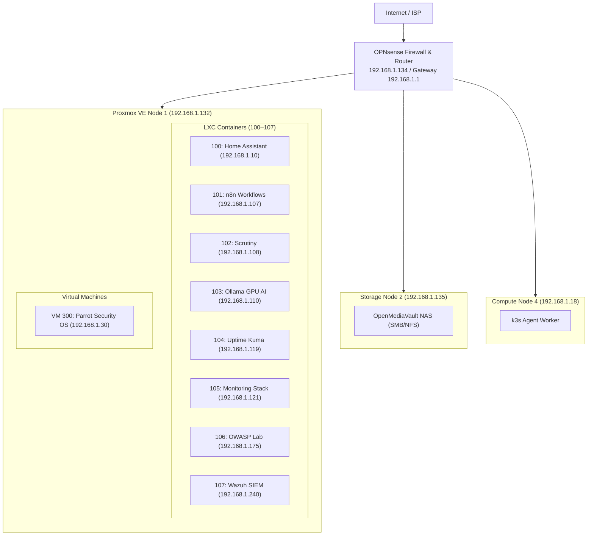

# Homelab

[](https://github.com/stefanutc1/infrastructure/actions)
[](https://proxmox.com)
[](https://opnsense.org)
[](cyber/)
[](LICENSE)

<!-- AUTO-METRICS-START -->
[](https://stefanutc1.github.io/infrastructure/)
[-brightgreen?style=flat&logo=githubactions)](https://github.com/stefanutc1/infrastructure/actions/workflows/ci.yml)
[](https://github.com/stefanutc1/infrastructure/actions/workflows/cd.yml)
[](https://github.com/stefanutc1/infrastructure/actions)
<!-- AUTO-METRICS-END -->

---

## 1. Overview

Personal homelab infrastructure repository. It contains Terraform configurations, Ansible playbooks, network setup notes, and security investigation writeups.

The setup consists of:
- **Node 1 (Proxmox VE)**: Primary hypervisor hosting LXC containers and security virtual machines.
- **Node 2 (OpenMediaVault)**: NAS for storage and backups on an older ASUS laptop.
- **Node 4 (k3s worker)**: Dedicated worker for lightweight container experiments.
- **OPNsense**: Perimeter router and firewall with Unbound DNS sinkholing.



---

## 2. Hardware

| Node | Machine / Chassis | CPU | GPU | RAM | Storage | Role |
| :--- | :--- | :--- | :--- | :--- | :--- | :--- |
| **`pve` (Node 1)** | Desktop Tower | Intel Core i3-10100F (4C/8T @ 4.30 GHz) | NVIDIA GeForce GTX 1050 Ti (4GB) | 12 GB DDR4 | 512 GB NVMe SSD | Hypervisor: LXC 100–107, VM 300 |
| **`omv` (Node 2)** | ASUS X451MA | Intel Celeron N2830 (2C/2T @ 2.41 GHz) | Intel HD Graphics | 2 GB DDR3 | 500 GB HDD | OpenMediaVault NAS (SMB / NFS shares) |
| **`k8s-node-04` (Node 4)** | Desktop ATX | AMD Athlon II X2 220 (2C/2T @ 2.80 GHz) | NVIDIA GeForce GTS 250 (1GB) | 4 GB DDR3 | 80 GB HDD | k3s agent worker node |

---

## 3. Services & Workloads

### LXC Containers (100–107)

| VMID | Hostname | Base OS | Cores | Memory | Disk | IP Address | Service |
| :---: | :--- | :--- | :---: | :---: | :---: | :--- | :--- |
| **100** | `homeassistant` | Debian 13 | 2 | 384 MB | 16 GB | `192.168.1.10` | Home Assistant (smart home hub) |
| **101** | `n8n` | Debian 13 | 2 | 384 MB | 8 GB | `192.168.1.107` | n8n workflow automation |
| **102** | `scrutiny` | Debian 13 | 1 | 128 MB | 4 GB | `192.168.1.108` | Scrutiny (disk health & S.M.A.R.T.) |
| **103** | `ollama` | Debian 13 | 4 | 2048 MB | 16 GB | `192.168.1.110` | Ollama LLM (GTX 1050 Ti passthrough) |
| **104** | `uptimekuma` | Alpine 3.24 | 1 | 128 MB | 2 GB | `192.168.1.119` | Uptime Kuma (service status monitor) |
| **105** | `monitoring` | Alpine 3.24 | 1 | 256 MB | 4 GB | `192.168.1.121` | Prometheus & Grafana |
| **106** | `owasp` | Alpine 3.24 | 2 | 512 MB | 8 GB | `192.168.1.175` | OWASP Juice Shop test environment |
| **107** | `wazuh` | Ubuntu 24.04 | 4 | 6144 MB | 35 GB | `192.168.1.240` | Wazuh SIEM manager, indexer & dashboard |

### Virtual Machines

| VMID | Name | OS | Cores | Memory | Disk | IP Address | Purpose |
| :---: | :--- | :--- | :---: | :---: | :---: | :--- | :--- |
| **300** | `parrot` | Parrot Security OS | 2 | 2048 MB | 30 GB | `192.168.1.30` | Security testing and network tools workstation |

---

## 4. Network & VLANs

VLAN configuration handled through OPNsense:

| VLAN ID | Name | Subnet | Gateway | Notes |
| :---: | :--- | :--- | :--- | :--- |
| **10** | Management | `192.168.1.0/24` | `192.168.1.1` | Proxmox host, NAS, core network management. |
| **20** | Services | `192.168.20.0/24` | `192.168.1.134` | LXC containers and local applications. |
| **30** | Lab | `192.168.30.0/24` | `192.168.1.134` | Security lab segment on bridge `vmbr1`. |
| **40** | DMZ | `192.168.40.0/24` | `192.168.1.134` | Isolated testing zone. |
| **50** | IoT | `192.168.50.0/24` | `192.168.1.134` | Smart home devices, isolated from LAN. |

---

## 5. Security & Investigations (`cyber/`)

The [`cyber/`](cyber/) folder contains writeups, notes, and Indicators of Compromise (IoCs) from real phishing and fraud campaigns investigated locally:

1. [Media Galaxy Brand Impersonation](cyber/mediagalaxy-ecommerce-fraud-forensics/README.md) (`SEC-2026-ECOM-005`): Sponsored ad phishing campaign; reported to DNSC (#178465) and blocked on PNRISC.
2. [Revolut Vishing Case Study](cyber/revolut-vishing-forensics/README.md) (`SEC-2026-VISH-002`): Caller ID spoofing and OTP interception analysis.
3. [Task Scam Analysis](cyber/task-scam-infrastructure-analysis/README.md) (`SEC-2026-TASK-003`): Fake job / deposit scam reverse-engineered.
4. [TikTok MRR Scam Funnels](cyber/tiktok-mrr-scam-infrastructure/README.md) (`SEC-2025-MRR-001`): Resale course marketing funnel investigation.
5. [Steam OpenID Phishing](cyber/openid-mitm-phishing-forensics/README.md) (`SEC-2025-AITM-004`): Browser-in-the-Middle credential interception writeup.

### Blocklists & OPNsense Sync
A combined domain blocklist is kept in `cyber/forbidden_domains.txt` and synced to OPNsense Unbound DNS for local sinkholing.

---

## 6. Automation

### Terraform (`terraform/`)
Manages Proxmox LXC containers and virtual machines:

```bash
cd terraform/proxmox
terraform init
terraform plan
terraform apply
```

### Ansible (`ansible/`)
Handles baseline configuration and service tasks:

```bash
cd ansible
ansible-playbook -i inventories/homelab/hosts.yml playbook.yml
```

---

## 7. Repository Structure

```text
.
├── ansible/              # Playbooks and inventory files
├── cyber/                # Investigation writeups, CTF, and domain blocklists
├── docs/                 # Additional lab documentation
├── hardware/             # Host specifications
├── kubernetes/           # k3s manifests and configs
├── scripts/              # Validation scripts and blocklist sync tools
├── services/             # Service configuration templates
└── terraform/            # Proxmox IaC configurations
```
