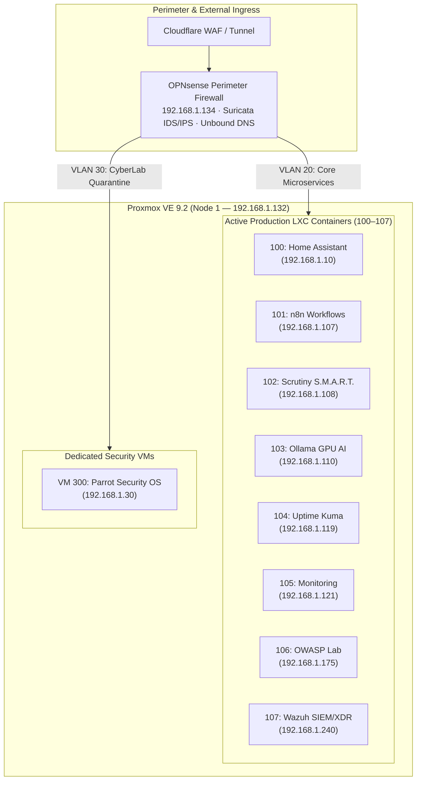

# 🏛️ Enterprise Homelab & Threat Intelligence Datacenter

[](https://github.com/stefanutc1/infrastructure/actions)
[-brightgreen?style=flat&logo=terraform)](terraform/)
[](https://proxmox.com)
[](https://opnsense.org)
[-teal?style=flat&logo=wazuh)](cyber/)
[](ai/)
[](LICENSE)

---

## 1. Overview & Architecture

This repository contains the complete **Infrastructure-as-Code (IaC)**, configuration management, and **Cyber Defense / Digital Forensics (DFIR)** portfolio for an enterprise hybrid homelab datacenter.



### Core Design Principles
* **Declarative GitOps**: 100% of virtualization, networking, and OS hardening managed through Terraform and Ansible.
* **Defense-in-Depth**: Default-deny stateful firewalling via OPNsense, continuous Suricata IDS inspection, and Wazuh SIEM telemetry correlation.
* **Resource Optimization**: Lightweight Alpine and Debian LXCs paired with ZRAM (lz4) swap compression and VirtIO memory ballooning on constrained hardware.

---

## 2. Hardware Fleet

| Host Identifier | Chassis / Node | CPU & Architecture | Accelerator / GPU | RAM | Primary Storage | Role |
| :--- | :--- | :--- | :--- | :--- | :--- | :--- |
| **`pve` (Node 1)** | Custom ATX Tower | Intel Core i3-10100F (4C/8T @ 4.30 GHz) | NVIDIA GeForce GTX 1050 Ti (4GB VRAM) | 12 GB DDR4-2133 | 512 GB NVMe SSD (`local-lvm`) | Primary Hypervisor: LXC fleet (100–107) & Security VMs |
| **`omv` (Node 2)** | ASUS X451MA | Intel Celeron N2830 (2C/2T @ 2.41 GHz) | Intel HD Graphics | 2 GB DDR3 | 500 GB HDD | OpenMediaVault Storage NAS, SMB/NFS Shares |
| **`k8s-node-04` (Node 4)** | Custom Compute ATX | AMD Athlon II X2 220 (2C/2T @ 2.80 GHz) | NVIDIA GeForce GTS 250 (1GB) | 4 GB DDR3 | 80 GB SATA HDD | Bare-metal Kubernetes (k3s-agent) Worker |

---

## 3. Active Workload Roster

### Production LXC Containers (Contiguous 100–107)

| VMID | Hostname | Base OS | Cores | Memory | Disk | IP Address | Primary Role |
| :---: | :--- | :--- | :---: | :---: | :---: | :--- | :--- |
| **100** | `homeassistant` | Debian 13 | 2 | 384 MB | 16 GB | `192.168.1.10` | Smart Home Hub, Zigbee & IoT Gateway |
| **101** | `n8n` | Debian 13 | 2 | 384 MB | 8 GB | `192.168.1.107` | Workflow Automation, Event Webhooks & SOAR |
| **102** | `scrutiny` | Debian 13 | 1 | 128 MB | 4 GB | `192.168.1.108` | S.M.A.R.T. Storage Health & Drive Telemetry |
| **103** | `ollama` | Debian 13 | 4 | 2048 MB | 16 GB | `192.168.1.110` | Local AI LLM Runtime (GTX 1050 Ti Passthrough) |
| **104** | `uptimekuma` | Alpine 3.24 | 1 | 128 MB | 2 GB | `192.168.1.119` | Endpoint Availability & Health Status Monitoring |
| **105** | `monitoring` | Alpine 3.24 | 1 | 256 MB | 4 GB | `192.168.1.121` | Prometheus Metrics Engine & Grafana Dashboards |
| **106** | `owasp` | Alpine 3.24 | 2 | 512 MB | 8 GB | `192.168.1.175` | Vulnerability Assessment & Pentest Proving Ground |
| **107** | `wazuh` | Ubuntu 24.04 | 4 | 6144 MB | 35 GB | `192.168.1.240` | Wazuh SIEM/XDR Manager, Indexer (4GB Heap) & Web UI |

### Dedicated Virtual Machines

| VMID | Name | OS | Cores | Memory | Disk | IP Address | Description |
| :---: | :--- | :--- | :---: | :---: | :---: | :--- | :--- |
| **300** | `parrot` | Parrot Security OS | 2 | 2048 MB | 30 GB | `192.168.1.30` | Dedicated Offensive Security & Threat Analysis Workstation |

---

## 4. Network Segmentation & Firewalling

The network uses strict layer 2/3 segmentation enforced by OPNsense and Proxmox VE firewalls:

| VLAN ID | Segment Name | Subnet | Gateway | Default Policy | Access Rules |
| :---: | :--- | :--- | :--- | :---: | :--- |
| **10** | Management & Storage | `192.168.1.0/24` | `192.168.1.1` | **PASS** | Full admin access to all subnets; Proxmox host, NAS, IPMI. |
| **20** | Core Microservices | `192.168.20.0/24` | `192.168.1.134` | **DROP** | Container communication restricted to authorized ports (DNS, API). |
| **30** | CyberLab & Sandboxes | `192.168.30.0/24` | `192.168.1.134` | **DROP** | Quarantined research segment on isolated bridge `vmbr1`; zero WAN egress. |
| **40** | DMZ Deception | `192.168.40.0/24` | `192.168.1.134` | **DROP** | Isolated honeypot network; all ingress strictly logged and forwarded to SIEM. |
| **50** | IoT & Edge Sensors | `192.168.50.0/24` | `192.168.1.134` | **DROP** | Isolated smart devices; outbound access restricted to MQTT (`1883/tcp`). |

---

## 5. Cyber Defense, Threat Intelligence & Forensics (`cyber/`)

The [`cyber/`](cyber/) directory contains five real-world digital forensics investigations and threat intelligence operations:

1. [**Media Galaxy Brand Spoofing**](cyber/mediagalaxy-ecommerce-fraud-forensics/README.md) (`SEC-2026-ECOM-005`): TikTok ad phishing funnel backed by Chinese SaaS (`yiyangsaas.com`); escalated to national CSIRT (DNSC #178465) and blocked on PNRISC.
2. [**Revolut FinTech Vishing**](cyber/revolut-vishing-forensics/README.md) (`SEC-2026-VISH-002`): VoIP SIP caller ID spoofing and real-time 3DS OTP relay fraud.
3. [**Task Scam & Crypto Drainage**](cyber/task-scam-infrastructure-analysis/README.md) (`SEC-2026-TASK-003`): Reverse engineering pig-butchering platform APIs with hardcoded fiat withdrawal kill-switches.
4. [**TikTok MRR Scam Infrastructure**](cyber/tiktok-mrr-scam-infrastructure/README.md) (`SEC-2025-MRR-001`): Algorithmic ad funnels driving users to predatory resale schemes.
5. [**Steam OpenID AiTM Phishing**](cyber/openid-mitm-phishing-forensics/README.md) (`SEC-2025-AITM-004`): Browser-in-the-Middle (BitM) session relay targeting Steam Guard 2FA.

### Automated CSIRT Threat Feed Sync
The repository maintains an automated threat feed (`cyber/forbidden_domains.txt`) combining internal forensic findings with authoritative CSIRTs ([DNSC](https://dnsc.ro), CISA, NCSC-UK, CCCS, ACSC). Synchronized daily at **05:00 Europe/Bucharest** into OPNsense Unbound DNS for real-time sinkholing.

---

## 6. Infrastructure as Code & Automation

### Terraform Architecture (`terraform/`)
Virtual machines and LXC containers are provisioned declaratively via the `bpg/proxmox` provider:

```bash
cd terraform/proxmox
terraform init
terraform plan
terraform apply
```

### Ansible Orchestration (`ansible/`)
Node configuration, security baseline hardening, and service updates are automated via Ansible playbooks:

```bash
cd ansible
ansible-playbook -i inventories/homelab/hosts.yml playbook.yml
```

---

## 7. CI/CD Quality Engineering

Every pull request and commit to `main` undergoes automated testing:

* **Static Security & IoC Hygiene**: [`scripts/verify_ioc_hygiene.py`](scripts/verify_ioc_hygiene.py) ensures domain blocklists are deduplicated, lowercase, and strictly validated.
* **Suricata Rules Syntax Gate**: [`scripts/verify_suricata_rules.py`](scripts/verify_suricata_rules.py) validates IDS signatures with SID uniqueness checks.
* **Terraform & Ansible Linting**: Enforces declarative syntax and formatting standards before deployment.

---

## 8. Monorepo Structure

```text
.
├── .github/workflows/    # CI/CD pipelines (CI quality gates, CD automated sync)
├── ansible/              # Playbooks, roles, group_vars, and host inventories
├── cyber/                # DFIR case studies, threat feeds, CTF, and CVE advisories
├── docs/                 # Thesis architecture & lab specifications
├── hardware/             # Physical host specs and hardware documentation
├── kubernetes/           # Bare-metal k3s manifests and cluster profiles
├── scripts/              # Validation gates, IoC synchronizers, and operational tooling
├── services/             # Workload definitions and service configurations
└── terraform/            # Declarative Proxmox VE IaC configurations and modules
```

---

<div align="center">
  <sub>Maintained with rigorous engineering standards by <a href="https://github.com/stefanutc1">@stefanutc1</a>. Licensed under AGPL-3.0.</sub>

<!-- AUTO-METRICS-START -->
[](https://stefanutc1.github.io/infrastructure/)
[-brightgreen?style=flat&logo=githubactions)](https://github.com/stefanutc1/infrastructure/actions/workflows/ci.yml)
[](https://github.com/stefanutc1/infrastructure/actions/workflows/cd.yml)
[](https://github.com/stefanutc1/infrastructure/actions)
<!-- AUTO-METRICS-END -->
</div>
