<div align="center">


[](https://github.com/stefanutc1/infrastructure/actions)
[-brightgreen?style=flat&logo=terraform)](https://github.com/stefanutc1/infrastructure/tree/main/terraform)
[](https://status.homelab.local)
[](https://github.com/stefanutc1/infrastructure)
[](https://github.com/stefanutc1/infrastructure)
[](https://github.com/stefanutc1/infrastructure)
[](LICENSE)

<br/>

**Infrastructure platform with Proxmox VE virtualization on x86_64, enterprise firewall routing (OPNsense perimeter NGFW + Proxmox VE defense-in-depth), ZFS storage arrays, declarative Terraform/Ansible automation, and eBPF runtime observability.**

[Live Interactive Web Architecture Viewer](https://stefanutc1.github.io/infrastructure/) • [Architecture Blueprint](ARCHITECTURE.md) • [Cyber Forensics Suite](https://stefanutc1.github.io/infrastructure/#cyber) • [Security Policy](SECURITY.md)

<!-- AUTO-METRICS-START -->
[](https://stefanutc1.github.io/infrastructure/)
[-brightgreen?style=flat&logo=githubactions)](https://github.com/stefanutc1/infrastructure/actions/workflows/ci.yml)
[](https://github.com/stefanutc1/infrastructure/actions/workflows/cd.yml)
[](https://github.com/stefanutc1/infrastructure/actions)
<!-- AUTO-METRICS-END -->
</div>

---

## Table of Contents

1. [Mission & Design Principles](#1-mission--design-principles)
2. [End-to-End Architecture & Network Topology](#2-end-to-end-architecture--network-topology)
3. [Physical Hardware Fleet & Power Delivery](#3-physical-hardware-fleet--power-delivery)
4. [LXC Containers & VM Workloads Resource Matrix](#4-lxc-containers--vm-workloads-resource-matrix)
5. [Storage Architecture & ZFS Pool Optimization](#5-storage-architecture--zfs-pool-optimization)
6. [Network Segmentation & Inter-VLAN Firewall Matrix](#6-network-segmentation--inter-vlan-firewall-matrix)
7. [Ingress Traffic, Zero-Trust Authentication & Split-Horizon DNS](#7-ingress-traffic-zero-trust-authentication--split-horizon-dns)
8. [Infrastructure as Code (Terraform & Ansible)](#8-infrastructure-as-code-terraform--ansible)
9. [Kubernetes & GitOps Deployment Lifecycle](#9-kubernetes--gitops-deployment-lifecycle)
10. [LGTM Observability Stack & Telemetry Pipeline](#10-lgtm-observability-stack--telemetry-pipeline)
11. [3-2-1 Backup Strategy, Sanoid & Disaster Recovery](#11-3-2-1-backup-strategy-sanoid--disaster-recovery)
12. [Cybersecurity Test Environment, SOC & eBPF Security](#12-cyber-defense-proving-ground-soc--ebpf-security)
13. [Local GPU AI LLM Runtime (Ollama CT 110)](#13-local-gpu-ai-llm-runtime-ollama-ct-110)
14. [Chaos Engineering & Resiliency Validation](#14-chaos-engineering--resiliency-validation)
15. [Environmental Telemetry & Closed-Loop Fan Control](#15-environmental-telemetry--closed-loop-fan-control)
16. [Security Hardening & Cryptographic Integrity](#16-security-hardening--cryptographic-integrity)
17. [Static IP & Ports Directory](#17-static-ip--ports-directory)
18. [Cold-Start Runbook & Operational Cheat Sheet](#18-cold-start-runbook--operational-cheat-sheet)
19. [Troubleshooting FAQ](#19-troubleshooting-faq)
20. [Monorepo Layout & Engineering Portfolio](#20-monorepo-layout--contributing)

---

## 1. Mission & Design Principles

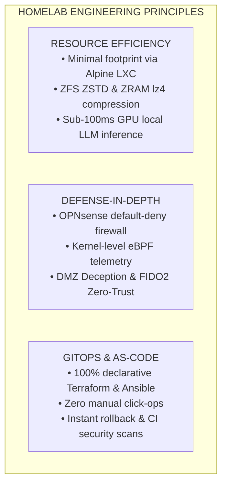

* **Resource Efficiency**: High-density virtualization utilizing minimal CPU/RAM footprints. Alpine Linux and Debian slim containers maximize performance on constrained silicon.
* **Defense-in-Depth**: Strict L2/L3 segmentation across 5 VLANs, CrowdSec real-time IP reputation bouncers, Suricata intrusion detection, and kernel-level Cilium Tetragon tracing.
* **Declarative GitOps**: Every container, VM, firewall rule, dashboard, and secret is managed declaratively through version-controlled Terraform, Ansible, and Docker manifests.
* **High Availability & Fault Tolerance**: Automated disaster recovery snapshots, virtual IP failover, cold-start runbooks, and UPS battery backup with controlled sequential shutdown.

---

## 2. End-to-End Architecture & Network Topology

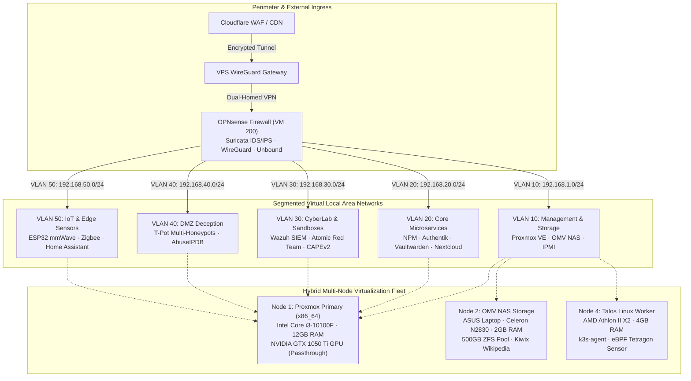

---


### 2.3 OPNsense Enterprise Architecture (5 Security Pillars)

The perimeter firewall **OPNsense (VM 200 · 192.168.1.134)** implements a unified enterprise defense suite running in the FreeBSD kernel (`pf`):

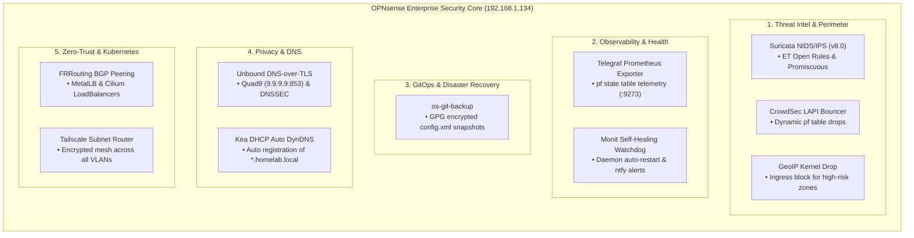

| Strategic Pillar | Technology & Module | Cluster Role & Functionality | Port / Protocol | **Threat Intel** | Suricata 8.0 + CrowdSec + GeoIP | Deep packet inspection, collaborative IP reputation, and GeoIP drop | WAN / VLAN Promisc | **GitOps & DR** | `os-git-backup` (GPG Encrypted) | Automatic Git versioning of `config.xml` on every administrative change | Git SSH Hook | **Zero-Trust Mesh** | FRRouting BGP + Tailscale Subnet | Dynamic K8s MetalLB routing and remote mesh access without open ports | `:179 BGP` / Mesh |

### 2.4 OPNsense 802.1Q VLAN Micro-Segmentation & Security Policies

The perimeter firewall OPNsense (VM 200 · 192.168.1.134) enforces zero-trust 802.1Q micro-segmentation across 5 isolated VLANs using strict Packet Filter (`pf`) rules:


| VLAN ID | Network Segment | Subnet CIDR | Gateway | Attached Workloads | Security Policy | **VLAN 10** | Management & Storage Subnet | `192.168.1.0/24` | `192.168.1.1` | Proxmox Core (x86_64), OMV NAS, Managed Switches | Isolated from IoT & Guest subnets | **VLAN 30** | Cyber Security & Sandboxes (CyberLab) | `192.168.30.0/24` | `192.168.1.134:8443` | Wazuh XDR SIEM (1514), Suricata IDS, Atomic Red Team, CAPEv2 / Cuckoo Sandbox (Win10 + INetSim) | Promiscuous SPAN mirror port, no outbound WAN access for sandboxes | **VLAN 50** | IoT & Physical Edge Devices | `192.168.50.0/24` | `192.168.1.134 (OPNsense)` | ESP32 mmWave Radar, ESP32 Irrigation Relays, Zigbee Gateway | MQTT communication strictly restricted to Home Assistant (CT 106) |

---

## 3. Hybrid Multi-Cloud Architecture (Azure, GCP, AWS)

The on-premise cluster is extended into a true hybrid multi-cloud topology across **Microsoft Azure**, **Google Cloud Platform (GCP)**, and **Amazon Web Services (AWS)** using declarative, modular Infrastructure as Code (IaC) located in [`cloud/`](cloud/) and [`terraform/`](terraform/):

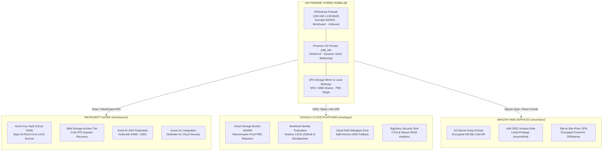

### Cloud Integration & Zero-Cost Tiering Matrix

| Cloud Provider | IaC Directory | Core Declarative Resources | Cost Optimization Tier | **Microsoft Azure** | [`cloud/azure/`](cloud/azure/) | `azurerm_key_vault` (Cloud HSM Root CA & LUKS), `azurerm_storage_blob` (Archive Tier DR), `azuread_application` (SSO Authentik), `azurerm_arc_machine` (Defender for Cloud) | Archive Tier + Free Tier HSM | **Amazon Web Services** | [`cloud/aws/`](cloud/aws/) | `aws_s3_bucket` (Glacier Deep Archive 365d), `aws_iam_openid_connect_provider` (Keyless CI/CD AssumeRole), `aws_vpn_connection` (Site-to-Site IPsec OPNsense) | Glacier Deep Archive + Free STS |

---

## 4. Enterprise CI/CD Quality Matrix

Infrastructure and application code are validated and deployed continuously across automated GitHub Actions CI/CD workflows:

| # | Workflow File | Pipeline Name | Automated Quality Guarantees & Checks |
|---|---|---|---|
| 1 | [`.github/workflows/ci.yml`](.github/workflows/ci.yml) | **Continuous Integration** | IaC validation (`terraform fmt` & `validate`), Web Frontend build & test (Angular 20), Dockerfile & policy linting, Secret & security scanning |
| 2 | [`.github/workflows/cd.yml`](.github/workflows/cd.yml) | **Continuous Deployment** | Automated Dependabot PR merge (daily 05:00 AM Europe/Bucharest), Angular Web production build & GitHub Pages deployment, README metrics auto-sync |
| 3 | [`.github/workflows/chaos.yml`](.github/workflows/chaos.yml) | **Chaos Engineering** | Automated chaos injection, network partition resilience, service health probing |

---

## 9. Physical Hardware Fleet & Power Delivery

### Hardware Specifications Matrix

| Node Identifier | Form Factor / Chassis | CPU Architecture | Accelerator / GPU | RAM Allocation | Storage Configuration | Primary Purpose | **`pve` (Node 1)** | Custom ATX Tower | Intel Core i3-10100F (4C/8T @ 4.30 GHz) | NVIDIA GeForce GTX 1050 Ti (4GB VRAM) | 12 GB DDR4-2133 (12,288 MB) | 512 GB NVMe SSD (`local-lvm`) | Primary Hypervisor: Windows Server 2025 Datacenter AD, OPNsense, Ollama GPU (CT 110), Immich AI | **`kubernetes` (Node 4)** | Custom ATX Chassis | AMD Athlon II X2 220 (2C/2T @ 2.80 GHz) | NVIDIA GeForce GTS 250 (1GB) | 4 GB DDR3-1333 | 80 GB HDD (NFS Root) | Immutable Talos Linux / k3s worker, batch cron workloads, eBPF security probing |

### Power Delivery & NUT Controlled Shutdown Sequence

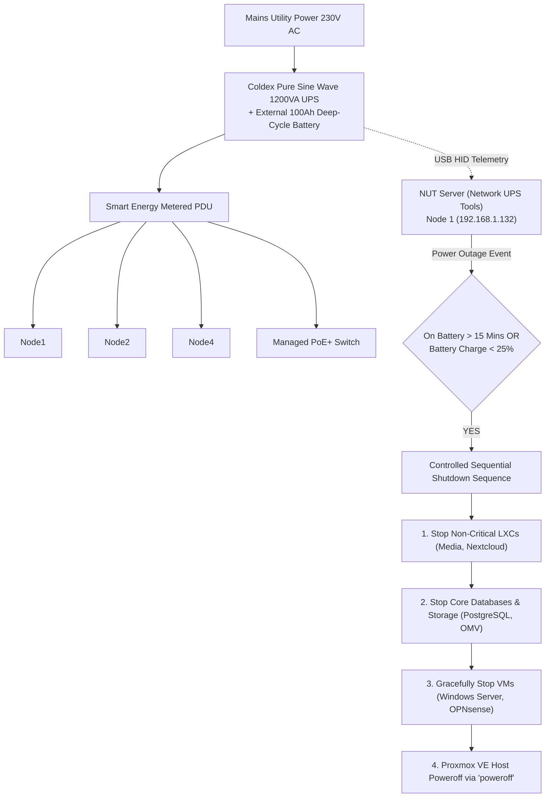

---

## 10. LXC Containers & VM Workloads Resource Matrix

### Granular LXC Container Roster (Node 1 — x86_64 Primary: CT 100 - CT 120)

| VMID | Hostname | Base OS | vCPU | RAM Allocation | Storage Pool | Static IP | Subsystem Category | Primary Workload |
| :--- | :--- | :--- | :--- | :--- | :--- | :--- | :--- | :--- |
| **100** | `immich` | Alpine 3.24 | 2 | 256 MB | `local-lvm:40G` | `192.168.1.15` | Storage / AI | Photo Library + Machine Learning Face Recognition |
| **101** | `nextcloud` | Alpine 3.24 | 1 | 256 MB | `local-lvm:50G` | `192.168.1.8` | Storage / Cloud | Private Cloud Hub & Distributed File Synchronization |
| **102** | `homeassistant` | Alpine 3.24 | 1 | 128 MB | `local-lvm:16G` | `192.168.1.10` | Automation | Smart Home Hub, Zigbee & ESP32 Telemetry Gateway |
| **103** | `n8n` | Alpine 3.24 | 2 | 256 MB | `local-lvm:8G` | `192.168.1.13` | Automation | Workflow Automation & Event Webhook Processing |
| **104** | `scrutiny` | Alpine 3.24 | 1 | 96 MB | `local-lvm:3G` | `192.168.1.18` | Monitoring | Scrutiny S.M.A.R.T. Drive Health & Telemetry Agent |
| **105** | `jellyfin` | Alpine 3.24 | 2 | 896 MB | `local-lvm:50G` | `192.168.1.21` | Media / Streaming | Jellyfin Media Server & DLNA Hardware-Accelerated Streaming |
| **106** | `ollama` | Debian 13 | 1 | 2048 MB | `local-lvm:16G` | `192.168.1.110` | Local AI | Ollama GPU LLM Runtime (Qwen2.5-Coder & DeepSeek-R1) |
| **107** | `openwebui` | Debian 13 | 1 | 512 MB | `local-lvm:8G` | `192.168.1.111` | Local AI | Open-WebUI Assistant & Multi-Model Inference Interface |
| **108** | `whisper` | Debian 13 | 1 | 1024 MB | `local-lvm:8G` | `192.168.1.112` | Local AI | Faster-Whisper Speech-to-Text CUDA Accelerated API |
| **109** | `paperless-ai` | Alpine 3.24 | 1 | 64 MB | `local-lvm:1G` | `192.168.1.56` | Local AI | Paperless-AI Automated OCR & DeepSeek Document Tagging |
| **110** | `code-server` | Alpine 3.24 | 1 | 512 MB | `local-lvm:4G` | `192.168.1.115` | Dev / IDE | Code-Server Web IDE (VS Code Cloud Workspace) |
| **111** | `proxmox-backup-server` | Alpine 3.24 | 1 | 512 MB | `local-lvm:4G` | `192.168.1.116` | Storage / Backup | Proxmox Backup Server (PBS Enterprise Deduplication & Verification) |
| **112** | `proxmox-datacenter-manager` | Alpine 3.24 | 1 | 512 MB | `local-lvm:4G` | `192.168.1.117` | Management | Proxmox Datacenter Manager (PDM Multi-Cluster Fleet UI) |
| **113** | `woodpecker-k0s` | Alpine 3.24 | 1 | 512 MB | `local-lvm:8G` | `192.168.1.118` | CI/CD | Woodpecker CI Server & Runner on Alpine Linux backed by k0s Kubernetes Engine |
| **114** | `it-tools` | Alpine 3.24 | 1 | 128 MB | `local-lvm:2G` | `192.168.1.115` | Dev / Tools | Collection of handy online tools for developers and system operations |
| **115** | `uptimekuma` | Alpine 3.24 | 1 | 128 MB | `local-lvm:2G` | `192.168.1.119` | Monitoring / Uptime | Uptime Kuma Self-Hosted Service Health & Latency Monitor |
| **116** | `vaultwarden` | Alpine 3.24 | 1 | 128 MB | `local-lvm:2G` | `192.168.1.120` | Security / Vault | Self-hosted zero-knowledge password vault providing cross-device synchronization |
| **117** | `monitoring` | Alpine 3.24 | 1 | 256 MB | `local-lvm:4G` | `192.168.1.121` | Monitoring / Metrics | Prometheus & Grafana System Metrics Collector and Dashboards |
| **118** | `authelia` | Alpine 3.24 | 1 | 128 MB | `local-lvm:2G` | `192.168.1.122` | Security / SSO | Identity provider enforcing two-factor authentication and single sign-on (SSO) |
| **119** | `gitea` | Alpine 3.24 | 1 | 256 MB | `local-lvm:4G` | `192.168.1.123` | Dev / VCS | Lightweight self-hosted Git repository service and package registry |
| **120** | `owasp` | Alpine 3.24 | 2 | 512 MB | `local-lvm:8G` | `192.168.1.175` | Security / Web | OWASP Juice Shop vulnerable web application container (Docker on Alpine) |

### Kubernetes Cloud-Native Platform & OpenStack Private Cloud

| Platform Component | Technology & Distribution | Node / Host Target | Port / Exposure | Primary Capability | **ArgoCD GitOps** | ArgoCD v2.12.3 Operator | Hybrid Cluster (Node 1 & Node 4) | `:8080` (HTTPS) | Declarative continuous delivery, auto-sync and self-healing directly from Git repository | **Cilium eBPF CNI** | Cilium v1.16.1 eBPF Engine | Kernel-space (`kube-system`) | `:9962` / `:12000` (Hubble) | High-performance CNI replacing kube-proxy, WireGuard transparent encryption & L3-L7 security | **Twingate ZTNA** | Twingate Connector v1 | Remote Access (`twingate`) | Internal P2P Mesh | Enterprise Zero-Trust Network Access for secure remote operations without inbound firewall holes | **OpenStack Cloud** | OpenStack 2024.1 Caracal (Kolla) | Node 1 (VM 201 · QEMU KVM) | `:80` / `:5000` (Keystone) | Enterprise IaaS private cloud virtualization (Nova, Neutron, Keystone, Glance, Horizon Dashboard) |

### QEMU / KVM Virtual Machines & VirtIO Memory Ballooning

| VMID | VM Name | Operating System | vCPU | RAM Max | Balloon Min | Passthrough / Hardware | Primary Role |
| :--- | :--- | :--- | :--- | :--- | :--- | :--- | :--- |
| **200** | `opnsense` | Hardened FreeBSD 14 | 1 Core | 1,024 MB | **1,024 MB** | VirtIO Net Multi-VLAN | Perimeter Firewall, Zenarmor NGFW, AdGuard Home, Unbound Split-DNS, CrowdSec IPS, FRR BGP |
| **201** | `openstack` | Ubuntu 24.04 LTS | 2 Cores | 4,096 MB | **2,048 MB** | VirtIO SCSI (32 GB) | OpenStack 2024.1 Caracal Enterprise Cloud Controller & Horizon |
| **300** | `kali` | Kali Linux Rolling | 2 Cores | 4,096 MB | **2,048 MB** | VirtIO SCSI (30 GB) | **Bachelor Thesis & Offensive Security** · Red Team Pentest Workstation on `vmbr1` (VLAN 30) |
| **301** | `metasploitable2` | Metasploitable 2 (Ubuntu 8.04) | 1 Core | 512 MB | **512 MB** | VirtIO Net + IDE (8 GB) | **Cyber Security Lab** · Intentionally Vulnerable Linux Target for Penetration Testing |
| **302** | `honeypot` | T-Pot 24.04 Multi-Honeypot | 4 Cores | 8,192 MB | **4,096 MB** | VirtIO SCSI (60 GB) | **Cyber Security Lab** · Multi-Honeypot Sensor Cluster (Cowrie, Dionaea, Elastic, Kibana) |
| **303** | `windows-malware-analysis` | Windows 10 Enterprise x64 | 2 Cores | 2,560 MB | **2,048 MB** | VirtIO SCSI (50 GB) + Q35 | **Cyber Security Lab** · Isolated Windows 10 Sandbox for Dynamic Malware Detonation & Triage |
| **304** | `remnux` | REMnux v7 Noble (Ubuntu 24.04) | 2 Cores | 4,096 MB | **2,048 MB** | VirtIO SCSI (40 GB) | **Cyber Security Lab** · Malware Analysis, Volatility Forensics, Ghidra & YARA Hunting |
| **400** | `ad2022` | Windows Server 2022 Standard | 2 Cores | 4,096 MB | **2,048 MB** | VirtIO SCSI (60 GB) + Q35 | **Active Directory Enterprise Lab** · Primary Domain Controller (PDC), DNS/DHCP Infrastructure |
| **401** | `ad2016` | Windows Server 2016 Standard | 2 Cores | 3,072 MB | **2,048 MB** | VirtIO SCSI (50 GB) + Q35 | **Active Directory Enterprise Lab** · Windows Server 2016 Domain Controller & Cross-Forest Trust |
| **402** | `ad2012` | Windows Server 2012 R2 Standard | 2 Cores | 1,024 MB | **1,024 MB** | VirtIO SCSI (50 GB) + i440fx | **Active Directory Enterprise Lab** · Windows Server 2012 R2 Legacy Functional Level DC |
| **403** | `adwin10` | Windows 10 Enterprise | 2 Cores | 2,560 MB | **2,048 MB** | VirtIO SCSI (50 GB) + Q35 | **Active Directory Enterprise Lab** · Windows 10 Enterprise Domain-Joined Workstation |
| **404** | `adwin7` | Windows 7 Ultimate SP1 | 2 Cores | 2,048 MB | **1,024 MB** | VirtIO SCSI (50 GB) + i440fx SeaBIOS | **Active Directory Enterprise Lab** · Windows 7 Ultimate SP1 Legacy Client |
| **405** | `adrhel` | RHEL 9.8 Enterprise | 2 Cores | 1,536 MB | **1,024 MB** | VirtIO SCSI (50 GB) + Q35 OVMF UEFI | **Active Directory Enterprise Lab** · Red Hat Enterprise Linux 9.8 Domain Integration (SSSD) |

### 🏢 Multi-Generation Active Directory Enterprise Laboratory (VM 400–405)

The Active Directory enterprise lab spans across six Windows Server, Windows client, and enterprise Linux releases, establishing an active environment for domain upgrades, Kerberos authentication delegation, Group Policy Objects (GPO), and Windows Event Forwarding:

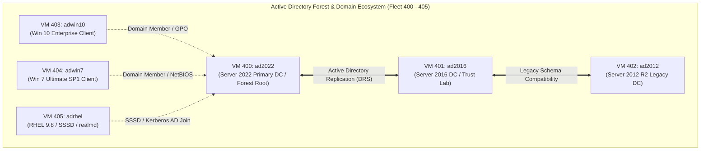

* **Genuine Installation Media**: All ISO images are sourced directly from genuine Microsoft distribution channels via [massgrave.dev](https://massgrave.dev), ensuring clean SHA-256 hashes without third-party tampering.
* **Architecture & Firmwares**: Server 2022, Server 2016, Windows 10, and RHEL 9.8 feature modern Q35 chipset emulation with OVMF UEFI, while legacy systems (2012 R2, Windows 7) utilize i440fx chipset for compatibility.
* **Storage Allocation**: High-speed VirtIO SCSI controllers with `iothread=1` and `local-lvm` thin provisioning for optimal I/O throughput.

### 🎓 Bachelor's Thesis CyberLab Architecture (VM 300, VM 301 & CT 117)

The dedicated Bachelor's Thesis (Lucrare de Licență) laboratory establishes an enterprise offensive and defensive cybersecurity proving ground. Full technical specifications, attack scenarios (Metasploit CVE exploitation, OWASP Top 10), and detection engineering pipelines are detailed in the [Bachelor's Thesis CyberLab Architecture Guide](docs/LICENTA_ARCHITECTURE.md).

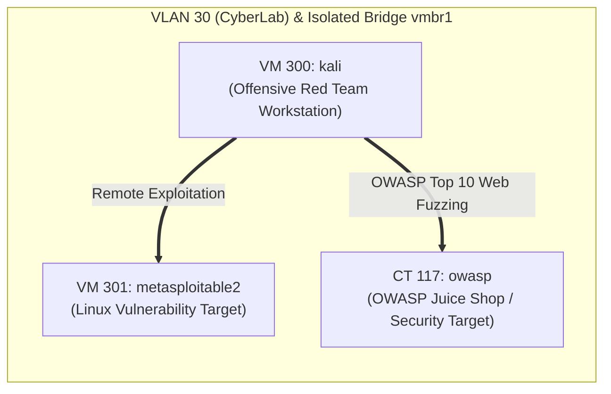

* **Network Quarantine**: Workloads reside on the dedicated internal Linux bridge **`vmbr1`** without physical uplink ports, preventing unauthorized broadcast leakage or external traffic escape.
* **Dynamic VirtIO Memory Ballooning**: All thesis virtual machines dynamically balloon RAM back to Proxmox when idle (saving 7+ GB of host RAM).
* **Declarative Provisioning**: Fully defined as code in [terraform/licenta.tf](terraform/licenta.tf), with fleet inventory mapped in [ansible/inventories/homelab/hosts.yml](ansible/inventories/homelab/hosts.yml).

### Host Memory Tuning: ZRAM / ZSWAP Fast RAM Compression

* **Compression Algorithm**: Ultra-fast `lz4` with < 1% CPU overhead.
* **Node 1 (x86_64) ZRAM**: `/dev/zram0` (6.0 GB RAM compressed swap, priority 100, `vm.swappiness = 60`, `vm.vfs_cache_pressure = 50`).
* **NVMe Lifespan Protection**: High-frequency memory pages are compressed directly in RAM before touching NVMe storage, eliminating SSD wear and IO blocking.

### Zero-Trust Security & Enterprise Test Environment

1. **HashiCorp Vault / OpenBao**:
 - Centralized secret management with zero `.env` files stored on local disks.
 - Automated dynamic token generation and ephemeral credential injection for Terraform, Ansible, and Woodpecker CI.
2. **WireGuard Kernel Module on OPNsense with Automated Key Rotation**:
 - Zero-downtime periodic rotation of Curve25519 cryptographic keypairs and pre-shared keys (PSK) via Ansible and cron.
3. **Mutual TLS (mTLS) Inter-Service Communication**:
 - Mandatory cryptographic client-certificate verification between ingress gateways and critical backend services in VLAN 20.
4. **Canary Honeytokens & Directory Decoys**:
 - Deceptive decoy files (`passwords.csv`, `aws_keys.env`, `id_rsa_backup`) placed in DMZ containers and SMB shares that trigger instant Telegram/ntfy webhooks upon access.
5. **RenovateBot On-Premise GitOps Automation**:
 - Continuous dependency scanning engine inspecting internal Gitea repositories and filing automated Pull Requests for new Docker images and Terraform modules.

---

## 9. Storage Architecture & ZFS Pool Optimization

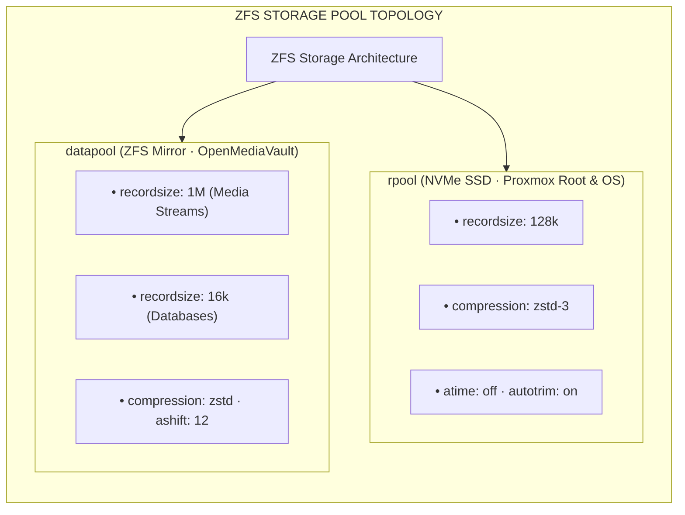

### Granular ZFS Filesystem Tuning Rules

* **PostgreSQL / MySQL / SQLite Data**: `recordsize=16k` matching DB page sizes to eliminate write amplification.
* **Large Media Streams (Jellyfin / Kiwix)**: `recordsize=1M` for sequential streaming throughput.
* **Compressratio**: `compression=zstd` delivering ~1.85x space efficiency with zero noticeable CPU latency.
* **ZFS ARC Ceiling**: Capped dynamically via `/etc/modprobe.d/zfs.conf` (`zfs_arc_max=2147483648` — 2GB) to protect VM allocations.

---

## 10. Network Segmentation & Inter-VLAN Firewall Matrix

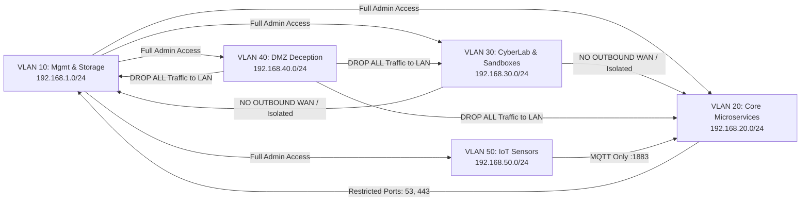

### Inter-VLAN Firewall Policy Table (Default-Deny)

| Source VLAN | Destination VLAN | Allowed Destination Ports | Protocol | Firewall Action | **VLAN 10 (Management)** | ALL VLANs | ANY | ANY | **PASS (Stateful)** | **VLAN 20 (Core Services)** | VLAN 50 (IoT) | `1883` (MQTT Broker) | TCP | **PASS** | **VLAN 30 (CyberLab)** | WAN | HTTP `:8080` via INetSim Fake Gateway | TCP | **PASS (Simulated)** | **VLAN 50 (IoT)** | ANY Internal VLAN | `1883` (Home Assistant MQTT Only) | TCP | **PASS** 
---

## 9. Ingress Traffic, Zero-Trust Authentication & Split-Horizon DNS

### Ingress Forward-Authentication Sequence

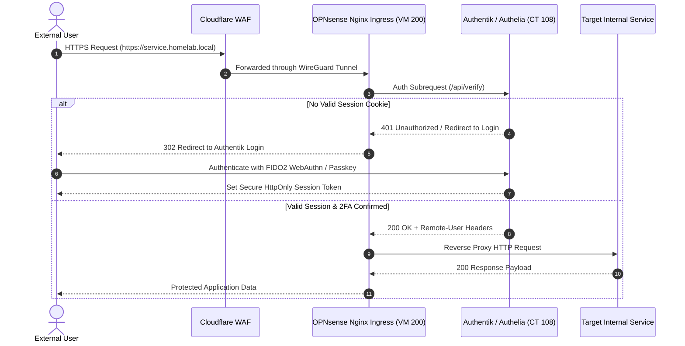

### Split-Horizon DNS Schema

* **External Resolution**: Public domain records hosted on Cloudflare DNS point exclusively to protected VPS reverse proxy endpoints.
* **Internal Resolution**: OPNsense Unbound DNS and AdGuard Home sinkholes resolve `*.homelab.local` directly to internal RFC1918 IPs (`192.168.1.134`), bypassing external bandwidth entirely.

---

## 10. Infrastructure as Code (Terraform & Ansible)

All infrastructure is provisioned declaratively using Terraform with the `bpg/proxmox` provider.

```
terraform/
├── main.tf                    # Root composition
├── providers.tf               # Proxmox VE provider & Remote S3 backend
├── backend-config.hcl.example # Remote MinIO S3 backend template
├── variables.tf               # Cluster endpoints & credentials
├── terraform.tfvars.example   # Template variables
├── lxc_services.tf            # Declarative LXC container definitions
├── vm_workloads.tf            # Declarative VM definitions
└── modules/
    ├── proxmox_lxc/           # Reusable LXC container module
    └── proxmox_vm/            # Reusable QEMU VM module
```

### Centralized & Encrypted Remote State with DynamoDB Locking

To prevent race conditions during concurrent CI/CD executions and guarantee enterprise reproducibility, Terraform state is stored on an internal MinIO S3 bucket (CT 161) with AES-256 encryption and state locking:

```hcl
terraform {
  backend "s3" {
    bucket                      = "terraform-state"
    key                         = "infrastructure/terraform.tfstate"
    region                      = "us-east-1"
    endpoint                    = "http://192.168.1.161:9000" # MinIO CT 161
    dynamodb_endpoint           = "http://192.168.1.161:9000" # Lock table
    dynamodb_table              = "terraform-locks"
    encrypt                     = true
    skip_credentials_validation = true
    skip_metadata_api_check     = true
    skip_region_validation      = true
    use_path_style              = true
  }
}
```

### Policy-as-Code Guardrails (OPA & Conftest)

All Terraform declarations and Kubernetes manifests undergo mandatory pre-flight policy evaluation via Open Policy Agent (`conftest`):

* **Rootless Containment**: Blocs any workload with `runAsNonRoot: false` or `runAsUser: 0` (`policy/kubernetes/security.rego`).
* **Immutable Version Pinning**: Forbids mutable tags (`:latest`) or untagged images.
* **Network Isolation**: Prohibits unauthorized `hostPort`, `hostNetwork: true`, or host namespace leaks.

### Quick Bootstrap Runbook

```bash
# 1. Clone repository
git clone https://github.com/stefanutc1/infrastructure.git
cd infrastructure/terraform

# 2. Initialize with remote backend
terraform init -backend-config=backend-config.hcl

# 3. Plan & Apply
terraform plan -out=tfplan.binary
terraform apply tfplan.binary
```

---

## 9. Kubernetes & GitOps Deployment Lifecycle

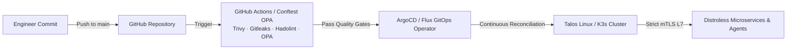

* **Talos Linux OS (`kubernetes/talos/cluster.yaml`)**: Immutable, zero-SSH operating system managed strictly via gRPC APIs.
* **Cilium eBPF CNI & Strict mTLS Service Mesh**:
  * Seamless SPIFFE/SPIRE mutual TLS authentication enforced on all inter-workload traffic (`kubernetes/apps/cilium/cilium-strict-mtls-vlan20.yaml`).
  * Enforces `authentication.mode: required` between Talos pods and critical VLAN 20 microservices (NPM, Authentik, Vaultwarden), completely eliminating cleartext inter-container communication.

---

## 10. LGTM Observability Stack & Telemetry Pipeline

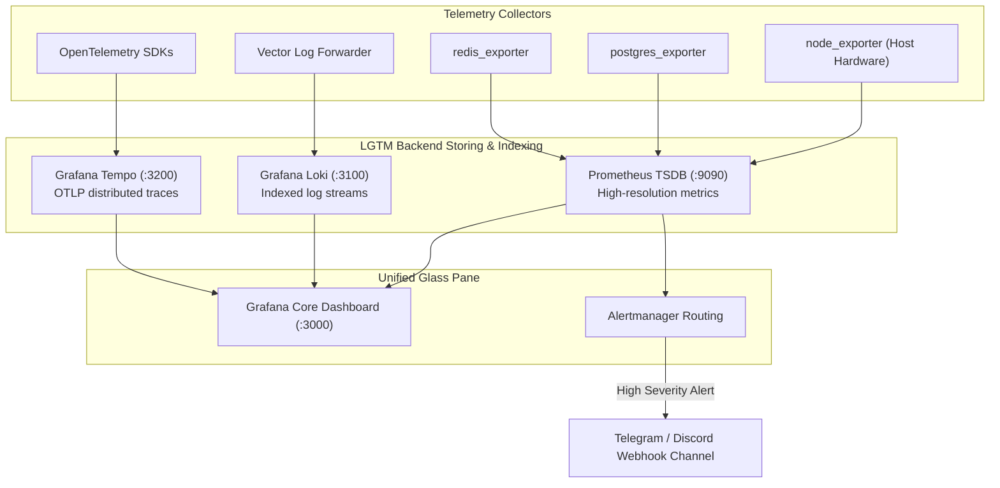

---

## 11. 3-2-1 Backup Strategy, Sanoid & Disaster Recovery

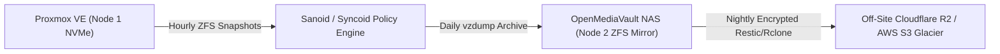

* **3 Copies**: Primary NVMe SSD, Secondary OMV NAS ZFS Mirror, Remote Cloudflare R2 Bucket.
* **2 Formats**: Live ZFS Snapshots + compressed zstd `.vma.zst` archives.
* **1 Off-Site**: Encrypted, immutable cloud backup with 90-day object lock.
* **Automated DR Verification (`scripts/disaster-recovery/dr_vzdump_restore.sh`)**: Weekly CI script restores the newest snapshot into an isolated test VLAN 99, tests DB consistency and HTTP 200 endpoints, and reports results to Telegram.

---

## 12. Digital Forensics, Cyber Defense Proving Ground & Threat Intelligence

The Datacenter operates an integrated Security Operations Center (SOC), automated deception mesh, and four in-depth real-world digital forensics investigations hosted directly within [`cyber/`](cyber/).

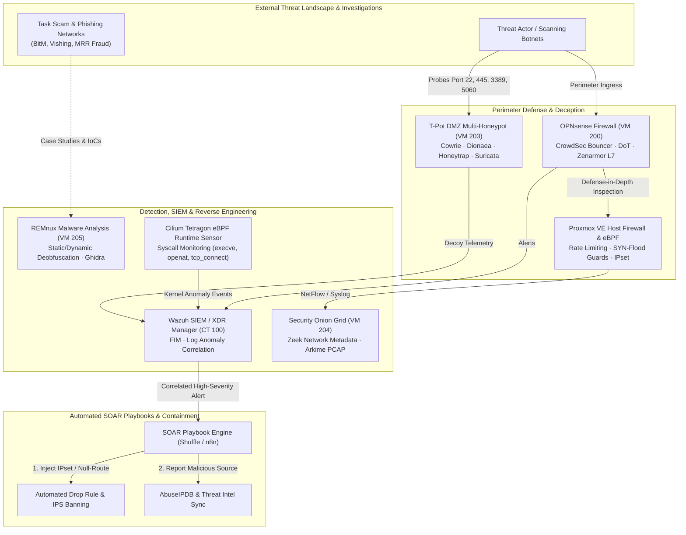

---

### 12.1 Real-World Digital Forensics & Threat Investigations (`cyber/`)

The [`cyber/`](cyber/) directory contains four end-to-end investigative case studies into active cybercrime campaigns, reverse engineered using the Datacenter's forensic sandbox tooling:

#### 1. [`task-scam-infrastructure-analysis/`](cyber/task-scam-infrastructure-analysis)
* **Threat Classification**: Cybercrime Infrastructure, Leaky REST APIs, Crypto Money Laundering.
* **Incident Summary**: In-depth anatomical breakdown of fraudulent "task-farming" platforms operated by organized cybercrime syndicates targeting mobile users through Telegram funnels.
* **Technical Exploitation & Findings**:
  - **Exposed Backend APIs**: Reverse engineering unauthenticated administrative endpoints (`/api/v1/user/task`, `/api/admin/recharge`) that leaked internal server architecture, agent referral trees, and database schemas.
  - **SQL Injection (SQLi) Discovery**: Identified severe vulnerabilities in backend transaction endpoints allowing full parameter extraction and administrative bypass.
  - **Cryptocurrency Money Laundering Flow**: Traced illicit USDT deposits on the TRC-20 (Tron) network across multi-hop mixing structures into centralized exchange consolidation hot wallets.
  - **UI Manipulation**: Documented client-side JavaScript trickery that dynamically fabricated fake trading balances and simulated VIP commission payouts.
* **Repository Deliverables**: Full case study, API exposure audit, SQLi proof of concept, OSINT infrastructure mapping, and Docker Compose test fixture.

#### 2. [`revolut-vishing-forensics/`](cyber/revolut-vishing-forensics)
* **Threat Classification**: Voice Phishing (Vishing), International SIP Telephony Fraud, 3D Secure Bypass.
* **Incident Summary**: Complete forensic reconstruction of an advanced social engineering phone attack where threat actors spoofed official European banking support numbers to intercept real-time SMS one-time passwords (OTP).
* **Technical Exploitation & Findings**:
  - **Caller ID Spoofing via International SIP Trunks**: Dissected how rogue VoIP softswitches manipulate the SIP `From:` and `P-Asserted-Identity` headers to present legitimate bank caller IDs on victim smartphones.
  - **Real-Time 3DS Intercept**: Documented step-by-step social engineering call flows engineered to induce panic, prompting victims to authorize pending credit card charges while believing they were canceling a fraud event.
  - **PCAP & Call Flow Analysis**: Extracted session initiation protocol packets (`INVITE`, `180 Ringing`, `200 OK`, `ACK`, `BYE`), analyzed SDP audio codec negotiation (G.711u / PCMU), and mapped caller User-Agent signatures.
  - **Carrier Traceback & Takedown**: Outlined the administrative and telecommunication subpoena processes used to isolate upstream rogue carriers.
* **Repository Deliverables**: Complete incident timeline, technical analysis, carrier response and takedown documentation, formal regulatory report, and simulated VoIP call-flow reproduction lab.

#### 3. [`tiktok-mrr-scam-infrastructure/`](cyber/tiktok-mrr-scam-infrastructure)
* **Threat Classification**: Monthly Recurring Revenue (MRR) Deception, Viral Social Funnels, Payment Gateway Abuse.
* **Incident Summary**: Investigation of automated social media ad networks promoting misleading software utilities and "AI tools" that enroll unsuspecting users into predatory recurring weekly and monthly subscription charges.
* **Technical Exploitation & Findings**:
  - **Bot Cloaking & User Fingerprinting**: Unpacked client-side JavaScript fingerprinting scripts designed to detect and serve benign, compliant pages to TikTok/Meta ad review crawlers while serving predatory landing pages to organic mobile users.
  - **Dark Pattern Payment Redirection**: Analyzed multi-stage redirect chains masking merchant category codes (MCCs) to bypass payment processor risk scoring.
  - **Chargeback Avoidance Tactics**: Identified how scammers artificially delay initial recurring billing cycles to exceed consumer dispute windows and maintain merchant acquiring accounts.
* **Repository Deliverables**: Comprehensive prevention guide, payment gateway abuse analysis, funnel traffic breakdown, LLM course synthesis, and architectural case study.

#### 4. [`openid-mitm-phishing-forensics/`](cyber/openid-mitm-phishing-forensics)
* **Threat Classification**: Browser-in-the-Middle (BitM / AitM), Steam OpenID 2.0 Credential & Session Theft.
* **Incident Summary**: Dissection of an aggressive phishing campaign targeting gaming accounts by rendering a simulated, interactive pop-up browser window within the active HTML DOM.
* **Technical Exploitation & Findings**:
  - **Synthetic Browser Canvas**: Attackers drew an entirely fake, draggable Chrome browser window (complete with custom minimize/maximize controls, URL address bar, and spoofed green SSL padlock) entirely in HTML5/CSS, rendering standard URL inspection useless.
  - **Real-Time Session Relaying**: Intercepted OpenID 2.0 authentication exchanges, harvesting `steamLoginSecure` cookies and session tokens while automatically passing SteamGuard mobile 2FA challenges.
  - **Automated Family View Lockout**: Captured sessions were immediately automated via headless scripts to activate Steam Family View with an attacker-selected PIN, preventing legitimate account recovery.
* **Repository Deliverables**: Full executive summary, technical reverse-engineering report, deobfuscated payload source, Suricata IDS detection signatures, and interactive HTML5 demonstration lab.

#### 5. [`mediagalaxy-ecommerce-fraud-forensics/`](cyber/mediagalaxy-ecommerce-fraud-forensics)
* **Threat Classification**: E-Commerce Brand Spoofing, TikTok Ad In-App Phishing, Chinese SaaS Fraud Infrastructure (`yiyangsaas.com`).
* **Incident Summary**: In-depth forensic teardown of an e-commerce brand impersonation campaign targeting Romanian consumers via sponsored TikTok ads mimicking national electronics retailer Media Galaxy (Altex România S.A.). Captured card credentials, triggered unauthorized Revolut virtual card charges, and launched secondary account takeover (ATO) lures.
* **Technical Exploitation & Findings**:
  - **DOM & Chinese Codebase Attribution**: Reverse engineered landing page DOM exposing `<html lang="zh-CN">`, `#module_login.module_login_default`, and `window._CEDDE_ET` execution timers characteristic of turnkey Chinese fraud SaaS platforms.
  - **Direct SSL Probe & C2 Identification**: Probed Cloudflare reverse proxy IP (`104.16.145.247`) on SSL ports 443/8443, leaking Common Name `cn: yiyangsaas.com` registered through eName Technology in Yunnan, China.
  - **Dual-MTA Relay Infrastructure**: Unpacked DKIM-signed dispatching via `info.mailapp-fly.com` and aged domain `worvixglobal.com` (NameSilo / Zoho Mail MX) routing to attacker drop inboxes (`MaryxBeckb96@gmail.com`, `brekerfurught@outlook.com`).
  - **Financial Flow & Remittance**: Documented payment capture under shell merchant descriptor `morvethemi london` (~21 EUR debit) funded via BCR into a Revolut virtual card.
* **Repository Deliverables**: Complete evidence analysis with 24 screenshots, MITRE ATT&CK mapping, structured IoC CSV and DNS blocklist, custom Suricata IDS rules, Visa/Mastercard chargeback dispute playbook, and automated ReportLab executive PDF generator.

---

### 12.2 Proving Ground Defense Stack & Threat Intelligence Feeding

Findings from these four forensic investigations directly inform the proactive defense configurations across the Datacenter:

| Security Layer | Host / Virtual Machine | Engine & Role | Defensive Functionality | **Perimeter IDS/IPS** | `VM 200` (OPNsense) | Suricata 8.0.3 + CrowdSec | Drops active BitM synthetic popup URLs and blocks malicious IP lists via threat feeds. | **Deception Honeynet**| `VM 203` (T-Pot) | Cowrie, Dionaea, Honeytrap | Exposes decoy honeypots in isolated DMZ (`vmbr3`) to harvest live scanner payloads. | **Enterprise SIEM/XDR**| `CT 100` (Wazuh) | Wazuh Manager + Elastic Stack | Centralized syslog/FIM correlation across all 95 services with automated active response. | **Host Zero-Trust FW** | Node 1 (`192.168.1.132`)| Proxmox VE Cluster Firewall | Global DROP policy, rate-limited ICMP, SYN-flood guards, IPset bastion access control. 
---

### 12.3 Security Auditing & Detection Tests (`cyber/red-team/`)

Verification scripts for container isolation and detection rules:

* **Container Audit (`cyber/red-team/container_audit.py`)**:
  * Audits Linux capabilities (`CAP_SYS_ADMIN`, `CAP_SYS_PTRACE`, `CAP_SYS_MODULE`, `CAP_DAC_OVERRIDE`).
  * Scans for mounted Docker/containerd UNIX control sockets (`/var/run/docker.sock`).
  * Validates cgroup isolation (`release_agent`), host namespace leakage (`hostPID`, `hostNetwork`), and Seccomp/AppArmor enforcement.
* **Security Detection Tests (`cyber/red-team/sec_tests.py`)**:
  * Runs controlled validation checks (T1059.004 Unix Shell, T1082 System Discovery, T1046 Network Service Discovery, T1552 Canary Token Search).
  * Validates alert ingestion in Wazuh SIEM (Rule 80710) and CrowdSec portscan decisions.
* **Privilege Audit (`cyber/red-team/priv_check.py`)**:
  * Evaluates writable system `PATH` directories, verifies private key permissions, and scans environment variables for plaintext secrets.

---

## 13. Local GPU AI LLM Runtime (Ollama CT 110)

Ollama is running inside container **`CT 110`** on Proxmox Node 1 (`192.168.1.110:11434`), utilizing direct NVIDIA GeForce GTX 1050 Ti GPU acceleration:

```bash
# Verify active models inside CT 110
pct exec 110 -- ollama list

# Output:
# NAME ID SIZE MODIFIED 
# llama3.2:1b baf6a787fdff 1.3 GB Active 
# qwen2.5-coder:1.5b d7372fd82851 986 MB Active 

# Execute instant test query via REST API:
curl -s http://192.168.1.110:11434/api/generate -d '{"model": "qwen2.5-coder:1.5b",
 "prompt": "Write a Python script to check Proxmox container status",
 "stream": false
}'
```

---

## 14. Chaos Engineering & Resiliency Validation

Automated continuous resiliency testing is enforced both locally and via a dedicated CI/CD pipeline (`.github/workflows/chaos-scheduled.yml`) scheduled via cron `0 3 * * 0` (Sunday nights at 03:00 UTC).

```bash
# 1. Inject 100% CPU stress & 80% RAM pressure
./scripts/chaos/chaos_runner.sh cpu-stress 30
./scripts/chaos/chaos_runner.sh ram-pressure 30

# 2. Inject service fault (SIGKILL) & verify automated self-healing without human intervention
./scripts/chaos/chaos_runner.sh service-kill 5 staging-workload
./scripts/chaos/chaos_runner.sh auto-healing-check 30 staging-workload

# 3. Simulate network latency (150ms) and packet loss (15%) via kernel netem
./scripts/chaos/chaos_runner.sh network-latency 30 eth0 150ms
./scripts/chaos/chaos_runner.sh packet-loss 30 eth0 15%

# 4. Validate incident alerting pipeline across Uptime Kuma, Ntfy, and Telegram
./scripts/chaos/chaos_runner.sh alert-webhook-validate
```

---

## 15. Environmental Telemetry & Closed-Loop Fan Control

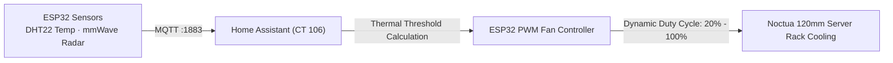

* **Rack Tamper Monitoring**: Optical microswitch on server chassis logs physical cabinet door state; triggers snapshot on security cameras if opened unexpectedly.

---

## 16. Security Hardening & Cryptographic Integrity

* **Linux Kernel Hardening (`/etc/sysctl.d/99-proxmox-hardening.conf`)**:
 * Complete ASLR randomization (`kernel.randomize_va_space=2`).
 * Strict memory restriction (`kernel.kptr_restrict=2`, `kernel.dmesg_restrict=1`).
 * SYN flood cookies enabled (`net.ipv4.tcp_syncookies=1`).
 * Source routing and ICMP redirects disabled.
* **SSH Hardening**: Password authentication disabled across all nodes; SSH restricted to Ed25519 cryptographic keys only (`ssh-audit` rated 100/100).
* **Storage Encryption**: LUKS encrypted data volumes unlocked automatically via Clevis/Tang Network-Bound Disk Encryption (NBDE).

---

## 17. Static IP & Ports Directory

| IP Address | Hostname / Resource | Exposed Ports | Subsystem Role | `192.168.1.1` | Gateway Router | `80`, `443` | Default LAN Gateway | `192.168.1.9` | `homeassistant` (CT 106) | `8123`, `1883` | Home Automation & MQTT Broker | `192.168.1.134 (OPNsense)` | `pve` (Node 1 Host) | `8006`, `22` | Proxmox VE Web Management 
---

## 18. Cold-Start Runbook & Operational Cheat Sheet

### Cold-Start Sequential Boot Sequence

1. **Phase 1 (Power & Networking)**: Turn on Coldex UPS $\to$ Power on Managed Switch $\to$ Verify OPNsense Firewall (VM 200) WAN connectivity.
2. **Phase 2 (Storage & DNS)**: Power on OMV NAS (Node 2) $\to$ Wait for NFS mounts $\to$ Verify AdGuard Home & Unbound DNS on OPNsense (VM 200).
3. **Phase 3 (Core Hypervisors)**: Power on Node 1 (x86_64) $\to$ Verify ZFS pool status (`zpool status`).
4. **Phase 4 (Security & Authentication)**: Start Authentik (CT 108) $\to$ Start Wazuh SIEM (CT 105) $\to$ Ingress Reverse Proxy active on OPNsense (VM 200).
5. **Phase 5 (Workloads & AI)**: Start Ollama (CT 110), Home Assistant (CT 106), and user microservices.

### Proxmox Daily CLI Commands

```bash
# List all active containers and VMs
pct list && qm list

# Check ZFS storage pools health
zpool status -v

# Inspect Ollama LLM logs inside CT 110
pct exec 110 -- journalctl -u ollama -f -n 50

# Perform immediate vzdump backup of critical container
vzdump 110 --storage local-lvm --mode snapshot --compress zstd
```

---

## 19. Troubleshooting FAQ

<details>
<summary><b>Q: How do I resolve temporary DNS resolution errors inside LXC containers?</b></summary>
Ensure the container nameserver is set to the local DNS resolver (`192.168.1.1` or `192.168.1.4`) via <code>pct set &lt;VMID&gt; -nameserver 192.168.1.1</code> and verify <code>/etc/resolv.conf</code> contains valid nameservers.
</details>

<details>
<summary><b>Q: How do I verify GPU Passthrough for Ollama inside CT 110?</b></summary>
Run <code>pct exec 110 -- /usr/local/bin/ollama run qwen2.5-coder:1.5b "test"</code> and check <code>nvidia-smi</code> on the Proxmox host to observe GPU compute utilization.
</details>

<details>
<summary><b>Q: How do I trigger an emergency snapshot restore in an isolated VLAN?</b></summary>
Execute the automated Disaster Recovery script: <code>./scripts/disaster-recovery/dr_vzdump_restore.sh proxmox /mnt/pve/backup-nfs/dump</code>.
</details>

---

## 20. Monorepo Layout & Engineering Portfolio

```
.
├── .github/workflows/ # CI/CD pipelines & automation workflows
├── ai/                # Local AI models, Ollama manifests & LLM inference runbooks
├── ansible/           # Configuration management, playbooks & server orchestration
├── cloud/             # Multi-cloud IaC integrations (AWS Glacier & Azure HSM/DR)
├── cyber/             # SOC, SIEM, Honeypots (T-Pot), eBPF & Sandbox forensics
├── esp32/             # IoT microcontrollers & environmental telemetry firmware
├── hardware/          # Physical hardware specs, NUT UPS power delivery & rack topology
├── hypervisors/       # Proxmox VE sysctl hardening, kernel profiles & network bridges
├── inventory/         # Fleet inventory, static IP assignments & MAC mappings
├── kubernetes/        # Talos Linux & K3s declarative manifests
├── nix/               # Declarative NixOS system configurations and flakes
├── opencore/          # OpenCore EFI bootloader for macOS Monterey KVM (/opencore/EFI)
├── photos/            # Live dashboard screenshots, telemetry captures & topology visuals
├── policy/            # Security policies, compliance benchmarks & governance rules
├── scripts/           # Disaster Recovery, metrics sync & automation tooling
├── services/          # Docker Compose workload catalog & microservice stacks
├── terraform/         # Declarative Proxmox LXC & VM IaC modules
└── web/               # Angular 20 Standalone Interactive Web Architecture Viewer
```

This repository serves as a **production-grade engineering portfolio and personal infrastructure lab**, designed and maintained by [@stefanutc1](https://github.com/stefanutc1) to showcase hybrid cloud architecture, SecOps, GitOps, and resilient self-hosted platforms.

---

<div align="center">

**Author**: [@stefanutc1](https://github.com/stefanutc1) 
Released under the **GNU Affero General Public License v3.0 (AGPL-3.0)**.

</div>

---

## Photo Gallery: Management Panels, Services & Loki Telemetry

All hardware nodes, virtual machines, and containers execute live on physical infrastructure. Below are direct interface captures of core control planes, running microservices, and centralized Grafana Loki log aggregation streams.

### Core Management Panels
| Grafana: Homelab Nodes (12GB x64) | Grafana: OPNsense Perimeter Defense |  |  | :---: | :---: 
| Pi-hole DNS Sinkhole & FTL (192.168.1.4:8080) | Home Assistant Automation Hub (192.168.1.10:8123) |  |  | :---: | :---: 
| OPNsense: WireGuard Kernel VPN Mesh | OPNsense: Unbound DNS-over-TLS (DoT) |  |  |

---

### Core & Networking
| Nginx Proxy Manager | Pi-hole DNS Sinkhole |  |  | :---: | :---: 
| OPNsense Core Gateway | OPNsense Unbound DoT |  |  | :---: | :---: 
---

### Storage & Backup
| Nextcloud Hub | Paperless-ngx Document OCR |  |  | :---: | :---: 
| Syncthing File Sync | Proxmox Backup Server (PBS) |  |  |

---

### Automation & AI
| Ollama LLM Runtime | Open-WebUI AI Interface |  |  | :---: | :---: 
| Home Assistant Automation Hub | RenovateBot GitOps Engine |  |  |

---

### Observability & Monitoring
| Grafana Enterprise Dashboard | Prometheus Metrics Engine |  |  | :---: | :---: 
| Gatus Status Healthchecker | Beszel Lightweight Metrics |  |  | :---: | :---: 
| Dozzle Real-Time Log Viewer | NetAlertX Network Scanner & Intrusion Monitor |  |  |

---

### Security & Cyber Lab
| OPNsense Suricata 8 NIDS/IPS | OPNsense CrowdSec LAPI Bouncer |  |  | :---: | :---: 
| CyberChef Cryptographic Utility | DFIR Dynamic Malware Sandbox |  |  | :---: | :---: 
---

### Media & Utilities
| Stirling-PDF Manipulation Suite | Kavita Digital Library |  |  | :---: | :---: 
| Transmission BitTorrent Client | Calibre-Web E-Book Manager |  |  | :---: | :---: 
| Code-Server VS Code Cloud IDE | Draw.io Architecture Designer |  |  | :---: | :---: 
| Trillium Structured Knowledge Base | ChangeDetection Web Monitor |  |  | :---: | :---: 
| Memos Lightweight Note Stream | Wallos Subscription Tracker |  |  | :---: | :---: 
| Flame Application Launcher | RustDesk Self-Hosted Remote Desktop |  |  | :---: | :---: 
| Kiwix Offline Wikipedia & Archive | Flatnotes Headless Wiki |  |  | :---: | :---: 
| Ntfy Real-Time Push Notifications | Bark iOS Alert Gateway |  |  | :---: | :---: 
| OpenGist Self-Hosted Pastebin | pgAdmin 4 PostgreSQL Manager |  |  |

---

### Specialized Operating Systems & Telemetry (Loki Telemetry & Runtime Logs)
| Windows Server 2025 Datacenter (VM 400 · Loki Telemetry) | Red Hat Enterprise Linux 9.8 (VM 409 · Loki Telemetry) |  |  | :---: | :---: 
| OpenStack 2024.1 Caracal (VM 201 · Cloud Horizon) | Metasploitable 2 (VM 301 · Vulnerable Target) |  |  | :---: | :---: 
| REMnux v7 Noble (VM 304 · Reverse Engineering) | OPNsense Core Gateway & Firewall (VM 200) |  |  | :---: | :---: 
| Proxmox VE 9.2 Primary (Node 1 · x86_64 Hypervisor) |  |
