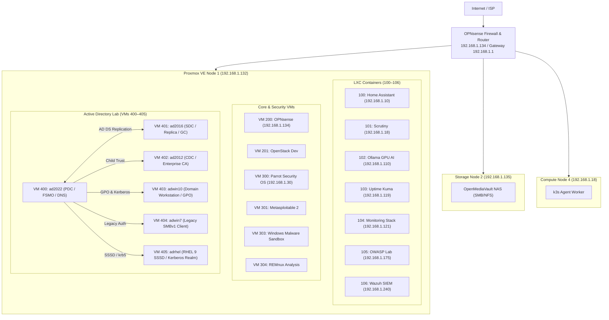

# Homelab

[](https://github.com/stefanutc1/infrastructure/actions)
[](https://proxmox.com)
[](https://opnsense.org)
[](cyber/)
[](LICENSE)

<!-- AUTO-METRICS-START -->
[](https://stefanutc1.github.io/infrastructure/)
[-brightgreen?style=flat&logo=githubactions)](https://github.com/stefanutc1/infrastructure/actions/workflows/ci.yml)
[](https://github.com/stefanutc1/infrastructure/actions/workflows/cd.yml)
[](https://github.com/stefanutc1/infrastructure/actions)
<!-- AUTO-METRICS-END -->

---

## 1. Overview

Personal homelab infrastructure repository. It contains Terraform configurations, Ansible playbooks, network setup notes, and security investigation writeups.

The setup consists of:
- **Node 1 (Proxmox VE)**: Primary hypervisor hosting LXC containers, security virtual machines, and the Active Directory lab.
- **Node 2 (OpenMediaVault)**: NAS for storage and backups on an older ASUS laptop.
- **Node 4 (k3s worker)**: Dedicated worker for lightweight container experiments.
- **OPNsense**: Perimeter router and firewall with Unbound DNS sinkholing.



---

## 2. Hardware

| Node | Machine / Chassis | CPU | GPU | RAM | Storage | Role |
| :--- | :--- | :--- | :--- | :--- | :--- | :--- |
| **`pve` (Node 1)** | Desktop Tower | Intel Core i3-10100F (4C/8T @ 4.30 GHz) | NVIDIA GeForce GTX 1050 Ti (4GB) | 12 GB DDR4 | 512 GB NVMe SSD | Hypervisor: LXCs (100–106), VMs (200, 201, 300, 301, 303, 304, 400–405) |
| **`omv` (Node 2)** | ASUS X451MA | Intel Celeron N2830 (2C/2T @ 2.41 GHz) | Intel HD Graphics | 2 GB DDR3 | 500 GB HDD | OpenMediaVault NAS (SMB / NFS shares) |
| **`k8s-node-04` (Node 4)** | Desktop ATX | AMD Athlon II X2 220 (2C/2T @ 2.80 GHz) | NVIDIA GeForce GTS 250 (1GB) | 4 GB DDR3 | 80 GB HDD | k3s agent worker node |

---

## 3. Services & Workloads

### LXC Containers (100–106)

| VMID | Hostname | Base OS | Cores | Memory | Disk | IP Address | Service |
| :---: | :--- | :--- | :---: | :---: | :---: | :--- | :--- |
| **100** | `homeassistant` | Alpine 3.24 | 1 | 128 MB | 16 GB | `192.168.1.10` | Home Assistant (smart home hub & telemetry) |
| **101** | `scrutiny` | Alpine 3.24 | 1 | 96 MB | 3 GB | `192.168.1.18` | Scrutiny (disk health & S.M.A.R.T.) |
| **102** | `ollama` | Debian 13 | 1 | 2048 MB | 16 GB | `192.168.1.110` | Ollama LLM (GTX 1050 Ti PCIe passthrough) |
| **103** | `uptimekuma` | Alpine 3.24 | 1 | 128 MB | 2 GB | `192.168.1.119` | Uptime Kuma (service availability monitoring) |
| **104** | `monitoring` | Alpine 3.24 | 1 | 256 MB | 4 GB | `192.168.1.121` | Prometheus TSDB & Grafana dashboards |
| **105** | `owasp` | Alpine 3.24 | 2 | 512 MB | 8 GB | `192.168.1.175` | OWASP Juice Shop test environment |
| **106** | `wazuh` | Ubuntu 24.04 | 4 | 6144 MB | 35 GB | `192.168.1.240` | Wazuh SIEM manager, OpenSearch indexer & dashboard |

### Core & Security Virtual Machines

| VMID | Name | OS | Cores | Memory | Disk | IP Address / Bridge | Purpose |
| :---: | :--- | :--- | :---: | :---: | :---: | :--- | :--- |
| **200** | `opnsense` | FreeBSD 14 | 1 | 1024 MB | 16 GB | `192.168.1.134` (vmbr0/1/2) | Perimeter firewall, Suricata IDS/IPS, WireGuard mesh |
| **201** | `openstack` | Linux | 2 | 4096 MB | 32 GB | `vmbr0` (DHCP) | Single-node OpenStack dev / Kolla-Ansible sandbox |
| **300** | `parrot` | Parrot Security OS | 1 | 1536 MB | 65 GB | `192.168.1.30` (vmbr0) | Security testing and network tools workstation |
| **301** | `metasploitable2` | Linux 2.6 | 1 | 512 MB | 8 GB | `vmbr0` (Isolated) | Intentionally vulnerable Linux target for exploits |
| **303** | `malware` | Windows 10 | 2 | 2560 MB | 50 GB | `vmbr0` (Sandboxed) | Dynamic malware analysis sandbox (Flare-VM) |
| **304** | `remnux` | REMnux Linux | 2 | 4096 MB | 40 GB | `vmbr0` (Analysis) | Reverse engineering and malware triage toolkit |

### Active Directory Lab Ecosystem (VMs 400–405)

The Windows Active Directory lab simulates a multi-tier enterprise forest for testing identity management, Group Policy distribution, authentication security, and cross-platform domain integration:

| VMID | Name | OS | Cores | Memory | Disk | Role in AD Ecosystem |
| :---: | :--- | :--- | :---: | :---: | :---: | :--- |
| **400** | `ad2022` | Windows Server 2022 | 2 | 4096 MB | 60 GB | **Forest Root Domain Controller (PDC)**: FSMO role holder, authoritative DNS, Kerberos Key Distribution Center (KDC). |
| **401** | `ad2016` | Windows Server 2016 | 2 | 3072 MB | 50 GB | **Secondary Domain Controller (SDC)**: Active Directory Domain Services (AD DS) multi-master replication partner, Global Catalog (GC). |
| **402** | `ad2012` | Windows Server 2012 R2 | 2 | 1024 MB | 50 GB | **Child Domain Controller / PKI CA**: Enterprise Root Certificate Authority (AD CS), legacy trust and NTLM compatibility testing. |
| **403** | `adwin10` | Windows 10 Enterprise | 2 | 2560 MB | 50 GB | **Modern Domain Workstation**: Domain-joined client enforcing Group Policy Objects (GPOs), Sysmon telemetry forwarding to Wazuh. |
| **404** | `adwin7` | Windows 7 SP1 | 2 | 2048 MB | 50 GB | **Legacy Client Workstation**: Domain-joined legacy client for legacy protocol analysis (SMBv1, NTLMv1/v2 relay drills). |
| **405** | `adrhel` | RHEL 9 (Enterprise Linux) | 2 | 1536 MB | 50 GB | **Enterprise Linux Domain Member**: Domain joined via `realmd` / SSSD and Kerberos for centralized Linux identity and PAM auth. |

#### Ecosystem Interactions
- **Multi-Master Directory Replication**: Bidirectional RPC/IP replication between `ad2022` (VM 400) and `ad2016` (VM 401) ensures consistent state for schema, partition, and domain configuration.
- **Enterprise Public Key Infrastructure (AD CS)**: `ad2012` (VM 402) operates the certificate authority, issuing certificates for LDAPS, client authentication, and internal services.
- **Group Policy & Hardening Baseline**: Centralized GPOs deployed from `ad2022` govern password policies, audit logging, and firewall rules on `adwin10` (VM 403) and `adwin7` (VM 404).
- **Heterogeneous Authentication**: `adrhel` (VM 405) queries Active Directory LDAP and verifies Kerberos tickets via SSSD, proving identity federation across mixed Linux/Windows infrastructure.
- **SIEM Telemetry Ingestion**: Sysmon and Windows Security Event logs from domain members are forwarded to Wazuh (LXC 106) for real-time threat detection and credential dumping alerts.

---

### 3.4 Bachelor Thesis: Banking Core Infrastructure (Lucrare de Licență FEAA Craiova)

Infrastructură dedicată lucrării de licență (*Arhitectura și Securitatea Sistemelor Informatice Bancare*, Absolvent Moanță Ștefănuț-Cornel, Informatică Economică FEAA UCV). Aceasta recreează nucleul tehnologic al unei instituții de credit, respectând principiile de partiționare de rețea, integritate a bazelor de date și audit continuu:

| VMID | Hostname / Nume | Tip | Cores | RAM | Disc | Rețea / IP | Rol Arhitectural & Standarde |
| :---: | :--- | :---: | :---: | :---: | :---: | :--- | :--- |
| **310** | `core-banking-licenta` | VM | 2 | 4096 MB | 40 GB | VLAN 20 (`192.168.20.50`) | **Sistem Central Core-Banking**: Motor bazat pe Apache Fineract / Mifos X. Implementează contabilitatea în partidă dublă (General Ledger), verificarea identității (KYC) și gestiunea soldurilor. Accesul este limitat prin OPNsense exclusiv la casieri autorizați și terminalul Kiosk (`192.168.20.100` / VM 205). |
| **311** | `fin-db-licenta` | VM | 2 | 4096 MB | 50 GB | VLAN 20 (`192.168.20.51`) | **Server Bază de Date Financiară**: Instanță izolată PostgreSQL cu audit avansat pgAudit și agent Wazuh HIDS. Monitorizează și blochează tentativele de SQL Injection și discrepanțele de sold neacoperite de înregistrări în cartea mare (Balance Tampering Detection). |
| **312** | `payment-gateway-licenta`| CT | 1 | 1024 MB | 10 GB | VLAN 20 (`192.168.20.52`) | **Payment Gateway & Simulator SWIFT**: Microserviciu FastAPI pentru procesare plăți electronice (Visa/Mastercard) cu algoritm Luhn, protecție anti-fraudă la viteză (Card Stuffing) și mesagerie interbancară ISO 20022 / SWIFT MT103 cu identificatori unici UETR. |
| **313** | `swift-jumpbox-licenta` | VM | 2 | 2048 MB | 25 GB | VLAN 10 (`192.168.10.50`) | **Hardened Bastion Host / Jump-Box**: Punct unic de intrare administrativă pentru operatorii financiari. Securizat prin chei criptografice ed25519 și MFA (TOTP), prevenind compromiterea rețelei interne de către malware de tip infostealer. |

#### Fluxuri de Securitate și Scenarii de Atac Validate:
1. **Nominal Kiosk Workflow**: Tranzacții legitime executate de terminalul clientului cu validare token hardware și actualizare atomică în partidă dublă.
2. **Database Integrity & SQLi Blocking**: Wazuh HIDS interceptează semnăturile SQLi și emite alertă de Nivel 14 în cazul oricărei discrepanțe între sold și registrul tranzacțiilor.
3. **Card-Stuffing / Velocity Defense**: Payment Gateway respinge rafalele automate de autorizare peste pragul admisibil (HTTP 429).
4. **Bastion Lateral Movement Prevention**: OPNsense respinge orice conexiune directă din VLAN 30 către Core-Banking care nu tranzitează Jump-Box-ul autentificat.
5. **SWIFT Payload Verification**: Validarea strictă a formatelor BIC (ISO 9362) și a semnăturilor UETR respinge mesajele financiare corupte.

---

## 4. Network & VLANs

VLAN configuration handled through OPNsense:

| VLAN ID | Name | Subnet | Gateway | Notes |
| :---: | :--- | :--- | :--- | :--- |
| **10** | Management | `192.168.1.0/24` | `192.168.1.1` | Proxmox host, NAS, core network management. |
| **20** | Services | `192.168.20.0/24` | `192.168.1.134` | LXC containers and local applications. |
| **30** | Lab | `192.168.30.0/24` | `192.168.1.134` | Security lab segment on bridge `vmbr1`. |
| **40** | DMZ | `192.168.40.0/24` | `192.168.1.134` | Isolated testing zone. |
| **50** | IoT | `192.168.50.0/24` | `192.168.1.134` | Smart home devices, isolated from LAN. |

---

## 5. Security & Investigations (`cyber/`)

The [`cyber/`](cyber/) folder contains writeups, notes, and Indicators of Compromise (IoCs) from real phishing and fraud campaigns investigated locally:

1. [Media Galaxy Brand Impersonation](cyber/mediagalaxy-ecommerce-fraud-forensics/README.md) (`SEC-2026-ECOM-005`): Sponsored ad phishing campaign; reported to DNSC (#178465) and blocked on PNRISC.
2. [Revolut Vishing Case Study](cyber/revolut-vishing-forensics/README.md) (`SEC-2026-VISH-002`): Caller ID spoofing and OTP interception analysis.
3. [Task Scam Analysis](cyber/task-scam-infrastructure-analysis/README.md) (`SEC-2026-TASK-003`): Fake job / deposit scam reverse-engineered.
4. [TikTok MRR Scam Funnels](cyber/tiktok-mrr-scam-infrastructure/README.md) (`SEC-2025-MRR-001`): Resale course marketing funnel investigation.
5. [Steam OpenID Phishing](cyber/openid-mitm-phishing-forensics/README.md) (`SEC-2025-AITM-004`): Browser-in-the-Middle credential interception writeup.

### Blocklists & OPNsense Sync
A combined domain blocklist is kept in `cyber/forbidden_domains.txt` and synced to OPNsense Unbound DNS for local sinkholing.

---

## 6. Automation

### Terraform (`terraform/`)
Manages Proxmox LXC containers and virtual machines:

```bash
cd terraform/proxmox
terraform init
terraform plan
terraform apply
```

### Ansible (`ansible/`)
Handles baseline configuration and service tasks:

```bash
cd ansible
ansible-playbook -i inventories/homelab/hosts.yml playbook.yml
```

---

## 7. Repository Structure

```text
.
├── ansible/              # Playbooks and inventory files
├── configuration.nix     # NixOS host system configuration
├── cyber/                # Investigation writeups, CTF, and domain blocklists
├── kubernetes/           # k3s manifests and configs
├── scripts/              # Validation scripts and blocklist sync tools
├── services/             # Service configuration templates and Proxmox definitions
├── terraform/            # Proxmox IaC configurations
└── web/                  # Angular 19 architecture visualization dashboard
```
