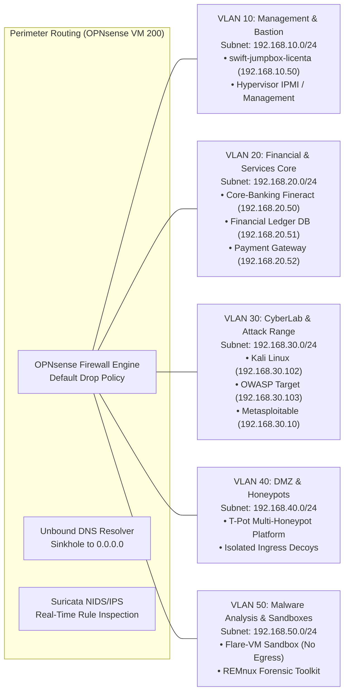
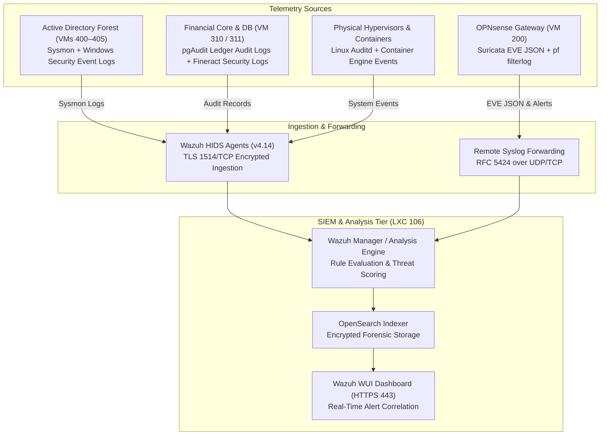
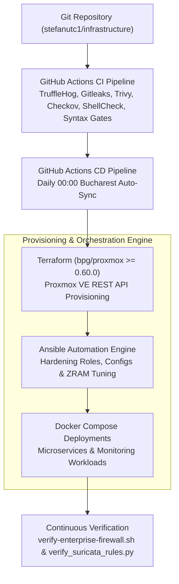

# Hybrid Infrastructure, Virtualization & Cybersecurity Laboratory

<div align="center">

[](https://github.com/stefanutc1/infrastructure/actions)
[](https://proxmox.com)
[](https://opnsense.org)
[](cyber/)
[](https://stefanutc1.github.io/infrastructure/)
[](LICENSE)

<!-- AUTO-METRICS-START -->
[](https://stefanutc1.github.io/infrastructure/)
[-brightgreen?style=flat&logo=githubactions)](https://github.com/stefanutc1/infrastructure/actions/workflows/ci.yml)
[](https://github.com/stefanutc1/infrastructure/actions/workflows/cd.yml)
[](https://github.com/stefanutc1/infrastructure/actions)
<!-- AUTO-METRICS-END -->

</div>

---

## 1. Overview

This repository houses the declarative Infrastructure-as-Code (IaC), virtualization architecture, configuration management, Digital Forensics & Incident Response (DFIR) case files, and the specialized **Bachelor's Thesis Banking Security Laboratory** (*"Arhitectura și Securitatea Sistemelor Informatice Bancare"*).

The platform operates across physical bare-metal nodes, a virtualized perimeter firewall, isolated network segments, Linux containers (LXC), Kernel-based Virtual Machines (KVM), and lightweight Kubernetes nodes:

- **Node 1 (`pve_primary_x64`)**: Primary bare-metal hypervisor running Proxmox VE 9.2, hosting core production LXC containers, security virtual machines, the multi-generational Active Directory forest, and the thesis banking core.
- **Node 2 (`omv_nas`)**: Network-attached storage host (ASUS X451MA) executing OpenMediaVault with ZFS, delivering SMB/NFS storage pools and Proxmox vzdump backup target repositories.
- **Node 4 (`k8s_node_04` / `kubernetes_node`)**: Dedicated bare-metal Kubernetes worker node (AMD Athlon II X2 220) running k3s/k0s for stateless workloads and cluster telemetry.
- **Perimeter Firewall & Router (`opnsense_router` / VM 200)**: Virtualized OPNsense instance providing multi-interface L3 routing, stateful packet filtering, Suricata NIDS/IPS deep packet inspection, WireGuard VPN mesh, and Unbound recursive DNS sinkholing.
- **Host System Configuration (`configuration.nix`)**: Declarative NixOS system specification (`homelab-max`) with hardened OpenSSH, BBR congestion control, DNSSEC, and container runtimes.

---

## 2. Master Platform Documentation Suite

The platform is thoroughly documented across specialized, production-ready specifications:

| Document | Scope & Focus | Primary Engineering Topics |
| :--- | :--- | :--- |
| [**`ARCHITECTURE.md`**](ARCHITECTURE.md) | High-Level Platform Architecture | 16 functional domain models, physical & logical blueprints, Zero Trust transit bus, compute density. |
| [**`INFRASTRUCTURE.md`**](INFRASTRUCTURE.md) | Physical Fleet & Compute Inventory | Hardware node specifications, KVM VM fleet (VM 200–410), LXC fleet (CT 100–106), capacity budget. |
| [**`SERVICES.md`**](SERVICES.md) | 33-Service Portfolio & Catalog | Tier 1–4 service taxonomy, port assignments, authentication, dependencies, backup, criticality. |
| [**`NETWORK.md`**](NETWORK.md) | Network Topology & Segmentation | Virtual bridges (`vmbr0–3`), 10.10.20.0/30 transit bus, 802.1q VLAN 10–50 matrix, WireGuard, DNS. |
| [**`SECURITY.md`**](SECURITY.md) | Defense Baseline & Threat Model | STRIDE analysis, CIS Linux benchmarks, PKI/CA, secrets hygiene, Wazuh SIEM, Suricata NIDS. |
| [**`OPERATIONS.md`**](OPERATIONS.md) | Day-2 Operations & SOPs | Cold boot sequencing, emergency shutdown protocols, routine maintenance, update cadences. |
| [**`BACKUP.md`**](BACKUP.md) | Backup & Data Protection | 3-2-1 backup strategy, Proxmox vzdump, PBS client deduplication, ZFS snapshot retention, RPO/RTO. |
| [**`DISASTER-RECOVERY.md`**](DISASTER-RECOVERY.md) | Disaster Recovery & Runbooks | Scenarios A–D, bare-metal rebuild procedures, restore drills, business continuity playbooks. |
| [**`CONTRIBUTING.md`**](CONTRIBUTING.md) | Engineering Guidelines | IaC formatting standards, pre-commit gates, conventional commits, local health checks. |
| [**`docs/decisions/`**](docs/decisions/) | Architecture Decision Records | Formal ADRs (ADR-0001 through ADR-0008) capturing key design decisions and trade-offs. |

---

## 3. Automated Infrastructure Health Doctor

The repository includes a comprehensive 12-domain automated diagnostic doctor script:

```bash
python3 scripts/audit_infrastructure.py
```

Evaluating: `IaC`, `Configuration`, `Security`, `Secrets`, `Networking`, `Kubernetes`, `Observability`, `Backup`, `Disaster Recovery`, `Documentation`, `AI Security`, and `Supply Chain`.

---

## 4. Architectural Blueprints

### 2.1 High-Level Infrastructure Topology

```mermaid
flowchart TB
    WAN["Internet Ingress / Fiber ONT<br/>Gateway: 192.168.1.1"] --> OPN["OPNsense Firewall (VM 200)<br/>192.168.1.134 / Suricata IDS/IPS / Unbound DNS"]

    subgraph NODE1["Node 1: Proxmox VE 9.2 (192.168.1.132)"]
        direction TB

        subgraph BRIDGES["Virtual Network Bridges"]
            VMBR0["vmbr0 (LAN / Core Transit)"]
            VMBR1["vmbr1 (CyberLab & Banking Isolation)"]
            VMBR2["vmbr2 (Firewall Interconnect / Transit 10.10.20.0/30)"]
        end

        subgraph LXC_FLEET["Production LXC Containers (100–106)"]
            CT100["CT 100: Home Assistant (192.168.1.10)"]
            CT101["CT 101: Scrutiny SMART (192.168.1.108)"]
            CT102["CT 102: Ollama AI (GTX 1050 Ti Passthrough) (192.168.1.110)"]
            CT103["CT 103: Uptime Kuma (192.168.1.119)"]
            CT104["CT 104: Monitoring (Prometheus/Grafana) (192.168.1.121)"]
            CT105["CT 105: OWASP Juice Shop Lab (192.168.1.175)"]
            CT106["CT 106: Wazuh SIEM / XDR Manager (192.168.1.240)"]
        end

        subgraph AD_FLEET["Active Directory Security Lab (VMs 400–405)"]
            AD400["VM 400: ad2022 (Forest Root PDC / FSMO / DNS)"]
            AD401["VM 401: ad2016 (Secondary DC / GC / Replication)"]
            AD402["VM 402: ad2012 (Child DC / AD CS Enterprise CA)"]
            AD403["VM 403: adwin10 (Enterprise Workstation / GPO)"]
            AD404["VM 404: adwin7 (Legacy Client / SMBv1 Testing)"]
            AD405["VM 405: adrhel (RHEL 9 SSSD / Kerberos Realm)"]
            AD400 <-->|AD DS Replication| AD401
            AD400 -->|Child Trust| AD402
            AD400 -->|GPO & Kerberos| AD403
            AD400 -->|NTLM & SMBv1| AD404
            AD400 -->|SSSD / krb5| AD405
        end

        subgraph THESIS_FLEET["Bachelor Thesis: Banking Security Lab (310–313)"]
            VM310["VM 310: Core Banking Engine (Apache Fineract) (192.168.20.50)"]
            VM311["VM 311: Financial Ledger DB (PostgreSQL + pgAudit) (192.168.20.51)"]
            CT312["CT 312: Payment Gateway & SWIFT API (FastAPI) (192.168.20.52)"]
            VM313["VM 313: Hardened Bastion Jump-Box (ed25519 + MFA) (192.168.10.50)"]
            VM313 -.->|Encrypted SSH Jump Only| VM310
            CT312 -->|Ledger Mutation API| VM310
            VM310 -->|Encrypted JDBC Connection| VM311
        end

        subgraph SEC_VMS["Security Testing & Malware Sandboxes"]
            VM300["VM 300: Parrot Security OS (192.168.1.30)"]
            VM301["VM 301: Metasploitable 2 (Isolated)"]
            VM303["VM 303: Windows Malware Sandbox (Flare-VM)"]
            VM304["VM 304: REMnux Reverse Engineering Toolkit"]
        end
    end

    subgraph NODE2["Node 2: Storage NAS (192.168.1.135)"]
        OMV["OpenMediaVault NAS<br/>ZFS Pool / NFS / SMB / vzdump Backups"]
    end

    subgraph NODE4["Node 4: Compute Worker (192.168.1.18)"]
        K8S["k3s / k0s Bare-Metal Agent<br/>AMD Athlon II X2 220 / 4GB RAM"]
    end

    OPN --> VMBR0
    OPN --> VMBR1
    OPN --> NODE2
    OPN --> NODE4
```



---

### 2.2 Network & VLAN Segmentation Architecture



---

### 2.3 Security Telemetry & Event Ingestion Pipeline



---

### 2.4 Infrastructure as Code Lifecycle



---

## 3. Infrastructure at a Glance

| Component | Technology | Version / Specification | Architectural Role | Repository Evidence |
| :--- | :--- | :--- | :--- | :--- |
| **Primary Hypervisor** | Proxmox VE | 9.2 (Linux 6.8+ kernel, ZRAM lz4) | Bare-metal virtualization & containerization | [`services/x64/`](services/x64/), [`terraform/proxmox/`](terraform/proxmox/) |
| **Storage NAS** | OpenMediaVault | Debian Linux, ZFS Storage Pools | NFS / SMB shares & vzdump backup target | [`inventory/hosts.yml`](inventory/hosts.yml), [`ansible/`](ansible/) |
| **Edge Compute** | Kubernetes (k3s / k0s) | Lightweight Kubernetes agent | Stateless worker & edge container tasks | [`kubernetes/hardware/hardware.md`](kubernetes/hardware/hardware.md) |
| **Perimeter Firewall** | OPNsense | FreeBSD 14 / pf packet filter | Stateful routing, NAT, Suricata NIDS/IPS, WireGuard | [`services/opnsense/`](services/opnsense/) |
| **SIEM & XDR** | Wazuh | 4.14 (Manager, OpenSearch Indexer, WUI) | Centralized log analysis, HIDS, compliance auditing | [`services/x64/wazuh/`](services/x64/wazuh/) |
| **NIDS / IPS** | Suricata | 7.0 (EVE JSON, Emerging Threats, local rules) | Real-time traffic inspection on perimeter gateway | [`services/opnsense/suricata/`](services/opnsense/suricata/) |
| **DNS Infrastructure** | Unbound DNS | Split-horizon DNSSEC with sinkholing | Local domain resolution & malicious domain blocking (`0.0.0.0`) | [`services/opnsense/unbound/`](services/opnsense/unbound/) |
| **IaC Orchestration** | Terraform | `>= 1.8.0` (`bpg/proxmox` provider) | Declarative Proxmox VM & LXC provisioning | [`terraform/`](terraform/) |
| **Configuration Mgmt** | Ansible | Python 3.12, Ansible Core | OS hardening, ZRAM tuning, Docker, user deployment | [`ansible/`](ansible/) |
| **Host Configuration** | NixOS | 26.05 (systemd-boot, BBR, OpenSSH ed25519) | Declarative immutable operating system baseline | [`configuration.nix`](configuration.nix) |
| **Web Dashboard** | Angular | 20.3 (`@angular/core` 20.3, Tailwind CSS) | Interactive infrastructure topology visualizer | [`web/`](web/) |
| **License** | GNU AGPLv3 | Version 3, 19 November 2007 | Copyleft software license | [`LICENSE`](LICENSE) |

---

## 4. Key Capabilities

### Infrastructure & Virtualization
- **Heterogeneous Virtualization**: Concurrent execution of FreeBSD (OPNsense), Windows Server (2003 through 2025), enterprise Linux (RHEL 9, Ubuntu 24.04, Debian 13, Alpine 3.24), and security distributions (Parrot, REMnux, Kali).
- **ZRAM Compressed Memory Optimization**: Dynamic compressed in-RAM swap allocation (`lz4` algorithm) providing 3.8 GB virtual memory headroom on memory-constrained compute nodes without disk I/O penalties.
- **Hardware Passthrough**: Dedicated PCI-e passthrough of NVIDIA GeForce GTX 1050 Ti into LXC container 102 (`ollama`) for hardware-accelerated local inference.

### Networking & Micro-Segmentation
- **Multi-Bridge Isolation**: Distinct virtual bridges on Proxmox (`vmbr0` for LAN/Transit, `vmbr1` for isolated CyberLab & Banking, `vmbr2` for inter-firewall transit `10.10.20.0/30`).
- **IEEE 802.1Q VLAN Tagging**: Strict L2/L3 separation across Management (VLAN 10), Services (VLAN 20), CyberLab (VLAN 30), DMZ (VLAN 40), and Malware Analysis (VLAN 50).
- **Encrypted Remote Mesh**: WireGuard kernel module (`wg0` on `10.10.0.0/24`) and site-to-cloud hybrid tunnel (`wg-cloud0`) providing secure administrative ingress.

### Security, Detection & Incident Response
- **Real-Time Network Intrusion Prevention**: Suricata 7.0 inspecting ingress/egress traffic against Emerging Threats and custom threat intelligence rules.
- **Host Intrusion Detection & Compliance**: Wazuh HIDS agents deployed across Linux endpoints and Active Directory servers forwarding system telemetry, file integrity monitoring (FIM), and command execution logs.
- **Automated DNS Sinkholing**: Continuous extraction of malicious domains from local forensic cases and international CSIRTs, compiled into Unbound and dnsmasq blocklists resolving to `0.0.0.0`.

### Bachelor's Thesis: Banking Security Research
- **Double-Entry General Ledger Simulation**: Apache Fineract core-banking system with strict separation of duties, KYC customer records, and immutable transaction records.
- **Financial Database Hardening**: PostgreSQL 16 configured with data checksums (`--data-checksums`), pgAudit transaction logging, and real-time SQL injection detection.
- **Interbank Settlement Simulation**: Custom FastAPI gateway emulating payment card authorization (Luhn checksum), velocity controls (card-stuffing mitigation), and ISO 20022 / SWIFT MT103 messaging with UETR tracking.

---

## 5. Physical Hardware Layer

Physical compute capacity is distributed across three bare-metal machines:

| Node Identifier | Hardware Platform | CPU Architecture | GPU Model | Installed RAM | Storage Configuration | Operational Role |
| :--- | :--- | :--- | :--- | :--- | :--- | :--- |
| **`pve_primary_x64`**<br/>*(Node 1)* | Desktop Custom Tower | Intel Core i3-10100F<br/>(4 Cores / 8 Threads @ 4.30 GHz) | NVIDIA GeForce GTX 1050 Ti<br/>(4 GB GDDR5) | 12 GB DDR4<br/>*(+3.8 GB ZRAM lz4)* | 512 GB NVMe SSD<br/>*(Storage pool: `local-lvm`)* | Primary Bare-Metal Hypervisor (Proxmox VE 9.2). Hosts LXC 100–106, VMs 200–205, 300–304, 310–313, 400–405. |
| **`omv_nas`**<br/>*(Node 2)* | ASUS X451MA Laptop Chassis | Intel Celeron N2830<br/>(2 Cores / 2 Threads @ 2.41 GHz) | Intel HD Graphics | 2 GB DDR3 | 500 GB Mechanical HDD<br/>*(ZFS pool / Ext4)* | Network-Attached Storage (OpenMediaVault). Supplies NFS/SMB shares and off-host Proxmox vzdump backup repository. |
| **`k8s_node_04`**<br/>*(Node 4)* | Desktop ATX Chassis | AMD Athlon II X2 220<br/>(2 Cores / 2 Threads @ 2.80 GHz) | NVIDIA GeForce GTS 250<br/>(1 GB VRAM) | 4 GB DDR3 | 80 GB Mechanical HDD | Dedicated Kubernetes worker node running k3s/k0s on Alpine Linux for stateless test workloads. |

---

## 6. Compute & Virtualization Fleet

### 6.1 Production LXC Containers (Node 1)

LXC containers provide low-overhead virtualization for persistent core services on Proxmox VE:

| VMID | Hostname | Base OS | CPU Cores | Memory | Root Disk | IP Address | Primary Service Function |
| :---: | :--- | :--- | :---: | :---: | :---: | :--- | :--- |
| **100** | `homeassistant` | Alpine 3.24 | 1 | 128 MB | 16 GB | `192.168.1.10/24` | Home Assistant: Home automation, Zigbee device integration, and sensor telemetry. |
| **101** | `scrutiny` | Alpine 3.24 | 1 | 96 MB | 3 GB | `192.168.1.108/24` | Scrutiny: Hard disk S.M.A.R.T. metrics collector and predictive drive failure daemon. |
| **102** | `ollama` | Debian 13 | 4 | 2048 MB | 16 GB | `192.168.1.110/24` | Ollama AI: Local large language model inference with NVIDIA GTX 1050 Ti PCIe passthrough. |
| **103** | `uptimekuma` | Alpine 3.24 | 1 | 128 MB | 2 GB | `192.168.1.119/24` | Uptime Kuma: HTTP/TCP availability health checks, latency tracking, and status badge generator. |
| **104** | `monitoring` | Alpine 3.24 | 1 | 256 MB | 4 GB | `192.168.1.121/24` | Observability: Prometheus TSDB time-series scraper and Grafana visual dashboards. |
| **105** | `owasp` | Alpine 3.24 | 2 | 512 MB | 8 GB | `192.168.1.175/24` | OWASP Juice Shop: Vulnerable test web application target for security validation drills. |
| **106** | `wazuh` | Ubuntu 24.04 | 4 | 6144 MB | 35 GB | `192.168.1.240/24` | Wazuh SIEM / XDR: Central manager, OpenSearch telemetry indexer, and security dashboard. |

### 6.2 Core & Security Virtual Machines (KVM)

| VMID | Name | Guest OS | Cores | Memory (Balloon) | Disk | Network Interface / Bridge | Architectural Purpose |
| :---: | :--- | :--- | :---: | :---: | :---: | :--- | :--- |
| **200** | `opnsense` | FreeBSD 14 | 1 | 1024 MB | 16 GB | `net0` (vmbr1), `net1` (vmbr0), `net2` (vmbr2) | Perimeter firewall, Suricata NIDS/IPS, WireGuard VPN gateway, and Unbound DNS. |
| **201** | `openstack` | Ubuntu 24.04 LTS | 2 | 4096 MB (2048 MB) | 32 GB | `net0` (vmbr0) | Single-node OpenStack Cloud controller & Kolla-Ansible experimentation sandbox. |
| **300** | `parrot` | Parrot Security 7.3 | 1 | 1536 MB | 65 GB | `net0` (vmbr0) | Security auditing workstation equipped with network analysis and pentest tooling. |
| **301** | `metasploitable2`| Ubuntu Linux 2.6 | 1 | 512 MB | 8 GB | `net0` (vmbr0, Isolated) | Intentionally vulnerable Linux server for vulnerability verification and detection tuning. |
| **303** | `malware` | Windows 10 Enterprise | 2 | 2560 MB | 50 GB | `net0` (vmbr0, Sandboxed) | Flare-VM dynamic malware analysis sandbox isolated from production subnets. |
| **304** | `remnux` | REMnux v7 (Linux) | 2 | 4096 MB (2048 MB) | 40 GB | `net0` (vmbr0, Analysis) | Reverse engineering workstation for static/dynamic binary triage and memory forensics. |

---

## 7. Network Architecture & Segmentation

### 7.1 Virtual Bridges & Interface Assignments

The primary hypervisor leverages three Linux bridge interfaces to enforce physical and logical traffic boundaries:

- **`vmbr0` (LAN & Default Transit)**: Bridges the physical host Gigabit NIC (`192.168.1.132`) with production LXCs, standard management interfaces, and external upstream router connectivity.
- **`vmbr1` (CyberLab & Banking Isolation)**: Completely non-routable internal bridge hosting the security testing range, penetration testing targets, and the Bachelor's Thesis banking segment. Egress is strictly mediated by OPNsense firewall policies.
- **`vmbr2` (Inter-Firewall Transit Link)**: Point-to-point transit interconnect configured with `10.10.20.0/30` for dual-tier firewall routing and cross-perimeter inspection.

### 7.2 VLAN Segmentation Matrix

| VLAN ID | Segment Name | Network Subnet | Default Gateway | Bridge | Isolation Level & Traffic Policy |
| :---: | :--- | :--- | :--- | :---: | :--- |
| **10** | **Management** | `192.168.10.0/24` | `192.168.10.1` (OPNsense) | `vmbr1` | **Strict Administrative Zone**: Houses the hardened `swift-jumpbox-licenta` (VM 313) and out-of-band management. Ingress permitted exclusively via ed25519 SSH with MFA. |
| **20** | **Services & Banking**| `192.168.20.0/24` | `192.168.20.1` (OPNsense) | `vmbr1` | **High-Integrity Financial Core**: Houses the Core Banking Engine (VM 310), Financial Database (VM 311), and Payment Gateway (CT 312). Direct ingress from untrusted VLANs is dropped by default. |
| **30** | **CyberLab & Range** | `192.168.30.0/24` | `192.168.30.1` (OPNsense) | `vmbr1` | **Offensive Security & Pentest Zone**: Houses Kali Linux (VM 302), OWASP target (CT 303), and Metasploitable (VM 301). Blocked from initiating sessions into VLAN 10 or VLAN 20. |
| **40** | **DMZ & Honeypots** | `192.168.40.0/24` | `192.168.40.1` (OPNsense) | `vmbr1` | **Isolated Ingress Buffer**: Houses multi-honeypot platforms (T-Pot VM 203) and external testing decoys. Zero access to internal RFC 1918 subnets. |
| **50** | **Malware Sandbox** | `192.168.50.0/24` | `192.168.50.1` (OPNsense) | `vmbr0`/`vmbr1` | **Contained Detonation Zone**: Detonation sandbox for Windows malware (VM 303) and REMnux (VM 304). Internet egress is blackholed or routed through INetSim simulation services. |

---

## 8. Active Directory Security Laboratory

The Windows Active Directory infrastructure provides a multi-generational enterprise identity lab designed to test Kerberos ticket security, Group Policy distribution, NTLM downgrade resistance, and hybrid Linux domain integration:

```mermaid
flowchart TD
    subgraph FOREST["Active Directory Enterprise Forest (homelab.local)"]
        direction TB

        subgraph TIER0["Tier 0: Domain Controllers & PKI"]
            AD400["VM 400: ad2022 (Windows Server 2022)<br/>• Forest Root PDC Emulator / FSMO Roles<br/>• Authoritative Active Directory DNS<br/>• Kerberos Key Distribution Center (KDC)"]
            AD401["VM 401: ad2016 (Windows Server 2016)<br/>• Secondary Domain Controller (SDC)<br/>• Multi-Master Directory Replication Partner<br/>• Global Catalog (GC) Server"]
            AD402["VM 402: ad2012 (Windows Server 2012 R2)<br/>• Child Domain Controller / NTLM Compatibility<br/>• Active Directory Certificate Services (AD CS Enterprise Root CA)"]
            AD400 <-->|AD DS RPC/IP Replication| AD401
            AD400 ---|Two-Way Transitive Forest Trust| AD402
        end

        subgraph TIER1["Tier 1: Domain Workstations & Heterogeneous Members"]
            WIN10["VM 403: adwin10 (Windows 10 Enterprise)<br/>• Enforces Enterprise Group Policy Objects (GPO)<br/>• Sysmon Process & Network Telemetry Engine"]
            WIN7["VM 404: adwin7 (Windows 7 SP1 Ultimate)<br/>• Legacy Client Workstation (SMBv1 & NTLMv1 Drills)"]
            RHEL["VM 405: adrhel (Red Hat Enterprise Linux 9)<br/>• SSSD / realmd Active Directory Integration<br/>• Kerberos Host Keytab Authentication (krb5)"]
            AD400 -->|GPO Distribution & Kerberos Tickets| WIN10
            AD400 -->|NTLMv1 / NTLMv2 Fallback Auth| WIN7
            AD400 -->|LDAP Identity Lookups & Kerberos Realm Auth| RHEL
        end
    end

    subgraph TELEMETRY["Threat Detection & Telemetry"]
        WAZUH["Wazuh SIEM / XDR Manager (CT 106)<br/>Event ID Correlation & Threat Alerts"]
        WIN10 -->|Sysmon Logs (Event IDs 1, 3, 7, 10)| WAZUH
        AD400 -->|Security Audit Logs (4624, 4625, 4768, 4769)| WAZUH
        RHEL -->|Linux Auditd & SSSD PAM Auth Logs| WAZUH
    end
```

### 8.1 Active Runtime Fleet vs. Declarative IaC Target

| VMID | Hostname | Operating System | Active Runtime Status | Declarative IaC Role (`terraform/ad_lab.tf`) | Network / IP Address | Core Security & Identity Function |
| :---: | :--- | :--- | :---: | :---: | :---: | :--- |
| **400** | `ad2022` / `ad2025` | Windows Server 2022 / 2025 | **Active (Server 2022)** | Server 2025 Blueprint (`vm_ad2025`) | `192.168.1.222` / `.225` | **Forest Root PDC**: Authoritative DNS, FSMO role holder, Kerberos KDC, and root security policy provider. |
| **401** | `ad2016` / `ad2022` | Windows Server 2016 / 2022 | **Active (Server 2016)** | Server 2022 Blueprint (`vm_ad2022`) | `192.168.1.223` / `.222` | **Secondary Domain Controller (SDC)**: Multi-master AD DS replication partner and Global Catalog (GC). |
| **402** | `ad2012` / `ad2019` | Windows Server 2012 R2 | **Active (Server 2012 R2)** | Server 2019 Blueprint (`vm_ad2019`) | `192.168.1.224` / `.219` | **Enterprise Root CA (AD CS)**: PKI certificate authority issuing internal LDAPS and server certificates. |
| **403** | `adwin10` / `ad2016` | Windows 10 Enterprise | **Active (Win 10 Ent)** | Server 2016 Blueprint (`vm_ad2016`) | `192.168.1.226` / `.216` | **Modern Enterprise Client**: Joined to domain, enforces GPO baselines, and generates Sysmon telemetry. |
| **404** | `adwin7` / `ad2012` | Windows 7 SP1 Ultimate | **Active (Win 7 SP1)** | Server 2012 R2 Blueprint (`vm_ad2012`) | `192.168.1.227` / `.212` | **Legacy Client Target**: Maintained for legacy protocol analysis (SMBv1, NTLMv1 relay attacks). |
| **405** | `adrhel` / `ad2008` | RHEL 9 Enterprise Linux | **Active (RHEL 9.8)** | Server 2008 R2 Blueprint (`vm_ad2008`) | `192.168.1.228` / `.208` | **Enterprise Linux Member**: Domain-joined via `realmd`/SSSD for centralized Linux authentication. |
| *406–410*| *Extended* | *Win 10/11, Win 7, RHEL, 2003* | *Declarative IaC Target* | Extended Fleet Blueprint (`ad_lab.tf`) | *VLAN 20 Pool* | *Multi-generational attack range targeting Server 2003 R2 through Windows 11 Enterprise.* |

### 8.2 Security Drills & Attack-Defense Scenarios
- **Kerberoasting & AS-REP Roasting Detection**: Wazuh monitors Windows Event ID 4769 (Kerberos Service Ticket requested) filtering for RC4 encryption downgrades (`0x17`) indicative of offline ticket extraction.
- **Pass-the-Hash & NTLM Relaying**: Detection of Event ID 4624 (Successful Logon with Logon Type 3) using NTLM authentication rather than Kerberos across administrative workstations.
- **Sysmon Endpoint Visibility**: Sysmon configuration forwarding Process Creation (Event ID 1), Network Connections (Event ID 3), and Remote Thread Injection (Event ID 8) directly to Wazuh for MITRE ATT&CK technique mapping.
- **Linux SSSD Federation Validation**: Verifies Kerberos ticket renewal (`kinit`) and PAM authorization on RHEL 9 (`VM 405`) backed by Active Directory LDAP group memberships.

---

## 9. Malware Analysis & Security Research Laboratories

The infrastructure maintains segregated, non-routable environments designed for safe dynamic analysis of malicious artifacts, vulnerability reproduction, and reverse engineering:

| Environment | Host VM / CT | Isolation Mechanism | Tooling Suite & Runtime | Research Objective | Safety Controls |
| :--- | :---: | :--- | :--- | :--- | :--- |
| **Dynamic Windows Sandbox** | `VM 303`<br/>(`malware`) | Isolated bridge, non-routable subnet, host firewall drop | Flare-VM, x64dbg, Process Hacker, Wireshark, RegShot | Dynamic execution of suspicious Windows binaries, infostealers, and macro droppers. | Host networking disabled; internet egress completely severed; non-persistent snapshots restored after every detonation run. |
| **REMnux Forensic Toolkit** | `VM 304`<br/>(`remnux`) | Isolated segment, fake DNS response interception | REMnux v7, Ghidra, Radare2, Volatility 3, YARA, INetSim | Static file triage, memory forensics, unpacking, and behavioral emulation. | INetSim simulates standard internet services (HTTP, DNS, SMTP) locally without external packet leakage. |
| **Parrot Security OS** | `VM 300`<br/>(`parrot`) | Routed via OPNsense with inspection logging | Nmap, Metasploit Framework, Burp Suite Pro, SQLmap | Offensive security auditing, network vulnerability scanning, and red-team drills. | Monitored by Suricata NIDS; restricted from accessing production management interfaces. |
| **Metasploitable 2 Target** | `VM 301`<br/>(`metasploitable2`) | Non-routable internal bridge (`vmbr0` isolated) | Vulnerable Linux 2.6 daemon stack (ProFTPD, Samba, vsftpd) | Vulnerability replication, exploit payload testing, and IDS/IPS alert tuning. | Ingress permitted exclusively from authorized audit nodes (`VM 300` / `VM 302`); zero outbound WAN routing. |
| **OWASP Web Target** | `CT 105` / `CT 303`<br/>(`owasp`) | Dedicated LXC container on VLAN 20/30 | Node.js runtime hosting OWASP Juice Shop | Web application security assessment (SQLi, XSS, CSRF, broken access control). | Sandboxed inside unprivileged LXC container; isolated from database backends. |

---

## 10. Bachelor's Thesis — Banking Security Laboratory

> [!IMPORTANT]
> **Academic & Experimental Demarcation**:  
> This subsystem is built as part of the bachelor's graduation thesis:  
> **"Arhitectura și Securitatea Sistemelor Informatice Bancare"**  
> *(Faculty of Economics and Business Administration - FEAA, University of Craiova, Informatics Specialization)*.  
> This is a dedicated academic and educational research laboratory designed to model the architecture, transaction integrity, and defensive security controls of a credit institution. It is **not** an actual financial production environment.

```mermaid
flowchart TD
    subgraph CLIENT_ZONE["Untrusted & Client Access Zone"]
        CLIENT["Online Client / Kiosk Terminal<br/>Client-Side Web Interface"]
    end

    subgraph ADMIN_ZONE["Administrative Management Zone (VLAN 10)"]
        BASTION["VM 313: swift-jumpbox-licenta (192.168.10.50)<br/>• Hardened SSH (ed25519 Keys Only)<br/>• Multi-Factor Authentication (TOTP / PAM)<br/>• Strict Egress Policy (No Agent Forwarding)"]
        ADMIN["Authorized Bank Operator"] -->|SSH ed25519 + MFA| BASTION
    end

    subgraph PERIMETER_INSPECTION["Perimeter Firewall & NIDS (OPNsense VM 200)"]
        FW_RULES["OPNsense Stateful Inspection<br/>Default Deny Inter-VLAN Rules"]
        SURICATA_BANK["Suricata IDS Inspection<br/>Signatures for SQLi, Rapid Bursts & Malformed SWIFT"]
    end

    subgraph BANKING_ZONE["Secure Core-Banking Segment (VLAN 20)"]
        direction TB

        GATEWAY["CT 312: payment-gateway-licenta (192.168.20.52)<br/>• FastAPI Payment Ingestion Service<br/>• Card Authorization (Luhn Checksum)<br/>• Anti-Fraud Velocity Limiting (5 req/min)<br/>• ISO 20022 / SWIFT MT103 Interbank Simulation"]

        CORE["VM 310: core-banking-licenta (192.168.20.50)<br/>• Apache Fineract / Mifos X Core Ledger Engine<br/>• Double-Entry General Ledger (GL)<br/>• KYC Customer Accounts & Balance State"]

        DB["VM 311: fin-db-licenta (192.168.20.51)<br/>• PostgreSQL 16 Isolated Financial Database<br/>• Block-Level Integrity (--data-checksums)<br/>• Comprehensive pgAudit Transaction Logging<br/>• Wazuh Agent Balance Tampering Monitor"]

        GATEWAY -->|Internal Transaction API| CORE
        CORE -->|Encrypted JDBC Connection (TLS)| DB
    end

    subgraph SOC_MONITORING["Security Operations Center (VLAN 20 / CT 106)"]
        WAZUH_CORE["Wazuh SIEM / XDR Manager<br/>Level 14 Alert: SQL Injection & Balance Mismatch Detection"]
    end

    CLIENT -->|HTTPS Rest API| GATEWAY
    BASTION -.->|Administrative Bastion SSH Only| CORE
    BASTION -.->|DB Maintenance SSH Only| DB

    CLIENT_ZONE -.->|Direct Connection Blocked| BANKING_ZONE
    
    SURICATA_BANK -->|Alert Telemetry| WAZUH_CORE
    DB -->|pgAudit Logs & File Integrity| WAZUH_CORE
    GATEWAY -->|HTTP 429 Rate Limit Alerts| WAZUH_CORE
```

### 10.1 Thesis Component Matrix

| Component Identifier | Virtualization Type | Hostname / Resource | Subnet / IP | Software Stack | Implemented vs. Simulated Functionality |
| :--- | :---: | :--- | :--- | :--- | :--- |
| **Core Banking System** | KVM VM (`vmid: 310`) | `core-banking-licenta` | VLAN 20<br/>`192.168.20.50` | Apache Fineract, Java 17, Mifos X Engine | **Implemented**: Double-entry general ledger (GL), multi-tenant accounts (`fineract_tenants`), deposit/withdrawal state machines, and KYC records. |
| **Financial Database** | KVM VM (`vmid: 311`) | `fin-db-licenta` | VLAN 20<br/>`192.168.20.51` | PostgreSQL 16 Alpine, pgAudit, Wazuh Agent | **Implemented**: Isolated database instance, block-level checksums (`--data-checksums`), pgAudit transaction logging, and Wazuh HIDS database monitoring. |
| **Payment Gateway** | LXC CT (`vmid: 312`) | `payment-gateway-licenta` | VLAN 20<br/>`192.168.20.52` | Python 3.11, FastAPI, Uvicorn | **Implemented & Simulated**: Implemented Luhn algorithm card checksums, rate-limiting (anti-card-stuffing). Simulated ISO 20022 and SWIFT MT103 interbank messaging with UETR generation and BIC validation (`BTRLRO22`). |
| **Administrative Bastion** | KVM VM (`vmid: 313`) | `swift-jumpbox-licenta` | VLAN 10<br/>`192.168.10.50` | Hardened Linux, OpenSSH, PAM Google Authenticator | **Implemented**: ed25519 public key authentication, mandatory TOTP/MFA, disabled password auth, root login forbidden, and lateral transit restriction. |
| **Offensive Audit Target** | KVM VM (`vmid: 301`) | `metasploitable-licenta` | VLAN 40<br/>`192.168.1.211` | Metasploitable Linux Stack | **Implemented**: Isolated target deployed on thesis bridge `vmbr1` for security testing and vulnerability detection tuning. |
| **Offensive Audit Client** | KVM VM (`vmid: 302`) | `kali-licenta` | VLAN 30<br/>`192.168.30.102` | Kali Linux Rolling | **Implemented**: Security assessment workstation executing controlled penetration testing drills against the banking perimeter. |
| **Web Attack Target** | LXC CT (`vmid: 303`) | `owasp-licenta` | VLAN 30<br/>`192.168.30.103` | Node.js, OWASP Juice Shop | **Implemented**: Vulnerable web target used for comparative evaluation of WAF and NIDS detection capabilities. |

### 10.2 Validated Banking Security & Detection Scenarios

1. **Nominal Double-Entry Transaction Integrity**:
   - Every financial operation is processed as an atomic, double-entry transaction where debit and credit mutations must reconcile to zero.
   - Database operations enforce PostgreSQL data checksums, preventing silent bit rot and unauthorized direct row alteration.
2. **SQL Injection Interception & Ledger Audit (`pgAudit` + Wazuh)**:
   - Attempted SQL injections targeting backend ledger endpoints are captured by Suricata NIDS signatures and database query audit logs.
   - The Wazuh agent parses `pgAudit` session records; any direct modification of balance tables outside the authorized Fineract application context triggers an emergency **Level 14 Critical Alert**.
3. **Card-Stuffing / Automated Velocity Mitigation**:
   - The Payment Gateway (`CT 312`) implements an active sliding-window rate limiter (`RATE_LIMIT_PER_MINUTE=5`).
   - Automated bursts of card authorization probes trigger immediate HTTP 429 (Too Many Requests) responses and emit telemetry to block source IPs at the OPNsense perimeter.
4. **Bastion Lateral Movement Prevention**:
   - The OPNsense firewall strictly prohibits direct TCP connections from the CyberLab (VLAN 30) or client subnets into the Core-Banking engine (VLAN 20).
   - Administrative access is restricted exclusively to operators connecting through the hardened Bastion Host (`VM 313`) via ed25519 key authentication and TOTP second-factor authentication.
5. **SWIFT / ISO 20022 Financial Message Validation**:
   - Interbank payment simulations validate international BIC identifiers (ISO 9362 compliance) and verify that each message structure carries a valid 36-character hexadecimal UETR (Unique End-to-end Transaction Reference).
   - Malformed payloads or messages with invalid checksums are rejected before reaching core accounting queues.

---

## 11. Cybersecurity Research & Digital Forensics (DFIR)

The [`cyber/`](cyber/) directory contains primary forensic investigations, threat intelligence analyses, evidence dossiers, and automated IoC extraction tools derived from active cyber campaigns investigated in the laboratory:

```text
cyber/
├── README.md                                 # Master security research dossier & MITRE ATT&CK mapping
├── forbidden_domains.txt                     # Normalized master domain blocklist (4,000+ threat indicators)
├── lista_interzisa.txt                       # Romanian-jurisdiction synchronized mirror list
├── dnsc_blacklist.json                       # Cached telemetry from Romanian National CSIRT (DNSC)
├── csirt_telemetry.json                      # Aggregated international threat intelligence feed data
├── mediagalaxy-ecommerce-fraud-forensics/    # SEC-2026-ECOM-005: Cloned e-commerce scam & Chinese SaaS C2
├── revolut-vishing-forensics/                # SEC-2026-VISH-002: FinTech caller ID spoofing & live OTP relay
├── task-scam-infrastructure-analysis/        # SEC-2026-TASK-003: Unauthenticated API exposure & deposit traps
├── tiktok-mrr-scam-infrastructure/           # SEC-2025-MRR-001: Algorithmic video funnel & course resell fraud
├── openid-mitm-phishing-forensics/           # SEC-2025-AITM-004: Steam OpenID Browser-in-the-Middle (BitM)
├── antigravity/                              # Automated threat scrapers, DNS sinkhole updaters & image redactor
├── cve/                                      # Laboratory vulnerability reproduction notes & patches
├── ctf/                                      # CTF practice challenges and writeups
└── red-team/                                 # Automated container isolation and privilege check scripts
```

### 11.1 Forensic Investigation Dossiers

| Case Identifier | Case Investigation Title | Threat Category | Threat Actor / Stack Origin | Ingress Vector & Mechanics | Forensic Artifacts & Disclosures | Status |
| :--- | :--- | :--- | :--- | :--- | :--- | :---: |
| [`SEC-2026-ECOM-005`](cyber/mediagalaxy-ecommerce-fraud-forensics/README.md) | **Media Galaxy E-Commerce Brand Spoofing** | E-Commerce Phishing & Payment Fraud | Yunnan, China (`yiyangsaas.com` C2 via eName Registrar) | Sponsored TikTok and Facebook ads promoting 51 lei coffee machine lures; routed to hijacked Dutch domain (`mediagalaxy.voetbalshop-nlco.com`). | 30 forensic evidence exhibits, payment card dispute filings (`morvethemi london` / `dreamwardrobe.online`), official DNSC takedown confirmation under Ticket `#178465`, and PNRISC national blacklisting. | **Closed / Neutralized** |
| [`SEC-2026-VISH-002`](cyber/revolut-vishing-forensics/README.md) | **Revolut FinTech Vishing & Credential Relay** | Social Engineering & Voice Phishing | Romanian SIP trunk (`0749-XXX-XXX`) with dynamic IVR | Spoofed Caller ID claiming unauthorized banking activity; real-time operator relay attempting to harvest 2FA OTP codes. | Telecom call graph logs, IVR audio traces, formal incident report submitted to Revolut Fraud Operations, and SIP trunk provider escalation. | **Resolved / Escalated** |
| [`SEC-2026-TASK-003`](cyber/task-scam-infrastructure-analysis/README.md) | **Task Scam Platform Infrastructure** | Financial Fraud & Deposit Trap | Russian white-label platform (Vue.js frontend, Laravel API) | Telegram & WhatsApp recruitment lures promising commissions for rating merchants; deposit tier lockouts. | API route decompilation revealing unauthenticated `/api/v1/site/config` endpoint with hardcoded disabled fiat withdrawals, SQL injection surface map. | **Published / Documented** |
| [`SEC-2025-MRR-001`](cyber/tiktok-mrr-scam-infrastructure/README.md) | **TikTok Predatory MRR Marketing Funnels** | Digital Marketing Scam | Automated content funnels via Stan.store platforms | Algorithmic TikTok hooks promoting $497 Master Resell Rights (MRR) wealth creation courses. | Video transcript semantic analysis, AI-generated content fingerprinting, and consumer protection advisory guide. | **Published / Documented** |
| [`SEC-2025-AITM-004`](cyber/openid-mitm-phishing-forensics/README.md) | **Steam OpenID Browser-in-the-Middle** | Adversary-in-the-Middle (AiTM) Phishing | Reverse proxy C2 infrastructure with fake window popups | Phishing links distributed over Discord prompting users to vote in competitive esports tournaments. | DOM analysis of fake popup windows simulating Valve OpenID authentication, session cookie exfiltration scripts, and account recovery protocols. | **Published / Documented** |

### 11.2 Threat Intelligence Automation & Community Blocklists

- **Automated DNS Sinkhole Synchronization (`scripts/sync_opnsense_blocklist.py`)**: Interacts directly with the OPNsense API to push verified malicious domains into Unbound DNS, resolving malicious FQDNs to `0.0.0.0` cluster-wide.
- **National CSIRT Ingestion (`scripts/sync_forbidden_domains.py`)**: Queries the Romanian National Cyber Security Directorate (DNSC) Blacklist Gateway (`blacklist.dnsc.ro`) alongside URLhaus (CERT-EU) and ThreatFox feeds, normalizing and deduplicating indicators into [`cyber/forbidden_domains.txt`](cyber/forbidden_domains.txt).
- **DFIR Telemetry Automation (`cyber/antigravity/`)**: Specialized Python tooling for ad threat analysis (`ad_threat_intel_analyzer.py`), headless browser threat probing (`live_threat_probe.py`), and forensic screenshot redaction (`dfir_image_redactor.py`).

---

## 12. Infrastructure as Code & Configuration Management

### 12.1 Terraform Architecture (`terraform/`)

The infrastructure lifecycle is managed declaratively using Terraform with the `bpg/proxmox` provider (version `>= 0.60.0`), interacting directly with the Proxmox VE REST API:

- **Root & Proxmox Configurations (`terraform/proxmox/`)**:
  - `providers.tf`: Configures the Proxmox provider endpoint (`https://192.168.1.132:8006/`) and remote S3-compatible backend state locking.
  - `lxc_services.tf`: Provisions and configures production containers (CT 100 through CT 106).
  - `vm_workloads.tf`: Provisions core virtual machines (VM 200, 201, 202, 203, 204, 205).
  - `ad_lab.tf`: Declares the multi-generational Active Directory fleet (VM 400 through VM 410).
  - `licenta.tf`: Declares the dedicated Bachelor Thesis laboratory environment (VM 301, 302, 310, 311, 313, and CT 303, 312).
- **Reusable Modules (`terraform/modules/`)**:
  - `proxmox_lxc`: Manages unprivileged/privileged container creation, veth interfaces, and resource limits.
  - `proxmox_vm`: Manages KVM virtual machine provisioning, SCSI single virtio controllers, cloud-init, and PCI passthrough.
  - `proxmox_firewall`: Enforces Proxmox-level host firewall rules.
  - `network_segment`: Configures SDN virtual zones and subnets.
- **Hybrid Cloud Modules (`cloud/`)**:
  - `cloud/azure/`: Azure Arc agent integration, Resource Group, Key Vault, and hybrid virtual network peering.
  - `cloud/gcp/`: Google Cloud Compute Engine, VPC networks, Cloud DNS, and Cloud Storage state backup.
  - `cloud/aws/`: AWS VPC, EC2 compute instances, S3 storage, and separate `dev`/`prod` environments.

```bash
# Provisioning Proxmox Infrastructure
cd terraform/proxmox
terraform init -backend-config=../backend-config.hcl.example
terraform plan
terraform apply
```

### 12.2 Ansible Configuration Management (`ansible/`)

Ansible automates operating system baselines, package updates, security hardening, and service configurations across the infrastructure:

- **Inventories**:
  - `ansible/inventories/homelab/hosts.yml`: Definitive live inventory grouping hypervisors, storage nodes, virtual machines, and LXC containers.
- **Playbook Hierarchy (`ansible/playbooks/`)**:
  - `00-hypervisors-setup.yml`: Proxmox VE post-install configuration, package repositories, and base utilities.
  - `01-vms-provision.yml`: Initial VM provisioning and cloud-init post-deployment bootstrapping.
  - `02-core-ingress-dns.yml`: Ingress proxying and internal DNS records.
  - `03-zerotrust-security.yml`: SSH ed25519 key rotation, fail2ban, and boundary verification.
  - `04-observability-lgtm.yml`: Deployment of monitoring agents, Prometheus exporters, and Grafana dashboards.
  - `05-ai-local-gpu.yml`: NVIDIA driver setup, CUDA container toolkit, and Ollama configuration.
  - `06-storage-backup.yml`: ZFS storage pool health checks and backup schedules.
  - `11-networking-sdn.yml`: Proxmox SDN virtual zones and VLAN configuration.
  - `12-proxmox-enterprise-firewall.yml`: Proxmox datacenter firewall compilation and rule enforcement.
  - `14-enterprise-firewall-interconnect.yml`: Dual-tier perimeter routing and transit link verification.
- **Roles (`ansible/roles/`)**:
  - `system_hardening`: Applies CIS-aligned Linux hardening, sysctl parameters, and root access controls.
  - `zram`: Configures dynamic compressed in-RAM swap space (`lz4` algorithm).
  - `docker`: Deploys modern Docker CE engine and compose plugins.
  - `wireguard_rotator`: Manages cryptographic key rotation for WireGuard tunnels.
  - `canary_tokens`: Plants tripwires and decoy credentials across experimental environments.

```bash
# Executing Infrastructure Configuration
cd ansible
ansible-playbook -i inventories/homelab/hosts.yml playbooks/site.yml
```

### 12.3 Kubernetes & Edge Container Workloads (`kubernetes/`)

The repository maintains Kubernetes manifests for edge orchestration on bare-metal Node 4 (`k8s_node_04`):

- **Cluster Engines**: Manifests supporting lightweight distributions including `k3s` (via Ansible in `kubernetes/ansible/`), `k0s` (`kubernetes/k0s/k0s.yaml`), and `talos` (`kubernetes/talos/cluster.yaml`).
- **GitOps Management**: Manifests configured for Flux (`kubernetes/gitops/flux-system/`) and ArgoCD (`kubernetes/apps/argocd/`) targeting the `homelab` cluster.
- **Advanced Networking & Security**:
  - `kubernetes/apps/cilium/`: Cilium eBPF CNI with strict Layer 7 mutual TLS (mTLS) network policies targeting the VLAN 20 microservices network (`cilium-strict-mtls-vlan20.yaml`).
  - `kubernetes/apps/rook-ceph/`: Ceph storage operator and distributed cluster configurations.
  - `kubernetes/apps/coredns/`: Cluster DNS resolution overrides and upstream forwarding.

---

## 13. CI/CD & DevSecOps Engineering

The repository enforces a comprehensive automated quality and security pipeline executed via GitHub Actions across every push and pull request:

```mermaid
flowchart LR
    COMMIT["Git Push / PR"] --> GATES

    subgraph GATES["Automated CI Security & Quality Gates (ci.yml)"]
        direction TB
        G1["Secrets Audit<br/>• Gitleaks v3<br/>• TruffleHog (verified)"]
        G2["Static Analysis & Linters<br/>• ShellCheck (*.sh)<br/>• YAML Lint (yamllint)<br/>• Markdown Lint (markdownlint)<br/>• Commitlint"]
        G3["Custom Security Gates<br/>• Suricata Syntax & SID (verify_suricata_rules.py)<br/>• IoC Format & RFC Hygiene (verify_ioc_hygiene.py)<br/>• DFIR PDF Smoke-Test (generate_report.py)"]
        G4["IaC & Vulnerability Scans<br/>• Trivy Repository & IaC Scan<br/>• Checkov Terraform Scan"]
        G5["IaC Syntax & Schema Validation<br/>• Terraform validate (Core & Cloud)<br/>• Ansible playbook syntax check<br/>• Docker Compose config check<br/>• Kubeconform K8s check"]
        G6["Frontend & Chaos Suite<br/>• Angular 20 Build (ng build)<br/>• Chaos Engineering (chaos_runner.sh)"]
    end

    GATES --> MERGE["Protected Main Branch Merge"]
    MERGE --> CD_PIPELINE["CD Pipeline (cd.yml)<br/>• Automated Dependabot Auto-Merge (100% CI pass gate)<br/>• GitHub Pages Dashboard Deploy<br/>• Daily 00:00 Bucharest Auto-Sync (Metrics, Currency, DNSC)<br/>• OPNsense DNS Sinkhole Auto-Sync"]
```



### 13.1 CI Pipeline Jobs (`.github/workflows/ci.yml`)

1. **`secrets-audit`**:
   - **Gitleaks Scanner**: Scans git history and staging trees against rules defined in `.gitleaks.toml`.
   - **TruffleHog**: Executes deep credential scanning with `--only-verified` verification to catch leaked API tokens and private keys.
2. **`lint`**:
   - **ShellCheck**: Statically audits all shell scripts across `scripts/` and `cyber/` for POSIX compliance, unquoted variables, and logic traps.
   - **YAML Lint & Markdown Lint**: Enforces strict syntax formatting and line length standards.
   - **Suricata Rules Syntax Gate (`scripts/verify_suricata_rules.py`)**: Audits all `.rules` files, enforcing rule option structure (`msg`, `sid`, `rev`), integer SID validation, and global SID uniqueness.
   - **IoC List Hygiene Gate (`scripts/verify_ioc_hygiene.py`)**: Enforces RFC 1035/1123 domain syntax, UNIX LF line endings, deduplication, and alphabetical sorting across all domain blocklists.
   - **DFIR PDF Report Smoke-Test**: Programmatically generates a live forensic PDF report using ReportLab to verify reporting pipelines.
3. **`security-scan`**:
   - **Trivy Vulnerability Scanner**: Performs filesystem scans (`CRITICAL,HIGH`) and IaC configuration audits across all Terraform manifests.
   - **Checkov Static Analysis**: Evaluates Terraform modules against CIS benchmarks and cloud security best practices.
4. **`iac-validate`**:
   - **Terraform Validation**: Recursively checks formatting (`terraform fmt`) and validates syntax across Proxmox modules and cloud modules (`cloud/azure`, `cloud/gcp`, `cloud/aws`).
   - **Ansible Syntax Gate**: Runs `ansible-lint` and executes `--syntax-check` against all playbooks in `ansible/playbooks/`.
   - **Docker Compose Validation**: Iterates through all compose files in `services/` and `cyber/`, validating structure via `docker compose config -q`.
   - **Kubernetes Schema Gate**: Validates all K8s manifests using `kubeconform` against official Kubernetes JSON schemas.
5. **`web-build`**:
   - Installs dependencies and builds the Angular 20 frontend dashboard (`ng build`), confirming `web/dist/index.html` builds without errors.
6. **`chaos-tests`**:
   - Executes `scripts/chaos/chaos_runner.sh` to validate system resilience under stress: CPU pressure, memory exhaustion, service kill & auto-healing verification, network latency injection, and webhook alert delivery.

### 13.2 CD Pipeline Jobs (`.github/workflows/cd.yml`)

- **`merge-dependabot`**: Evaluates Dependabot pull requests at 00:00 Europe/Bucharest. PRs are merged automatically **only** if 100% of CI checks have completed with a green pass status.
- **`build-and-deploy-web`**: Builds the Angular 20 frontend and publishes static assets to the `gh-pages` branch, providing the live web dashboard.
- **`sync-readme`**: Automatically invokes `scripts/sync_readme_metrics.py`, `scripts/sync_currency_conversions.py`, and `scripts/sync_forbidden_domains.py` to keep documentation metrics and threat feeds current.
- **`sync-opnsense-sinkhole`**: Connects via API/SSH to the live OPNsense perimeter firewall to deploy updated Unbound blocklists.

---

## 14. Repository Structure

```text
.
├── .github/
│   ├── dependabot.yml                        # Automated dependency management configuration
│   └── workflows/
│       ├── ci.yml                            # Multi-stage CI security, linting, IaC, and test gates
│       └── cd.yml                            # Continuous deployment, auto-sync, and web publishing
├── ansible/
│   ├── ansible.cfg                           # Ansible runtime configuration
│   ├── group_vars/                           # Group variables for hypervisors and LXC containers
│   ├── inventories/homelab/hosts.yml         # Definitive production inventory
│   ├── playbooks/                            # Numbered deployment playbooks (00 through 14)
│   └── roles/                                # Modular Ansible roles (hardening, zram, docker, etc.)
├── cloud/
│   ├── aws/                                  # AWS Terraform modules, VPC, EC2, and environments
│   ├── azure/                                # Azure Arc, Resource Groups, and hybrid networking
│   └── gcp/                                  # Google Cloud Compute, VPC, DNS, and IAM configurations
├── configuration.nix                         # Declarative NixOS system configuration (homelab-max)
├── cyber/
│   ├── antigravity/                          # Threat scrapers, DNS sinkhole scripts, and redactors
│   ├── ctf/                                  # Capture the Flag challenge writeups and practice kits
│   ├── cve/                                  # Vulnerability reproduction notes and remediation guides
│   ├── forbidden_domains.txt                 # Master normalized malicious domain blocklist
│   ├── lista_interzisa.txt                   # Romanian mirror of forbidden domains list
│   ├── mediagalaxy-ecommerce-fraud-forensics/# SEC-2026-ECOM-005 investigation dossier
│   ├── openid-mitm-phishing-forensics/       # SEC-2025-AITM-004 investigation dossier
│   ├── red-team/                             # Container security and privilege auditing scripts
│   ├── revolut-vishing-forensics/            # SEC-2026-VISH-002 investigation dossier
│   ├── task-scam-infrastructure-analysis/    # SEC-2026-TASK-003 investigation dossier
│   └── tiktok-mrr-scam-infrastructure/       # SEC-2025-MRR-001 investigation dossier
├── inventory/
│   └── hosts.yml                             # Extended infrastructure blueprint inventory
├── kubernetes/
│   ├── apps/                                 # K8s application manifests (argocd, cilium, rook-ceph)
│   ├── gitops/                               # Flux CD GitOps cluster repository definitions
│   ├── hardware/hardware.md                  # Hardware documentation for Node 4 (AMD Athlon II X2)
│   ├── k0s/                                  # k0s single-node cluster specification
│   └── talos/                                # Talos OS immutable Kubernetes configuration
├── photos/                                   # Architectural screenshots and dashboard evidence
├── scripts/
│   ├── chaos/chaos_runner.sh                 # Chaos engineering stress and resilience suite
│   ├── disaster-recovery/                    # Backup restoration and recovery scripts
│   ├── perl/ & ruby/                         # Systems auditing and terminal management scripts
│   ├── sync_forbidden_domains.py             # CSIRT feed extraction and normalization engine
│   ├── sync_opnsense_blocklist.py            # OPNsense Unbound DNS sinkhole API sync tool
│   ├── sync_readme_metrics.py                # Automated README workload metric synchronizer
│   ├── verify_ioc_hygiene.py                 # Static RFC compliance validator for domain blocklists
│   ├── verify_suricata_rules.py              # Static syntax and SID uniqueness validator for IDS rules
│   └── verify-enterprise-firewall.sh         # Dual-perimeter firewall and transit link validator
├── services/
│   ├── caddy-mtls/                           # Caddy mutual TLS reverse proxy configuration
│   ├── opnsense/                             # Declarative service configs (Suricata, Unbound, WireGuard)
│   └── x64/                                  # Native Proxmox VM/CT definitions and docker-compose stacks
├── terraform/
│   ├── ad_lab.tf                             # Active Directory multi-generational lab fleet (400–410)
│   ├── licenta.tf                            # Bachelor Thesis banking security laboratory resources
│   ├── main.tf & outputs.tf                  # Root Terraform entry points and outputs
│   ├── modules/                              # Reusable Proxmox VM, LXC, and SDN modules
│   └── proxmox/                              # Proxmox VE REST API deployment configurations
└── web/                                      # Angular 20 infrastructure topology visualizer dashboard
```

---

## 15. Getting Started & Operations

### 15.1 Prerequisites

Ensure the following management tools are installed on your administrative workstation:
- **Terraform** (`>= 1.8.0`)
- **Ansible Core** (`>= 2.16` with Python 3.12)
- **OpenSSH** with ed25519 cryptographic key support
- **Python 3.12** (with `reportlab` for DFIR smoke tests)
- **Node.js 22 & npm** (for Angular web dashboard compilation)

### 15.2 Repository Setup & Static Validation

```bash
# Clone the repository
git clone https://github.com/stefanutc1/infrastructure.git
cd infrastructure

# Run local security and hygiene checks
python3 scripts/verify_suricata_rules.py
python3 scripts/verify_ioc_hygiene.py

# Verify Terraform formatting across all configurations
terraform fmt -check -recursive terraform/
terraform fmt -check -recursive cloud/
```

### 15.3 Safe Operational Workflows

#### 1. Modifying & Applying Virtualization Infrastructure
1. Update declarations in `terraform/proxmox/`.
2. Generate an execution plan:
   ```bash
   cd terraform/proxmox
   terraform plan -out=tfplan.binary
   ```
3. Inspect the plan output to verify VMIDs and network bridge assignments.
4. Apply the change:
   ```bash
   terraform apply tfplan.binary
   ```

#### 2. Configuration Management & Playbook Execution
1. Always execute Ansible in dry-run mode (`--check --diff`) before modifying live hosts:
   ```bash
   ansible-playbook -i ansible/inventories/homelab/hosts.yml ansible/playbooks/site.yml --check --diff
   ```
2. Apply changes sequentially by tagging specific roles:
   ```bash
   ansible-playbook -i ansible/inventories/homelab/hosts.yml ansible/playbooks/site.yml --tags "hardening,zram"
   ```

#### 3. Disaster Recovery & Hypervisor Restores
1. Hypervisor virtual disk backups are taken daily and stored on Node 2 (`omv_nas`) over NFS.
2. In the event of VM corruption, restore from vzdump archives using the automated script:
   ```bash
   bash scripts/disaster-recovery/dr_vzdump_restore.sh /mnt/pve/omv-backup/dump/vzdump-qemu-310-latest.vma.zst 310
   ```

---

## 16. Threat Model & Security Baseline

The infrastructure security model is mapped against common enterprise and cloud threats:

| Threat Category | Primary Risk Vector | Target Subsystem | Enforced Mitigation & Defensive Control |
| :--- | :--- | :--- | :--- |
| **Credential Theft** | Phishing lures, infostealers, brute force | Management interfaces, Active Directory | Password authentication disabled on SSH; ed25519 keys enforced with TOTP/MFA; Gitleaks and TruffleHog in CI. |
| **Lateral Movement** | Post-exploitation pivot from compromised VM | VLAN 20 (Services) & VLAN 10 (Mgmt) | OPNsense default-deny inter-VLAN routing; distinct Linux bridges (`vmbr1`); strict jump-box enforcement. |
| **E-Commerce Fraud** | Sponsored ad phishing, fake merchant checkouts | Romanian consumers, internal users | DNS sinkholing (`0.0.0.0`) via Unbound DNS; Suricata NIDS inspection; submission of abuse dossiers to DNSC. |
| **Database Injection** | SQL injection targeting financial endpoints | PostgreSQL financial ledger (VM 311) | Parameterized queries; pgAudit session logging; Wazuh HIDS alerting at Severity Level 14. |
| **Balance Tampering** | Unauthorized direct row mutation in database | Apache Fineract ledger | Double-entry accounting invariants; PostgreSQL `--data-checksums`; integrity validation triggers. |
| **Card Stuffing** | Automated card number generation & testing | Payment Gateway API (CT 312) | Luhn checksum gate; strict sliding-window rate-limiting (5 requests/minute); automatic IP blacklisting. |
| **Supply-Chain Attacks**| Malicious upstream dependency injection | CI/CD runners, container images | Trivy container and filesystem scans; Checkov IaC scans; Renovate/Dependabot dependency auditing. |

---

## 17. Architectural Design Decisions

- **Why Proxmox VE?** (See [ADR-0001](docs/decisions/ADR-0001-proxmox-primary-hypervisor.md))  
  Provides native support for lightweight unprivileged LXC containers alongside enterprise KVM virtual machines, delivering high compute density on resource-constrained physical desktop hardware without commercial licensing overhead.
- **Why LXC Container Density?** (See [ADR-0002](docs/decisions/ADR-0002-lxc-container-density.md))  
  Reduces memory footprint by >80% compared to KVM VMs, allowing 15+ services to run on a 12GB RAM hypervisor.
- **Why OPNsense as a Virtualized Perimeter?** (See [ADR-0003](docs/decisions/ADR-0003-opnsense-perimeter-gateway.md))  
  Enables programmable routing, stateful packet filtering, Suricata NIDS/IPS, and Unbound DNS sinkholing directly within the hypervisor virtualization plane, eliminating the need for expensive dedicated physical firewall appliances.
- **Why Two-Tier Storage Architecture?** (See [ADR-0004](docs/decisions/ADR-0004-storage-tiering-local-zfs.md))  
  Splits high-IOPS local NVMe (`local-lvm`) for active databases and container roots from fault-tolerant remote ZFS storage (`omv_tank`) on OpenMediaVault NAS for backups.
- **Why Ingress mTLS & On-Demand Active Directory?** (See [ADR-0005](docs/decisions/ADR-0005-identity-access-strategy.md))  
  Avoids continuous 2GB JVM memory overhead of Keycloak/Authentik, while preserving full multi-version AD/Kerberos research capabilities on-demand.
- **Why Secrets Hygiene over Vault Cluster?** (See [ADR-0006](docs/decisions/ADR-0006-secrets-management-hygiene.md))  
  Eliminates unseal ceremony complexity during cold-boot while guaranteeing zero-plaintext storage via SOPS and age.
- **Why Single-Node k3s/k0s on Edge Hardware?** (See [ADR-0007](docs/decisions/ADR-0007-edge-kubernetes-k3s-k0s.md))  
  Runs lightweight edge Kubernetes on an AMD Athlon II X2 220 with 4GB RAM using SQLite backend instead of high-IOPS etcd.
- **Why ELO AI Routing & Security Gatekeeper?** (See [ADR-0008](docs/decisions/ADR-0008-elo-ai-routing-security-gatekeeper.md))  
  Guarantees offline local GPU inference (GTX 1050 Ti) while strictly enforcing L0–L3 human confirmation gates for destructive actions.

---

## 18. Factual Project Status & Lifecycle Matrix

In compliance with the **No Fake Enterprise** engineering standard, every workload and subsystem is classified into four truthful lifecycle states:

| Infrastructure Area | Factual Lifecycle State | Implementation & Verification Evidence |
| :--- | :---: | :--- |
| **Physical Nodes & Fleet** | `DEPLOYED` | Node 1 (Proxmox 9.2), Node 2 (OMV NAS), Node 4 (Edge Worker) in [`INFRASTRUCTURE.md`](INFRASTRUCTURE.md). |
| **Production LXC Fleet (100–106)** | `DEPLOYED` | 7 core containers in [`SERVICES.md`](SERVICES.md), [`terraform/proxmox/lxc_services.tf`](terraform/proxmox/lxc_services.tf). |
| **Perimeter Firewall & Routing** | `DEPLOYED` | OPNsense VM 200, transit bus `10.10.20.0/30`, verified via [`NETWORK.md`](NETWORK.md). |
| **Observability (Prom & Grafana)** | `DEPLOYED` | Prometheus TSDB, Grafana dashboards, Telegraf, Node Exporter in [`SERVICES.md`](SERVICES.md). |
| **Local AI Inference (Ollama GPU)** | `DEPLOYED` | Container 102 with GTX 1050 Ti PCIe passthrough in [`docs/ai/model_routing_cascade.md`](docs/ai/model_routing_cascade.md). |
| **Data Protection & 3-2-1 Backups** | `DEPLOYED` | Proxmox vzdump to OMV NAS NFS, PBS client, ZFS snapshots in [`BACKUP.md`](BACKUP.md). |
| **Disaster Recovery Plan** | `DECLARED` (WARNING) | Scenarios A–D, cold boot, and vzdump restore runbooks in [`DISASTER-RECOVERY.md`](DISASTER-RECOVERY.md). |
| **Bachelor's Thesis Banking Lab** | `DECLARED` (On-Demand) | Apache Fineract, PostgreSQL ledger, and Kali pentest range in [`docs/research/banking_security_lab.md`](docs/research/banking_security_lab.md). |
| **Active Directory Security Lab** | `DECLARED` (On-Demand) | 11-node multi-forest lab (2008 R2 to 2025) in [`docs/research/active_directory_range.md`](docs/research/active_directory_range.md). |
| **T-Pot Honeypot & Remnux Lab** | `DECLARED` (On-Demand) | VM 203 and VM 205 declared in [`terraform/proxmox/vm_workloads.tf`](terraform/proxmox/vm_workloads.tf). |
| **DFIR Case Studies & Disclosures** | `DEPLOYED` (Published) | 5 complete forensic investigation dossiers and DNSC takedown files in [`cyber/`](cyber/). |
| **Automated Health Audit & CI/CD** | `DEPLOYED` | 12-domain diagnostic doctor in [`scripts/audit_infrastructure.py`](scripts/audit_infrastructure.py) and [`.github/workflows/ci.yml`](.github/workflows/ci.yml). |

### Roadmap Enhancements
- [ ] **Proxmox SDN EVPN/VXLAN Zones**: Transition inter-node links from Linux bridges to Proxmox SDN as outlined in [`ansible/playbooks/11-networking-sdn.yml`](ansible/playbooks/11-networking-sdn.yml).
- [ ] **Automated Offsite Cold Mirror Sync**: Implement automated periodic GPG/Age encryption and rsync of vzdump snapshots to an offsite S3 repository.
- [ ] **Talos OS Migration for Edge Node**: Evaluate migrating Node 4 to immutable Talos Linux using [`kubernetes/talos/cluster.yaml`](kubernetes/talos/cluster.yaml).

---

## 19. License

This repository is licensed under the **GNU Affero General Public License v3.0 (AGPL-3.0)**.  
See the full license text in [`LICENSE`](LICENSE).
