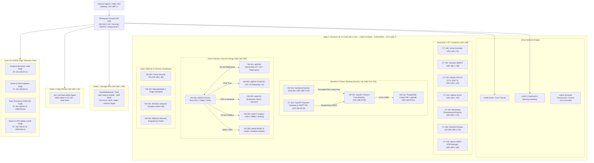

# Hybrid Datacenter, Virtualization & Cybersecurity Laboratory

<div align="center">

[](https://stefanutc1.github.io/infrastructure/)
[-52212e?style=for-the-badge&logo=github&logoColor=efebe5&labelColor=140b0f)](https://github.com/stefanutc1)
[-401823?style=for-the-badge&logo=googleclassroom&logoColor=efebe5&labelColor=24181e)](https://github.com/stefanutc1/university)

<!-- AUTO-METRICS-START -->
[](https://stefanutc1.github.io/infrastructure/)
[-brightgreen?style=flat&logo=githubactions)](https://github.com/stefanutc1/infrastructure/actions/workflows/ci.yml)
[](https://github.com/stefanutc1/infrastructure/actions/workflows/cd.yml)
[](https://github.com/stefanutc1/infrastructure/actions)
<!-- AUTO-METRICS-END -->

<br/>

[](https://github.com/stefanutc1/infrastructure/actions/workflows/ci.yml)
[-success?style=flat-square&logo=terraform&logoColor=white)](policy/cloud/zero_cost_policy.rego)
[](https://proxmox.com)
[](https://opnsense.org)
[-00A4E4?style=flat-square&logo=wazuh&logoColor=white)](cyber/)
[-10b981?style=flat-square&logo=hackthebox&logoColor=white)](cyber/ctf/19-09-2026/)
[](LICENSE)

</div>

---

## 1. Executive Summary

This repository houses the declarative Infrastructure-as-Code (IaC), virtualization architecture, configuration management, Digital Forensics & Incident Response (DFIR) case files, physical ESP32 edge telemetry, and the specialized **Bachelor's Thesis Banking Security Laboratory** (*"Arhitectura și Securitatea Sistemelor Informatice Bancare"*).

The platform operates across physical bare-metal nodes, a virtualized perimeter firewall, isolated 802.1Q network segments, Linux containers (LXC), Kernel-based Virtual Machines (KVM), lightweight Kubernetes nodes, and autonomous ESP32 microcontrollers:

> [!NOTE]
> **Author & Engineering Background**:
> - **Lead Architect**: **Moană Ștefănuț-Cornel ([@stefanutc1](https://github.com/stefanutc1))**
> - **University**: **Universitatea din Craiova** · Faculty of Economics and Business Administration (FEAA) — Economic Informatics (*Informatică Economică*, **2024 – 2027**)
> - **Software Experience**: Continuous hands-on software & systems engineering since **2015** (10+ years, backed by historical repositories at [`stefanutc1/old`](https://github.com/stefanutc1/old))
> - **Academic Coursework Repository**: [`https://github.com/stefanutc1/university`](https://github.com/stefanutc1/university)
> - **Main Engineering Portfolio**: [`https://stefanutc1.github.io`](https://stefanutc1.github.io)
> - **Interactive Datacenter 3D Explorer**: [`https://stefanutc1.github.io/infrastructure/`](https://stefanutc1.github.io/infrastructure/)

---

## 2. Master Platform Documentation Map

| Document | Focus & Scope | Target Engineering Audience |
| :--- | :--- | :--- |
| [**`ARCHITECTURE.md`**](ARCHITECTURE.md) | Platform architecture, Zero Trust transit bus, compute density, and ELO AI routing cascade | Systems & Enterprise Architects |
| [**`INFRASTRUCTURE.md`**](INFRASTRUCTURE.md) | Hardware fleet inventory, KVM VM fleet (VM 200–410), LXC fleet (CT 100–106), capacity budget | Systems & Platform Engineers |
| [**`SERVICES.md`**](SERVICES.md) | 26 active workloads, port assignments, dependencies, criticality, and health probes | DevOps & SRE Teams |
| [**`NETWORK.md`**](NETWORK.md) | 802.1Q VLAN matrix (10–50), virtual bridges (`vmbr0–3`), firewall rules, and WireGuard VPN | Network & Security Engineers |
| [**`SECURITY.md`**](SECURITY.md) | Defense baseline, STRIDE threat model, CIS Linux benchmarks, PKI/CA, and Wazuh HIDS | SecOps & Compliance Teams |
| [**`OPERATIONS.md`**](OPERATIONS.md) | Day-2 SOPs, cold boot sequencing, emergency shutdown protocols, and maintenance cadence | Operations & SRE Engineers |
| [**`BACKUP.md`**](BACKUP.md) | 3-2-1 backup strategy, Proxmox vzdump, PBS deduplication, ZFS snapshot retention, RPO/RTO | Backup & Storage Admins |
| [**`DISASTER-RECOVERY.md`**](DISASTER-RECOVERY.md) | DR plan, bare-metal recovery runbooks, failure scenarios A–D, and restore verification | Incident Response Commanders |
| [**`CONTRIBUTING.md`**](CONTRIBUTING.md) | Contribution standards, IaC formatting, pre-commit gates, conventional commits | Contributors & Developers |
| [**`docs/LICENTA_ARCHITECTURE.md`**](docs/LICENTA_ARCHITECTURE.md) | Bachelor's Thesis Banking Security Lab (Apache Fineract, PostgreSQL ledger, SWIFT MT103 API) | Academic Advisors & Researchers |
| [**`docs/ACTIVE_DIRECTORY_LAB.md`**](docs/ACTIVE_DIRECTORY_LAB.md) | Multi-generational Active Directory forest (2008–2025), Kerberos, BloodHound, and Sysmon | Identity & Red Team Engineers |
| [**`esp32/README.md`**](esp32/README.md) | Physical edge IoT fleet (Gate Biometrics, Smart Irrigation, Thermal Monitor, Power/UPS) | Embedded & IoT Engineers |
| [**`cyber/ctf/19-09-2026/`**](cyber/ctf/19-09-2026/) | Complete 19.09.2026 InvataCyber.ro CTF writeup (3/3 flags · 100% solved) | Reverse Engineers & CTF Players |

---

## 3. High-Level Architectural Blueprints

### 3.1 End-to-End Infrastructure Topology


```mermaid
flowchart TB
    WAN["Internet Ingress / Fiber ONT<br/>Gateway: 192.168.1.1"] --> OPN["OPNsense Firewall (VM 200)<br/>192.168.1.134 / Suricata IDS/IPS / Unbound DoT"]

    subgraph NODE1["Node 1: Proxmox VE 9.2 (192.168.1.132) — Intel i3-10100F · 12GB DDR4 · GTX 1050 Ti"]
        direction TB

        subgraph BRIDGES["Virtual Network Bridges"]
            VMBR0["vmbr0 (LAN / Core Transit)"]
            VMBR1["vmbr1 (CyberLab & Banking Isolation)"]
            VMBR2["vmbr2 (Firewall Interconnect / Transit 10.10.20.0/30)"]
        end

        subgraph LXC_FLEET["Production LXC Containers (100–106)"]
            CT100["CT 100: Home Assistant (192.168.1.10)"]
            CT101["CT 101: Scrutiny SMART (192.168.1.108)"]
            CT102["CT 102: Ollama GPU AI (GTX 1050 Ti) (192.168.1.110)"]
            CT103["CT 103: Uptime Kuma (192.168.1.119)"]
            CT104["CT 104: Monitoring (Prometheus/Grafana) (192.168.1.121)"]
            CT105["CT 105: OWASP Pentest Lab (192.168.1.175)"]
            CT106["CT 106: Wazuh SIEM / XDR Manager (192.168.1.240)"]
        end

        subgraph THESIS_FLEET["Bachelor's Thesis: Banking Security Lab (VMs 310–313)"]
            VM310["VM 310: Apache Fineract Core-Banking (192.168.20.50)"]
            VM311["VM 311: PostgreSQL Ledger DB + pgAudit (192.168.20.51)"]
            CT312["CT 312: FastAPI Payment Gateway & SWIFT API (192.168.20.52)"]
            VM313["VM 313: Hardened Bastion Jump-Box (192.168.10.50)"]
            VM313 -.->|Encrypted SSH Jump Only| VM310
            CT312 -->|Double-Entry REST| VM310
            VM310 -->|mTLS JDBC| VM311
        end

        subgraph AD_FLEET["Active Directory Security Range (VMs 400–405)"]
            AD400["VM 400: ad2022 (Forest Root PDC / FSMO / DNS)"]
            AD401["VM 401: ad2016 (Secondary DC / GC / Replication)"]
            AD402["VM 402: ad2012 (Child DC / AD CS Enterprise CA)"]
            AD403["VM 403: adwin10 (Enterprise Client / Sysmon)"]
            AD404["VM 404: adwin7 (Legacy Client / SMBv1 Testing)"]
            AD405["VM 405: adrhel (RHEL 9 SSSD / Kerberos Realm)"]
            AD400 <-->|AD DS Replication| AD401
            AD400 -->|Child Trust| AD402
            AD400 -->|GPO & Kerberos| AD403
            AD400 -->|NTLM & SMBv1| AD404
            AD400 -->|SSSD / krb5| AD405
        end

        subgraph SEC_VMS["Cyber Defense & Forensic Sandboxes"]
            VM300["VM 300: Parrot Security OS (192.168.1.30)"]
            VM301["VM 301: Metasploitable 2 Target (Isolated)"]
            VM303["VM 303: Windows Malware Sandbox (Flare-VM)"]
            VM304["VM 304: REMnux Reverse Engineering Toolkit"]
        end
    end

    subgraph NODE2["Node 2: Storage NAS (192.168.1.135)"]
        OMV["OpenMediaVault 7 NAS<br/>Intel Celeron N2830 · 2GB RAM<br/>ZFS Pool / NFS / SMB / vzdump Target"]
    end

    subgraph NODE4["Node 4: Edge Worker (192.168.1.18)"]
        K8S["k3s / k0s Bare-Metal Agent<br/>AMD Athlon II X2 220 · 4GB RAM"]
    end

    subgraph EDGE_FLEET["VLAN 50: ESP32 Edge Telemetry Fleet"]
        ESP_GATE["Footprint Biometric Gate Node<br/>IP: 192.168.50.14"]
        ESP_IRR["Smart 4-Zone Irrigation Node<br/>IP: 192.168.50.12"]
        ESP_ENV["Rack Thermal & PWM Fan Node<br/>IP: 192.168.50.15 (:80/metrics)"]
        ESP_PWR["Mains & UPS Safety Cutoff Node<br/>IP: 192.168.50.16 (:80/metrics)"]
    end

    OPN --> VMBR0
    OPN --> VMBR1
    OPN --> NODE2
    OPN --> NODE4
    OPN --> EDGE_FLEET
```

---

## 4. Physical Compute Fleet

| Parameter | Node 1: Hypervisor (`pve_primary_x64`) | Node 2: Storage NAS (`omv_nas`) | Node 4: Edge Worker (`k8s_node_04`) |
| :--- | :--- | :--- | :--- |
| **Chassis** | Custom Bare-Metal Workstation | ASUS X451MA Laptop Server | Custom Legacy Micro-Tower |
| **Role** | Type-1 Hypervisor & Production Host | Central ZFS Storage & vzdump Target | Lightweight Edge Kubernetes Node |
| **CPU Model** | Intel Core i3-10100F (Comet Lake) | Intel Celeron N2830 (Bay Trail) | AMD Athlon II X2 220 (Regor) |
| **Architecture** | x86_64 (4C/8T @ 3.60 GHz, 4.3 Turbo) | x86_64 (2C/2T @ 2.16 GHz, 2.41 Turbo)| x86_64 (2C/2T @ 2.80 GHz) |
| **Dedicated GPU** | NVIDIA GeForce GTX 1050 Ti (4GB GDDR5)| Integrated Intel HD Graphics | NVIDIA GeForce GTS 250 (1GB GDDR3)|
| **System Memory** | 12 GB DDR4 (1x 8GB + 1x 4GB @ 2666 MHz)| 2 GB DDR3L (1333 MHz) | 4 GB DDR3 (1066 MHz) |
| **Storage Pool** | 512 GB NVMe PCIe M.2 SSD (`local-lvm`) | 500 GB 2.5" SATA HDD (ZFS Pool) | 80 GB 3.5" SATA HDD (Ext4) |
| **Operating System**| Proxmox VE 9.2 (Debian 12 / Linux 6.8+) | OpenMediaVault 7 (Debian 12 / ZFS) | Debian 12 Minimal (Linux 6.1+) |
| **Static IPv4** | `192.168.1.132` | `192.168.1.135` | `192.168.1.18` |
| **Operational State**| `DEPLOYED` (Active 24/7 Production) | `DEPLOYED` (Active 24/7 Production) | `DEPLOYED` (Active Edge Worker) |

---

## 5. Network Segmentation & 802.1Q VLAN Matrix

All traffic traverses the virtualized OPNsense perimeter firewall (VM 200) with strict default-deny inter-VLAN routing:

```
+---------+----------------------------+-----------------+---------------------------+----------------------------------------------+
| VLAN ID | Subnet CIDR                | Bridge / Gateway| Primary Workloads         | Stateful Firewall Security Policy            |
+---------+----------------------------+-----------------+---------------------------+----------------------------------------------+
| VLAN 10 | 192.168.10.0/24 (Mgmt)     | vmbr1 / .1      | Proxmox, SSH Bastion, CA  | Ingress: ed25519 & MFA only; no direct WAN   |
| VLAN 20 | 192.168.20.0/24 (Services) | vmbr1 / .1      | Banking Core, PostgreSQL  | Inter-VLAN blocked except routed pf filter   |
| VLAN 30 | 192.168.30.0/24 (CyberLab) | vmbr1 / .1      | Flare-VM, REMnux, Kali    | Total default-deny egress: zero WAN outbound |
| VLAN 40 | 192.168.40.0/24 (AD Forest)| vmbr1 / .1      | Windows DCs (VM 400-405)  | Kerberos, LDAP, SMB strictly contained       |
| VLAN 50 | 192.168.50.0/24 (IoT Edge) | vmbr1 / .1      | ESP32 Telemetry Nodes     | MQTT to HA only; isolated from VLAN 10/20/40 |
+---------+----------------------------+-----------------+---------------------------+----------------------------------------------+
```

---

## 6. Bachelor's Thesis: Banking Security Laboratory

The dedicated **Bachelor's Thesis CyberLab** (*"Arhitectura și Securitatea Sistemelor Informatice Bancare"*) simulates an enterprise multi-tier banking architecture adhering to PCI-DSS 4.0, ISO 27001, and the SWIFT Customer Security Programme (CSP):

1. **VM 310 — Apache Fineract Core-Banking (`192.168.20.50`)**:
   - Central transaction engine executing double-entry chart of accounts verification under ACID semantics.
   - Maker-Checker authorization controls for high-value financial mutations.
2. **VM 311 — Financial Ledger Database (`192.168.20.51`)**:
   - Hardened PostgreSQL 16 server with the `pgAudit` extension capturing all DDL and DML operations.
   - Row-level locking to prevent concurrent balance race conditions.
3. **CT 312 — Payment Gateway & SWIFT API (`192.168.20.52`)**:
   - FastAPI microservice validating card numbers via the Luhn mod 10 checksum algorithm.
   - Validates ISO 20022 (`pacs.008`) and SWIFT MT103 telegraphic transfer schemas.
4. **VM 313 — Hardened Bastion Jump-Box (`192.168.10.50`)**:
   - Dedicated administrative bridge shielding the banking core; requires ed25519 elliptic-curve SSH keys and Google Authenticator TOTP tokens.

---

## 7. ESP32 Physical Edge Telemetry Fleet

The platform incorporates an autonomous fleet of ESP32 microcontrollers in [`esp32/`](esp32/):

- **Footprint Biometric Gate Node (`esp32/footprint/`)**: Dual PIR + HC-SR04 ultrasonic presence detection paired with an optical fingerprint scanner and 12V solenoid lock actuation.
- **Smart 4-Zone Irrigation Controller (`esp32/irrigation/`)**: Optocoupled solenoid valve actuation with hardware watchdog timers, analog soil moisture probes, and rain inhibit logic.
- **Datacenter Rack Thermal Monitor (`esp32/datacenter_environment/`)**: BME280 ambient climate sensor, dual DS18B20 1-Wire intake/exhaust probes, autonomous Noctua 25kHz PWM fan regulation, and embedded Prometheus `/metrics` exporter.
- **Mains AC & UPS Safety Appliance (`esp32/power_monitor/`)**: Zero-latency 230V AC optocoupler outage detection, INA219 digital power meter, and automated hypervisor shutdown triggers if battery falls below 11.4V.

---

## 8. Digital Forensics & Competitive CTF Dossiers

The repository maintains full technical writeups and evidence archives for real-world cybercrime investigations and competitive events:

- **19.09.2026 InvataCyber.ro CTF (3/3 Flags · 100% Solved)**:
  - Challenge 1: *Imagine* — PNG EOF ZIP carving and Bit Plane 2 LSB extraction ([`cyber/ctf/19-09-2026/writeup_01_the_blog_xss.md`](cyber/ctf/19-09-2026/writeup_01_the_blog_xss.md)).
  - Challenge 2: *Seiful* — Predictable PHP `mt_srand(timestamp)` PRNG seed brute-force ([`cyber/ctf/19-09-2026/writeup_02_portal_lockdown_sqli.md`](cyber/ctf/19-09-2026/writeup_02_portal_lockdown_sqli.md)).
  - Challenge 3: *Bursa* — Floating-point `round(0.45) == 0` exploitation and base64 JSON cookie tampering ([`cyber/ctf/19-09-2026/writeup_03_cms_editor_ssti.md`](cyber/ctf/19-09-2026/writeup_03_cms_editor_ssti.md)).
- **Media Galaxy Brand Impersonation & Chinese SaaS Fraud Campaign** ([`cyber/mediagalaxy`](cyber/mediagalaxy)): Reported via DNSC PNRISC (#178465), leading to upstream domain neutralization.
- **Revolut FinTech Vishing & Session Hijacking** ([`cyber/revolut`](cyber/revolut)): Analysis of SIP caller-ID spoofing and real-time push notification relay.
- **Hotel Reviewer Task Scam & TRON USDT Laundering** ([`cyber/taskscam`](cyber/taskscam)): Reverse engineering of rigged WebSocket withdrawal logic and smart contract layering.

---

## 9. DevSecOps CI/CD & Preventative Cloud Zero-Cost Guardrails

The repository enforces automated CI/CD validation gates on every commit and pull request:

```mermaid
flowchart LR
    A[Git Push / PR] --> B[Gitleaks & TruffleHog Secrets Audit]
    B --> C[ShellCheck, YAML Lint & Markdown Lint]
    C --> D[Trivy & Checkov IaC Security Scans]
    D --> E[Terraform & Ansible Validation]
    E --> F[ESP32 Edge Firmware Audit]
    F --> G[Zero-Cost Cloud Guardrail ($0.00 / Free-Tier)]
    G --> H[Angular Web Frontend Build & Test]
    H --> I[Chaos Engineering Self-Healing Drills]
```

### Preventative Zero-Cost Cloud Policy
To prevent unexpected cloud billing:
- **`scripts/verify_zero_cloud_cost.py`**: Statically audits all Terraform manifests in `cloud/` (AWS, GCP, Azure) to verify strict adherence to free-tier SKUs (`t2.micro`, `t3.micro`, `e2-micro`, `Standard_B1s`).
- **Prohibited Billable Resources**: Instantly flags and rejects NAT Gateways (`aws_nat_gateway`), Application Load Balancers (`aws_lb`), provisioned IOPS, or unattached disks.
- **Policy-as-Code**: Enforced via Open Policy Agent in [`policy/cloud/zero_cost_policy.rego`](policy/cloud/zero_cost_policy.rego).

---

## 10. Automated Diagnostic Doctor

Run the comprehensive 12-domain diagnostic health check locally:

```bash
python3 scripts/audit_infrastructure.py
```

Evaluating: `IaC`, `Configuration`, `Security`, `Secrets`, `Networking`, `Kubernetes`, `Observability`, `Backup`, `Disaster Recovery`, `Documentation`, `AI Security`, and `Supply Chain`.

---

## 11. Quick Start

### 11.1 Clone & Setup
```bash
git clone https://github.com/stefanutc1/infrastructure.git
cd infrastructure
```

### 11.2 Validate Cloud & Firmware Hygiene
```bash
python3 scripts/verify_zero_cloud_cost.py
python3 scripts/verify_esp32_firmware.py
python3 scripts/verify_ioc_hygiene.py
```

### 11.3 Run Web Dashboard Locally
```bash
cd web
npm install
npm start
# Navigate to http://localhost:4200
```

---

<div align="center">

**[Moană Ștefănuț-Cornel (@stefanutc1)](https://github.com/stefanutc1)**  
Universitatea din Craiova · FEAA — Informatică Economică (2024 – 2027)  
Software Engineering since 2015 · Licensed under GNU AGPLv3

</div>
