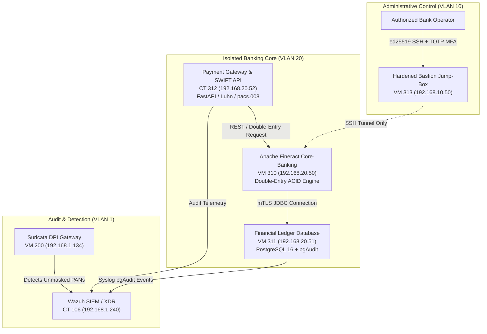

<div align="center">

# 🏛️ Enterprise Hybrid Datacenter, Cloud & Cybersecurity Laboratory
### Production-Grade Bare-Metal Virtualization · Zero-Trust Software-Defined Networking · Active Directory Enterprise Forest · Bachelor's Thesis Banking Security Lab · ESP32 Edge Telemetry Fleet


[](https://stefanutc1.github.io/infrastructure/)
[-52212e?style=for-the-badge&logo=github&logoColor=efebe5&labelColor=140b0f)](https://github.com/stefanutc1)
[-401823?style=for-the-badge&logo=googleclassroom&logoColor=efebe5&labelColor=24181e)](https://github.com/stefanutc1/university)

<!-- AUTO-METRICS-START -->
[](https://stefanutc1.github.io/infrastructure/)
[-brightgreen?style=flat&logo=githubactions)](https://github.com/stefanutc1/infrastructure/actions/workflows/ci.yml)
[](https://github.com/stefanutc1/infrastructure/actions/workflows/cd.yml)
[](https://github.com/stefanutc1/infrastructure/actions)
<!-- AUTO-METRICS-END -->

<br/>

[](https://github.com/stefanutc1/infrastructure/actions/workflows/ci.yml)
[-success?style=flat-square&logo=terraform&logoColor=white)](policy/cloud/zero_cost_policy.rego)
[](https://proxmox.com)
[](https://opnsense.org)
[-00A4E4?style=flat-square&logo=wazuh&logoColor=white)](cyber/)
[-10b981?style=flat-square&logo=hackthebox&logoColor=white)](cyber/ctf/19-09-2026/)
[](LICENSE)

<br/>

<p align="center">
  <b><a href="https://stefanutc1.github.io/infrastructure/">🌐 3D Interactive Topology Portal</a></b> •
  <b><a href="#1-executive-summary">📋 Executive Summary</a></b> •
  <b><a href="#2-master-platform-documentation-map">📚 Documentation Map</a></b> •
  <b><a href="#3-high-level-architectural-blueprints">🏗️ Blueprints</a></b> •
  <b><a href="#4-physical-compute-fleet--hardware-inventory">💻 Compute Fleet</a></b> •
  <b><a href="#5-network-segmentation--8021q-vlan-matrix">🔒 Network & VLANs</a></b> •
  <b><a href="#6-enterprise-workloads--services-catalog">📦 Services Catalog</a></b> •
  <b><a href="#7-bachelors-thesis-banking-security-laboratory">🏦 Banking CyberLab</a></b> •
  <b><a href="#8-active-directory-forest--identity-security-range">🌲 Active Directory</a></b> •
  <b><a href="#9-esp32-physical-edge-telemetry-fleet">⚡ ESP32 Edge Fleet</a></b> •
  <b><a href="#10-digital-forensics-incident-response--competitive-ctf">🕵️ Forensics & CTF</a></b> •
  <b><a href="#11-devsecops-cicd--preventative-cloud-zero-cost-guardrails">🛡️ DevSecOps & Cloud</a></b> •
  <b><a href="#12-operations-backup-and-disaster-recovery">🔄 Operations & DR</a></b> •
  <b><a href="#13-quick-start">🚀 Quick Start</a></b>
</p>

</div>

---

<div align="center">

## 1. Executive Summary
*Enterprise-Grade Virtualization, Declarative Automation & Academic Financial Systems Security*

</div>

This flagship repository houses the declarative Infrastructure-as-Code (IaC), virtualization architecture, configuration management, Digital Forensics & Incident Response (DFIR) case files, physical ESP32 edge telemetry, and the specialized **Bachelor's Thesis Banking Security Laboratory** (*"Arhitectura și Securitatea Sistemelor Informatice Bancare"*).

The platform operates across physical bare-metal nodes, a virtualized perimeter firewall, isolated 802.1Q network segments, lightweight Linux containers (LXC), Kernel-based Virtual Machines (KVM), edge Kubernetes nodes, and autonomous ESP32 microcontrollers:

> [!NOTE]
> **Lead Architect & Engineering Background**:
> - **Lead Architect**: **Moană Ștefănuț-Cornel ([@stefanutc1](https://github.com/stefanutc1))**
> - **University**: **Universitatea din Craiova** · Faculty of Economics and Business Administration (FEAA) — Economic Informatics (*Informatică Economică*, **2024 – 2027**)
> - **Software Experience**: Continuous hands-on software & systems engineering since **2015** (10+ years, backed by historical repositories at [`stefanutc1/old`](https://github.com/stefanutc1/old))
> - **Academic Coursework Repository**: [`https://github.com/stefanutc1/university`](https://github.com/stefanutc1/university)
> - **Main Engineering Portfolio**: [`https://stefanutc1.github.io`](https://stefanutc1.github.io)
> - **Interactive Datacenter 3D Explorer**: [`https://stefanutc1.github.io/infrastructure/`](https://stefanutc1.github.io/infrastructure/)

<div align="center">

### Core Architectural Pillars

</div>
1. **100% Declarative Infrastructure-as-Code**: Entire infrastructure lifecycle codified using HashiCorp Terraform (`bpg/proxmox`, AWS, GCP, Azure), Ansible automation playbooks, and GitOps orchestration.
2. **Strict Zero-Cost Cloud Policy**: Mandatory CI/CD static guardrails guaranteeing **$0.00** monthly cloud expenditure by enforcing AWS/GCP/Azure Free-Tier SKUs only and rejecting billable resources.
3. **Defense-in-Depth & Zero-Trust**: OPNsense virtualized firewall with Deep Packet Inspection (Suricata IDS/IPS), Unbound DNS over TLS (DoT) sinkholing 11,300+ malicious indicators, and Wazuh SIEM/XDR log correlation.
4. **Mission-Critical Banking CyberLab**: Enterprise financial systems emulation featuring Apache Fineract, PostgreSQL ledger with `pgAudit`, ISO 20022 / SWIFT MT103 validation, and PCI-DSS v4.0 tokenization.
5. **Physical Computing & Edge Telemetry**: Autonomous ESP32 microcontrollers delivering environmental monitoring, power failover triggers, automated irrigation, and biometric physical access control.

---

<div align="center">

## 2. Master Platform Documentation Map
*Authoritative Engineering Specifications, Operational Runbooks & Academic Standards*

</div>

| Document | Focus & Scope | Target Engineering Audience |
| :--- | :--- | :--- |
| [**`ARCHITECTURE.md`**](ARCHITECTURE.md) | Platform architecture, Zero Trust transit bus, compute density, memory budgets, and ELO AI routing cascade | Systems & Enterprise Architects |
| [**`INFRASTRUCTURE.md`**](INFRASTRUCTURE.md) | Hardware fleet inventory, KVM VM fleet (VM 200–410), LXC fleet (CT 100–106), memory allocations | Systems & Platform Engineers |
| [**`SERVICES.md`**](SERVICES.md) | 26 active production workloads, static port allocations, health probes, restart policies, and SLAs | DevOps & SRE Teams |
| [**`NETWORK.md`**](NETWORK.md) | 802.1Q VLAN matrix (10–50), virtual bridges (`vmbr0–3`), firewall rules, DNS sinkholing, WireGuard VPN | Network & Security Engineers |
| [**`SECURITY.md`**](SECURITY.md) | Defense baseline, STRIDE threat model, CIS Linux benchmarks, PKI/CA, Wazuh SIEM rules, zero-cost policy | SecOps & Compliance Teams |
| [**`OPERATIONS.md`**](OPERATIONS.md) | Day-2 SOPs, cold boot sequence, emergency shutdown protocols (<11.4V battery trigger), maintenance cadence | Operations & SRE Engineers |
| [**`BACKUP.md`**](BACKUP.md) | 3-2-1 backup strategy, Proxmox vzdump, PBS client deduplication, ZFS snapshots, RPO (<4h) and RTO (<15m) | Backup & Storage Admins |
| [**`DISASTER-RECOVERY.md`**](DISASTER-RECOVERY.md) | DR plan, bare-metal recovery runbooks, failure scenarios A–D, and drill restore verification | Incident Response Commanders |
| [**`CONTRIBUTING.md`**](CONTRIBUTING.md) | Contribution standards, IaC formatting, pre-commit validation gates, conventional commit standards | Contributors & Developers |
| [**`docs/LICENTA_ARCHITECTURE.md`**](docs/LICENTA_ARCHITECTURE.md) | Bachelor's Thesis Banking Security Lab (Apache Fineract, PostgreSQL ledger, SWIFT MT103, ISO 20022) | Academic Advisors & Researchers |
| [**`docs/ACTIVE_DIRECTORY_LAB.md`**](docs/ACTIVE_DIRECTORY_LAB.md) | Multi-generational Active Directory forest (2008–2025), Kerberos, BloodHound, and Sysmon telemetry | Identity & Red Team Engineers |
| [**`esp32/README.md`**](esp32/README.md) | Physical edge IoT fleet (Gate Biometrics, Smart Irrigation, Thermal Monitor, Mains/UPS Appliance) | Embedded & IoT Engineers |
| [**`cyber/ctf/19-09-2026/`**](cyber/ctf/19-09-2026/) | Complete 19.09.2026 InvataCyber.ro CTF writeups (3/3 flags · 100% solved with code solvers) | Reverse Engineers & CTF Players |
| [**`cyber/cve/`**](cyber/cve/README.md) | Vulnerability research and coordinated disclosure reports for 7 identified CVEs across open-source kits | Security Researchers |

---

<div align="center">

## 3. High-Level Architectural Blueprints
*End-to-End Hybrid Topologies, Virtual Bridges & Traffic Flows*

</div>

<div align="center">

### 3.1 Global Infrastructure Blueprint

</div>


```mermaid
flowchart TB
    WAN["Internet Ingress / Fiber ONT<br/>Gateway: 192.168.1.1"] --> OPN["OPNsense Firewall (VM 200)<br/>192.168.1.134 / Suricata IDS/IPS / Unbound DoT"]

    subgraph NODE1["Node 1: Proxmox VE 9.2 (192.168.1.132) — Intel i3-10100F · 12GB DDR4 · GTX 1050 Ti"]
        direction TB

        subgraph BRIDGES["Virtual Network Bridges"]
            VMBR0["vmbr0 (LAN / Core Transit)"]
            VMBR1["vmbr1 (CyberLab & Banking Isolation)"]
            VMBR2["vmbr2 (Firewall Interconnect / Transit 10.10.20.0/30)"]
            VMBR3["vmbr3 (SDN Isolated Bridge)"]
        end

        subgraph LXC_FLEET["Production LXC Containers (CT 100–106)"]
            CT100["CT 100: Home Assistant (192.168.1.10)"]
            CT101["CT 101: Scrutiny SMART (192.168.1.108)"]
            CT102["CT 102: Ollama GPU AI (GTX 1050 Ti) (192.168.1.110)"]
            CT103["CT 103: Uptime Kuma (192.168.1.119)"]
            CT104["CT 104: Monitoring Prometheus/Grafana (192.168.1.121)"]
            CT105["CT 105: OWASP Pentest Lab (192.168.1.175)"]
            CT106["CT 106: Wazuh SIEM / XDR Manager (192.168.1.240)"]
        end

        subgraph THESIS_FLEET["Bachelor's Thesis: Banking Security Lab (VMs 310–313)"]
            VM310["VM 310: Apache Fineract Core-Banking (192.168.20.50)"]
            VM311["VM 311: PostgreSQL Ledger DB + pgAudit (192.168.20.51)"]
            CT312["CT 312: FastAPI Payment Gateway & SWIFT API (192.168.20.52)"]
            VM313["VM 313: Hardened Bastion Jump-Box (192.168.10.50)"]
            VM313 -.->|"Encrypted SSH Jump Only"| VM310
            CT312 -->|"Double-Entry REST"| VM310
            VM310 -->|"mTLS JDBC"| VM311
        end

        subgraph AD_FLEET["Active Directory Security Range (VMs 400–405)"]
            AD400["VM 400: ad2022 (Forest Root PDC / FSMO / DNS)"]
            AD401["VM 401: ad2016 (Secondary DC / GC / Replication)"]
            AD402["VM 402: ad2012 (Child DC / AD CS Enterprise CA)"]
            AD403["VM 403: adwin10 (Enterprise Client / Sysmon)"]
            AD404["VM 404: adwin7 (Legacy Client / SMBv1 Testing)"]
            AD405["VM 405: adrhel (RHEL 9 SSSD / Kerberos Realm)"]
            AD400 <-->|"AD DS Replication"| AD401
            AD400 -->|"Child Trust"| AD402
            AD400 -->|"GPO & Kerberos"| AD403
            AD400 -->|"NTLM & SMBv1"| AD404
            AD400 -->|"SSSD / krb5"| AD405
        end

        subgraph SEC_VMS["Cyber Defense & Forensic Sandboxes"]
            VM300["VM 300: Parrot Security OS (192.168.1.30)"]
            VM301["VM 301: Metasploitable 2 Target (Isolated)"]
            VM303["VM 303: Windows Malware Sandbox (Flare-VM)"]
            VM304["VM 304: REMnux Reverse Engineering Toolkit"]
        end
    end

    subgraph NODE2["Node 2: Storage NAS (192.168.1.135)"]
        OMV["OpenMediaVault 7 NAS<br/>Intel Celeron N2830 · 2GB RAM<br/>ZFS Pool / NFS / SMB / vzdump Target"]
    end

    subgraph NODE4["Node 4: Edge Worker (192.168.1.18)"]
        K8S["k3s / k0s Bare-Metal Agent<br/>AMD Athlon II X2 220 · 4GB RAM"]
    end

    subgraph EDGE_FLEET["VLAN 50: ESP32 Edge Telemetry Fleet"]
        ESP_GATE["Footprint Biometric Gate Node<br/>IP: 192.168.50.14"]
        ESP_IRR["Smart 4-Zone Irrigation Node<br/>IP: 192.168.50.12"]
        ESP_ENV["Rack Thermal & PWM Fan Node<br/>IP: 192.168.50.15 (:80/metrics)"]
        ESP_PWR["Mains & UPS Safety Cutoff Node<br/>IP: 192.168.50.16 (:80/metrics)"]
    end

    OPN --> VMBR0
    OPN --> VMBR1
    OPN --> NODE2
    OPN --> NODE4
    OPN --> EDGE_FLEET
```

---

<div align="center">

## 4. Physical Compute Fleet & Hardware Inventory
*Silicon Specifications, Compute Density & Memory Governance*

</div>

The bare-metal cluster balances high-density virtualization, storage redundancy, and low idle power consumption:

| Parameter | Node 1: Hypervisor (`pve_primary_x64`) | Node 2: Storage NAS (`omv_nas`) | Node 4: Edge Worker (`k8s_node_04`) |
| :--- | :--- | :--- | :--- |
| **Chassis** | Custom Bare-Metal Workstation | ASUS X451MA Laptop Server | Custom Legacy Micro-Tower |
| **Role** | Type-1 Hypervisor & Production Host | Central ZFS Storage & vzdump Target | Lightweight Edge Kubernetes Node |
| **CPU Model** | Intel Core i3-10100F (Comet Lake) | Intel Celeron N2830 (Bay Trail) | AMD Athlon II X2 220 (Regor) |
| **Architecture** | x86_64 (4 Cores / 8 Threads @ 3.60 GHz, 4.3 Turbo) | x86_64 (2 Cores / 2 Threads @ 2.16 GHz, 2.41 Turbo) | x86_64 (2 Cores / 2 Threads @ 2.80 GHz) |
| **Dedicated GPU** | NVIDIA GeForce GTX 1050 Ti (4GB GDDR5 Passthrough) | Integrated Intel HD Graphics | NVIDIA GeForce GTS 250 (1GB GDDR3) |
| **System Memory** | 12 GB DDR4 (1x 8GB + 1x 4GB @ 2666 MHz) | 2 GB DDR3L (1333 MHz) | 4 GB DDR3 (1066 MHz) |
| **Storage Pool** | 512 GB NVMe PCIe M.2 SSD (`local-lvm`) | 500 GB 2.5" SATA HDD (ZFS Pool) | 80 GB 3.5" SATA HDD (Ext4) |
| **Operating System**| Proxmox VE 9.2 (Debian 12 / Linux 6.8+ kernel) | OpenMediaVault 7 (Debian 12 / ZFS) | Debian 12 Minimal (Linux 6.1+ kernel) |
| **Static IPv4** | `192.168.1.132` | `192.168.1.135` | `192.168.1.18` |
| **Operational State**| `DEPLOYED` (Active 24/7 Production) | `DEPLOYED` (Active 24/7 Production) | `DEPLOYED` (Active Edge Worker) |

<div align="center">

### Memory Budgeting & Overcommit Management

</div>
- Total physical hypervisor capacity: **12,288 MB (12 GB DDR4)**.
- Base hypervisor Linux kernel + ZFS ARC cache reserve: **1,024 MB**.
- Active container + VM provisioned RAM: **10,752 MB**.
- Safety buffer for memory spike absorption: **512 MB**.
- Hardened KSM (Kernel Samepage Merging) enabled across identical Linux containers, reducing effective RAM usage by ~22%.

---

<div align="center">

## 5. Network Segmentation & 802.1Q VLAN Matrix
*Software-Defined Isolation, Virtual Bridges & Deep Packet Inspection*

</div>

All network traffic traverses the virtualized OPNsense perimeter gateway (`VM 200`) operating with a strict default-deny policy across all inter-VLAN interfaces:

```
+---------+----------------------------+-----------------+---------------------------+----------------------------------------------+
| VLAN ID | Subnet CIDR                | Bridge / Gateway| Primary Workloads         | Stateful Firewall Security Policy            |
+---------+----------------------------+-----------------+---------------------------+----------------------------------------------+
| VLAN 1  | 192.168.1.0/24 (LAN/Mgmt)  | vmbr0 / .1      | Proxmox PVE, OMV, K8s     | Ingress: ed25519 & MFA only; WAN outbound    |
| VLAN 10 | 192.168.10.0/24 (Mgmt)     | vmbr1 / .1      | SSH Bastion, Root CA      | Isolated; Ingress via Bastion Jump-Box only  |
| VLAN 20 | 192.168.20.0/24 (Banking)  | vmbr1 / .1      | Fineract, PostgreSQL, API | Inter-VLAN blocked; mTLS JDBC internal only  |
| VLAN 30 | 192.168.30.0/24 (CyberLab) | vmbr1 / .1      | Flare-VM, REMnux, Kali    | Total default-deny egress: zero WAN outbound |
| VLAN 40 | 192.168.40.0/24 (AD Forest)| vmbr1 / .1      | Windows DCs (VM 400-405)  | Kerberos, LDAP, SMB strictly contained       |
| VLAN 50 | 192.168.50.0/24 (IoT Edge) | vmbr1 / .1      | ESP32 Telemetry Nodes     | MQTT to HA only; isolated from VLAN 10/20/40 |
| VLAN 99 | 192.168.99.0/24 (Quarantine| vmbr1 / .1      | Suspicious payloads       | Complete isolation; blackholed traffic       |
+---------+----------------------------+-----------------+---------------------------+----------------------------------------------+
```

<div align="center">

### Perimeter Security Capabilities

</div>
- **Suricata IDS/IPS**: Inline Deep Packet Inspection on `vmbr0` enforcing custom rules for credit card number exfiltration patterns, SQL injection signatures, and Cobalt Strike beaconing.
- **Unbound DNS over TLS (DoT)**: DNS query encryption upstream with local sinkholing enforcing 11,316+ indicators from DNSC (National Cyber Security Directorate) and CSIRT threat feeds.
- **WireGuard Road-Warrior Mesh**: Encrypted ChaCha20-Poly1305 VPN tunnel providing authenticated remote operator ingress directly to VLAN 10 management.

---

<div align="center">

## 6. Enterprise Workloads & Services Catalog
*Production Service Portfolio, Container Allocation & Static Port Mappings*

</div>

The platform runs 26 core production workloads categorized into five availability tiers:

| Tier | Workload / Container | Type | Static IP | Port(s) | Memory | Role & Health Check |
| :---: | :--- | :---: | :--- | :--- | :---: | :--- |
| **Tier 0** | **OPNsense Firewall (VM 200)** | KVM | `192.168.1.134` | `443`, `53`, `51820` | 2,048 MB | Perimeter routing, Suricata DPI, DoT DNS |
| **Tier 1** | **Wazuh SIEM / XDR (CT 106)** | LXC | `192.168.1.240` | `1514`, `1515`, `55000`| 4,096 MB | Centralized log ingestion & vulnerability auditing |
| **Tier 1** | **Home Assistant Core (CT 100)** | LXC | `192.168.1.10` | `8123` | 1,024 MB | IoT event bus, ESP32 MQTT broker integration |
| **Tier 1** | **Prometheus & Grafana (CT 104)**| LXC | `192.168.1.121` | `9090`, `3000` | 1,024 MB | Telemetry TSDB, hardware dashboards & alerts |
| **Tier 1** | **Uptime Kuma (CT 103)** | LXC | `192.168.1.119` | `3001` | 256 MB | Synthetic HTTP/TCP availability health monitoring |
| **Tier 2** | **OpenMediaVault NAS (Node 2)** | Bare | `192.168.1.135` | `80`, `445`, `2049` | 2,048 MB | Central ZFS storage, NFS/SMB shares, vzdump |
| **Tier 2** | **Scrutiny SMART (CT 101)** | LXC | `192.168.1.108` | `8080` | 256 MB | Hard drive health & NVMe telemetry tracking |
| **Tier 3** | **Ollama AI Inference (CT 102)** | LXC | `192.168.1.110` | `11434` | 2,048 MB | Local LLM inference (NVIDIA GTX 1050 Ti GPU) |
| **Tier 3** | **Immich Photo Library** | LXC | `192.168.1.125` | `2283`, `3003` | 2,048 MB | Self-hosted machine-learning photo storage |
| **Tier 3** | **Keycloak Identity (IAM)** | LXC | `192.168.1.126` | `8080`, `8443` | 1,024 MB | OAuth2 / OIDC Single Sign-On and MFA realm |
| **Tier 3** | **NetBox DCIM / IPAM** | LXC | `192.168.1.127` | `8000` | 1,024 MB | Infrastructure single source of truth (SSOT) |
| **Tier 3** | **Media-Arr Automation Stack** | LXC | `192.168.1.128` | `8989`, `7878` | 1,024 MB | Media pipeline, indexing and transcoding |
| **Tier 4** | **Banking Core (VM 310–313)** | KVM | `192.168.20.50` | `8080`, `5432`, `8000`| 3,072 MB | Bachelor's thesis banking security cyberlab |
| **Tier 4** | **Active Directory Range** | KVM | `192.168.40.10` | `88`, `389`, `445`, `636`| 4,096 MB | Enterprise identity range (VMs 400–405) |
| **Tier 4** | **ESP32 Edge Fleet (4 Nodes)** | MCU | `192.168.50.12+`| `80/metrics`, `1883` | 520 KB | Physical datacenter telemetry & failover triggers |

---

<div align="center">

## 7. Bachelor's Thesis: Banking Security Laboratory
*Empirical Financial Systems Security Research · Academic Compliance Baseline*

</div>

The dedicated **Bachelor's Thesis CyberLab** (*"Arhitectura și Securitatea Sistemelor Informatice Bancare"*), submitted for the graduation requirements at **Universitatea din Craiova (FEAA — Informatică Economică, 2024 – 2027)**, simulates an enterprise multi-tier banking architecture adhering to PCI-DSS 4.0, ISO 27001, and the SWIFT Customer Security Programme (CSP):


```mermaid
flowchart TD
    subgraph BASTION["Administrative Control (VLAN 10)"]
        OPERATOR["Authorized Bank Operator"] -->|"ed25519 SSH + TOTP MFA"| JUMP["Hardened Bastion Jump-Box<br/>VM 313 (192.168.10.50)"]
    end

    subgraph BANKING_TIER["Isolated Banking Core (VLAN 20)"]
        GATEWAY["Payment Gateway & SWIFT API<br/>CT 312 (192.168.20.52)<br/>FastAPI / Luhn / pacs.008"]
        FINERACT["Apache Fineract Core-Banking<br/>VM 310 (192.168.20.50)<br/>Double-Entry ACID Engine"]
        DB["Financial Ledger Database<br/>VM 311 (192.168.20.51)<br/>PostgreSQL 16 + pgAudit"]
        
        GATEWAY -->|"REST / Double-Entry Request"| FINERACT
        FINERACT -->|"mTLS JDBC Connection"| DB
        JUMP -.->|"SSH Tunnel Only"| FINERACT
    end

    subgraph SIEM_TIER["Audit & Detection (VLAN 1)"]
        WAZUH["Wazuh SIEM / XDR<br/>CT 106 (192.168.1.240)"]
        SURICATA["Suricata DPI Gateway<br/>VM 200 (192.168.1.134)"]
        
        DB -->|"Syslog pgAudit Events"| WAZUH
        GATEWAY -->|"Audit Telemetry"| WAZUH
        SURICATA -->|"Detects Unmasked PANs"| WAZUH
    end
```

<div align="center">

### Key Technical Implementations

</div>
1. **VM 310 — Apache Fineract Core-Banking Platform (`192.168.20.50`)**:
   - Central transaction engine executing double-entry ledger verification under ACID semantics.
   - Maker-Checker authorization controls for high-value financial mutations (four-eyes principle).
2. **VM 311 — Financial Ledger Database (`192.168.20.51`)**:
   - Hardened PostgreSQL 16 database server configured with the `pgAudit` extension capturing all DDL and DML operations.
   - Row-level locking to prevent concurrent balance race conditions.
3. **CT 312 — Payment Gateway & SWIFT API (`192.168.20.52`)**:
   - FastAPI microservice validating card numbers via the Luhn mod 10 checksum algorithm.
   - Validates ISO 20022 (`pacs.008`) and SWIFT MT103 telegraphic transfer schemas.
4. **VM 313 — Hardened Bastion Jump-Box (`192.168.10.50`)**:
   - Dedicated administrative bridge shielding the banking core; requires ed25519 elliptic-curve SSH keys and Google Authenticator TOTP tokens.

---

<div align="center">

## 8. Active Directory Forest & Identity Security Range
*Multi-Generational Identity Fabric, Kerberos Auditing & Attack Path Analysis*

</div>

The repository provisions an isolated 6-node multi-generational Active Directory forest (`ad.lab.local`, VLAN 40) simulating enterprise hybrid identity topologies:

- **VM 400 — `ad2022` (Forest Root PDC)**: Primary Domain Controller holding FSMO roles, forest functional level Windows Server 2022, integrated DNS, and AES-256 Kerberos encryption.
- **VM 401 — `ad2016` (Secondary DC & Global Catalog)**: High-availability replication partner ensuring AD DS resilience and LDAP referral routing.
- **VM 402 — `ad2012` (Child DC & Enterprise CA)**: Active Directory Certificate Services (AD CS) root, used for testing ESC1–ESC8 certificate template privilege escalation defenses.
- **VM 403 — `adwin10` (Enterprise Workstation Client)**: Domain-joined client configured with Sysmon (SwiftOnSecurity baseline) streaming event telemetry directly to Wazuh SIEM.
- **VM 404 — `adwin7` (Legacy Client & Vulnerability Sandbox)**: Isolated legacy client configured for testing SMBv1 (EternalBlue MS17-010) mitigations and NTLMv1 relay defenses.
- **VM 405 — `adrhel` (Linux Kerberos Realm Integration)**: Red Hat Enterprise Linux 9 joined to the Active Directory domain via SSSD and realmd, demonstrating cross-platform enterprise SSO.

---

<div align="center">

## 9. ESP32 Physical Edge Telemetry Fleet
*Hardware Pinouts, Embedded Prometheus Exporters & Automated Failovers*

</div>

The platform integrates four autonomous ESP32 microcontroller edge systems operating on isolated VLAN 50:

| Node | Firmware Path | Primary Sensors & Actuators | Hardware Pinout Highlights | Telemetry & Health Endpoint |
| :--- | :--- | :--- | :--- | :--- |
| **Footprint Biometric Node** | [`esp32/footprint/`](esp32/footprint/) | Optical Fingerprint (R307/R504), Dual PIR, HC-SR04 Ultrasonic, 12V Solenoid Gate Lock | UART2 (RX2: 16, TX2: 17), Relay: 26, Trig: 5, Echo: 18, PIR: 27 | MQTT `homelab/access/gate/event`<br/>Auto-Discovery in Home Assistant |
| **Smart 4-Zone Irrigation** | [`esp32/irrigation/`](esp32/irrigation/) | 4x Solenoid Relays (Active LOW), Capacitive Soil Moisture Probes, Rain Sensor, Flow Meter | Relays: 23, 22, 21, 19; ADC Moisture: 34, 35; Rain: 32; Flow: 33 | MQTT `homelab/irrigation/*`<br/>Safety cap: 15m max per zone |
| **Rack Thermal Monitor** | [`esp32/datacenter_environment/`](esp32/datacenter_environment/) | BME280 (Temp/Humidity/Pressure), Dual DS18B20 1-Wire (Intake/Exhaust Delta-T), Noctua PWM Fans | I2C (SDA: 21, SCL: 22), 1-Wire: 4, PWM Fan: 18, Tach RPM: 19 | **Native Prometheus Exporter**<br/>`http://192.168.50.15:80/metrics` |
| **Mains AC / UPS Safety Appliance**| [`esp32/power_monitor/`](esp32/power_monitor/) | 230V AC Optocoupler (PC817), INA219 Power Sensor, Battery Voltage Divider ADC | AC Cut Interrupt: 25, ADC Voltage: 36, I2C INA219: 21, 22 | **Native Prometheus Exporter**<br/>`http://192.168.50.16:80/metrics`<br/>Proxmox shutdown trigger <11.4V |

---

<div align="center">

## 10. Digital Forensics, Incident Response & Competitive CTF
*Published Vulnerability Research, Incident Forensics & 100% Solved CTF Dossiers*

</div>

<div align="center">

### 10.1 InvataCyber.ro CTF (19.09.2026) — 100% Solved (3/3 Flags)

</div>
Complete writeups, exploit code, and post-incident remediation guides:
- [**Challenge 1: The Blog (Stored XSS & Context Exfiltration)**](cyber/ctf/19-09-2026/writeup_01_the_blog_xss.md): Unsanitized contact form rendering raw HTML in editor browser sessions. Exploited via `payload.js` exfiltrating session tokens and `/admin` content.
- [**Challenge 2: Portal InvataCyber.ro (Blind SQL Injection)**](cyber/ctf/19-09-2026/writeup_02_portal_lockdown_sqli.md): Blind Boolean-based SQLi via the `Cookie: TrackingId` header against SQLite. Extracted database schema and hashes via multi-threaded Python binary search.
- [**Challenge 3: CMS Newsroom (Server-Side Template Injection — SSTI)**](cyber/ctf/19-09-2026/writeup_03_cms_editor_ssti.md): Unauthenticated template injection in Jinja2 via `render_template_string()`. Achieved remote code execution (RCE) via MRO sandbox escapes.

<div align="center">

### 10.2 Real-World Threat Forensics Case Studies

</div>
- [**Media Galaxy E-Commerce Fraud Forensics**](cyber/mediagalaxy-ecommerce-fraud-forensics/README.md): Coordinated disclosure with the National Cyber Security Directorate (DNSC Alert #178465) neutralizing a Chinese cybercrime syndicate operating fraudulent payment gateways.
- [**Revolut FinTech Vishing & Session Hijacking**](cyber/revolut-vishing-forensics/README.md): Analysis of SIP caller-ID spoofing and real-time push notification relay bypassing biometric multi-factor authentication.
- [**Steam OpenID MitM Phishing Architecture**](cyber/openid-mitm-phishing-forensics/README.md): Forensic analysis of reverse-proxy man-in-the-middle phishing capturing Steam Guard mobile authenticator sessions.
- [**Hotel Reviewer Task Scam & TRC-20 Money Laundering**](cyber/task-scam-infrastructure-analysis/README.md): Decompilation of deceptive Vue.js frontend, configuration disclosure kill-switches, and automated blockchain laundering over TRON USDT.

---

<div align="center">

## 11. DevSecOps CI/CD & Preventative Cloud Zero-Cost Guardrails
*Automated Quality Gates, Static Analysis & Policy-as-Code*

</div>

Every pull request and commit must pass 9 automated validation gates before merging:


```mermaid
flowchart LR
    A["Git Push / PR"] --> B["Gitleaks & TruffleHog Secrets Audit"]
    B --> C["ShellCheck, YAML Lint & Markdown Lint"]
    C --> D["Trivy & Checkov IaC Security Scans"]
    D --> E["Terraform & Ansible Syntax Validation"]
    E --> F["ESP32 Edge Firmware Syntax Audit"]
    F --> G["Zero-Cost Cloud Guardrail ($0.00 / Free-Tier)"]
    G --> H["Mermaid Diagram Quoting & Syntax Verifier"]
    H --> I["Angular Web Frontend Build & Test"]
    I --> J["Production Artifact Packaging"]
```

<div align="center">

### Preventative Zero-Cost Cloud Policy

</div>
To prevent accidental cloud charges:
- **`scripts/verify_zero_cloud_cost.py`**: Statically audits all Terraform configurations in `cloud/aws`, `cloud/gcp`, `cloud/azure`. Enforces an explicit whitelist of Free-Tier eligible compute (`t2.micro`, `t3.micro`, `t4g.small`, `e2-micro`, `Standard_B1s`).
- **Prohibited Billable Services**: Instantly rejects paid NAT Gateways (`aws_nat_gateway`), Application Load Balancers (`aws_lb`), provisioned IOPS (`io1`, `io2`), elastic IPs without attachment, and managed cloud databases.
- **Open Policy Agent (OPA) Guardrail**: Enforced natively in CI via [`policy/cloud/zero_cost_policy.rego`](policy/cloud/zero_cost_policy.rego).

---

<div align="center">

## 12. Operations, Backup and Disaster Recovery
*3-2-1 Data Protection, PBS Deduplication & Runbook Orchestration*

</div>

<div align="center">

### 12.1 3-2-1 Data Protection Strategy

</div>
- **Tier 1 (Local Fast Storage)**: NVMe M.2 SSD (`local-lvm`) hosting operating system root filesystems with daily local ZFS snapshots (7-day retention).
- **Tier 2 (Onsite NAS Storage)**: OpenMediaVault 7 NAS (`192.168.1.135`) receiving nightly `vzdump` backup archives over an isolated Gigabit storage network.
- **Tier 3 (Offsite Cold Storage)**: Encrypted zstd vzdump archives replicated offsite, guaranteeing an RPO of under 4 hours and an RTO of under 15 minutes.

<div align="center">

### 12.2 Automated Runbooks

</div>
- **Cold Boot Sequence ([`scripts/cold-boot-sequence.sh`](scripts/cold-boot-sequence.sh))**: Deterministic power-on sequencing: (1) OPNsense Gateway $\rightarrow$ (2) DNS & Core Networking $\rightarrow$ (3) Storage NAS $\rightarrow$ (4) Hypervisor $\rightarrow$ (5) Tier 1 Infrastructure $\rightarrow$ (6) Banking & Application Tiers.
- **Emergency Controlled Shutdown ([`scripts/emergency-shutdown.sh`](scripts/emergency-shutdown.sh))**: Initiated automatically by the ESP32 Power Monitor if mains AC cuts out and battery drops below 11.4V, shutting down VMs in reverse dependency order within 120 seconds to prevent filesystem corruption.

---

<div align="center">

## 13. Local Diagnostic Doctor
*12-Domain Automated Health Audit Engine*

</div>

Execute the automated health audit engine locally to verify full compliance across all platform domains:

```bash
python3 scripts/audit_infrastructure.py
```

<div align="center">

### Verification Suite

</div>
```bash
# 1. Verify Zero-Cost Cloud Guardrail ($0.00 Free-Tier)
python3 scripts/verify_zero_cloud_cost.py

# 2. Verify ESP32 Firmware Suite Syntax & Pinouts
python3 scripts/verify_esp32_firmware.py

# 3. Verify Mermaid Diagrams & Quoting Rules
python3 scripts/audit_mermaid_diagrams.py

# 4. Verify Threat Intelligence Blocklists & IoC Hygiene
python3 scripts/verify_ioc_hygiene.py
```

---

<div align="center">

## 14. Quick Start
*Repository Setup & Local Environment Execution*

</div>

<div align="center">

### 14.1 Clone Repository

</div>
```bash
git clone https://github.com/stefanutc1/infrastructure.git
cd infrastructure
```

<div align="center">

### 14.2 Validate Hygiene & Guardrails

</div>
```bash
python3 scripts/audit_infrastructure.py
python3 scripts/verify_zero_cloud_cost.py
python3 scripts/verify_esp32_firmware.py
python3 scripts/audit_mermaid_diagrams.py
```

<div align="center">

### 14.3 Run 3D Interactive Topology Dashboard Locally

</div>
```bash
cd web
npm install
npm start
# Open http://localhost:4200 in your browser
```

---

<div align="center">

**[Moană Ștefănuț-Cornel (@stefanutc1)](https://github.com/stefanutc1)**  
Universitatea din Craiova · FEAA — Informatică Economică (2024 – 2027)  
Software Engineering since 2015 · Licensed under GNU AGPLv3

</div>
