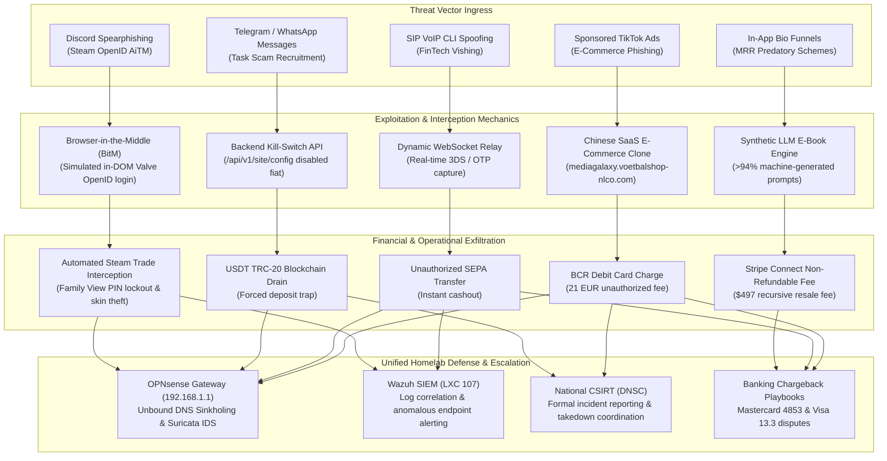
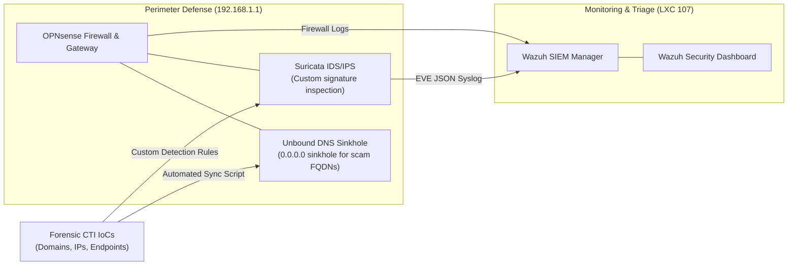
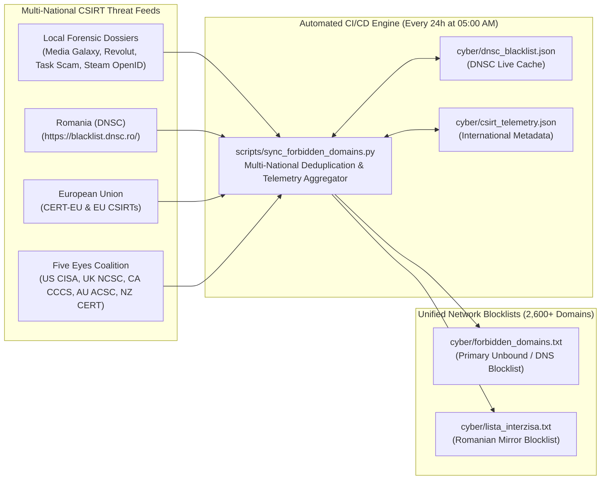

# Threat Intelligence, Digital Forensics & Cyber Defense Operations (`cyber/`)
**Department:** Cyber Defense & Threat Intelligence Operations  
**Lead Analyst:** `@stefanutc1`  
**Classification:** `TLP:CLEAR`  
**Ecosystem:** [Infrastructure Datacenter Architecture](https://github.com/stefanutc1/infrastructure)  

[](#)
[](#)
[](#)
[](#)

---

## 1. Overview & Operational Mandate

The `cyber/` directory serves as the centralized repository for **Cyber Threat Intelligence (CTI)**, **Digital Forensics and Incident Response (DFIR)**, automated malware & ad feed analysis, Capture The Flag (CTF) security challenges, vulnerability research (CVE), and active perimeter network defense.

All forensic dossiers housed within this repository are backed by raw cryptographic evidence, reverse-engineered network telemetry, MITRE ATT&CK kill-chain mapping, formal disclosures to national Computer Security Incident Response Teams ([DNSC](https://dnsc.ro)), upstream infrastructure takedown notices, and custom security rules protecting the internal homelab datacenter.

```text
/cyber/
├── README.md                                 # Master threat intelligence catalog and operational matrix
├── forbidden_domains.txt                     # Master forbidden domain list (Local Forensics + DNSC Blacklist)
├── lista_interzisa.txt                       # Romanian alias for forbidden domains list
├── dnsc_blacklist.json                       # Cumulative DNSC threat intelligence cache (with metadata)
├── mediagalaxy-ecommerce-fraud-forensics/    # SEC-2026-ECOM-005: E-Commerce phishing & Chinese SaaS kit
├── revolut-vishing-forensics/                # SEC-2026-VISH-002: Voice phishing & real-time credential relay
├── task-scam-infrastructure-analysis/        # SEC-2026-TASK-003: Pig butchering & crypto drain kill-switch
├── tiktok-mrr-scam-infrastructure/           # SEC-2025-MRR-001:  TikTok funnels & recursive resell schemes
├── openid-mitm-phishing-forensics/           # SEC-2025-AITM-004: Steam OpenID AiTM & BitM session relay
├── antigravity/                              # Automated DFIR scripting, OCR redaction, ad crawlers & sinkholes
├── cve/                                      # Security vulnerability advisories and exploitation research
├── ctf/                                      # Capture The Flag frameworks, crypto/stego, web & forensics
└── red-team/                                 # Host hardening, privilege audits & container security checks
```

---

## 2. Master Threat Intelligence Matrix

| Case ID | Incident Name & Target | Threat Origin & Stack | Ingress Vector | Primary Impact | Status & Defense |
| :--- | :--- | :--- | :--- | :--- | :--- |
| [`SEC-2026-ECOM-005`](mediagalaxy-ecommerce-fraud-forensics/README.md) | **Media Galaxy Brand Impersonation** | Yunnan, China (`yiyangsaas.com`) | Sponsored TikTok Ad Campaigns | Debit card theft (~21 EUR), secondary ATO lures | Mitigated; Confirmed & Blocked on DNSC PNRISC (#178465); OPNsense sinkhole |
| [`SEC-2026-VISH-002`](revolut-vishing-forensics/README.md) | **Revolut FinTech Vishing & Smishing** | Offshore VoIP Trunk (`0749-XXX`) | Spoofed SIP Caller ID + SMS links | Real-time 3DS OTP interception, SEPA Instant cashout | Takedown confirmed; Revolut breach persistence noted (Sept 2026) |
| [`SEC-2026-TASK-003`](task-scam-infrastructure-analysis/README.md) | **Task Scam & Pig Butchering Platform** | Russian white-label kit (Vue/Laravel) | WhatsApp / Telegram job recruitment | Hardcoded fiat withdrawal kill-switch, USDT TRC-20 theft | Analyzed; SQLi & API exposure exposed; TRON tracing |
| [`SEC-2025-MRR-001`](tiktok-mrr-scam-infrastructure/README.md) | **Recursive Master Resell Rights (MRR)** | Deceptive Digital Funnels (Stan.store) | TikTok algorithmic lifestyle hooks | Predatory $497 course purchases, recursive MLM lock-in | Reported; Stan.store, Stripe Legal & FTC escalated |
| [`SEC-2025-AITM-004`](openid-mitm-phishing-forensics/README.md) | **Steam OpenID 2.0 AiTM & BitM Phishing** | Reverse Proxy C2 (Offshore VPS) | Discord tournament voting lures | Session cookie theft, Family View lockout, API skin theft | Mitigated; Valve advisory filed; API audit playbook |

---

## 3. End-to-End Threat Kill-Chain & Defense Lifecycle



---

## 4. Investigative Case File Directory

### 🛒 1. [Media Galaxy E-Commerce Brand Spoofing](mediagalaxy-ecommerce-fraud-forensics/README.md)
- **Reference:** `SEC-2026-ECOM-005`
- **Focus:** Threat actors cloned the Romanian retail giant Media Galaxy via TikTok ads and a hijacked Dutch domain (`mediagalaxy.voetbalshop-nlco.com`). Backed by a Chinese-hosted phishing SaaS engine (`yiyangsaas.com`) in Yunnan, China.
- **Key Artifacts:** 25 forensic screenshots, ReportLab PDF generation script, Suricata IDS rules, multi-agency disclosure filings, official DNSC response ticket (#178465) & PNRISC blacklist confirmation.

### 📞 2. [Revolut FinTech Vishing & Credential Relay](revolut-vishing-forensics/README.md)
- **Reference:** `SEC-2026-VISH-002`
- **Focus:** Vishing campaign utilizing international SIP trunk injection to spoof Romanian mobile caller IDs (`0749-XXX-XXX`). Real-time WebSocket relay mirrored 3DS verification prompts in $<3$ seconds.
- **Key Artifacts:** Telephony sequence analysis, official response and safety advisory issued by Revolut security, infrastructure takedown report, upstream government-spoofing data breach correlation (Sept 2026).

### 💼 3. [Task Scam Platform & Crypto Drainage](task-scam-infrastructure-analysis/README.md)
- **Reference:** `SEC-2026-TASK-003`
- **Focus:** Technical reverse engineering of an active Pig Butchering / Task Scam web application. Uncovered unauthenticated configuration disclosure (`/api/v1/site/config`) proving fiat withdrawals were hardcoded to `false` while locking users into USDT TRC-20 deposit traps.
- **Key Artifacts:** API configuration dump, SQL injection audit on `invite_code` (`888888`), Canvas GPU hardware fingerprinting, white-label Russian translation leakage.

### 📈 4. [TikTok Marketing Funnels & Recursive MRR Schemes](tiktok-mrr-scam-infrastructure/README.md)
- **Reference:** `SEC-2025-MRR-001`
- **Focus:** Investigation of automated TikTok video funnels driving users to Stan.store storefronts selling $497 Master Resell Rights courses. Lexical forensic analysis confirmed >94% LLM-generated text with a contract mandating downstream resale.
- **Key Artifacts:** Multi-tier funnel mapping, lexical evaluation of course materials, Stripe Connect underwriting abuse study, official FTC and Stan.store abuse notifications.

### 🎮 5. [Steam OpenID AiTM & Browser-in-the-Middle](openid-mitm-phishing-forensics/README.md)
- **Reference:** `SEC-2025-AITM-004`
- **Focus:** Adversary-in-the-Middle campaign targeting Counter-Strike 2 gamers via simulated tournament voting portals. Weaponized in-page Browser-in-the-Middle (BitM) popups to capture Steam Guard TOTP tokens and `steamLoginSecure` cookies.
- **Key Artifacts:** BitM DOM emulation analysis, post-compromise Family View 4-digit PIN lock mechanics, rogue Steam Web API key trade hijacking, Valve incident disclosure.

---

## 5. Defense Tooling & Core Engineering Suites

Beyond individual case files, `cyber/` maintains operational software tools and specialized sub-projects:

- **[`antigravity/`](antigravity/README.md): Threat Intel & DFIR Automation**  
  Automated toolsuite including native Apple Vision OCR screenshot redaction (`dfir_image_redactor.py`), Safari ad feed scrapers (`safari_feed_crawler.py`), clipboard HTML decoders (`clipboard_html_decoder.py`), and OPNsense Unbound/Dnsmasq sinkhole synchronizers (`opnsense_dns_sinkhole.py`).
- **[`cve/`](cve/README.md): Vulnerability Research & Exploitation Analysis**  
  In-depth technical vulnerability analysis dossiers and proof-of-concept assessments across modern software vulnerabilities (including CVE-2026-69603, CVE-2026-69730, CVE-2026-69845, CVE-2026-72979, and CVE-2026-80083).
- **[`ctf/`](ctf/README.md): Capture The Flag Engineering Framework**  
  Structured platform containing defensive and offensive security challenges spanning Cryptography & Steganography, Web Application Exploitation, Reverse Engineering, and Forensic Artifact Analysis.
- **[`red-team/`](red-team/): Automated Auditing & Privilege Analysis**  
  Production test scripts for verifying Docker container isolation (`container_audit.py`), Linux local privilege escalation surface auditing (`priv_check.py`), and perimeter compliance checks (`sec_tests.py`).

---

## 6. Homelab Security Integration Architecture

The threat intelligence gathered across these operations is directly operationalized across our home datacenter:



1. **OPNsense Unbound DNS Sinkhole (`192.168.1.1`)**: Automated sync script (`antigravity/opnsense_dns_sinkhole.py`) consumes compiled domain blocklists (`romania_scam_blocklist.txt`, `extended_network_blocklist.txt`) to sinkhole malicious traffic at the gateway.
2. **Suricata IDS/IPS & Complete Traffic Ingestion**: Inspects egress traffic for HTTP signatures matching scam API patterns. All firewall traffic logs (`filterlog`) and system telemetry are streamed live via Syslog-ng (`192.168.1.240:514` UDP) to Wazuh SIEM.
3. **Wazuh SIEM / XDR Manager (LXC 107 - `192.168.1.240`)**: Scaled with a **4GB JVM Heap** (`-Xms4096m -Xmx4096m`) on 6GB RAM. Ingests all OPNsense traffic with full JSON audit archiving (`<logall_json>yes</logall_json>`), correlating endpoint DNS queries, firewall block/pass decisions, and Suricata telemetry.

---

## 7. Multi-National CSIRT Threat Intelligence Feed & Forbidden Domains

The centralized forbidden domain lists ([`cyber/forbidden_domains.txt`](forbidden_domains.txt) and its Romanian alias [`cyber/lista_interzisa.txt`](lista_interzisa.txt)) aggregate all malicious infrastructure cataloged across the repository's forensic investigations and merge them in real time with authoritative Computer Security Incident Response Teams across the **European Union, Romania, and the Five Eyes Alliance (US, UK, CA, AU, NZ)**:
- **Romania:** [DNSC](https://dnsc.ro) Blacklist Gateway ([`https://blacklist.dnsc.ro/`](https://blacklist.dnsc.ro/))
- **European Union:** CERT-EU & European CSIRT Network (abuse.ch URLhaus)
- **United States:** Cybersecurity and Infrastructure Security Agency ([CISA](https://www.cisa.gov))
- **United Kingdom:** National Cyber Security Centre ([NCSC-UK](https://www.ncsc.gov.uk))
- **Canada:** Canadian Centre for Cyber Security ([CCCS](https://cyber.gc.ca))
- **Australia:** Australian Cyber Security Centre ([ACSC](https://www.cyber.gov.au))
- **New Zealand:** [CERT NZ / NCSC NZ](https://www.cert.govt.nz)



### Automation & Synchronization Mechanism:
- **Daily Automated 24h Polling:** Integrated directly into the CD pipeline (`.github/workflows/cd.yml`) executing daily at **05:00 AM Europe/Bucharest** (and on every `push` to `main`).
- **Cumulative Telemetry ([`cyber/dnsc_blacklist.json`](dnsc_blacklist.json)):** Automatically preserves historical DNSC entries, discovery timestamps, classification types (`Domain`, `Subdomain`, `IP`), and attack motivations (`Scam`, `Phishing`, `Impersonation`, `SMiShing`).
- **Ready for Perimeter Defense:** Formatted as single-line Fully Qualified Domain Names (FQDNs), ready for automated consumption by OPNsense Unbound DNS, Pi-hole, AdGuard Home, and network firewalls.

---

## 8. MITRE ATT&CK Enterprise Matrix Correlation

| MITRE ATT&CK Tactic | Technique ID | Technique Name | Mapped Investigations |
| :--- | :--- | :--- | :--- |
| **Reconnaissance** | `T1598` | Phishing for Information | Revolut Vishing (`SEC-2026-VISH-002`) |
| **Reconnaissance** | `T1592` | Gather Victim Host Info | Task Scam Analysis (`SEC-2026-TASK-003`) |
| **Resource Development**| `T1583.001` | Acquire Infrastructure: Domains | Revolut Vishing (`SEC-2026-VISH-002`), Media Galaxy (`SEC-2026-ECOM-005`) |
| **Initial Access** | `T1566.001` | Spearphishing Attachment / Link | Steam OpenID AiTM (`SEC-2025-AITM-004`) |
| **Initial Access** | `T1566.004` | Phishing: Voice (Vishing) | Revolut Vishing (`SEC-2026-VISH-002`) |
| **Initial Access** | `T1566.002` | Spearphishing Link / Ads | Media Galaxy (`SEC-2026-ECOM-005`), MRR Funnels (`SEC-2025-MRR-001`) |
| **Credential Access** | `T1557.001` | Adversary-in-the-Middle: BitM | Steam OpenID AiTM (`SEC-2025-AITM-004`) |
| **Credential Access** | `T1056.001` | Keylogging / Web Form Capture | Media Galaxy Phishing (`SEC-2026-ECOM-005`) |
| **Credential Access** | `T1556` | Modify Authentication Process | Revolut Vishing (`SEC-2026-VISH-002`) |
| **Persistence** | `T1098` | Account Manipulation (API & PIN) | Steam OpenID AiTM (`SEC-2025-AITM-004`) |
| **Impact** | `T1499` | Financial Fraud / Asset Theft | All investigations |
| **Impact** | `T1657` | Financial Theft via E-Commerce | Media Galaxy (`SEC-2026-ECOM-005`), MRR Funnels (`SEC-2025-MRR-001`) |
