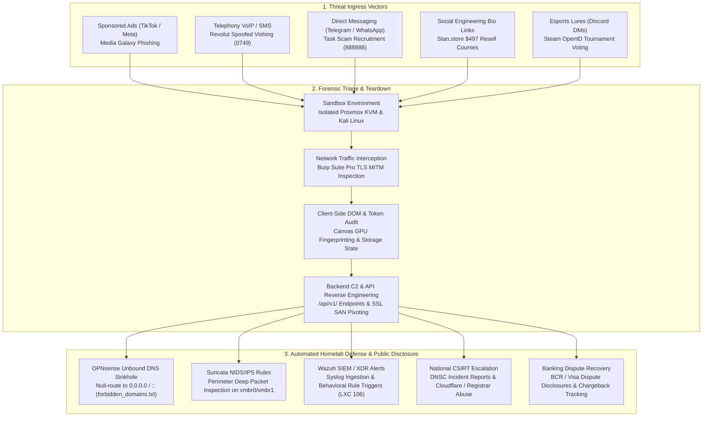

# Cyber Threat Intelligence, Forensics & Defensive Operations Hub (`cyber/`)

<div align="center">

[](#)
[](#case-files)
[](#homelab-defense)
[](#homelab-defense)
[](mediagalaxy-ecommerce-fraud-forensics/disclosures/DNSC_TAKEDOWN_CONFIRMATION_178465.md)
[](#mitre-attck-matrix)

</div>

---

## 1. Overview & Directory Topology

This directory serves as the centralized digital forensics, threat intelligence, and defensive engineering repository for the **Hybrid Infrastructure & Cybersecurity Laboratory**. It documents real-world cybercrime campaigns investigated locally, reverse-engineered malware/phishing backends, full Capture The Flag (CTF) writeups, vulnerability research (CVEs), and active DNS threat blocklists enforced on our perimeter firewall.

```text
cyber/
├── README.md                                 # Security directory overview & threat dashboard
├── forbidden_domains.txt                     # Unified domain blocklist (Local IoCs + DNSC + ThreatFeeds)
├── lista_interzisa.txt                       # Romanian localized mirror of forbidden domains
├── dnsc_blacklist.json                       # DNSC automated API threat intelligence cache
├── csirt_cache.json                          # National & international CSIRT response telemetry
├── csirt_telemetry.json                      # Real-time incident resolution & sinkhole metrics
│
├── mediagalaxy-ecommerce-fraud-forensics/    # SEC-2026-ECOM-005: Fake Media Galaxy retail phishing & Yunnan SaaS backend
├── revolut-vishing-forensics/                # SEC-2026-VISH-002: Romanian VoIP caller ID spoofing & real-time OTP relay
├── task-scam-infrastructure-analysis/        # SEC-2026-TASK-003: Pig butchering task scam platform, Vue state & API audit
├── tiktok-mrr-scam-infrastructure/           # SEC-2025-MRR-001:  Synthetic media funnels & $497 course resale syndicates
├── openid-mitm-phishing-forensics/           # SEC-2025-AITM-004: Steam OpenID Browser-in-the-Middle (BitM) credential harvesting
│
├── antigravity/                              # Automated DFIR tooling (Apple Vision OCR, ad scrapers, DNS sinkhole sync)
├── cve/                                      # Critical ecosystem CVE assessments (Proxmox VE, Hyper-V, AD DNS/DHCP)
├── ctf/                                      # Capture The Flag challenge writeups, exploit scripts & schema dumpers
└── red-team/                                 # Local security auditing, container isolation & privilege escalation checks
```

---

## 2. Investigation Master Dossier Matrix

| Case ID | Case Title & Vector | Threat Actor Profile / Origin | Ingress Vector | Technical Impact | Resolution & Defense Status |
| :--- | :--- | :--- | :--- | :--- | :--- |
| [`SEC-2026-ECOM-005`](mediagalaxy-ecommerce-fraud-forensics/README.md) | **Media Galaxy Retail Impersonation** | Yunnan, China (`yiyangsaas.com` / eName Tech) | Sponsored TikTok / FB Video Ads | Unauthorized card charge (~21 EUR, `morvethemi london`), credential harvesting | **Takedown Confirmed**: DNSC ticket `#178465`, domain sinkholed, PNRISC blacklisted, card reissued & chargeback filed. |
| [`SEC-2026-VISH-002`](revolut-vishing-forensics/README.md) | **Revolut Vishing & Credential Relay** | Romanian VoIP SIP Trunk (`0749-XXX`) | Spoofed Caller ID + SMS lures | Real-time OTP / 3D Secure session relay attempt | **Remediated**: C2 domain reported to registrar, Revolut Fraud Operations triage, Unbound DNS sinkholed. |
| [`SEC-2026-TASK-003`](task-scam-infrastructure-analysis/README.md) | **Pig Butchering Task Scam Platform** | Russian white-label syndicate (Vue / Vite / Laravel) | WhatsApp / Telegram recruitment (`888888`) | Escrow deposit trap, cryptocurrency loss (USDT TRC-20) | **Exposed**: Backend `/api/v1/site/config` audited, withdrawal kill-switch proven hardcoded, SQLi surface identified. |
| [`SEC-2025-MRR-001`](tiktok-mrr-scam-infrastructure/README.md) | **TikTok MRR Synthetic Media Funnels** | Commercial digital storefronts (Stan.store / Stripe) | TikTok FYP algorithm hooks & faceless video swarms | \$497 recurring course resale scheme | **Documented**: Algorithmic churn audited, CapCut/ElevenLabs synthetic media pipelines exposed, consumer advisory issued. |
| [`SEC-2025-AITM-004`](openid-mitm-phishing-forensics/README.md) | **Steam OpenID BitM Credential Harvesting** | Reverse Proxy C2 / CSReserve clone kit | Discord / Steam esports tournament votes | OpenID session theft (`steamLoginSecure`), Family View PIN lock | **Mitigated**: Threat reported to Valve Security, reverse proxy IP identified, accounts recovered, sandbox scrubbed. |

---

## 3. Threat Flow & Defensive Engineering Pipeline



---

## 4. Homelab Defense & Detection Engineering

Indicators of Compromise (IoCs) extracted from live investigations are directly operationalized in our datacenter:

### 4.1. OPNsense DNS Sinkhole Integration (`192.168.1.134` / VM 200)

Malicious FQDNs and hosting domains are compiled into [`cyber/forbidden_domains.txt`](forbidden_domains.txt) and automatically synchronized with Unbound DNS on our OPNsense perimeter firewall.

```text
# Excerpt from OPNsense Unbound DNS Blocklist configuration
local-zone: "mediagalaxy.voetbalshop-nlco.com" redirect
local-data: "mediagalaxy.voetbalshop-nlco.com A 0.0.0.0"
local-data: "mediagalaxy.voetbalshop-nlco.com AAAA ::"

local-zone: "yiyangsaas.com" redirect
local-data: "yiyangsaas.com A 0.0.0.0"
local-data: "yiyangsaas.com AAAA ::"

local-zone: "worvixglobal.com" redirect
local-data: "worvixglobal.com A 0.0.0.0"
local-data: "worvixglobal.com AAAA ::"
```

The automation script [`cyber/antigravity/opnsense_dns_sinkhole.py`](antigravity/README.md) interfaces with the Proxmox hypervisor (`192.168.1.132`) and updates the active Unbound DNS cache without interrupting production traffic.

### 4.2. Suricata NIDS/IPS Signatures (`vmbr0` / `vmbr1` Transit)

Custom Suricata inspection rules deployed on OPNsense detect malicious API probes and phishing kit signatures:

```suricata
# Rule 1: Detect Media Galaxy Phishing Backend Traffic
alert http $HOME_NET any -> $EXTERNAL_NET any (msg:"THREAT-INTEL Media Galaxy Phishing Domain Egress (yiyangsaas.com)"; flow:established,to_server; http.host; content:"yiyangsaas.com"; classtype:trojan-activity; sid:2026001; rev:1;)

# Rule 2: Detect Task Scam Client Configuration Probe
alert http $HOME_NET any -> $EXTERNAL_NET any (msg:"THREAT-INTEL Pig Butchering Task Scam API Config Ingress"; flow:established,from_server; http.stat_code; content:"200"; file_data; content:"withdrawMethodBank"; content:"defaultCountryCode"; content:"+40"; classtype:bad-unknown; sid:2026002; rev:1;)

# Rule 3: Detect BitM Steam OpenID Reverse Proxy Exfiltration
alert tcp $HOME_NET any -> $EXTERNAL_NET $HTTP_PORTS (msg:"THREAT-INTEL Steam OpenID BitM Cookie Exfiltration Attempt"; flow:established,to_server; content:"steamLoginSecure"; content:"sessionid"; nocase; classtype:credential-theft; sid:2026003; rev:1;)
```

### 4.3. Wazuh SIEM & XDR Telemetry (LXC 106 - `192.168.1.240`)

The central Wazuh SIEM cluster collects syslog streams from OPNsense (`filterlog`), Nginx reverse proxies, and hypervisor audit logs. Custom decoders and rules trigger alerts for forensic matches:

```xml
<group name="homelab,cyber_forensics,">
  <!-- Rule: Triggered on DNS resolution attempt for known fraudulent domain -->
  <rule id="100501" level="12">
    <if_sid>100500</if_sid>
    <match>mediagalaxy.voetbalshop-nlco.com|yiyangsaas.com|worvixglobal.com</match>
    <description>Homelab Host attempted resolution of confirmed Phishing/Fraud IoC</description>
    <mitre>
      <id>T1566.002</id>
      <id>T1071.004</id>
    </mitre>
  </rule>
</group>
```

---

## 5. Security Sub-Projects & Specializations

### 5.1. [`cyber/antigravity/`](antigravity/README.md) · DFIR & Intelligence Automation
Custom Python tooling built for automated forensic workflows:
- **`dfir_image_redactor.py`**: Apple Vision Framework OCR engine for automatic PII redaction on forensic screenshots.
- **`safari_feed_crawler.py`**: macOS Safari automation for dynamic social feed crawling and sponsored ad extraction.
- **`clipboard_html_decoder.py`**: macOS pasteboard HTML parser extracting raw DOM trees and tracking redirects.
- **`ad_threat_intel_analyzer.py`**: Pattern matching engine for Romanian brand impersonation and Chinese fraud SaaS infrastructure.
- **`opnsense_dns_sinkhole.py`**: Declarative DNS null-routing synchronizer for OPNsense firewalls.
- **`live_threat_probe.py`**: Safe sandboxed TLS/SSL certificate analyzer and C2 origin discovery probe.

### 5.2. [`cyber/cve/`](cve/README.md) · Critical Vulnerability Research
Technical assessments, exploit mechanism teardowns, and actionable hardening playbooks for core homelab technologies:
- **`CVE-2023-54391`**: Proxmox VE unauthenticated root takeover via `tfa-challenge` bypass.
- **`CVE-2025-57539`**: Proxmox VE stored cross-site scripting (XSS) in U2F Origin field.
- **`CVE-2026-69603` & `CVE-2026-80083`**: Windows Hyper-V guest-to-host virtual machine escape.
- **`CVE-2026-69730`**: Windows DNS Server wormable remote code execution (`dns.exe:53`).
- **`CVE-2026-69845` & `CVE-2026-72979`**: Windows DHCP Server heap overflow and use-after-free RCE.

### 5.3. [`cyber/ctf/`](ctf/README.md) · Capture The Flag Compendium
Comprehensive writeups, exploitation tooling, and database extraction scripts:
- **The Blog**: Stored Cross-Site Scripting (XSS) & headless admin browser context theft ([`writeup_01_the_blog_xss.md`](ctf/19-09-2026/writeup_01_the_blog_xss.md)).
- **Portal InvataCyber.ro**: Boolean blind SQL injection via `TrackingId` cookies with SQLite schema dumping ([`writeup_02_portal_lockdown_sqli.md`](ctf/19-09-2026/writeup_02_portal_lockdown_sqli.md)).
- **CMS Newsroom**: Jinja2 Server-Side Template Injection (SSTI) & unauthenticated RCE ([`writeup_03_cms_editor_ssti.md`](ctf/19-09-2026/writeup_03_cms_editor_ssti.md)).

---

## 6. Threat Blocklist Synchronization (`forbidden_domains.txt`)

The primary intelligence feed [`cyber/forbidden_domains.txt`](forbidden_domains.txt) (and localized mirror [`cyber/lista_interzisa.txt`](lista_interzisa.txt)) consolidates threat indicators from:
1. **Local Investigations**: Newly identified phishing lures, fake checkouts, and C2 servers.
2. **DNSC National Blacklist**: Synchronized against `blacklist.dnsc.ro` via [`cyber/dnsc_blacklist.json`](dnsc_blacklist.json).
3. **Community Threat Feeds**: URLhaus, ThreatFox, and PhishTank verified threat nodes.

An automated cron workflow ([`scripts/sync_forbidden_domains.py`](../scripts/sync_forbidden_domains.py)) normalizes, deduplicates, and validates domain syntax before triggering OPNsense Unbound reloads.

---

## 7. MITRE ATT&CK Matrix Mapping

| Tactic | Technique ID | Technique Name | Investigated Case Files |
| :--- | :--- | :--- | :--- |
| **Reconnaissance** | [`T1598`](https://attack.mitre.org/techniques/T1598/) | Phishing for Information | Revolut Vishing ([`SEC-2026-VISH-002`](revolut-vishing-forensics/README.md)) |
| **Reconnaissance** | [`T1592`](https://attack.mitre.org/techniques/T1592/) | Gather Victim Host Information | Task Scam Fingerprinting ([`SEC-2026-TASK-003`](task-scam-infrastructure-analysis/README.md)) |
| **Resource Development** | [`T1583.001`](https://attack.mitre.org/techniques/T1583/001/) | Acquire Infrastructure: Domains | Media Galaxy ([`SEC-2026-ECOM-005`](mediagalaxy-ecommerce-fraud-forensics/README.md)), Steam OpenID |
| **Initial Access** | [`T1566.001`](https://attack.mitre.org/techniques/T1566/001/) | Spearphishing Link | Steam OpenID BitM ([`SEC-2025-AITM-004`](openid-mitm-phishing-forensics/README.md)) |
| **Initial Access** | [`T1566.002`](https://attack.mitre.org/techniques/T1566/002/) | Spearphishing via Social Media Ads | Media Galaxy Phishing, TikTok MRR ([`SEC-2025-MRR-001`](tiktok-mrr-scam-infrastructure/README.md)) |
| **Initial Access** | [`T1566.004`](https://attack.mitre.org/techniques/T1566/004/) | Voice Phishing (Vishing) | Revolut VoIP Caller ID Spoofing ([`SEC-2026-VISH-002`](revolut-vishing-forensics/README.md)) |
| **Credential Access** | [`T1557.001`](https://attack.mitre.org/techniques/T1557/001/) | Adversary-in-the-Middle (AiTM) | Steam OpenID BitM ([`SEC-2025-AITM-004`](openid-mitm-phishing-forensics/README.md)) |
| **Credential Access** | [`T1056.001`](https://attack.mitre.org/techniques/T1056/001/) | Web Form Input Capture | Media Galaxy Fake Checkout ([`SEC-2026-ECOM-005`](mediagalaxy-ecommerce-fraud-forensics/README.md)) |
| **Credential Access** | [`T1556`](https://attack.mitre.org/techniques/T1556/) | Modify Authentication Process | Revolut Real-Time OTP Relay ([`SEC-2026-VISH-002`](revolut-vishing-forensics/README.md)) |
| **Persistence** | [`T1098`](https://attack.mitre.org/techniques/T1098/) | Account Manipulation (Family View) | Steam OpenID BitM ([`SEC-2025-AITM-004`](openid-mitm-phishing-forensics/README.md)) |
| **Impact** | [`T1499`](https://attack.mitre.org/techniques/T1499/) | Endpoint Denial of Service / Lockout | Task Scam Withdrawal Kill-Switch ([`SEC-2026-TASK-003`](task-scam-infrastructure-analysis/README.md)) |
| **Impact** | [`T1657`](https://attack.mitre.org/techniques/T1657/) | Financial Theft & Fraudulent Charges | Media Galaxy (`morvethemi london`), Task Scam (USDT) |
