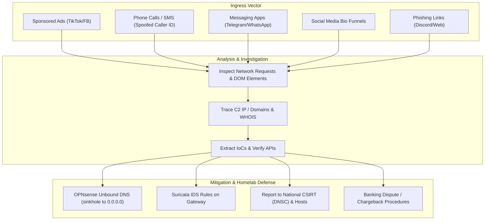

# Security Investigations & Notes (`cyber/`)

This directory contains personal writeups, forensic notes on real phishing and fraud campaigns investigated locally, CTF challenges, CVE research, and DNS blocklists used in the homelab.

---

## 1. Overview

```text
cyber/
├── README.md                                 # Security directory overview
├── forbidden_domains.txt                     # Combined domain blocklist (local investigations + CSIRTs)
├── lista_interzisa.txt                       # Romanian mirror of forbidden domains list
├── dnsc_blacklist.json                       # DNSC blacklist cache
├── mediagalaxy-ecommerce-fraud-forensics/    # SEC-2026-ECOM-005: Fake Media Galaxy ad campaign & SaaS backend
├── revolut-vishing-forensics/                # SEC-2026-VISH-002: Phone spoofing & OTP relay investigation
├── task-scam-infrastructure-analysis/        # SEC-2026-TASK-003: Task scam platform & API analysis
├── tiktok-mrr-scam-infrastructure/           # SEC-2025-MRR-001:  TikTok funnel analysis
├── openid-mitm-phishing-forensics/           # SEC-2025-AITM-004: Steam OpenID credential phishing
├── antigravity/                              # Helper scripts for OCR, ad scraping, and DNS sinkhole
├── cve/                                      # Notes on specific CVEs and testing
├── ctf/                                      # CTF practice challenges and templates
└── red-team/                                 # Basic auditing and privilege checks
```

---

## 2. Investigation Case Files

| Case ID | Case Name | Threat Stack | Ingress Vector | Observed Impact | Notes |
| :--- | :--- | :--- | :--- | :--- | :--- |
| [`SEC-2026-ECOM-005`](mediagalaxy-ecommerce-fraud-forensics/README.md) | **Media Galaxy Brand Impersonation** | Yunnan, China (`yiyangsaas.com`) | Sponsored TikTok ads | Fake checkout, card charge (~21 EUR) | Reported to DNSC (#178465), blocked on PNRISC |
| [`SEC-2026-VISH-002`](revolut-vishing-forensics/README.md) | **Revolut Vishing & Credential Relay** | SIP Trunk (`0749-XXX`) | Spoofed caller ID + SMS | Real-time OTP intercept attempt | Takedown filed; Revolut security response |
| [`SEC-2026-TASK-003`](task-scam-infrastructure-analysis/README.md) | **Task Scam Platform** | Russian white-label kit (Vue/Laravel) | WhatsApp / Telegram job lures | Deposit trap, fiat withdrawals disabled | API and SQL injection surface audited |
| [`SEC-2025-MRR-001`](tiktok-mrr-scam-infrastructure/README.md) | **TikTok MRR Funnels** | Stan.store digital storefronts | TikTok algorithm lifestyle hooks | $497 course resale scheme | Funnel and content analysis |
| [`SEC-2025-AITM-004`](openid-mitm-phishing-forensics/README.md) | **Steam OpenID Phishing** | Reverse Proxy C2 | Discord tournament voting links | Session cookie capture, Family View lock | Browser-in-the-Middle DOM analysis |

---

## 3. Threat Flow & Mitigation



---

## 4. Case Summaries

### 1. [Media Galaxy E-Commerce Brand Spoofing](mediagalaxy-ecommerce-fraud-forensics/README.md)
- **Reference:** `SEC-2026-ECOM-005`
- **Details:** Phishing campaign using sponsored TikTok ads to direct users to a fake Media Galaxy checkout page (`mediagalaxy.voetbalshop-nlco.com`). Connected to a backend kit hosted on `yiyangsaas.com`.
- **Artifacts:** Screenshots, Suricata rules, dispute disclosure drafts, DNSC ticket confirmation (#178465), and PNRISC block.

### 2. [Revolut FinTech Vishing](revolut-vishing-forensics/README.md)
- **Reference:** `SEC-2026-VISH-002`
- **Details:** Phone phishing campaign using spoofed Romanian mobile numbers (`0749-XXX-XXX`). Attackers attempted to capture one-time passwords in real time via an interactive backend.
- **Artifacts:** Call flow notes, official response from Revolut security, and infrastructure takedown report.

### 3. [Task Scam Platform Analysis](task-scam-infrastructure-analysis/README.md)
- **Reference:** `SEC-2026-TASK-003`
- **Details:** Reverse engineering of a task scam platform. Analysis of the unauthenticated `/api/v1/site/config` endpoint showed fiat withdrawals were hardcoded to disabled.
- **Artifacts:** API responses, input validation checks, and fingerprinting notes.

### 4. [TikTok Marketing Funnels & MRR](tiktok-mrr-scam-infrastructure/README.md)
- **Reference:** `SEC-2025-MRR-001`
- **Details:** Breakdown of automated video funnels promoting $497 resell courses. Content analysis showed high proportion of generic AI-generated material.
- **Artifacts:** Funnel breakdown and consumer advisory notes.

### 5. [Steam OpenID Phishing](openid-mitm-phishing-forensics/README.md)
- **Reference:** `SEC-2025-AITM-004`
- **Details:** Analysis of a Browser-in-the-Middle login popup simulating a Valve OpenID login window to steal authentication tokens.
- **Artifacts:** DOM inspection notes and account recovery steps.

---

## 5. Security Sub-Projects

- **[`antigravity/`](antigravity/README.md)**: Python helper tools (image redactor, ad crawler, DNS sinkhole updater).
- **[`cve/`](cve/README.md)**: Notes and writeups on CVEs tested in the lab.
- **[`ctf/`](ctf/README.md)**: CTF challenge notes and starter templates.
- **[`red-team/`](red-team/)**: Local auditing scripts for container isolation and permissions.

---

## 6. Homelab Integration

IoCs from these investigations are used directly in the homelab:

1. **OPNsense DNS Sinkhole (`192.168.1.1`)**: Malicious domains are compiled into blocklists and resolved to `0.0.0.0` in Unbound DNS.
2. **Suricata IDS**: Custom HTTP/DNS inspection signatures deployed on the OPNsense router.
3. **Wazuh SIEM (LXC 107 - `192.168.1.240`)**: Collects OPNsense firewall logs (`filterlog`) and system alerts over syslog.

---

## 7. Domain Blocklist (`forbidden_domains.txt`)

The file [`cyber/forbidden_domains.txt`](forbidden_domains.txt) (and [`cyber/lista_interzisa.txt`](lista_interzisa.txt)) contains domain names collected from:
- Local investigations (phishing lures, fake stores, scam backends).
- DNSC Blacklist portal (`blacklist.dnsc.ro`).
- Community feeds (URLhaus, ThreatFox).

An automated script ([`scripts/sync_forbidden_domains.py`](../scripts/sync_forbidden_domains.py)) deduplicates and normalizes these domains on a daily schedule.

---

## 8. ATT&CK Technique Mapping

| Tactic | Technique | Name | Cases |
| :--- | :--- | :--- | :--- |
| Reconnaissance | `T1598` | Phishing for Information | Revolut Vishing (`SEC-2026-VISH-002`) |
| Reconnaissance | `T1592` | Gather Victim Host Info | Task Scam Analysis (`SEC-2026-TASK-003`) |
| Resource Development | `T1583.001` | Acquire Domains | Revolut Vishing, Media Galaxy (`SEC-2026-ECOM-005`) |
| Initial Access | `T1566.001` | Spearphishing Link | Steam OpenID (`SEC-2025-AITM-004`) |
| Initial Access | `T1566.004` | Voice Phishing (Vishing) | Revolut Vishing (`SEC-2026-VISH-002`) |
| Initial Access | `T1566.002` | Spearphishing Ads | Media Galaxy, MRR Funnels (`SEC-2025-MRR-001`) |
| Credential Access | `T1557.001` | AiTM: Browser-in-the-Middle | Steam OpenID (`SEC-2025-AITM-004`) |
| Credential Access | `T1056.001` | Web Form Capture | Media Galaxy Phishing (`SEC-2026-ECOM-005`) |
| Credential Access | `T1556` | Modify Auth Process | Revolut Vishing (`SEC-2026-VISH-002`) |
| Persistence | `T1098` | Account Manipulation | Steam OpenID (`SEC-2025-AITM-004`) |
| Impact | `T1499` | Financial Fraud | All investigations |
| Impact | `T1657` | Financial Theft | Media Galaxy, MRR Funnels |
