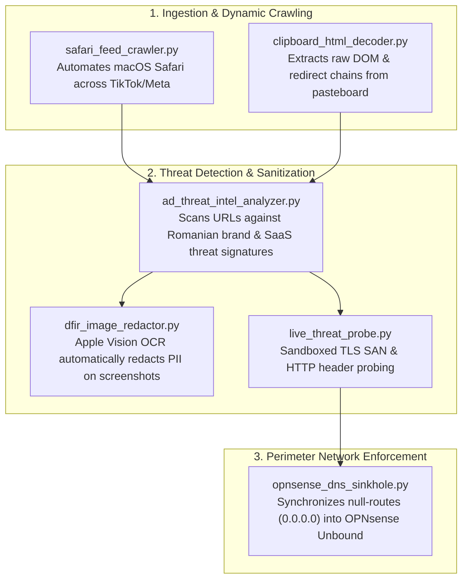

# Cyber Threat Intelligence, Forensics & Network Defense Tools (`antigravity`)

<div align="center">

[](https://python.org)
[](#)
[](#)
[](#)
[](#)

</div>

---

## 1. Overview & Operational Role

This directory contains specialized threat intelligence, digital forensics, dynamic web crawling, and automated perimeter synchronization utilities developed and battle-tested during active cybercrime investigations (such as `SEC-2026-ECOM-005: Media Galaxy Counterfeit Phishing Cluster`).

All utilities are engineered under strict sanitization standards: they contain zero sensitive credentials, hardcoded victim identities, or active session cookies, utilizing CLI arguments and environment variables for maximum operational flexibility.



---

## 2. Tool Arsenal & Functional Matrix

| Utility | Primary Function | Core Technical Capabilities | Runtime Dependencies |
| :--- | :--- | :--- | :--- |
| **`dfir_image_redactor.py`** | Evidence Sanitization & PII Redaction | Native Apple Vision OCR text recognition, accurate bounding box computation, and solid black pixel-overwriting to sanitize forensic screenshots with zero leaks. | macOS Native (`pyobjc`, `Pillow`) |
| **`safari_feed_crawler.py`** | Social Media Feed & Ad Crawler | Automates macOS Safari across Facebook, Instagram, and TikTok feeds, handling dynamic lazy-loading scroll, DOM copying, and sponsored post extraction. | macOS AppleScript / JXA |
| **`clipboard_html_decoder.py`** | macOS Pasteboard HTML Extractor | Extracts raw `«class HTML»` hex data from macOS clipboard selections, reconstructing full DOM markup and resolving tracking redirects (`l.facebook.com`, `ig_redirect`). | Python standard library |
| **`ad_threat_intel_analyzer.py`** | Ad Scam Pattern & Threat Intelligence Engine | Detects Romanian retail impersonation (e.g. Media Galaxy, Altex, eMAG clones), Chinese fraud SaaS fingerprints (`yiyangsaas.com`, OEMCart), and disposable relay domains. | Python standard library / `re` |
| **`opnsense_dns_sinkhole.py`** | OPNsense DNS Sinkhole Synchronizer | Manages automated null-routing (`0.0.0.0` / `::`) via Dnsmasq and Unbound on OPNsense (VM 200 on Proxmox VE), updating local blocklists without manual UI intervention. | `paramiko` / SSH Key Auth |
| **`live_threat_probe.py`** | Safe Sandboxed Reconnaissance & TLS Pivoting | Safe external SSL/TLS certificate inspection and HTTP header probing to unmask backend C2 origins and shared infrastructure without executing browser scripts. | `ssl`, `socket`, `urllib` |

---

## 3. Detailed Usage & CLI Playbooks

### 3.1. DFIR Evidence Image Redactor (`dfir_image_redactor.py`)
```bash
# Redact all instances of a sensitive personal name in an evidence screenshot:
python3 dfir_image_redactor.py --file /path/to/evidence.png --target "Victim Full Name"

# Batch redact an entire directory of captured exhibits:
python3 dfir_image_redactor.py --dir ./evidence/ --target "Sensitive PII"

# Apply explicit bounding box coordinates (X0 Y0 X1 Y1) to black out card numbers:
python3 dfir_image_redactor.py --file card_receipt.png --box 1150 780 1450 840
```

### 3.2. Safari Feed & Ad Crawler (`safari_feed_crawler.py`)
```bash
# Crawl the active Safari tab with 15 dynamic scroll intervals:
python3 safari_feed_crawler.py --tab 1 --scrolls 15 --outdir /tmp/feed_dumps

# Sequentially crawl Tabs 1, 2, and 3 (Facebook, TikTok, Instagram):
python3 safari_feed_crawler.py --all --scrolls 20 --outdir /tmp/feed_dumps
```

### 3.3. Clipboard HTML Decoder (`clipboard_html_decoder.py`)
```bash
# Decode current macOS clipboard selection to a sanitized HTML file:
python3 clipboard_html_decoder.py --save /tmp/page_dom.html

# Extract all outbound hyperlinks and tracking redirects directly to stdout:
python3 clipboard_html_decoder.py --extract-links
```

### 3.4. Ad Threat Intelligence Analyzer (`ad_threat_intel_analyzer.py`)
```bash
# Analyze a list of URLs or domains against threat signatures:
python3 ad_threat_intel_analyzer.py --file /tmp/extracted_links.txt

# Run a live threat signature check on a specific suspicious URL:
python3 ad_threat_intel_analyzer.py --url "https://mediagalaxy.voetbalshop-nlco.com"
```

### 3.5. OPNsense DNS Sinkhole Deployer (`opnsense_dns_sinkhole.py`)
```bash
# Sync newly extracted malicious domain list to OPNsense (VM 200 on Proxmox VE 9.2):
PROXMOX_HOST="192.168.1.132" OPNSENSE_VMID="200" python3 opnsense_dns_sinkhole.py --domains-file iocs.txt

# Check live Unbound DNS resolution status:
python3 opnsense_dns_sinkhole.py --status
```

### 3.6. Sandboxed Threat Recon Probe (`live_threat_probe.py`)
```bash
# Inspect TLS certificate SANs and server headers for a target domain:
python3 live_threat_probe.py --target "voetbalshop-nlco.com"

# Pivot directly to an origin IP on HTTPS port 443:
python3 live_threat_probe.py --ip "104.16.145.247" --port 443
```
