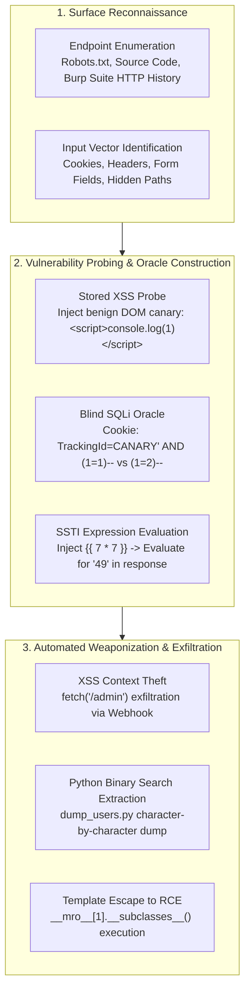

# Capture The Flag (CTF) Archives & Offensive Security Hub (`cyber/ctf/`)

<div align="center">

[](#)
[](19-09-2026/WRITEUP.md)
[-brightgreen.svg?style=flat&logo=checkmarx)](#)
[](#)
[](19-09-2026/)

</div>

---

## 1. Overview & Competition Directory

This directory archives Capture The Flag (CTF) writeups, offensive exploit scripts, blind database extractors, and payload generators developed during competitive cybersecurity events.

All technical writeups provide end-to-end vulnerability analysis, mathematical/logical root causes, automated Python solver scripts, and enterprise architectural remediation blueprints.

```text
cyber/ctf/
├── README.md                                    # CTF Hub overview & challenge master matrix
└── 19-09-2026/                                  # InvataCyber.ro CTF (19 September 2026)
    ├── README.md                                # Challenge session index & execution guide
    ├── WRITEUP.md                               # Comprehensive centralized writeup
    │
    ├── writeup_01_the_blog_xss.md               # Challenge 1: Stored XSS & Admin Context Theft
    ├── payload.js                               # Asynchronous payload exfiltrating /admin HTML
    ├── solver.py                                # Automated HTTP POST payload delivery script
    │
    ├── writeup_02_portal_lockdown_sqli.md       # Challenge 2: Blind Boolean-Based SQLite Injection
    ├── sql_solve.py                             # True/False condition oracle validator
    ├── extract_creds.py                         # Proof-of-concept boolean expression tester
    ├── flag.py                                  # System table existence prober (sqlite_master)
    ├── dump_sqlite.py                           # High-speed character-by-character table dumper
    ├── dump_schema.py                           # DDL schema definition extractor
    ├── dump_all_schema.py                       # Recursive full-database schema dumper
    ├── dump_users.py                            # Administrative credential extraction script
    ├── solver_portal.py                         # Hidden administrative console discovery scanner
    │
    ├── writeup_03_cms_editor_ssti.md            # Challenge 3: Jinja2 SSTI to Unauthenticated RCE
    ├── blog_flag.py                             # Unauthenticated editor panel exploit & RCE runner
    └── requirements.txt                         # Python runtime dependencies (requests, urllib3)
```

---

## 2. Challenge Master Matrix

| # | Challenge Title | Category | CWE Classification | Core Vulnerability | Exploit Mechanism & Impact | Primary Solvers |
| :---: | :--- | :--- | :--- | :--- | :--- | :--- |
| **01** | **The Blog** | Web / Client-Side | [CWE-79](https://cwe.mitre.org/data/definitions/79.html) (Stored XSS) | Unsanitized contact form message rendering | Injects asynchronous JavaScript into admin bot browser; exfiltrates `/admin` context via external webhook. | [`payload.js`](19-09-2026/payload.js), [`solver.py`](19-09-2026/solver.py) |
| **02** | **Portal InvataCyber.ro** | Web / Database | [CWE-89](https://cwe.mitre.org/data/definitions/89.html) (Blind SQLi) | Unsanitized `TrackingId` cookie in SQLite backend | Submits boolean comparison queries; performs binary-search character extraction to dump schema, users, and admin credentials. | [`dump_users.py`](19-09-2026/dump_users.py), [`solver_portal.py`](19-09-2026/solver_portal.py) |
| **03** | **CMS Newsroom** | Web / Server-Side | [CWE-1336](https://cwe.mitre.org/data/definitions/1336.html) (SSTI) & [CWE-306](https://cwe.mitre.org/data/definitions/306.html) | Direct string interpolation into `render_template_string` | Bypasses unauthenticated `/edit/5` panel; executes arbitrary Python OS commands (`cat /flag.txt`) via Jinja2 template primitives. | [`blog_flag.py`](19-09-2026/blog_flag.py) |

---

## 3. Offensive Methodology & Tooling Pipeline



---

## 4. Quick Execution & Tooling Setup

To execute any of the Python solver scripts in this repository:

```bash
# Navigate to the challenge directory
cd cyber/ctf/19-09-2026

# Install minimal HTTP automation dependencies
pip install -r requirements.txt

# Run Challenge 1 XSS Solver
python3 solver.py

# Run Challenge 2 Blind SQLite Credential Dumper
python3 dump_users.py

# Run Challenge 3 SSTI Remote Command Execution Exploit
python3 blog_flag.py
```
