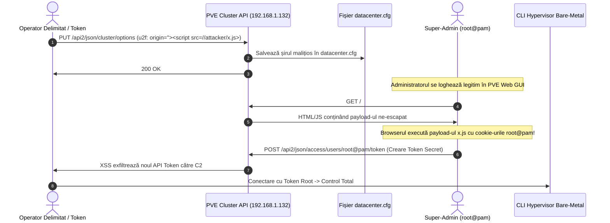

# Raport Tehnic de Threat Intelligence: CVE-2025-57539
## Proxmox Virtual Environment (PVE) Stored XSS în Câmpul U2F Origin din Configurația Datacenter

---

| Câmp Evaluat | Valoare Detaliată |
| :--- | :--- |
| **Identificator CVE** | **CVE-2025-57539** |
| **Severitate / Scor CVSS** | **MEDIUM · CVSS 3.1: 5.4** (`CVSS:3.1/AV:N/AC:L/PR:L/UI:R/S:C/C:L/I:L/A:N`) · **Scor de Risc Operațional în Datacenter: HIGH (Privilege Escalation la ROOT)** |
| **CWE Asociat** | **CWE-79**: Improper Neutralization of Input During Web Page Generation ('Cross-site Scripting') |
| **Componentă Afectată** | Proxmox VE 8.4 (`pve-manager` / Interfața Web ExtJS · `PVE.dc.OptionView` & `/etc/pve/datacenter.cfg`) |
| **Noduri Afectate în Homelab** | `pve_primary_x64` (`192.168.1.132` / Proxmox VE Bare-Metal Hypervisor) |
| **Vector de Atac** | Rețea / Autentificat cu privilegii reduse (Stored XSS prin API/Configurări Datacenter) |
| **Impact Tehnic Direct** | Furt de tichete de sesiune `root@pam`, execuție de comenzi în numele super-administratorului, persistență SSH pe hypervisor |

---

## 1. Sumar Executiv & Clasificare

**CVE-2025-57539** documentează o vulnerabilitate de tip **Stored Cross-Site Scripting (XSS)** în modulul de configurare a centrului de date (Datacenter Configuration) din Proxmox Virtual Environment 8.4.

Problema rezidă în validarea și afișarea nesecurizată a câmpului **U2F Origin** (opțiunea `u2f: origin=...` din `/etc/pve/datacenter.cfg`). Un utilizator autentificat cu drepturi de modificare a opțiunilor de cluster (`Sys.Modify` sau acces prin token API delegat) poate injecta sarcini utile JavaScript malițioase în acest parametru.

Atunci când administratorul principal (`root@pam`) navighează în consola Web GUI la secțiunea **Datacenter -> Two-Factor Authentication** sau **Datacenter -> Options**, payload-ul stocat este randat direct în DOM fără o filtrare adecvată a caracterelor speciale HTML. Codul malițios se execută automat în contextul sesiunii de browser a administratorului `root@pam`, având acces complet la `PVEAuthCookie` și la tokenul anti-CSRF (`CSRFPreventionToken`).

Deși scorul CVSS de bază este 5.4 datorită cerinței de privilegii inițiale, într-o infrastructură de virtualizare precum a noastră, impactul real reprezintă o **escaladare critică de privilegii (Privilege Escalation)** către controlul absolut al nodului fizic.

---

## 2. Cauza Primară & Mecanismul de Injectare (Root Cause)

### 2.1 Structura Fișierului `/etc/pve/datacenter.cfg`

Opțiunile globale ale clusterului Proxmox sunt stocate în fișierul sincronizat prin cluster filesystem (pmxcfs) `/etc/pve/datacenter.cfg`. Pentru autentificarea FIDO2/U2F, Proxmox permite specificarea domeniului de origine prin directiva:
```text
u2f: appid=https://pve.lan:8006,origin=https://pve.lan:8006
```

Atunci când această opțiune este actualizată via REST API:
```http
PUT /api2/json/cluster/options HTTP/1.1
Host: 192.168.1.132:8006
CSRFPreventionToken: <TOKEN>
Content-Type: application/x-www-form-urlencoded

u2f=origin=https://pve.lan:8006">
```

Serverul PVE backend (`pve-cluster` / `pveproxy`) salva valoarea în fișierul de configurare fără a impune o expresie regulată strictă (cum ar fi `^https?://[a-zA-Z0-9\.\-]+(:[0-9]+)?$`).

### 2.2 Randarea Nesecurizată în ExtJS (`pve-manager`)

În frontend-ul web Proxmox, bazat pe librăria Sencha ExtJS, câmpul `origin` era extras din răspunsul JSON primit de la API și inserat într-un container HTML (`Ext.grid.Panel` sau casetă de dialog) folosind șabloane innerHTML în loc de `Ext.String.htmlEncode()`:

```javascript
// COD VULNERABIL ÎN INTERFAȚA WEB (ExtJS):
{
    xtype: 'displayfield',
    fieldLabel: gettext('U2F Origin'),
    name: 'origin',
    // Lipsă filtrare: valoarea este injectată direct în DOM:
    renderer: function(value) {
        return value; // Lipsă htmlEncode -> XSS Executat!
    }
}
```

Odată randat, browserul interpretează secvența `">` sau etichetele `<svg onload="...">`, declanșând execuția codului JavaScript arbitrar.

---

## 3. Impactul în Topologia Noastră Homelab (`inventory/hosts.yml`)

În cadrul infrastructurii noastre (`pve_primary_x64`, `192.168.1.132`):

```
       [ ATACATOR CU CONT DELEGAT / TOKEN REST ]
                           │
      PUT /api2/json/cluster/options (u2f: origin="><script...>)
                           ▼
          ┌───────────────────────────────────┐
          │     /etc/pve/datacenter.cfg       │
          │    [ Payload XSS Stocat în PVE ]  │
          └─────────────────┬─────────────────┘
                            │
       Administratorul root@pam deschide GUI Proxmox
                            │
                            ▼
          ┌───────────────────────────────────┐
          │      Browser Administrator Root   │
          │ [ Execuție XSS în Sesiunea ROOT ] │
          └─────────────────┬─────────────────┘
                            │
       Executare automată de comenzi API via REST:
         - Generare API Token root nou cu permisiuni depline
         - Adăugare cheie SSH publică în /root/.ssh/authorized_keys
         - Comenzi pe containere și VM-uri (ad2025_vm, opnsense_vm)
```

1. **Escaladare de Privilegii la Nivel de Hypervisor (`pve_primary_x64`)**:
   * Orice cont cu drepturi parțiale de administrare (de exemplu, un operator ce gestionează doar VM-ul `tpot_vm` sau `metasploitable_vm`) poate prelua contul `root@pam`.
2. **Injectare Backdoor Persistent prin SSH**:
   * Scriptul XSS executat în browserul administratorului face un apel POST către API-ul Proxmox pentru a crea un utilizator local de urgență sau pentru a trimite o cheie SSH pe host.
3. **Compromiterea Datacenterului Virtual**:
   * Accesul la consola oricărei mașini virtuale (inclusiv Domain Controller-ul Windows `ad2025_vm` și firewall-ul `opnsense_vm`) fără a cunoaște parolele acestora.

---

## 4. Lanțul de Exploatare (Kill Chain)



---

## 5. Indicatori de Compromitere (IoCs) & Signaturi SIEM

### 5.1 Verificare Locală pe Nodul Proxmox
Inspectarea configurației clusterului pentru identificarea caracterelor speciale (`<`, `>`, `script`, `onerror`):
```bash
grep -i -E '(script|onerror|onload|<svg|<img)' /etc/pve/datacenter.cfg
```

### 5.2 Regulă de Detecție SIEM (Format Sigma)

```yaml
title: Proxmox VE Stored XSS Attempt in Datacenter Options (CVE-2025-57539)
id: 57539b02-pve-stored-xss-detection
status: experimental
description: Detectează tentative de injectare a sarcinilor utile XSS în opțiunile de configurare Datacenter/U2F Proxmox VE prin cereri API PUT/POST.
author: StefanUTC1
references:
  - https://github.com/khankishiyev-j/bug-bounty/blob/main/proxmox-xss
tags:
  - attack.persistence
  - attack.privilege_escalation
  - attack.t1059.007
  - cve.2025.57539
logsource:
  category: webserver
  product: proxmox
detection:
  selection:
    c-method:
      - 'PUT'
      - 'POST'
    cs-uri-stem|contains: '/api2/json/cluster/options'
    cs-uri-query|contains:
      - '<script'
      - 'onerror='
      - 'onload='
      - '<svg'
      - '<img'
  condition: selection
level: high
```

---

## 6. Măsuri de Remediere

Ghidul complet pas-cu-pas, scripturile de curățare, sanitizarea configurațiilor și politicile de securitate (CSP) sunt documentate în [fix.md](./fix.md).
