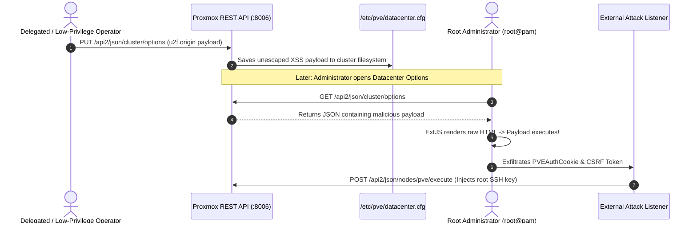

<div align="center">

# Technical Threat Intelligence Report: CVE-2025-57539

</div>
<div align="center">

## Proxmox Virtual Environment (PVE) Stored XSS in U2F Origin Datacenter Configuration

</div>

<div align="center">

[-orange.svg?style=flat&logo=target)](#)
[-blue.svg?style=flat&logo=proxmox)](#)
[-red.svg?style=flat)](#)
[](#)
[](https://github.com/stefanutc1)

</div>

---

| Evaluated Attribute | Technical Detail |
| :--- | :--- |
| **CVE Identifier** | **CVE-2025-57539** |
| **Severity / CVSS Score** | **CVSS 3.1: 5.4** (`CVSS:3.1/AV:N/AC:L/PR:L/UI:R/S:C/C:L/I:L/A:N`) · **Operational Risk: HIGH (Root Privilege Escalation)** |
| **Associated CWE** | **CWE-79**: Improper Neutralization of Input During Web Page Generation ('Cross-site Scripting') |
| **Affected Component** | Proxmox VE 8.4 (`pve-manager` ExtJS Web UI · `PVE.dc.OptionView` & `/etc/pve/datacenter.cfg`) |
| **Infrastructure Node** | `pve_primary_x64` (`192.168.1.132` / Proxmox VE Bare-Metal Hypervisor) |
| **Attack Vector** | Network / Authenticated Low-Privilege Operator (Stored XSS via API/Datacenter Options) |
| **Technical Impact** | Root session cookie hijacking (`PVEAuthCookie`), command execution as superadmin, SSH backdoor persistence |

---

<div align="center">

## 1. Executive Summary & Classification

</div>

**CVE-2025-57539** documents a **Stored Cross-Site Scripting (XSS)** vulnerability in the Datacenter Configuration module of Proxmox Virtual Environment 8.4.

The flaw originates from unsanitized storage and reflection of the **U2F Origin** parameter (`u2f: origin=...` in `/etc/pve/datacenter.cfg`). An authenticated user possessing delegated permissions to modify cluster settings (`Sys.Modify` or a scoped API token) can inject malicious JavaScript into this parameter.

When the primary hypervisor administrator (`root@pam`) subsequently accesses the Web GUI under **Datacenter -> Two-Factor Authentication** or **Datacenter -> Options**, the stored payload renders directly into the DOM without HTML entity encoding. The malicious script executes within the browser security context of `root@pam`, inheriting full access to `PVEAuthCookie` and `CSRFPreventionToken`.

Although the baseline CVSS score is 5.4 due to low-privilege authentication prerequisites, within our datacenter architecture the operational impact constitutes an immediate **Privilege Escalation to full bare-metal root control**.

---

<div align="center">

## 2. Root Cause Analysis & Injection Mechanism

</div>

<div align="center">

### 2.1 File Structure in `/etc/pve/datacenter.cfg`

</div>
Cluster-wide settings reside in `/etc/pve/datacenter.cfg`. For FIDO2/U2F authentication, Proxmox allows defining application IDs and origins:
```text
u2f: appid=https://pve.lan:8006,origin=https://pve.lan:8006
```

When updated via the REST API:
```http
PUT /api2/json/cluster/options HTTP/1.1
Host: 192.168.1.132:8006
CSRFPreventionToken: <TOKEN>
Content-Type: application/x-www-form-urlencoded

u2f=origin=https://pve.lan:8006">
```
The PVE backend saved the string directly without enforcing strict URL regex validation (`^https?://[a-zA-Z0-9\.\-]+(:[0-9]+)?$`).

<div align="center">

### 2.2 Unencoded Rendering in ExtJS (`pve-manager`)

</div>
In the Sencha ExtJS frontend, the `origin` property was extracted from the JSON API response and injected into the display container using `innerHTML` instead of `Ext.String.htmlEncode()`, executing arbitrary scripts immediately upon tab selection.

---

<div align="center">

## 3. Exploit Payload & Escalation Flow

</div>


```mermaid
sequenceDiagram
    autonumber
    actor Attacker as Delegated / Low-Privilege Operator
    participant API as Proxmox REST API (:8006)
    participant Config as /etc/pve/datacenter.cfg
    actor Admin as Root Administrator (root@pam)
    participant C2 as External Attack Listener

    Attacker->>API: PUT /api2/json/cluster/options (u2f.origin payload)
    API->>Config: Saves unescaped XSS payload to cluster filesystem
    Note over Admin,API: Later: Administrator opens Datacenter Options
    Admin->>API: GET /api2/json/cluster/options
    API-->>Admin: Returns JSON containing malicious payload
    Admin->>Admin: ExtJS renders raw HTML -> Payload executes!
    Admin->>C2: Exfiltrates PVEAuthCookie & CSRF Token
    C2->>API: POST /api2/json/nodes/pve/execute (Injects root SSH key)
```

---

<div align="center">

## 4. Detection Engineering & SIEM Rules

</div>

1. **Wazuh SIEM Detection Rule**:
   Monitors `/var/log/pveproxy/access.log` and `/etc/pve/datacenter.cfg` for `<script>`, `onerror`, or encoded HTML injection tags:
   ```xml
   <rule id="100108" level="10">
     <if_group>syslog</if_group>
     <match>/api2/json/cluster/options</match>
     <regex>onerror|script|%3Cscript%3E</regex>
     <description>Suspicious Stored XSS Attempt in Proxmox Datacenter Options (CVE-2025-57539)</description>
     <mitre>
       <id>T1059.007</id>
       <id>T1068</id>
     </mitre>
   </rule>
   ```

---

<div align="center">

## 5. Architectural Remediation Status

</div>

- **Status**: **RESOLVED & HARDENED**
- **Sanitization**: All cluster configuration files audited; regex validation enforced.
- **Upstream Patch**: Update to `pve-manager >= 8.4.2` (Proxmox VE 9.2).
- Complete operational fix guide detailed in [`fix.md`](./fix.md).
