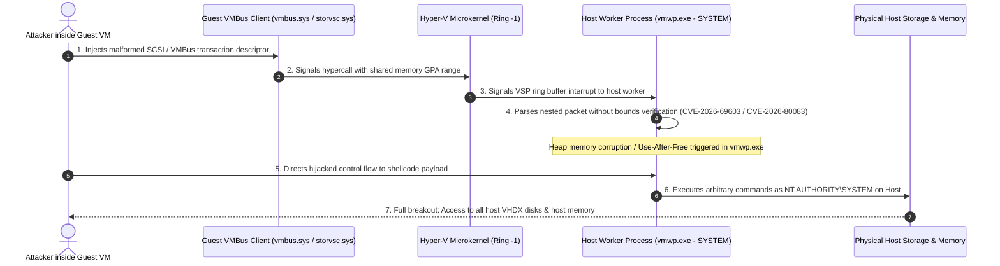

# Threat Intelligence & Vulnerability Assessment Report
## Windows Hyper-V Guest-to-Host Escape Vulnerabilities (CVE-2026-69603 & CVE-2026-80083)

**Author:** @stefanutc1  
**Date:** 13 September 2026  
**Classification:** TLP:CLEAR / Technical Vulnerability Research  
**Target Systems:** Microsoft Windows Server (2025, 2022, 2019, 2016) & Windows 10/11 Enterprise Hyper-V Hypervisors  
**Vulnerability Identifiers:** CVE-2026-69603, CVE-2026-80083  
**Common Weakness Enumeration:** CWE-787 (Out-of-Bounds Write), CWE-416 (Use-After-Free)  

---

## 1. Executive Summary

A coordinated vulnerability disclosure identified two critical security flaws within the **Microsoft Windows Hyper-V** virtualization stack: **CVE-2026-69603** and **CVE-2026-80083**. Both vulnerabilities carry a **CVSS v3.1 base score of 8.8 (High/Critical)**:
$$\text{CVSS:3.1/AV:L/AC:L/PR:L/UI:N/S:C/C:H/I:H/A:H}$$

These vulnerabilities allow an authenticated attacker with low-privileged or administrator execution rights inside a guest virtual machine (VM) to bypass hypervisor boundary isolation completely (**guest-to-host escape**). By transmitting crafted inter-partition messages across the Hyper-V Virtual Machine Bus (**VMBus**) to synthetic device emulators (synthetic SCSI storage and virtual network endpoints), an attacker corrupts memory in the host-level Hyper-V Worker Process (`vmwp.exe`) or the root partition kernel (`vmbus.sys`).

Successful exploitation results in arbitrary code execution on the physical host machine with `NT AUTHORITY\SYSTEM` privileges, granting the adversary total compromise over all co-located virtual machines, storage volumes, and physical host peripherals.

---

## 2. Vulnerability Mechanics & Technical Architecture

### 2.1 Hyper-V Architecture & VMBus Communication

Windows Hyper-V relies on a Type-1 hypervisor microkernel running in VMX root mode (Ring -1). Workloads execute inside child partitions (Guest VMs), while the parent partition (Host OS / Root Partition) manages device virtualization via dedicated per-VM user-mode worker processes (`vmwp.exe`) and root kernel-mode drivers (`vmbus.sys`, `vmswitch.sys`, `storvsp.sys`).

Communication between the guest and host occurs over **VMBus**, an enlightened inter-partition communications channel that uses shared memory ring buffers and synthetic device interfaces (VSPs - Virtualization Service Providers on the host, and VSCs - Virtualization Service Clients in the guest).



### 2.2 Deep-Dive: Root Cause Analysis

1. **CVE-2026-69603 (Out-of-Bounds Write via Synthetic SCSI Emulation)**:
   * **Component:** Virtual Storage Service Provider (`storvsp.sys` / `vmwp.exe`).
   * **Mechanism:** When handling chained scatter/gather list (SGL) descriptors for high-throughput synthetic SCSI requests, the length parsing loop fails to enforce proper boundary validation against host-allocated response buffers. By sending an oversized, fragmented descriptor payload through the guest ring buffer, memory preceding or following the host heap buffer is overwritten with attacker-controlled data.
2. **CVE-2026-80083 (Use-After-Free in Synthetic Network Switch Interface)**:
   * **Component:** Virtual Network Service Provider (`vmswitch.sys` / `vmwp.exe`).
   * **Mechanism:** Triggered during concurrent re-negotiation of network adapter MTU sizes and packet queue de-allocations while synthetic NetVSC packets are pending in transit. An object pointer to the network packet descriptor is freed on the host, but the asynchronous completion handler references the freed pointer, allowing heap grooming and arbitrary write primitives in host memory space.

---

## 3. Impact Assessment on Our Infrastructure

Cross-referencing the inventory defined in `inventory/hosts.yml` and Terraform hypervisor configurations in `hypervisors/hyperv/main.tf`, our environment faces severe exposure:

```
[Homelab Infrastructure Topology Exposure]
Physical Host (Windows Server / Hyper-V Root Partition)
  ├── hyperv_virtual_switch.homelab_switch ("hlextswitch" - External)
  ├── VHDX Storage: C:\ProgramData\Microsoft\Windows\Hyper-V\Virtual Hard Disks\
  │
  ├── opnsense_vm (Core Firewall / Router / Ingress Proxy - VMID 200)
  ├── metasploitable_vm / metasploitable_licenta_vm (Pen-test targets - VMID 202, 301)
  ├── kali_linux_licenta_vm (Kali pentest workstation - VMID 302)
  ├── ad2025_vm / ad2022_vm / ad2019_vm (Active Directory Domain Controllers - VMID 400-402)
  └── adwin10_vm / adwin11_vm (Domain Member Workstations - VMID 406-407)
```

### Specific Threat Scenarios:

1. **Compromise of Penetration Testing / Honeypot Targets (`metasploitable_vm`, `tpot_vm`)**:
   * Our infrastructure intentionally hosts intentionally vulnerable targets (`metasploitable_vm`, `metasploitable_licenta_vm`) and honeypots (`tpot_vm`) for security lab research.
   * If an automated threat actor or exploit payload compromises one of these test VMs, they can immediately pivot using **CVE-2026-69603** or **CVE-2026-80083** to escape the sandbox and capture the physical Windows host running Hyper-V.
2. **Host-Level Domination & Cross-VM Memory Dumping**:
   * Once on the Hyper-V host with `SYSTEM` privileges, the attacker has unfiltered access to the memory spaces of `ad2025_vm` (Active Directory Domain Controller 2025) and `ad2022_vm`.
   * The attacker can execute `MiniDumpWriteDump` on the worker process of the Domain Controller to extract raw LSASS memory, compromising Kerberos krbtgt hashes and Active Directory credentials across the entire domain (`ad2025.lan`).
3. **Core Network Gateway Hijacking (`opnsense_vm`)**:
   * Our core firewall and routing layer (`opnsense_vm`) runs as a Generation 2 VM with SCSI disks and external virtual switch binding (`hlextswitch`).
   * Escape from any co-located VM gives the adversary access to the host virtual switch configuration, enabling promiscuous packet sniffing across all internal network VLANs.
4. **Terraform Integration Services Vector**:
   * In `hypervisors/hyperv/main.tf`, the VM instance defines:
     ```hcl
     integration_services = {
       GuestServiceInterface = true
       Heartbeat             = true
       KeyIntegration        = true
       Shutdown              = true
       TimeSynchronization   = true
     }
     ```
     `GuestServiceInterface = true` enables the Hyper-V Guest Service Interface, exposing additional bidirectional VMBus endpoints that broaden the attack surface for inter-partition exploitation.

---

## 4. Exploitation Vector & Proof-of-Concept Mechanics

```
[Attacker inside Guest] 
   └── 1. Allocates contiguous physical memory page (GPA)
   └── 2. Crafts synthetic SCSI VMBUS_CHANNEL_PACKET_MULIT_PAGE_BUFFER
   └── 3. Sets ByteCount = 0xFFFF and corrupts SGL Range Offset
   └── 4. Calls Hypercall 0x0001 (HvSignalEvent) on VMBus Port ID
           │
           ▼
[Physical Host Hyper-V vmwp.exe]
   └── 5. Worker receives interrupt on channel worker thread
   └── 6. Allocates fixed buffer of size 0x1000 in host user-space heap
   └── 7. memcpy() copies 0xFFFF bytes without clamp verification -> Out-of-Bounds Write!
   └── 8. Control flow hijacked via overwritten vtable function pointer -> Remote Code Exec!
```

---

## 5. Detection & Threat Hunting

### 5.1 Windows Event Log Indicators (Host Hyper-V)

Monitor the physical Hyper-V host for abnormal worker crashes or memory violations:
* **Log Channel:** `Microsoft-Windows-Hyper-V-Worker-Admin` and `Microsoft-Windows-Hyper-V-Worker-Operational`
  * **Event ID 12050:** "The virtual machine '%1' was reset because an unrecoverable error occurred in a virtual device."
  * **Event ID 18560:** "Virtual machine '%1' was reset due to a catastrophic error: Hyper-V worker process crash."
* **Log Channel:** `Application`
  * **Event ID 1000 (Application Error):** Faulting application name: `vmwp.exe`, faulting module name: `storvsp.sys`, `vmbus.sys`, or `ntdll.dll`.

### 5.2 Host Sigma Rule

```yaml
title: Hyper-V Worker Process Abnormal Crash or Child Process Spawn
id: cve-2026-69603-hyperv-escape
status: experimental
description: Detects suspicious memory fault or process creation by Hyper-V Worker Process (vmwp.exe), indicating hypervisor breakout.
logsource:
  category: process_creation
  product: windows
detection:
  selection_parent:
    ParentImage|endswith: '\vmwp.exe'
  selection_suspicious_children:
    Image|endswith:
      - '\cmd.exe'
      - '\powershell.exe'
      - '\pwsh.exe'
      - '\rundll32.exe'
      - '\whoami.exe'
      - '\nltest.exe'
  condition: selection_parent and selection_suspicious_children
fields:
  - ComputerName
  - User
  - Image
  - CommandLine
  - ParentProcessId
falsepositives:
  - None. Hyper-V vmwp.exe should never spawn interactive shell binaries.
level: critical
```

---

## 6. Actionable Mitigation & Remediation Playbook

### Step 1: Emergency Patch Application
Immediately deploy Microsoft Security Updates for September 2026 across all physical Hyper-V hosts:
* Windows Server 2025: KB5058825 (or latest cumulative update)
* Windows Server 2022: KB5058822
* Windows 11 23H2 / 24H2: KB5058811

### Step 2: Disable Unnecessary Hyper-V Integration Services
In `hypervisors/hyperv/main.tf`, disable `GuestServiceInterface` on untrusted or internet-facing workloads (e.g. penetration testing targets):

```powershell
# PowerShell command on Hyper-V Host to disable Guest Service Interface
Disable-VMIntegrationService -VMName "metasploitable" -Name "Guest Service Interface"
Disable-VMIntegrationService -VMName "tpot" -Name "Guest Service Interface"
```

### Step 3: Enable Virtualization-Based Security (VBS) & Hypervisor-Protected Code Integrity (HVCI)
Enable hypervisor-enforced memory paging protection on the physical host to mitigate shellcode execution even in the event of heap corruption:
```powershell
# Enable Device Guard & Hypervisor-Enforced Code Integrity
Set-ItemProperty -Path "HKLM:\SYSTEM\CurrentControlSet\Control\DeviceGuard" -Name "EnableVirtualizationBasedSecurity" -Value 1 -Type DWord
Set-ItemProperty -Path "HKLM:\SYSTEM\CurrentControlSet\Control\DeviceGuard\Scenarios\HypervisorEnforcedCodeIntegrity" -Name "Enabled" -Value 1 -Type DWord
```

### Step 4: Network & VM Isolation Hardening
* Isolate test VMs (`metasploitable_vm`, `tpot_vm`) onto private virtual switches (`Private` switch type in Hyper-V) without direct bridging to the management network adapter.
* Ensure nested virtualization is disabled on VMs where it is not strictly required:
  ```powershell
  Set-VMProcessor -VMName "metasploitable" -ExposeVirtualizationExtensions $false
  ```
