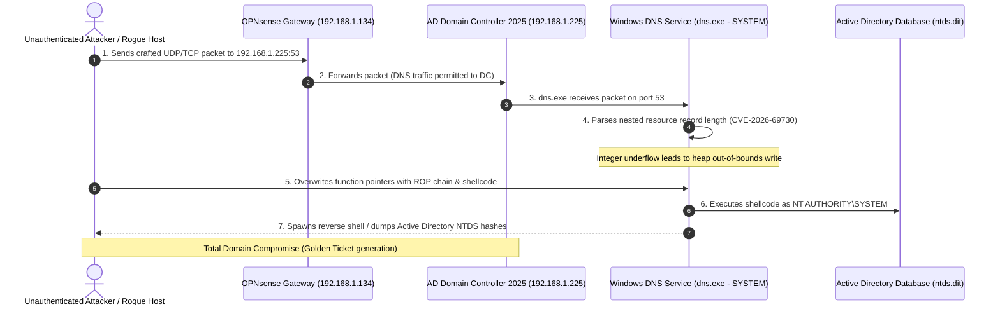

# Threat Intelligence & Vulnerability Assessment Report
## Windows DNS Server Critical Remote Code Execution (CVE-2026-69730)

**Author:** @stefanutc1  
**Date:** 13 September 2026  
**Classification:** TLP:CLEAR / Technical Vulnerability Research  
**Target Systems:** Windows Server 2025, Windows Server 2022, Windows Server 2019, Windows Server 2016 (DNS Server Role)  
**Vulnerability Identifier:** CVE-2026-69730  
**Common Weakness Enumeration:** CWE-120 (Buffer Copy without Checking Size of Input), CWE-787 (Out-of-Bounds Write)  
**CVSS v3.1 Score:** 9.8 (Critical / Wormable)  
$$\text{CVSS:3.1/AV:N/AC:L/PR:N/UI:N/S:U/C:H/I:H/A:H}$$

---

## 1. Executive Summary

**CVE-2026-69730** is a critical, unauthenticated, remotely exploitable **Remote Code Execution (RCE)** vulnerability residing in the **Windows DNS Server service (`dns.exe`)**. Rated with a maximum severity CVSS score of **9.8**, this vulnerability allows an attacker anywhere on the local network (or across subnets with routing to port 53) to achieve arbitrary code execution in the context of **`NT AUTHORITY\SYSTEM`** without valid credentials or user interaction.

Because the Windows DNS Server service runs by default on all **Active Directory Domain Controllers**, successful exploitation of this vulnerability yields instantaneous, complete compromise of the entire Active Directory domain forest. The vulnerability is functionally **wormable**, meaning an infected host can scan and propagate automatically to other Domain Controllers and DNS servers across adjacent network segments.

---

## 2. Vulnerability Mechanics & Attack Flow

### 2.1 Technical Architecture of Windows DNS Parsing (`dns.exe`)

The Windows DNS Server service listens natively on UDP port 53 and TCP port 53. To accommodate modern protocol standards, `dns.exe` implements record compression algorithms and decoding handlers for extended DNS options (EDNS0), dynamic DNS updates (RFC 2136), and DNSSEC cryptographic signature records (`SIG`, `RRSIG`, `KEY`).

When processing nested resource record compression pointers or variable-length dynamic update packets, a signed integer comparison flaw exists inside the record ingestion routine (`dns.exe!Msg_CopyRecords`). When an attacker transmits an oversized length prefix coupled with negative displacement offsets in the query question/answer sections, the memory allocator allocates an undersized buffer on the heap while the subsequent memory copy operation operates on the unclipped length.



### 2.2 Exploitation Prerequisites
* **Network Vector (AV:N):** The attacker only needs network reachability to UDP or TCP port 53 on the victim server.
* **Zero Privileges Required (PR:N):** No domain credentials, Kerberos tickets, or local accounts are necessary.
* **Zero User Interaction (UI:N):** Exploitation occurs silently in the background on the target server.

---

## 3. Impact Assessment on Our Infrastructure

Mapping this vulnerability against our infrastructure catalog in `inventory/hosts.yml` demonstrates that our core Active Directory environment is in the direct line of fire:

```
[Our Active Directory Architecture & DNS Roles]
Core Domain Controllers (Hosts authoritative DNS for ad2025.lan, ad2022.lan, ad2019.lan):
  ├── ad2025_vm  (192.168.1.225) -> Windows Server 2025 Datacenter (VMID 400, 6 cores, 8GB RAM)
  ├── ad2022_vm  (192.168.1.222) -> Windows Server 2022 Datacenter (VMID 401, 2 cores, 4GB RAM)
  ├── ad2019_vm  (192.168.1.219) -> Windows Server 2019 Standard   (VMID 402, 2 cores, 2GB RAM)
  ├── ad2016_vm  (192.168.1.216) -> Windows Server 2016 Standard   (VMID 403)
  ├── ad2012_vm  (192.168.1.212) -> Windows Server 2012 R2 Standard(VMID 404)
  └── ad2008_vm  (192.168.1.208) -> Windows Server 2008 R2 Standard(VMID 405)

Dependent Clients / Services (Configured to resolve DNS via 192.168.1.225 / 192.168.1.222):
  ├── adwin11_vm (192.168.1.218) & adwin10_vm (192.168.1.217) [Member Workstations]
  ├── adrhel_vm  (192.168.1.228) [RHEL Enterprise Domain Workload]
  ├── opnsense_vm (192.168.1.134) [Core Ingress Router]
  └── k8s_node_04, immich_photos, nextcloud_hub, homeassistant_core
```

### Critical Threat Vectors in Our Homelab:

1. **Instant Domain Administrator Privilege Escalation**:
   * On `ad2025_vm` and `ad2022_vm`, the DNS server service executes as `NT AUTHORITY\SYSTEM`.
   * An attacker compromising a low-trust node on the network (e.g. `metasploitable_vm` 192.168.1.202, or a compromised IoT / media container) can fire a single network packet to `192.168.1.225:53`.
   * Upon code execution, the attacker dumps the **Active Directory NTDS database (`C:\Windows\NTDS\ntds.dit`)** using `vssadmin` or `ntdsutil`, instantly recovering the password hashes of all domain administrators and service accounts.
2. **Persistence via Kerberos Golden Tickets**:
   * Access to the `krbtgt` password hash from `ad2025_vm` allows the attacker to forge valid Kerberos Ticket Granting Tickets (TGT) valid for 10+ years, surviving complete password resets.
3. **Internal DNS Poisoning & Man-in-the-Middle (MitM)**:
   * By hijacking `dns.exe`, the attacker can arbitrarily modify DNS record resolutions for internal services:
     * `nextcloud.lan` $\rightarrow$ Redirect to phishing credential harvester.
     * `opnsense.lan` $\rightarrow$ Intercept administrative sessions.
     * `k8s-node-04.lan` $\rightarrow$ Compromise Kubernetes cluster API tokens.
4. **Wormable Propagation through the Subnet**:
   * Since all Domain Controllers replicate Active Directory and DNS zones, a worm payload weaponizing CVE-2026-69730 would compromise `ad2025_vm`, scan and compromise `ad2022_vm`, and pivot to `ad2019_vm` in less than 30 seconds.

---

## 4. Threat Hunting & Detection Engineering

### 4.1 Suspicious Child Processes of `dns.exe` (Sigma Rule)

The legitimate Windows DNS Server process (`dns.exe`) should **never** spawn interactive shells, script interpreters, or administrative management utilities.

```yaml
title: Suspicious Child Process Spawned by Windows DNS Server (CVE-2026-69730)
id: 8f4a3e21-d419-4b02-98aa-cve202669730
status: stable
description: Detects process creation events where dns.exe is the parent process, indicating exploitation of Windows DNS Server.
logsource:
  category: process_creation
  product: windows
detection:
  selection:
    ParentImage|endswith: '\dns.exe'
    Image|endswith:
      - '\cmd.exe'
      - '\powershell.exe'
      - '\pwsh.exe'
      - '\conhost.exe'
      - '\rundll32.exe'
      - '\regsvr32.exe'
      - '\certutil.exe'
      - '\whoami.exe'
      - '\net.exe'
      - '\net1.exe'
      - '\nltest.exe'
      - '\vssadmin.exe'
      - '\ntdsutil.exe'
  condition: selection
fields:
  - ComputerName
  - User
  - Image
  - CommandLine
  - ParentCommandLine
falsepositives:
  - Rare administrative batch scripts (verify and whitelist specific parent-child arguments).
level: critical
tags:
  - attack.initial_access
  - attack.t1190
  - attack.execution
  - attack.t1059
```

### 4.2 Network Intrusion Detection (Suricata / Snort Signature)

```suricata
# Detect anomalous DNS queries exceeding standard MTU or containing malformed record headers
alert udp any any -> [192.168.1.225,192.168.1.222,192.168.1.219] 53 (msg:"EXPLOIT [Homelab] Possible Windows DNS Server RCE Attempt (CVE-2026-69730)"; \
    content:"|00 00|"; offset:2; depth:2; \
    dsize:>4096; \
    threshold: type limit, track by_src, count 1, seconds 60; \
    classtype:attempted-admin; sid:202669730; rev:1;)
```

### 4.3 Sysmon & Windows Event Log Telemetry
* **Event ID 1 (Process Creation):** Parent Image: `C:\Windows\System32\dns.exe`.
* **Event ID 3 (Network Connection):** `dns.exe` initiating outbound network connections to external or non-standard ports (C2 reverse shell).
* **DNS Server Analytical Log:** Event ID `257` (Dynamic update received from unauthenticated source), Event ID `258` (Zone update failure with buffer error).

---

## 5. Hardening & Immediate Remediation Playbook

### Step 1: Emergency Cumulative Security Updates
Apply the official Microsoft security update immediately on all Windows Server Domain Controllers:
* **Windows Server 2025:** KB5058825
* **Windows Server 2022:** KB5058822
* **Windows Server 2019:** KB5058819

```powershell
# Check installed hotfixes on Domain Controller via PowerShell
Get-HotFix | Where-Object { $_.HotFixID -match "KB50588" } | Select-Object HotFixID, InstalledOn, Description
```

### Step 2: Temporary Emergency Registry Workaround (If Patching is Delayed)
Limit the maximum allowable TCP packet size that `dns.exe` will ingest, neutralizing oversized heap-grooming payloads:

```powershell
# Restrict maximum incoming DNS TCP payload size
reg add "HKEY_LOCAL_MACHINE\SYSTEM\CurrentControlSet\Services\DNS\Parameters" /v "TcpReceivePacketSize" /t REG_DWORD /d 0xFF00 /f
# Restart DNS Server service to apply workaround
Restart-Service -Name "DNS" -Force
```

### Step 3: OPNsense Ingress Filtering (`opnsense_vm` 192.168.1.134)
* Configure OPNsense firewall rules to block direct access to port 53 on Domain Controllers (`192.168.1.225`, `192.168.1.222`) from:
  * Guest Wi-Fi / IoT VLANs.
  * Honeypot / Penetration testing subnets (`metasploitable_vm`, `tpot_vm`).
* Enforce DNS relaying: All non-domain clients must resolve DNS through OPNsense Unbound DNS proxy (`192.168.1.134:53`) rather than talking directly to the Windows Domain Controllers.

### Step 4: Active Directory Domain Security Hardening
* Enforce **Secure-Only Dynamic DNS Updates**:
  ```powershell
  # Configure all Active Directory integrated zones to accept only Kerberos-authenticated updates
  Get-DnsServerZone | Where-Object { $_.IsDsIntegrated -eq $true } | Set-DnsServerZone -DynamicUpdate Secure
  ```
* Disable DNS Zone Transfers (`AXFR`) to any unauthorized IP addresses.
