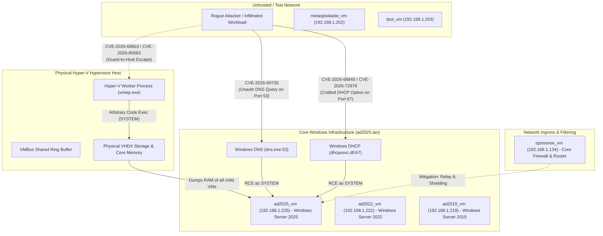

# Infrastructure Cyber Security: Vulnerability & Threat Intelligence Hub
## Critical Windows Ecosystem CVE Assessments (September 2026 Disclosure)

**Author:** @stefanutc1  
**Last Updated:** 13 September 2026  
**Classification:** TLP:CLEAR / Technical Cyber Threat Intelligence  
**Scope:** Impact Analysis on Homelab & Enterprise Infrastructure (`hosts.yml`, Hyper-V, Active Directory Domain Controllers)

---

## 1. Vulnerability Matrix & Threat Dashboard

| CVE Identifier | Affected Component | CVSS v3.1 | Vulnerability Class | Impact on Our Infrastructure | Detailed Report |
| :--- | :--- | :---: | :--- | :--- | :--- |
| **CVE-2026-69603**<br>**CVE-2026-80083** | Windows Hyper-V Virtualization Stack | **8.8**<br>(High/Crit) | Out-of-Bounds Write & Use-After-Free in VMBus Synthetic SCSI/Net | **Guest-to-Host Escape:** Compromise of physical Hyper-V host from untrusted VMs (`metasploitable_vm`, `tpot_vm`, developer machines); total cross-VM memory & VHDX disk exposure. | [Hyper-V Report](file:///C:/Users/Administrator/.gemini/antigravity/scratch/infrastructure/cyber/cve/CVE-2026-69603-CVE-2026-80083/report.md) |
| **CVE-2026-69730** | Windows DNS Server Service (`dns.exe`) | **9.8**<br>(Critical) | Remote Code Execution via Malformed DNS Record Parsing (Wormable) | **Domain Controller Takeover:** Unauthenticated RCE as `SYSTEM` on `ad2025_vm`, `ad2022_vm`, `ad2019_vm`. Full Active Directory database (`ntds.dit`) dump and Golden Ticket creation. | [DNS RCE Report](file:///C:/Users/Administrator/.gemini/antigravity/scratch/infrastructure/cyber/cve/CVE-2026-69730/report.md) |
| **CVE-2026-69845**<br>**CVE-2026-72979** | Windows DHCP Server Service (`dhcpssvc.dll`) | **9.8**<br>(Critical) | Heap-based Buffer Overflow & Use-After-Free via Option 43/82 | **Subnet Compromise & MitM:** Unauthenticated remote execution via UDP port 67 broadcast; rogue client lease poisoning, DNS redirection, and lateral movement to DC. | [DHCP RCE Report](file:///C:/Users/Administrator/.gemini/antigravity/scratch/infrastructure/cyber/cve/CVE-2026-69845-CVE-2026-72979/report.md) |

---

## 2. Infrastructure Attack Surface & Threat Topology

The following diagram illustrates how these three vulnerability classes intersect within our specific infrastructure topology (`inventory/hosts.yml` and `hypervisors/hyperv/main.tf`):



---

## 3. Executive Summary of Impact on Our Workloads

### 1. Hypervisor Sandbox Breach (Hyper-V Escape)
* **Affected Hosts:** Physical Hyper-V hypervisors managing `hlextswitch` (`hypervisors/hyperv/main.tf`).
* **Criticality:** High risk for environments co-hosting testing VMs (`metasploitable_vm`, `tpot_vm`) alongside operational domain controllers (`ad2025_vm`) or firewalls (`opnsense_vm`). An attacker gaining command execution inside a lab VM escapes into the physical host, seizing all virtual hard drives and physical interfaces.

### 2. Full Active Directory Forest Compromise (Windows DNS Server)
* **Affected Hosts:** `ad2025_vm` (`192.168.1.225`), `ad2022_vm` (`192.168.1.222`), `ad2019_vm` (`192.168.1.219`).
* **Criticality:** Maximum danger (CVSS 9.8). Exploitation requires zero authentication and no user interaction. A single network query to port 53 yields an interactive `SYSTEM` shell on the Domain Controller, exposing the complete Active Directory database (`ntds.dit`) and enabling unrestricted Golden Ticket creation.

### 3. Local Network Takeover & MitM (Windows DHCP Server)
* **Affected Hosts:** Domain Controllers configured with the DHCP Server role.
* **Criticality:** Severe risk (CVSS 9.8) from unauthenticated LAN broadcasts. Allows malicious endpoints or Wi-Fi devices to compromise the server and poison network parameters (gateway, DNS, WPAD) across all corporate clients (`adwin10_vm`, `adwin11_vm`, `k8s_node_04`).

---

## 4. Master Remediation & Action Plan

```powershell
# 1. Check Patch Status across Domain Controllers for September 2026 Cumulative Updates
Get-HotFix | Where-Object { $_.HotFixID -match "KB50588" }

# 2. Hyper-V Hardening: Disable unnecessary integration services on test/untrusted VMs
Disable-VMIntegrationService -VMName "metasploitable" -Name "Guest Service Interface"

# 3. DNS Workaround (if immediate reboot/patch is not feasible)
reg add "HKLM\SYSTEM\CurrentControlSet\Services\DNS\Parameters" /v "TcpReceivePacketSize" /t REG_DWORD /d 0xFF00 /f
Restart-Service -Name "DNS" -Force

# 4. DHCP Best Practice Architecture
# Decommission Windows DHCP and delegate all dynamic IP leasing to OPNsense (192.168.1.134)
Stop-Service -Name "DHCPServer" -Force
Set-Service -Name "DHCPServer" -StartupType Disabled
```

---

## 5. Report Index & Direct Navigation
* [CVE-2026-69603 & CVE-2026-80083 Detailed Report](file:///C:/Users/Administrator/.gemini/antigravity/scratch/infrastructure/cyber/cve/CVE-2026-69603-CVE-2026-80083/report.md)
* [CVE-2026-69730 Detailed Report](file:///C:/Users/Administrator/.gemini/antigravity/scratch/infrastructure/cyber/cve/CVE-2026-69730/report.md)
* [CVE-2026-69845 & CVE-2026-72979 Detailed Report](file:///C:/Users/Administrator/.gemini/antigravity/scratch/infrastructure/cyber/cve/CVE-2026-69845-CVE-2026-72979/report.md)
