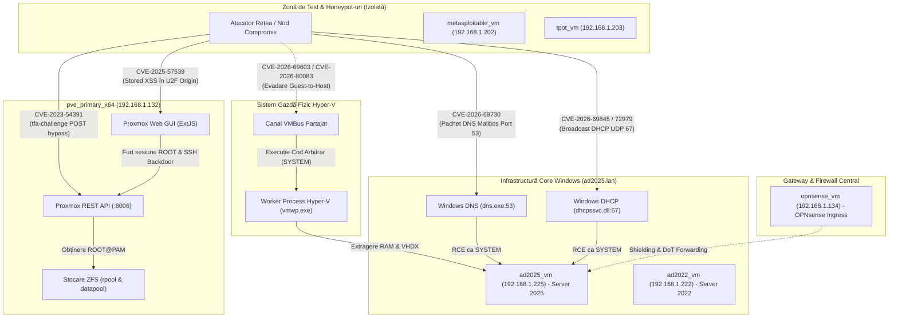

# Infrastructure Cyber Security: Vulnerability & Threat Intelligence Hub
## Critical Ecosystem CVE Assessments & Hardening Guides (Windows & Proxmox VE)

**Author:** @stefanutc1  
**Last Updated:** 13 September 2026  
**Classification:** TLP:CLEAR / Technical Cyber Threat Intelligence  
**Scope:** Impact Analysis on Homelab & Enterprise Infrastructure (`hosts.yml`, Proxmox VE Bare-Metal, Hyper-V, Active Directory Domain Controllers)

---

## 1. Vulnerability Matrix & Threat Dashboard

| CVE Identifier | Affected Component | CVSS v3.1 | Vulnerability Class | Impact on Our Infrastructure | Dossier Tehnic | Plan Remediere |
| :--- | :--- | :---: | :--- | :--- | :---: | :---: |
| **CVE-2023-54391** | Proxmox VE (`libpve-access-control` < 8.0.4) | **9.8** (Critical) | Authentication Bypass via `tfa-challenge` Parameter | **Hypervisor Root Takeover:** Unauthenticated network attacker bypasses password auth to obtain `root@pam` on `pve_primary_x64` (192.168.1.132); total control over all VMs, containers, and ZFS pools (`rpool`, `datapool`). | [Raport Tehnic](./CVE-2023-54391/report.md) | [Plan Fix & Hardening](./CVE-2023-54391/fix.md) |
| **CVE-2025-57539** | Proxmox VE 8.4 (`pve-manager` / ExtJS GUI) | **5.4** (High Risk) | Stored Cross-Site Scripting (XSS) in U2F Origin Field | **Root Privilege Escalation:** Low-privilege/token operator injects XSS in `datacenter.cfg`. When `root@pam` visits Datacenter Options, payload steals session tokens, injects SSH backdoors, and issues rogue API tokens. | [Raport Tehnic](./CVE-2025-57539/report.md) | [Plan Fix & Hardening](./CVE-2025-57539/fix.md) |
| **CVE-2026-69603** **CVE-2026-80083** | Windows Hyper-V Virtualization Stack | **8.8** (High/Crit) | Out-of-Bounds Write & Use-After-Free in VMBus Synthetic SCSI/Net | **Guest-to-Host Escape:** Compromise of physical Hyper-V host from untrusted VMs (`metasploitable_vm`, `tpot_vm`); total cross-VM memory & VHDX disk exposure (`ad2025_vm`, `opnsense_vm`). | [Raport Tehnic](./CVE-2026-69603-CVE-2026-80083/report.md) | [Plan Fix & Hardening](./CVE-2026-69603-CVE-2026-80083/fix.md) |
| **CVE-2026-69730** | Windows DNS Server Service (`dns.exe`) | **9.8** (Critical) | Remote Code Execution via Malformed DNS Record Parsing (Wormable) | **Domain Controller Takeover:** Unauthenticated RCE as `SYSTEM` on `ad2025_vm`, `ad2022_vm`, `ad2019_vm`. Full Active Directory database (`ntds.dit`) dump and Golden Ticket creation. | [Raport Tehnic](./CVE-2026-69730/report.md) | [Plan Fix & Hardening](./CVE-2026-69730/fix.md) |
| **CVE-2026-69845** **CVE-2026-72979** | Windows DHCP Server Service (`dhcpssvc.dll`) | **9.8** (Critical) | Heap-based Buffer Overflow & Use-After-Free via Option 43/82 | **Subnet Compromise & MitM:** Unauthenticated remote execution via UDP port 67 broadcast; rogue client lease poisoning, DNS redirection, and lateral movement to Domain Controllers. | [Raport Tehnic](./CVE-2026-69845-CVE-2026-72979/report.md) | [Plan Fix & Hardening](./CVE-2026-69845-CVE-2026-72979/fix.md) |

---

## 2. Topologia Amenințărilor & Intersecția cu Infrastructura Noastră

---

## 3. Ghiduri de Rezolvare & Playbook-uri (Direct Navigation)

Toate vulnerabilitățile includ dosare tehnice de analiză (`report.md`) și planuri operaționale de remediere (`fix.md`):

1. **Proxmox VE Authentication Bypass**
   * [Raport Tehnic CVE-2023-54391](./CVE-2023-54391/report.md)
   * [Ghid de Rezolvare & Hardening CVE-2023-54391](./CVE-2023-54391/fix.md)
2. **Proxmox VE Stored XSS în Datacenter Options**
   * [Raport Tehnic CVE-2025-57539](./CVE-2025-57539/report.md)
   * [Ghid de Rezolvare & Hardening CVE-2025-57539](./CVE-2025-57539/fix.md)
3. **Windows Hyper-V Guest-to-Host Escape**
   * [Raport Tehnic CVE-2026-69603 & CVE-2026-80083](./CVE-2026-69603-CVE-2026-80083/report.md)
   * [Ghid de Rezolvare & Hardening Hyper-V](./CVE-2026-69603-CVE-2026-80083/fix.md)
4. **Windows DNS Server Critical Remote Code Execution**
   * [Raport Tehnic CVE-2026-69730](./CVE-2026-69730/report.md)
   * [Ghid de Rezolvare & Hardening DNS Server](./CVE-2026-69730/fix.md)
5. **Windows DHCP Server Heap Overflow & Use-After-Free RCE**
   * [Raport Tehnic CVE-2026-69845 & CVE-2026-72979](./CVE-2026-69845-CVE-2026-72979/report.md)
   * [Ghid de Rezolvare & Hardening DHCP Server](./CVE-2026-69845-CVE-2026-72979/fix.md)
