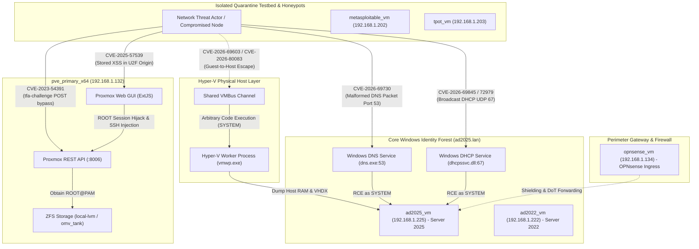

# Infrastructure Cybersecurity: Vulnerability & Threat Intelligence Hub

---

## Critical Ecosystem CVE Assessments & Hardening Playbooks (Windows & Proxmox VE)

**Lead Threat Analyst:** Moană Ștefănuț-Cornel ([`@stefanutc1`](https://github.com/stefanutc1))  
**Academic Affiliation:** Universitatea din Craiova · FEAA — Informatică Economică (2024–2027)  
**Classification:** TLP:CLEAR / Technical Cyber Threat Intelligence  
**Scope:** Impact analysis on bare-metal Proxmox VE, Windows Hyper-V, and multi-tier Active Directory Domain Controllers.

---

## 1. Vulnerability Matrix & Threat Dashboard

| CVE Identifier | Affected Component | CVSS v3.1 | Vulnerability Class | Infrastructure Impact & Vector | Technical Dossier | Remediation Playbook |
| :--- | :--- | :---: | :--- | :--- | :---: | :---: |
| **CVE-2023-54391** | Proxmox VE (`libpve-access-control` < 8.0.4) | **9.8** (Critical) | Authentication Bypass via `tfa-challenge` Parameter | **Hypervisor Root Takeover:** Unauthenticated network attacker bypasses password auth to obtain `root@pam` on `pve_primary_x64` (192.168.1.132); total control over all VMs, containers, and ZFS pools. | [Technical Report](./CVE-2023-54391/report.md) | [Hardening Plan](./CVE-2023-54391/fix.md) |
| **CVE-2025-57539** | Proxmox VE 8.4 (`pve-manager` / ExtJS GUI) | **5.4** (High Risk) | Stored Cross-Site Scripting (XSS) in U2F Origin Field | **Root Privilege Escalation:** Low-privilege/token operator injects XSS in `datacenter.cfg`. When `root@pam` views Datacenter Options, payload exfiltrates session tokens and issues rogue API keys. | [Technical Report](./CVE-2025-57539/report.md) | [Hardening Plan](./CVE-2025-57539/fix.md) |
| **CVE-2026-69603** **CVE-2026-80083** | Windows Hyper-V Virtualization Stack | **8.8** (High/Crit) | Out-of-Bounds Write & Use-After-Free in VMBus Synthetic SCSI/Net | **Guest-to-Host Escape:** Compromise of physical Hyper-V host from untrusted VMs; total cross-VM memory & VHDX virtual disk exposure. | [Technical Report](./CVE-2026-69603-CVE-2026-80083/report.md) | [Hardening Plan](./CVE-2026-69603-CVE-2026-80083/fix.md) |
| **CVE-2026-69730** | Windows DNS Server Service (`dns.exe`) | **9.8** (Critical) | Remote Code Execution via Malformed DNS Record Parsing (Wormable) | **Domain Controller Takeover:** Unauthenticated RCE as `SYSTEM` on `ad2025_vm`, `ad2022_vm`, `ad2019_vm`. Full Active Directory database (`ntds.dit`) dump and Golden Ticket forgery. | [Technical Report](./CVE-2026-69730/report.md) | [Hardening Plan](./CVE-2026-69730/fix.md) |
| **CVE-2026-69845** **CVE-2026-72979** | Windows DHCP Server Service (`dhcpssvc.dll`) | **9.8** (Critical) | Heap-based Buffer Overflow & Use-After-Free via Option 43/82 | **Subnet Compromise & MitM:** Unauthenticated remote execution via UDP port 67 broadcast; rogue client lease poisoning, DNS redirection, and lateral movement to Domain Controllers. | [Technical Report](./CVE-2026-69845-CVE-2026-72979/report.md) | [Hardening Plan](./CVE-2026-69845-CVE-2026-72979/fix.md) |

---

## 2. Threat Topology & Attack Surface Intersection

```mermaid
graph TD
  subgraph Untrusted_or_Compromised_Zone["Isolated Quarantine Testbed & Honeypots"]
    Attacker["Network Threat Actor / Compromised Node"]
    Metasploitable["metasploitable_vm (192.168.1.202)"]
    TPot["tpot_vm (192.168.1.203)"]
  end

  subgraph Proxmox_Hypervisor_Layer["pve_primary_x64 (192.168.1.132)"]
    PVE_API["Proxmox REST API (:8006)"]
    PVE_GUI["Proxmox Web GUI (ExtJS)"]
    ZFS_Pools["ZFS Storage (local-lvm / omv_tank)"]
  end

  subgraph HyperV_Host_Layer["Hyper-V Physical Host Layer"]
    VMBus["Shared VMBus Channel"]
    VMWP["Hyper-V Worker Process (vmwp.exe)"]
  end

  subgraph Active_Directory_Domain_Controllers["Core Windows Identity Forest (ad2025.lan)"]
    AD2025["ad2025_vm (192.168.1.225) - Server 2025"]
    AD2022["ad2022_vm (192.168.1.222) - Server 2022"]
    DNS_Svc["Windows DNS Service (dns.exe:53)"]
    DHCP_Svc["Windows DHCP Service (dhcpssvc.dll:67)"]
  end

  subgraph Ingress_Layer["Perimeter Gateway & Firewall"]
    OPNsense["opnsense_vm (192.168.1.134) - OPNsense Ingress"]
  end

  %% Attack vectors
  Attacker -->|"CVE-2023-54391<br/>(tfa-challenge POST bypass)"| PVE_API
  PVE_API -->|"Obtain ROOT@PAM"| ZFS_Pools

  Attacker -->|"CVE-2025-57539<br/>(Stored XSS in U2F Origin)"| PVE_GUI
  PVE_GUI -->|"ROOT Session Hijack & SSH Injection"| PVE_API

  Attacker -.->|"CVE-2026-69603 / CVE-2026-80083<br/>(Guest-to-Host Escape)"| VMBus
  VMBus -->|"Arbitrary Code Execution (SYSTEM)"| VMWP
  VMWP -->|"Dump Host RAM & VHDX"| AD2025

  Attacker -->|"CVE-2026-69730<br/>(Malformed DNS Packet Port 53)"| DNS_Svc
  DNS_Svc -->|"RCE as SYSTEM"| AD2025

  Attacker -->|"CVE-2026-69845 / 72979<br/>(Broadcast DHCP UDP 67)"| DHCP_Svc
  DHCP_Svc -->|"RCE as SYSTEM"| AD2025

  OPNsense -.->|"Shielding & DoT Forwarding"| AD2025
```

---

## 3. Remediation Playbooks & Action Guides

Each vulnerability dossier contains a technical analysis report (`report.md`) and an actionable hardening playbook (`fix.md`):

1. **Proxmox VE Authentication Bypass**
   * [Technical Analysis Report (CVE-2023-54391)](./CVE-2023-54391/report.md)
   * [Remediation & Hardening Playbook (CVE-2023-54391)](./CVE-2023-54391/fix.md)
2. **Proxmox VE Stored XSS in Datacenter Options**
   * [Technical Analysis Report (CVE-2025-57539)](./CVE-2025-57539/report.md)
   * [Remediation & Hardening Playbook (CVE-2025-57539)](./CVE-2025-57539/fix.md)
3. **Windows Hyper-V Guest-to-Host Escape**
   * [Technical Analysis Report (CVE-2026-69603 & CVE-2026-80083)](./CVE-2026-69603-CVE-2026-80083/report.md)
   * [Remediation & Hardening Playbook (Hyper-V Escape)](./CVE-2026-69603-CVE-2026-80083/fix.md)
4. **Windows DNS Server Remote Code Execution (SIGRed Variant)**
   * [Technical Analysis Report (CVE-2026-69730)](./CVE-2026-69730/report.md)
   * [Remediation & Hardening Playbook (Windows DNS)](./CVE-2026-69730/fix.md)
5. **Windows DHCP Server Remote Code Execution**
   * [Technical Analysis Report (CVE-2026-69845 & CVE-2026-72979)](./CVE-2026-69845-CVE-2026-72979/report.md)
   * [Remediation & Hardening Playbook (Windows DHCP)](./CVE-2026-69845-CVE-2026-72979/fix.md)

---

*Threat Intelligence & Cybersecurity Research · **Moană Ștefănuț-Cornel** (`@stefanutc1`).*  
*Universitatea din Craiova · Facultatea de Economie și Administrarea Afacerilor (FEAA) · Informatică Economică (2024–2027).*

