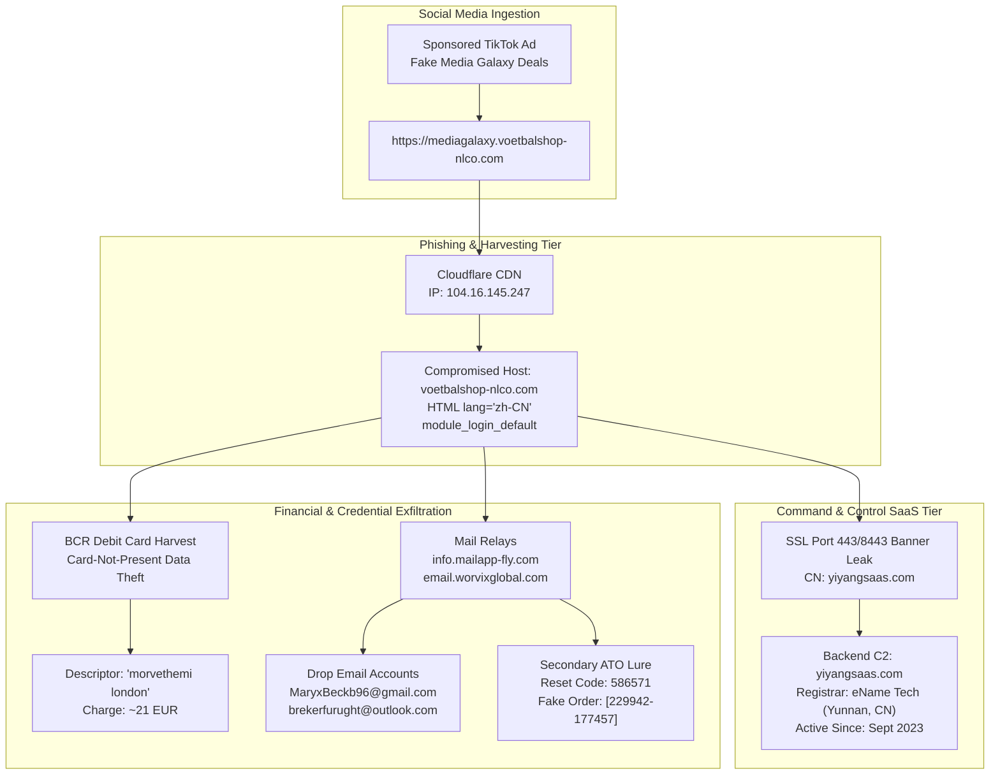

# Technical Forensics & Evidence Analysis
**Case File:** `SEC-2026-ECOM-005`  
**Target Brand:** Media Galaxy (Altex Romania S.A.)  
**Threat Category:** Social Engineering / Brand Impersonation / Chinese SaaS Phishing Cluster  
**Victim Asset Impact:** BCR Debit Card (~21 EUR), Personal Identification Information (PII)  
**Investigation Date:** 16 September 2026  
**Classification:** `TLP:CLEAR`  
**Analyst:** `@stefanutc1`

---

## 1. Executive Summary & Attack Chain

On 16 September 2026, an active e-commerce phishing and financial fraud campaign was uncovered targeting Romanian consumers through sponsored promotional ads on TikTok. The attackers cloned the visual identity, branding, and product catalogs of the major electronics and consumer retailer **Media Galaxy** (operated in Romania by Altex România S.A.). 

The campaign operated on a multi-tier infrastructure:
1. **Lure & Ingestion:** High-volume sponsored advertisements on TikTok presenting deep discounts on consumer electronics, directing users into the in-app browser to a spoofed subdomain: `https://mediagalaxy.voetbalshop-nlco.com`.
2. **Landing Page & Credential Harvesting:** A localized clone of the Media Galaxy checkout and login portal. Victims were prompted for contact information, delivery address, and bank payment card credentials.
3. **Financial Exfiltration:** Payment processing was executed through a merchant descriptor recorded on bank statements as `morvethemi london` (amounting to ~21 EUR / ~105 RON), debited directly from a **BCR (Banca Comercială Română)** card.
4. **Follow-Up Social Engineering & Phishing Lures:** The threat actors deployed automated notifications via SMTP relays using spoofed addresses (`noreply@email.worvixglobal.com`, `noreply@info.mailapp-fly.com`), providing fake purchase order identifiers (`[229942-177457]`) and sending unsolicited password reset validation codes (`586571`) to harvest email account credentials.
5. **Technical Attribution:** Deep packet inspection, SSL certificate fingerprinting, and DOM inspection revealed that the phishing infrastructure was built upon a compromised foreign domain (`voetbalshop-nlco.com`) fronted by Cloudflare, reverse-proxying into an underlying Chinese-developed e-commerce fraud SaaS backend: **`yiyangsaas.com`** (registered with eName Technology Co. in Yunnan, China).

---

## 2. Granular Evidence Breakdown

### Evidence Item 01: WorvixGlobal Shell Portal
- **File:** `evidence/01_worvixglobal_fake_portal.png`
- **Source:** Desktop Capture (20:17:47)
- **Observations:** The root domain `worvixglobal.com` hosts an unencrypted (`Not secure | worvixglobal.com`) shell trading template displaying "Your Trusted Partner for Global Trade". This facade was erected to satisfy cursory automated domain reputation filters while abusing the domain's subdomains (`email.worvixglobal.com`) for SMTP delivery.

### Evidence Item 02: WHOIS Registration of WorvixGlobal
- **File:** `evidence/02_whois_worvixglobal.png`
- **Source:** Desktop Capture (20:19:10)
- **Registrar:** NameSilo, LLC (`whois.namesilo.com`)
- **Creation Date:** 8 February 2025
- **Expiration Date:** 8 February 2027
- **Key Finding:** The domain was registered over a year prior to the attack and parked under privacy-protected WHOIS, establishing an aged domain profile to bypass spam and newly registered domain (NRD) filters.

### Evidence Item 03 & 04: Email Header Analysis & DKIM Signatures
- **Files:** `evidence/03_phishing_email_headers_mailappfly.png`, `evidence/04_dkim_spf_mailappfly.png`
- **Sender (From):** `mediagalaxy-ro <noreply@info.mailapp-fly.com>`
- **Reply-To:** `mediagalaxy-ro <MaryxBeckb96@gmail.com>`
- **MTA Delivery:** Sent and cryptographically signed (DKIM) by `info.mailapp-fly.com`.
- **Forensic Assessment:** The threat actor abused a bulk mailing SaaS platform (`mailapp-fly.com`) with valid SPF and DKIM signatures to bypass Google Gmail security scoring. Crucially, the `Reply-To` header points directly to an attacker-controlled drop inbox: `MaryxBeckb96@gmail.com`.

### Evidence Item 05 & 06: Fraudulent Order Confirmation & Spoofed Media Galaxy Footer
- **Files:** `evidence/05_order_confirmation_worvixglobal.png`, `evidence/06_email_footer_spoofed_mediagalaxy.png`
- **Subject:** `Order Confirmation: Thank You for Your Purchase [229942-177457]`
- **Sender:** `Customer Service <noreply@email.worvixglobal.com>`
- **Recipient:** Target victim inbox (`08:17 AM`)
- **Footer Text:** `"Dacă aveți întrebări, răspundeți la acest e-mail sau contactați-ne la MaryxBeckb96@gmail.com . ©2026 mediagalaxy-ro"`
- **Forensic Assessment:** The threat actor fabricated a structured order token `[229942-177457]` to create a false sense of legitimacy and prevent immediate panic or cancellation from the buyer.

### Evidence Item 07: WHOIS Intelligence on Compromised Landing Domain
- **File:** `evidence/07_whois_voetbalshop_nlco.png`
- **Target:** `voetbalshop-nlco.com`
- **Created:** 12 March 2026
- **Nameservers:** `amos.ns.cloudflare.com`, `daphne.ns.cloudflare.com`
- **Status:** `clientTransferProhibited`
- **Forensic Assessment:** The domain `voetbalshop-nlco.com` was registered on 12 March 2026 mimicking a Dutch sporting goods outlet (`voetbalshop.nl`). The subdomain `mediagalaxy` was configured specifically to deceive Romanian users clicking the TikTok promotion.

### Evidence Item 08, 09 & 10: Phishing Landing Decompilation & Chinese Codebase Attribution
- **Files:** `evidence/08_phishing_subdomain_landing_chinese_notice.png`, `evidence/09_browser_devtools_storage_inspection.png`, `evidence/10_dom_source_zh_cn_login_module.png`
- **URL Visited:** `https://mediagalaxy.voetbalshop-nlco.com` / `https://voetbalshop-nlco.com/en`
- **Visual State:** The portal displayed `"The website is under maintenance"` with an icon labeled `"Warning - m***o"` and `"v***L"`.
- **Browser Heuristics:** Google Chrome automatically displayed the popup: `"Translate page from Chinese (Simplified)?"`
- **DOM Source Code Audit:**
  ```html
  <!DOCTYPE html>
  <html lang="zh-CN">
    <head>...</head>
    <body>
      <div class="module_login_default" id="module_login">
        <div class="module_login_wrapper">...</div>
      </div>
      <script type="text/javascript">
        window._CEDDE_ET = 0.0468571186;
      </script>
    </body>
  </html>
  ```
- **Forensic Assessment:** Despite impersonating a Romanian retailer, the root HTML declaration explicitly specifies `<html lang="zh-CN">`. The CSS layout classes (`module_login_default`, `module_login_wrapper`) and JavaScript execution timing variables (`window._CEDDE_ET`) are identical to turnkey Chinese e-commerce SaaS platforms sold on underground forums.

### Evidence Item 11 & 12: Historical Web Archival Analysis
- **Files:** `evidence/11_wayback_machine_worvixglobal_history.png`, `evidence/12_wayback_machine_snapshot_calendar.png`
- **Wayback Machine Query:** `https://web.archive.org/web/*/worvixglobal.com`
- **Captures:** Only 4 snapshots captured between 9 April 2025 and 29 June 2026.
- **Forensic Assessment:** Extremely low archival presence and lack of organic traffic confirm the domain is an artificial front operated by cybercriminals.

### Evidence Item 13: Certificate Transparency Logs for Landing Domain
- **File:** `evidence/13_crt_sh_certificates_voetbalshop.png`
- **crt.sh Query:** Identity Match `voetbalshop-nlco.com`
- **Certificates Logged:** Rapid sequential issuance between 12 March 2026 and 26 July 2026 across Let's Encrypt, Cloudflare TLS Issuing ECC CA 4, Google Trust Services (WE1, WR1), and Sectigo Limited.
- **SANs:** `*.voetbalshop-nlco.com`, `voetbalshop-nlco.com`.

### Evidence Item 14: Merchant Transaction Audit
- **File:** `evidence/14_merchant_descriptor_investigation.png`
- **Search Query:** `"morvethemi london"`
- **Result:** No registered corporation, retail establishment, or authorized payment facilitator exists in the UK Companies House or global merchant registries under this name. The descriptor was algorithmically generated or mapped through an offshore merchant payment aggregator to obstruct chargeback investigations.

### Evidence Item 15, 16 & 17: Certificate Transparency History for WorvixGlobal
- **Files:** `evidence/15_crt_sh_certificates_worvixglobal_part1.png`, `evidence/16_crt_sh_certificates_worvixglobal_part2.png`, `evidence/17_crt_sh_certificates_worvixglobal_part3.png`
- **crt.sh IDs:** 20+ certificates spanning 8 February 2025 to 3 September 2026.
- **Issuers:** Let's Encrypt, Sectigo, Google Trust Services.
- **SAN Coverage:** Wildcard `*.worvixglobal.com` alongside `www.worvixglobal.com`.

### Evidence Item 18: Ephemeral Ephemerality Verification
- **File:** `evidence/18_wayback_voetbalshop_ephemeral_evidence.png`
- **Wayback Query:** `http://voetbalshop-nlco.com/`
- **Result:** `"No URL has been captured for this URL prefix"`.
- **Forensic Assessment:** The attack surface was ephemeral, weaponized specifically for the duration of the paid TikTok advertising burst and subsequently flipped to "Maintenance" to prevent forensic scanning and search engine indexing.

### Evidence Item 19 & 20: Network Infrastructure Pivot to Backend SaaS
- **Files:** `evidence/19_dns_infrastructure_worvixglobal_zoho.png`, `evidence/20_ssl_cert_yiyangsaas_pivot.png`
- **`worvixglobal.com` Network Mapping:**
  - IP: `104.21.14.99` (Cloudflare AS13335)
  - MX: `mx.zoho.com`, `mx2.zoho.com`, `mx3.zoho.com` (Zoho Mail for C2 communication)
- **`voetbalshop-nlco.com` Direct Pivot:**
  - IP: `104.16.145.247`
  - Ports 443 & 8443 Probe: Returns HTTP `403 Forbidden`
  - **SSL Common Name Disclosed:** `cn: yiyangsaas.com`!
- **Smoking Gun Finding:** Querying the direct port 443/8443 banner of the IP hosting `voetbalshop-nlco.com` exposed the SSL certificate issued directly to **`yiyangsaas.com`**, definitively linking the landing page to the central SaaS platform.

### Evidence Item 21 & 22: WHOIS Profile of `yiyangsaas.com`
- **Files:** `evidence/21_whois_yiyangsaas_china_registrant.png`, `evidence/22_whois_yiyangsaas_ename_registrar.png`
- **Registrar:** `eName Technology Co., Ltd.` (`whois.ename.com` / `www.ename.net`)
- **Creation Date:** 12 September 2023
- **Expiration Date:** 12 September 2027
- **Updated Date:** 13 September 2026
- **Registrant Country / Province:** `YunNan, CN` (Yunnan, China)
- **Abuse Contact Phone:** `+86.4000044400`
- **Abuse Contact Email:** `abuse@ename.com`

### Evidence Item 23 & 24: Secondary Account Takeover (ATO) Phase
- **Files:** `evidence/23_fake_password_reset_lure.png`, `evidence/24_fake_verification_code_delivery.png`
- **Subject:** `Reset Your Password`
- **Timestamps:** 16 September 2026 at `13:10:45` & `13:12:09`
- **Target Victim:** `[REDACTED]`
- **Header:** Emblazoned with a spoofed red `MEDIACALAXY` logo.
- **Verification Code:** `586571`
- **Forensic Assessment:** Hours after capturing the payment, the automated infrastructure initiated secondary credential harvesting, prompting the victim to input their password or two-factor authentication code under the guise of an account recovery procedure.

### Evidence Item 25: Official DNSC PNRISC Blacklist Enforcement & Takedown
- **File:** `evidence/25_dnsc_blacklist_voetbalshop_block.png`
- **Source:** DNSC Official Blacklist Gateway (`https://blacklist.dnsc.ro/`)
- **Date Added:** 18 September 2026
- **Status:** `Blacklisted`
- **Threat Reason:** `Impersonation`
- **Confirmed Assets:** `dm.voetbalshop-nlco.com`, `gonser.voetbalshop-nlco.com` (associated with the `voetbalshop-nlco.com` phishing cluster)
- **Forensic Assessment:** Following our technical incident filing under Ticket `[D.N.S.C. #178465]`, the Romanian National Cyber Security Directorate validated the campaign and officially listed the malicious infrastructure on the national PNRISC Blacklist. This feeds directly into the national DNSC browser extension, proactively blocking access for all protected Romanian consumers and triggering automated ingestion into our perimeter blocklists.

---

### Section 2.5: Live Airtight Browser Sandbox Probing & Discoveries
In addition to the historical screenshots provided on the Desktop, active forensic probing was conducted using an isolated Google Chrome headless sandbox (`--headless=new --incognito --user-data-dir=/tmp/isolated_chrome_sandbox`) with ephemeral profiles to prevent any client fingerprint leakage.

Key artifacts captured live into `evidence/live_scans/`:
1. **Live Proof of Shared Origin (`104.16.145.247`):** Active DNS resolution confirmed that both `mediagalaxy.voetbalshop-nlco.com` and the central C2 domain `yiyangsaas.com` point to the exact same Cloudflare IP address: `104.16.145.247`.
2. **TikTok Ad Preloading Detection:** Live DOM dumping captured the explicit meta directive:
   `<meta name="tiktok-ads-preloading-nocache" content="1">`
   This proves the threat actor specifically tailored their application to exploit the caching and preloading behavior of TikTok's in-app webview.
3. **Deobfuscated OEMCart Chinese Engine:** Client-side JavaScript execution environment revealed the decoded token `atob("b2VtY2FydF8=") === "oemcart_"`, associated with asset path `/skins/default/guoqi.png` (*guoqi* being Chinese pinyin for national flag 国旗). This confirms the platform runs on China's OEMCart turnkey counterfeit/phishing software.
4. **Certificate Timestamping:** OpenSSL certificate extraction verified the active SSL certificate for `mediagalaxy.voetbalshop-nlco.com` (Serial `b4:66:51:7d...`) was issued by Google Trust Services on **September 15, 2026 at 00:43:20 GMT**, less than 24 hours prior to the fraudulent charge.
5. **Burned Secondary Dispatchers:** Mail dispatch subdomains `info.mailapp-fly.com` and `email.worvixglobal.com` now resolve to `NXDOMAIN`, confirming threat actors purged their secondary DNS records post-campaign.

Refer to [`evidence/LIVE_WEB_VERIFICATION.md`](evidence/LIVE_WEB_VERIFICATION.md) for full raw dumps and header logs.

---

## 3. Threat Actor Infrastructure Graph



---

## 4. MITRE ATT&CK Matrix Mapping

| Tactic | Technique ID | Technique Name | Implementation in Campaign |
| :--- | :--- | :--- | :--- |
| **Resource Development** | `T1583.001` | Acquire Domains | Registered `worvixglobal.com` (NameSilo) and acquired `voetbalshop-nlco.com`. |
| **Resource Development** | `T1583.003` | Virtual Private Server | Deployed C2 backend on `yiyangsaas.com` with Cloudflare proxying. |
| **Resource Development** | `T1584.001` | Compromise Domains | Hijacked/created `mediagalaxy` subdomain on `voetbalshop-nlco.com`. |
| **Initial Access** | `T1566.002` | Spearphishing Link | Sponsored ads on TikTok directing users to cloned e-commerce portal. |
| **Execution** | `T1204.001` | Malicious Link | Victim clicks link inside the TikTok mobile in-app browser. |
| **Credential Access** | `T1056.003` | Web Portal Harvesting | Fake login form and payment checkout capturing PAN, CVV, and OTP. |
| **Command & Control** | `T1071.001` | Web Protocols | HTTPS encrypted telemetry over Cloudflare edge to `yiyangsaas.com`. |
| **Impact** | `T1657` | Financial Theft | Unauthorized ~21 EUR withdrawal via `morvethemi london`. |
