# Incident Analysis: E-Commerce Brand Spoofing & Phishing Campaign (Media Galaxy)
**Case File Reference:** `SEC-2026-ECOM-005`  
**Classification:** `TLP:CLEAR`  
**Investigation Date:** 16 September 2026  
**Primary Analyst:** `@stefanutc1`  

[](#)
[](#)
[](#)

---

## 1. Project Overview

This repository contains the complete forensic investigation, evidence analysis, Indicators of Compromise (IoCs), Incident Response (IR) playbooks, and perimeter defense configurations for an e-commerce fraud campaign uncovered in September 2026. 

The threat actors impersonated the Romanian retail giant **Media Galaxy** via sponsored TikTok advertisements, driving traffic to a deceptive sub-domain (`mediagalaxy.voetbalshop-nlco.com`) running a Chinese-engineered phishing SaaS kit (`yiyangsaas.com`). The campaign fraudulently charged ~21 EUR to a BCR (Banca Comercială Română) debit card and subsequently launched secondary account takeover lures.

```text
/incident-analysis-rep/
├── README.md                          # Comprehensive project overview, execution guide, and timeline
├── EVIDENCE_ANALYSIS.md               # Detailed breakdown of OSINT findings and IOC correlation
├── /disclosures/                      # Official incident notifications, CSIRT filings & disclosure dossiers
│   ├── README.md                      # Catalog of all communications & reports
│   ├── BCR_CHARGEBACK_FRAUD_DISCLOSURE.md # First-person chargeback dispute statement for BCR (RO / EN)
│   ├── MEDIA_GALAXY_DISCLOSURE.md     # Brand abuse notice to Media Galaxy / Altex (RO / EN)
│   ├── DNSC_INCIDENT_NOTIFICATION.md  # Official CSIRT incident notification to DNSC (RO / EN)
│   ├── DNSC_RESPONSE_178465.md        # Official CSIRT resolution & response from DNSC [Ticket #178465] (RO / EN)
│   ├── CIPRIAN_LOSPA_PROPOSAL.md      # YouTube investigative proposal to Ciprian Lospa (RO / EN)
│   ├── GOOGLE_SAFE_BROWSING_REPORT.md # Malicious URL & phishing submission to Google
│   └── CLOUDFLARE_ABUSE_REPORT.md     # Infrastructure abuse report to Cloudflare (yiyangsaas.com)
├── /evidence/                         # 25 raw and cataloged evidence screenshots (including DNSC PNRISC block)
├── /ioc/
│   ├── indicators.csv                 # Structured CSV listing all extracted IoCs
│   ├── domains.txt                    # Plaintext list of domains ready for Unbound DNS
│   └── suricata_rules.rules           # Custom Suricata IDS/IPS detection rules
├── /reports/
│   ├── generate_report.py             # Python script using ReportLab to build the PDF report
│   └── cybersecurity_report_final.pdf # Executive PDF incident report
├── /playbooks/
│   └── ir_playbook.md                 # Incident Response playbook for financial fraud & chargebacks
├── /configs/
│   └── opnsense_blocklist_guide.md    # Gateway (192.168.1.1) integration runbook
├── forbidden_domains.txt              # Synchronized master forbidden domain list (DNSC, EU, Five Eyes, Local)
├── lista_interzisa.txt                # Romanian naming mirror for network sinkholing
├── dnsc_blacklist.json                # Structured DNSC PNRISC blacklist database
├── csirt_telemetry.json               # Multi-national CSIRT telemetry & jurisdictional breakdown
└── csirt_cache.json                   # Resilient fallback cache for upstream threat feeds
```

---

## 2. Attack Lifecycle & Incident Response Action Timeline

### 2.1 Technical Attack Kill Chain (Sequence Diagram)

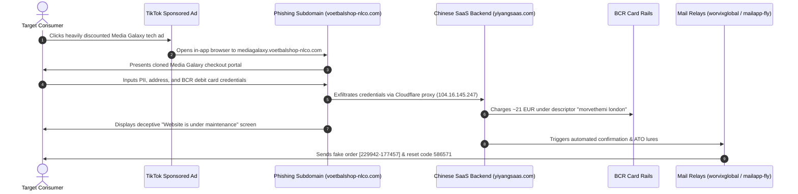

---

### 2.2 Incident Response Action Lifecycle & Forensic Audit Trail

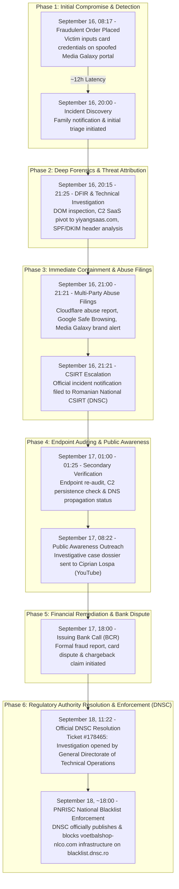

| Timestamp | Incident Lifecycle Phase | Target Entity / Channel | Forensic Action & Milestone |
| :---: | :--- | :--- | :--- |
| **September 16, 08:17** | **Initial Compromise** | Phishing Subdomain (`voetbalshop-nlco.com`) | Victim interacts with TikTok sponsored lure, completes fake checkout; ~21 EUR charged under descriptor `morvethemi london`. |
| **September 16, 20:00** | **Discovery & Triage** | Family Incident Alert | Unauthorized charge & order confirmation detected; emergency response procedure triggered. |
| **September 16, 20:15 - 21:25** | **Deep DFIR Investigation** | DOM, C2 Infrastructure, Mail Relays | Reverse engineered client-side DOM (`zh-CN` tag), pivoted C2 reverse-proxy to `yiyangsaas.com` (Yunnan, China), extracted raw MBOX/DKIM/SPF headers from `worvixglobal.com`. |
| **September 16, 21:00 - 21:21** | **Infrastructure Abuse Filings** | Cloudflare, Google Safe Browsing, Media Galaxy | Dispatched C2 abuse reports to Cloudflare (`104.16.145.247`), filed Google malicious URL blacklist, notified Altex/Media Galaxy legal & security teams. |
| **September 16, 21:21** | **CSIRT Notification** | Romanian National CSIRT ([DNSC](https://dnsc.ro)) | Dispatched formal CSIRT incident notification with technical IoCs and evidence package to `alerte@dnsc.ro`. |
| **September 17, 01:00 - 01:25** | **Secondary Endpoint Audit** | Threat Infrastructure & Subdomains | Second-wave verification of endpoint responsiveness, C2 persistence, IP redirection, and DNS propagation. |
| **September 17, 08:22** | **Public Awareness Outreach** | Ciprian Lospa (YouTube Cyber Investigator) | Submitted complete investigative pitch and technical forensic dossier for public awareness on scam mechanics. |
| **September 17, 18:00** | **Financial Chargeback Dispute** | BCR (Banca Comercială Română) Support | Contacted bank customer service, reported cyber fraud, and opened formal transaction dispute / chargeback case. |
| **September 18, 11:22** | **Authority Response** | Romanian National CSIRT ([DNSC](https://dnsc.ro)) | Official ticket response received under `[D.N.S.C. #178465]`: formal investigation launched, reported domain evaluated for inclusion in the national PNRISC Blacklist (`https://blacklist.dnsc.ro/`). |
| **September 18, ~18:00** | **National Blacklist Enforcement** | DNSC PNRISC Blacklist Gateway (`https://blacklist.dnsc.ro/`) | **CONFIRMED & ENFORCED**: DNSC officially lists and blocks the `voetbalshop-nlco.com` threat infrastructure (`dm.voetbalshop-nlco.com`, `gonser.voetbalshop-nlco.com`) under classification **Impersonation**; threat pushed live to national browser extension database and our automated CI/CD blocklist. |

---

## 3. Quick Start & Execution

### Generating the Executive PDF Report
```bash
# Set up virtual environment and install ReportLab
python3 -m venv .venv
source .venv/bin/activate
pip install reportlab

# Generate the PDF report
python3 reports/generate_report.py
```
The output file `reports/cybersecurity_report_final.pdf` will be compiled immediately.

### Deploying Network Blocklists to OPNsense (`192.168.1.1`)
```bash
# Inspect plain domain list
cat ioc/domains.txt

# Integrate directly into Unbound DNS Blocklist or Pi-hole
# Follow the complete step-by-step instructions in configs/opnsense_blocklist_guide.md
```

### Reviewing the Chargeback Playbook
For victims or fraud handlers filing chargeback claims with BCR or issuing banks, refer to:
[playbooks/ir_playbook.md](playbooks/ir_playbook.md)

---

## 4. Key Indicators of Compromise (IoCs)

- **Phishing FQDN:** `mediagalaxy.voetbalshop-nlco.com`
- **Compromised Base Domain:** `voetbalshop-nlco.com`
- **DNSC PNRISC Blacklisted Subdomains:** `dm.voetbalshop-nlco.com`, `gonser.voetbalshop-nlco.com` *(Added September 18, 2026 under 'Impersonation')*
- **Backend C2 SaaS:** `yiyangsaas.com` (Yunnan, China)
- **Email Infrastructure:** `worvixglobal.com`, `email.worvixglobal.com`, `mailapp-fly.com`, `info.mailapp-fly.com`
- **Attacker Drop Inboxes:** `MaryxBeckb96@gmail.com`, `brekerfurught@outlook.com`
- **Bank Charge Descriptor:** `morvethemi london`
- **Fraud Order ID:** `[229942-177457]`
- **Phishing OTP Lure:** `586571`

---

## 5. Defense-in-Depth Homelab Correlation

This incident analysis feeds directly into the homelab's central security architecture:
- **OPNsense Gateway (`192.168.1.1`):** Unbound DNS sinkholing and Suricata IDS alerts.
- **Wazuh SIEM (Proxmox LXC 150):** Log ingestion and alert correlation on endpoint mail and DNS requests.
- **Documentation Platform:** Published in the [Homelab Datacenter Architecture](https://github.com/stefanutc1/infrastructure).

---

## 6. Official Disclosures & Investigation Communications

All external incident notifications, abuse filings, and public advocacy disclosures are tracked in the [`disclosures/`](disclosures/) directory:

- **BCR Chargeback Dispute & Fraud Statement ([RO / EN](disclosures/BCR_CHARGEBACK_FRAUD_DISCLOSURE.md)):** First-person script for phone/branch reporting to BCR to initiate the chargeback dispute and obtain a claim number.
- **Media Galaxy Official Brand Disclosure ([RO / EN](disclosures/MEDIA_GALAXY_DISCLOSURE.md)):** Notification to Altex/Media Galaxy legal and security teams.
- **DNSC Incident Notification ([RO / EN](disclosures/DNSC_INCIDENT_NOTIFICATION.md)):** Formal filing to the Romanian National Cyber Security Directorate.
- **DNSC Official Response & Resolution ([RO / EN](disclosures/DNSC_RESPONSE_178465.md)):** Official response under Ticket `[D.N.S.C. #178465]` confirming active investigation, followed by immediate publication and enforcement on the national PNRISC Blacklist (`https://blacklist.dnsc.ro/`).
- **Ciprian Lospa Investigation Pitch ([RO / EN](disclosures/CIPRIAN_LOSPA_PROPOSAL.md)):** Public awareness and YouTube case study pitch.
- **Google Safe Browsing Report ([EN](disclosures/GOOGLE_SAFE_BROWSING_REPORT.md)):** Domain blacklisting request for `mediagalaxy.voetbalshop-nlco.com`.
- **Cloudflare Abuse Report ([EN](disclosures/CLOUDFLARE_ABUSE_REPORT.md)):** Infrastructure takedown request targeting `yiyangsaas.com`.

---

## 7. Visual Forensic Evidence Gallery

Below is the complete photographic and forensic dossier documenting the anatomy of this e-commerce phishing campaign across its entire lifecycle:

### Phase 1: Lure Ingestion & Brand Impersonation
| Sponsored TikTok Campaign | Cloned Media Galaxy Subdomain |
| :---: | :---: |
|  | 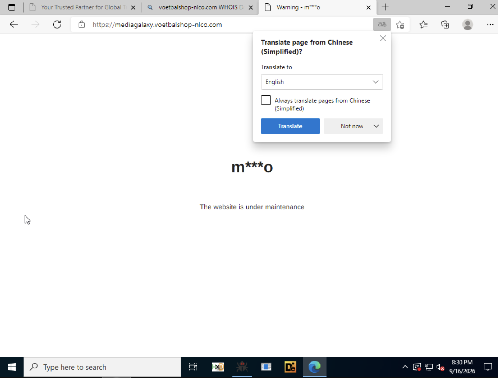 |
| *Deceptive sponsored ad offering 4 RON detergent* | *Subdomain `mediagalaxy.voetbalshop-nlco.com` displaying fake maintenance screen* |

---

### Phase 2: Technical Fingerprinting & Chinese SaaS Telemetry
| Browser DevTools & Storage Inspection | DOM Source Code (`zh-CN` Language Tag) |
| :---: | :---: |
| 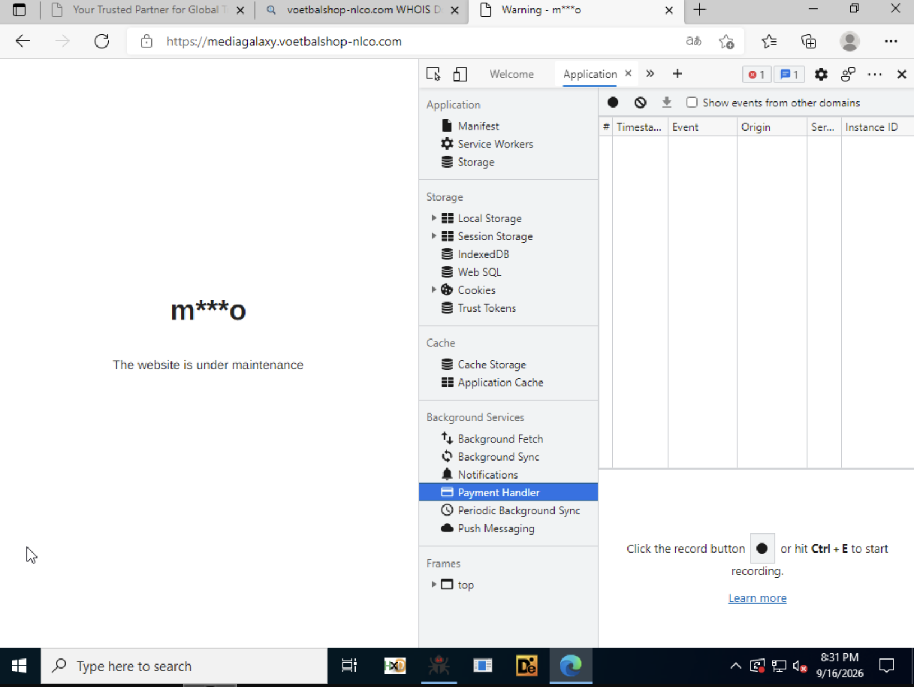 | 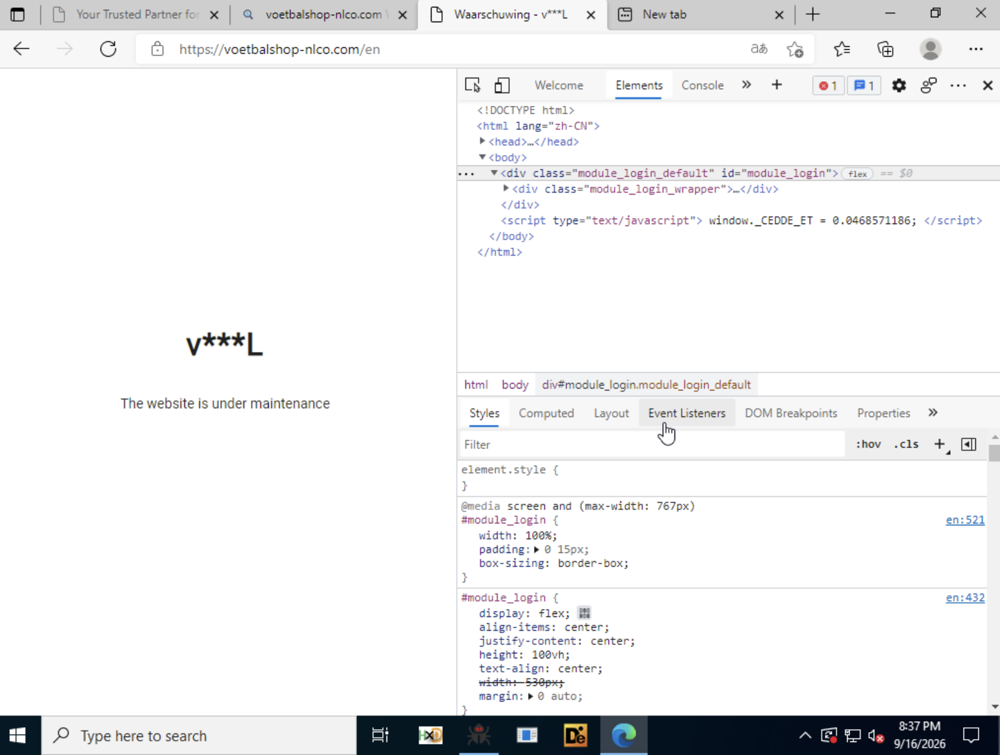 |
| *Inspection of session tokens, tracking cookies & telemetry* | *Source code revealing Chinese SaaS frontend boilerplate and login modules* |

---

### Phase 3: Fraudulent Order Confirmation & Spoofed Communications
| Phishing Email Confirmation | Spoofed Media Galaxy Footer |
| :---: | :---: |
| 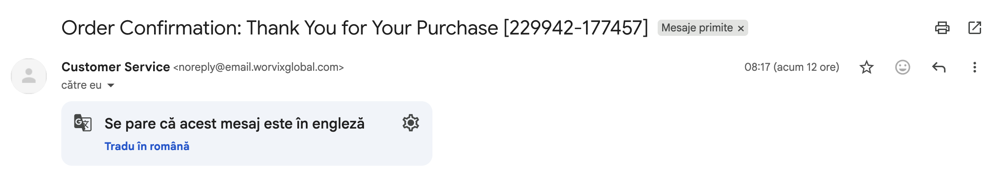 | 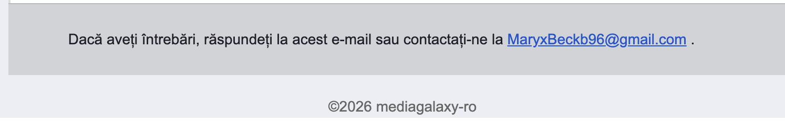 |
| *Order `[229942-177457]` generated by `noreply@email.worvixglobal.com`* | *Counterfeit copyright footer pointing to drop inbox `MaryxBeckb96@gmail.com`* |

| DKIM & SPF Cryptographic Headers | Phishing Relay Mail Routing |
| :---: | :---: |
| 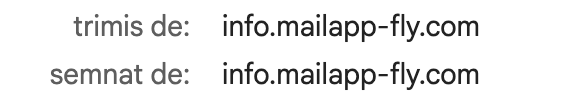 | 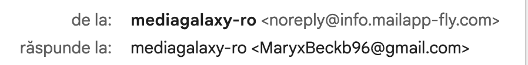 |
| *Cryptographic signatures passing Gmail filters via `mailapp-fly.com`* | *MTA delivery trace showing relay through bulk mailing services* |

---

### Phase 4: Financial Exfiltration & Secondary Lures
| Bank Statement & Merchant Descriptor | Secondary Password Reset / Verification Lure |
| :---: | :---: |
| 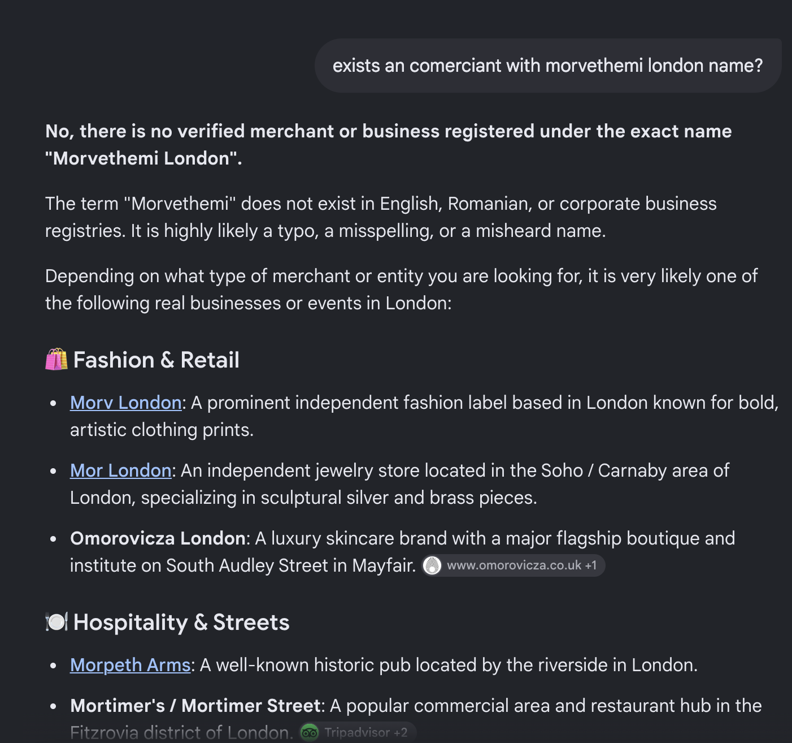 | 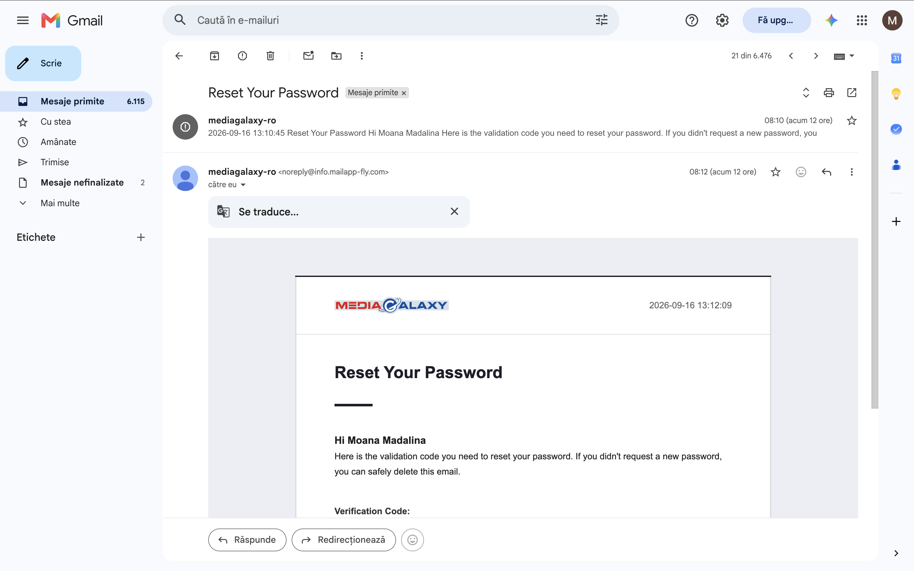 |
| *BCR statement charge of ~21 EUR under `morvethemi london`* | *Follow-up email attempting secondary account takeover with code `586571`* |

---

### Phase 5: OSINT, Certificate Pivoting & Threat Actor Attribution
| WorvixGlobal Facade Shell | WHOIS Records (NameSilo Parked Domain) |
| :---: | :---: |
| 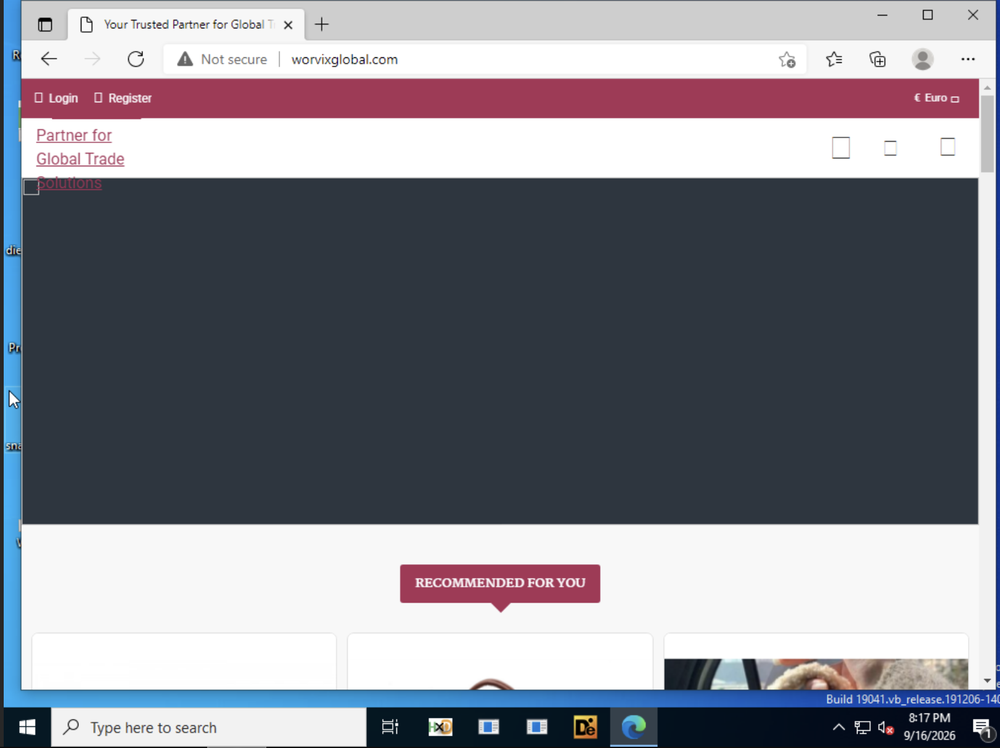 | 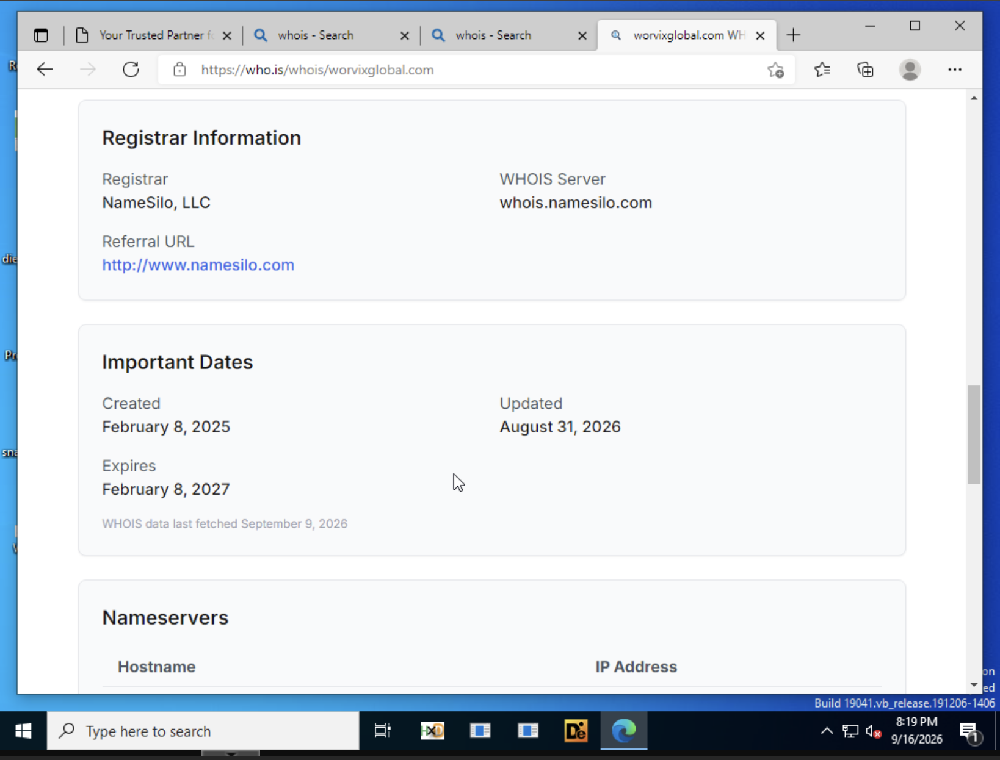 |
| *Unencrypted shell website erected to evade automated reputation filters* | *Aged domain registration (08.02.2025) used for phishing SMTP relays* |

| SSL Certificate Transparency (crt.sh) | Cloudflare Reverse-Proxy Pivot to Backend |
| :---: | :---: |
| 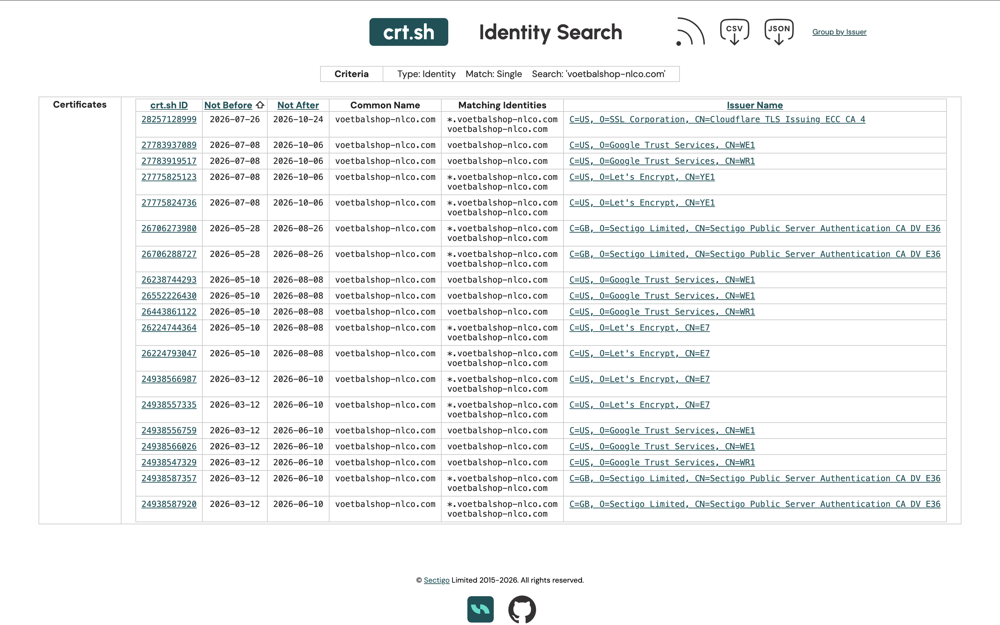 | 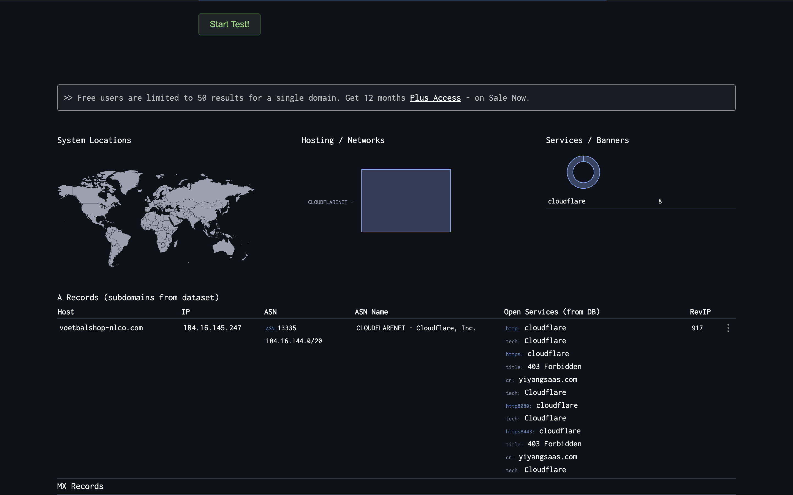 |
| *Subdomain generation pattern on hijacked Dutch domain* | *SSL SAN inspection revealing link to backend `yiyangsaas.com`* |

| WHOIS Attribution: Yunnan, China | Registrar Profile: eName Technology |
| :---: | :---: |
| 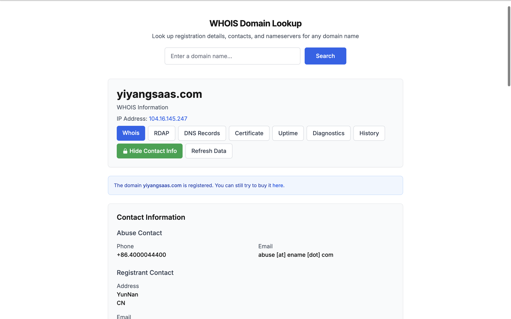 | 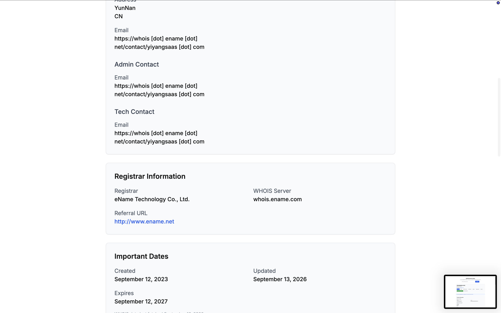 |
| *Attribution of `yiyangsaas.com` to threat actors in Yunnan, China* | *Domain registered via eName Technology Co. on 12.09.2023* |

---

### Phase 6: Regulatory Authority Resolution & National PNRISC Blacklisting
| DNSC Official PNRISC Blacklist Confirmation |
| :---: |
| 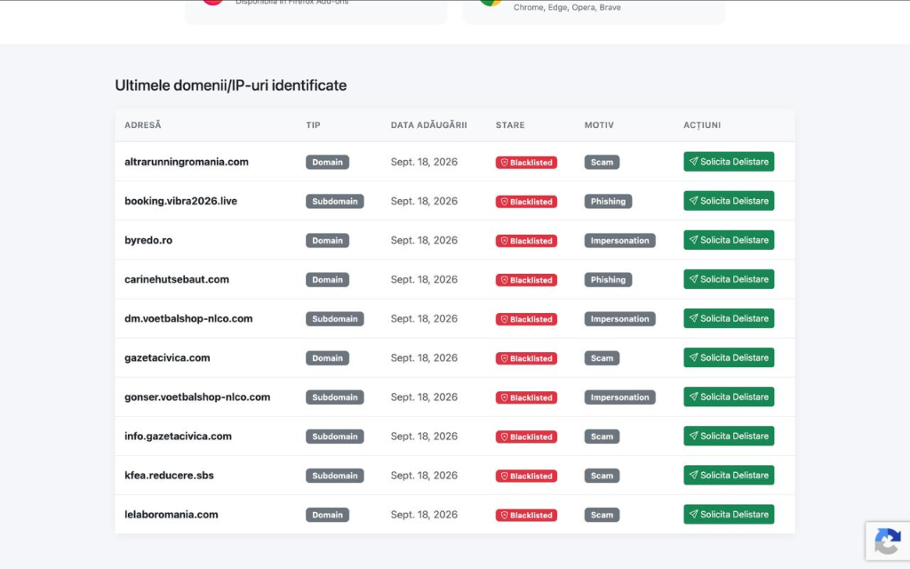 |
| *Official DNSC Blacklist Gateway (`https://blacklist.dnsc.ro/`) confirming `dm.voetbalshop-nlco.com` & `gonser.voetbalshop-nlco.com` published and blacklisted under Impersonation* |

---

### Phase 7: Cross-Platform Campaign Link (Facebook Sponsored Ad Lure & Banking Fraud)
| Facebook Sponsored Ad Lure: Philips LatteGO 4300 (51 lei) | Facebook Victim Transaction: Dreamwardrobe.online (-49.72 RON) |
| :---: | :---: |
| 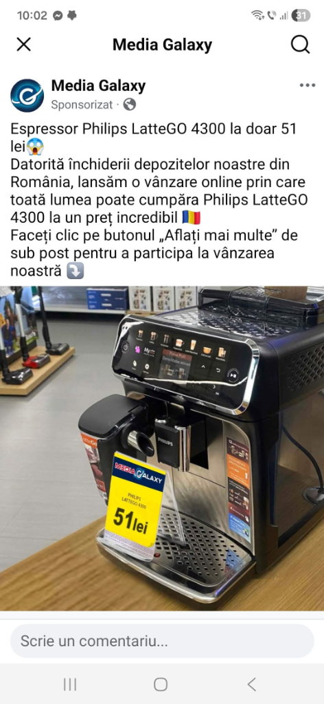 | 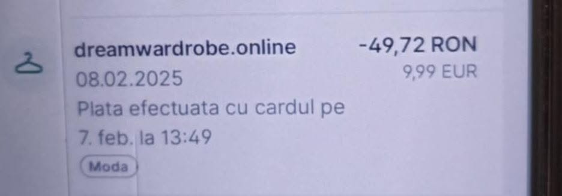 |
| *Deceptive sponsored ad in Facebook feed impersonating Media Galaxy with a fake warehouse closure pretext ("închiderea depozitelor noastre din România"), advertising a Philips LatteGO 4300 for only 51 lei (~10 EUR) with a spoofed yellow shelf price tag and "Aflați mai multe" CTA.* | *Victim lured on Facebook by the coffee machine clearance ad, resulting in an unauthorized payment debited as `dreamwardrobe.online` (-49.72 RON / 9.99 EUR) on 07/08.02.2025 — the exact calendar date on which campaign domain `worvixglobal.com` was created.* |

---


## 8. Practical Security Guidelines: What to Do & What NOT to Do (DOs and DON'Ts)

These recommendations are designed for consumers and victims of e-commerce phishing schemes, as well as security practitioners, incident responders, and their families.

### WHAT TO DO (DOs) - Immediate Protective Actions

| Recommended Action | Detailed Instructions & Practical Procedure |
| :--- | :--- |
| **1. Immediately freeze and replace the compromised card** | Open your banking application immediately (George BCR, BT Pay, etc.). **Freeze the compromised card immediately** in the mobile banking app and request an emergency card cancellation and reissuance to prevent future recurring unauthorized charges. |
| **2. Initiate an official Chargeback dispute with your bank** | Contact your card-issuing bank or visit a physical branch immediately. Explicitly request the opening of a **Chargeback / Payment Dispute claim** on grounds of commercial and cyber fraud (utilize the structured statement provided in [`BCR_CHARGEBACK_FRAUD_DISCLOSURE.md`](disclosures/BCR_CHARGEBACK_FRAUD_DISCLOSURE.md)). Always obtain an official **case/incident tracking number**. |
| **3. Always inspect the address bar and domain (FQDN)** | Before entering any payment or identity credentials, scrutinize the browser's address bar. The only legitimate Romanian domains for this brand are **`mediagalaxy.ro`** and **`altex.ro`**. Any nested subdomain or non-official TLD (e.g., `mediagalaxy.voetbalshop-nlco.com`, `mediagalaxy-promo.cc`) represents a **100% fraudulent phishing operation**. |
| **4. Rotate compromised credentials & enforce strong 2FA** | If the password entered on the counterfeit site is shared with your email account or other digital services, **change it immediately**. Enforce app-based multi-factor authentication (**MFA/2FA** using Google Authenticator, Bitwarden, or YubiKey); avoid insecure SMS-based verification codes. |
| **5. Preserve forensic artifacts & evidence** | Do not delete confirmation emails or purge browser cache/history. Capture full-page screenshots of the advertisements, banking transaction records, and export raw RFC 822 email source headers (including SPF, DKIM, and DMARC verification headers) for law enforcement submission. |
| **6. Report the incident to National CSIRTs and Law Enforcement** | Submit the technical indicators and details to your national cybersecurity agency (e.g., the Romanian National Cyber Security Directorate at [dnsc.ro](https://dnsc.ro) / `alerte@dnsc.ro`) and file a formal cybercrime report with local police authorities (Cybercrime Investigation Division). |

---

### WHAT NOT TO DO (DON'Ts) - Critical Mistakes to Avoid

| Common Critical Mistake | Threat Rationale & Why It Is Hazardous |
| :--- | :--- |
| **DO NOT click "Unsubscribe" links in suspicious emails** | The unsubscribe link in a phishing email does not remove your address. Instead, it confirms to threat actors that your inbox is **active and responsive**, and may trigger drive-by malware downloads or payload drops (info-stealers). |
| **DO NOT input secondary verification codes (OTP / SMS)** | If you receive SMS messages or emails containing security codes (such as the observed `586571` OTP), **never enter them on any web form** and do not disclose them to anyone. Attackers often use these out-of-band codes to initiate account takeovers or authorize secondary fraudulent transfers! |
| **DO NOT reply to threat actor email or drop inboxes** | Never send replies to drop mailboxes or contact addresses listed in scam receipts (such as `brekerfurught@outlook.com` or `MaryxBeckb96@gmail.com`). Any active engagement registers your profile on high-value target lists ("suckers lists") and attracts follow-up social engineering or vishing attacks. |
| **DO NOT complete checkouts inside social media in-app webviews** | Social media in-app browsers (TikTok, Instagram, Facebook) routinely obscure the full URL string, security padlocks, and SSL/TLS certificate details. Always tap the overflow menu (`...`) and select **"Open in Browser" (Safari / Chrome)** to inspect the genuine domain name. |
| **DO NOT fall for absurdly discounted prices** | Legitimate e-commerce retailers never sell name-brand household goods or high-value electronics for **4 RON (~$0.87) or 10 RON**. Discounts exceeding 90-95% advertised via sponsored social media feeds are exclusively bait for harvesting financial credentials. |
| **DO NOT use primary physical debit cards on unverified websites** | For online purchases on unfamiliar platforms, **strictly utilize single-use disposable virtual cards** with strict spending limits rather than exposing primary physical debit or salary accounts. |

---

### Key Incident Response Takeaways

1. **Immediate Containment:** Freeze/terminate the compromised card, dispute the transaction via your issuing bank under official chargeback protocols, and preserve raw forensic email headers (`.eml`/`.msg`).
2. **Zero-Trust Browsing:** Never finalize transactions within in-app social media webviews; always break out to external browsers to inspect the Fully Qualified Domain Name (FQDN).
3. **No Threat Engagement:** Never click fake unsubscribe links or communicate with drop mailboxes (`*@outlook.com`, `*@gmail.com`), as this flags the victim as an active candidate for targeted social engineering.
4. **Credential Hygiene:** Rotate any compromised or reused passwords immediately and enforce application-based Multi-Factor Authentication (MFA) across all critical accounts.

