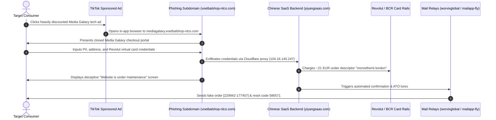

# Incident Analysis: E-Commerce Brand Spoofing & Phishing Campaign (Media Galaxy)
**Case File Reference:** `SEC-2026-ECOM-005`  
**Classification:** `TLP:CLEAR`  
**Investigation Date:** 16 September 2026  
**Primary Analyst:** `@stefanutc1`  

[](#)
[](#)
[](#)

---

## 1. Project Overview

This repository contains the complete forensic investigation, evidence analysis, Indicators of Compromise (IoCs), Incident Response (IR) playbooks, and perimeter defense configurations for an e-commerce fraud campaign uncovered in September 2026. 

The threat actors impersonated the Romanian retail giant **Media Galaxy** via sponsored TikTok advertisements, driving traffic to a deceptive sub-domain (`mediagalaxy.voetbalshop-nlco.com`) running a Chinese-engineered phishing SaaS kit (`yiyangsaas.com`). The campaign fraudulently charged ~21 EUR to a Revolut virtual card and subsequently launched secondary account takeover lures.

```text
/incident-analysis-rep/
├── README.md                          # Comprehensive project overview, execution guide, and timeline
├── EVIDENCE_ANALYSIS.md               # Detailed breakdown of OSINT findings and IOC correlation
├── /disclosures/                      # Official incident notifications, CSIRT filings & disclosure dossiers
│   ├── README.md                      # Catalog of all communications & reports
│   ├── BCR_CHARGEBACK_FRAUD_DISCLOSURE.md # First-person chargeback dispute statement for BCR (RO / EN)
│   ├── MEDIA_GALAXY_DISCLOSURE.md     # Brand abuse notice to Media Galaxy / Altex (RO / EN)
│   ├── DNSC_INCIDENT_NOTIFICATION.md  # Official CSIRT incident notification to DNSC (RO / EN)
│   ├── CIPRIAN_LOSPA_PROPOSAL.md      # YouTube investigative proposal to Ciprian Lospa (RO / EN)
│   ├── GOOGLE_SAFE_BROWSING_REPORT.md # Malicious URL & phishing submission to Google
│   └── CLOUDFLARE_ABUSE_REPORT.md     # Infrastructure abuse report to Cloudflare (yiyangsaas.com)
├── /evidence/                         # 24 raw and cataloged evidence screenshots
├── /ioc/
│   ├── indicators.csv                 # Structured CSV listing all extracted IoCs
│   ├── domains.txt                    # Plaintext list of domains ready for Unbound DNS
│   └── suricata_rules.rules           # Custom Suricata IDS/IPS detection rules
├── /reports/
│   ├── generate_report.py             # Python script using ReportLab to build the PDF report
│   └── cybersecurity_report_final.pdf # Executive PDF incident report
├── /playbooks/
│   └── ir_playbook.md                 # Incident Response playbook for financial fraud & chargebacks
└── /configs/
    └── opnsense_blocklist_guide.md    # Gateway (192.168.1.1) integration runbook
```

---

## 2. Attack Lifecycle & Kill Chain



---

## 3. Quick Start & Execution

### Generating the Executive PDF Report
```bash
# Set up virtual environment and install ReportLab
python3 -m venv .venv
source .venv/bin/activate
pip install reportlab

# Generate the PDF report
python3 reports/generate_report.py
```
The output file `reports/cybersecurity_report_final.pdf` will be compiled immediately.

### Deploying Network Blocklists to OPNsense (`192.168.1.1`)
```bash
# Inspect plain domain list
cat ioc/domains.txt

# Integrate directly into Unbound DNS Blocklist or Pi-hole
# Follow the complete step-by-step instructions in configs/opnsense_blocklist_guide.md
```

### Reviewing the Chargeback Playbook
For victims or fraud handlers filing chargeback claims with Revolut or issuing banks, refer to:
[playbooks/ir_playbook.md](playbooks/ir_playbook.md)

---

## 4. Key Indicators of Compromise (IoCs)

- **Phishing FQDN:** `mediagalaxy.voetbalshop-nlco.com`
- **Compromised Base Domain:** `voetbalshop-nlco.com`
- **Backend C2 SaaS:** `yiyangsaas.com` (Yunnan, China)
- **Email Infrastructure:** `worvixglobal.com`, `email.worvixglobal.com`, `mailapp-fly.com`, `info.mailapp-fly.com`
- **Attacker Drop Inboxes:** `MaryxBeckb96@gmail.com`, `brekerfurught@outlook.com`
- **Bank Charge Descriptor:** `morvethemi london`
- **Fraud Order ID:** `[229942-177457]`
- **Phishing OTP Lure:** `586571`

---

## 5. Defense-in-Depth Homelab Correlation

This incident analysis feeds directly into the homelab's central security architecture:
- **OPNsense Gateway (`192.168.1.1`):** Unbound DNS sinkholing and Suricata IDS alerts.
- **Wazuh SIEM (Proxmox LXC 150):** Log ingestion and alert correlation on endpoint mail and DNS requests.
- **Documentation Platform:** Published in the [Homelab Datacenter Architecture](https://github.com/stefanutc1/infrastructure).

---

## 6. Official Disclosures & Investigation Communications

All external incident notifications, abuse filings, and public advocacy disclosures are tracked in the [`disclosures/`](disclosures/) directory:

- **BCR Chargeback Dispute & Fraud Statement ([RO / EN](disclosures/BCR_CHARGEBACK_FRAUD_DISCLOSURE.md)):** First-person script for phone/branch reporting to BCR to initiate the chargeback dispute and obtain a claim number.
- **Media Galaxy Official Brand Disclosure ([RO / EN](disclosures/MEDIA_GALAXY_DISCLOSURE.md)):** Notification to Altex/Media Galaxy legal and security teams.
- **DNSC Incident Notification ([RO / EN](disclosures/DNSC_INCIDENT_NOTIFICATION.md)):** Formal filing to the Romanian National Cyber Security Directorate.
- **Ciprian Lospa Investigation Pitch ([RO / EN](disclosures/CIPRIAN_LOSPA_PROPOSAL.md)):** Public awareness and YouTube case study pitch.
- **Google Safe Browsing Report ([EN](disclosures/GOOGLE_SAFE_BROWSING_REPORT.md)):** Domain blacklisting request for `mediagalaxy.voetbalshop-nlco.com`.
- **Cloudflare Abuse Report ([EN](disclosures/CLOUDFLARE_ABUSE_REPORT.md)):** Infrastructure takedown request targeting `yiyangsaas.com`.
