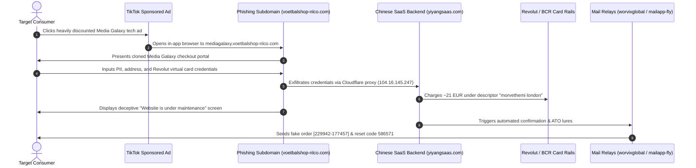

# Incident Analysis: E-Commerce Brand Spoofing & Phishing Campaign (Media Galaxy)
**Case File Reference:** `SEC-2026-ECOM-005`  
**Classification:** `TLP:CLEAR`  
**Investigation Date:** 16 September 2026  
**Primary Analyst:** `@stefanutc1`  

[](#)
[](#)
[](#)

---

## 1. Project Overview

This repository contains the complete forensic investigation, evidence analysis, Indicators of Compromise (IoCs), Incident Response (IR) playbooks, and perimeter defense configurations for an e-commerce fraud campaign uncovered in September 2026. 

The threat actors impersonated the Romanian retail giant **Media Galaxy** via sponsored TikTok advertisements, driving traffic to a deceptive sub-domain (`mediagalaxy.voetbalshop-nlco.com`) running a Chinese-engineered phishing SaaS kit (`yiyangsaas.com`). The campaign fraudulently charged ~21 EUR to a Revolut virtual card and subsequently launched secondary account takeover lures.

```text
/incident-analysis-rep/
├── README.md                          # Comprehensive project overview, execution guide, and timeline
├── EVIDENCE_ANALYSIS.md               # Detailed breakdown of OSINT findings and IOC correlation
├── /disclosures/                      # Official incident notifications, CSIRT filings & disclosure dossiers
│   ├── README.md                      # Catalog of all communications & reports
│   ├── BCR_CHARGEBACK_FRAUD_DISCLOSURE.md # First-person chargeback dispute statement for BCR (RO / EN)
│   ├── MEDIA_GALAXY_DISCLOSURE.md     # Brand abuse notice to Media Galaxy / Altex (RO / EN)
│   ├── DNSC_INCIDENT_NOTIFICATION.md  # Official CSIRT incident notification to DNSC (RO / EN)
│   ├── CIPRIAN_LOSPA_PROPOSAL.md      # YouTube investigative proposal to Ciprian Lospa (RO / EN)
│   ├── GOOGLE_SAFE_BROWSING_REPORT.md # Malicious URL & phishing submission to Google
│   └── CLOUDFLARE_ABUSE_REPORT.md     # Infrastructure abuse report to Cloudflare (yiyangsaas.com)
├── /evidence/                         # 24 raw and cataloged evidence screenshots
├── /ioc/
│   ├── indicators.csv                 # Structured CSV listing all extracted IoCs
│   ├── domains.txt                    # Plaintext list of domains ready for Unbound DNS
│   └── suricata_rules.rules           # Custom Suricata IDS/IPS detection rules
├── /reports/
│   ├── generate_report.py             # Python script using ReportLab to build the PDF report
│   └── cybersecurity_report_final.pdf # Executive PDF incident report
├── /playbooks/
│   └── ir_playbook.md                 # Incident Response playbook for financial fraud & chargebacks
└── /configs/
    └── opnsense_blocklist_guide.md    # Gateway (192.168.1.1) integration runbook
```

---

## 2. Attack Lifecycle & Kill Chain



---

## 3. Quick Start & Execution

### Generating the Executive PDF Report
```bash
# Set up virtual environment and install ReportLab
python3 -m venv .venv
source .venv/bin/activate
pip install reportlab

# Generate the PDF report
python3 reports/generate_report.py
```
The output file `reports/cybersecurity_report_final.pdf` will be compiled immediately.

### Deploying Network Blocklists to OPNsense (`192.168.1.1`)
```bash
# Inspect plain domain list
cat ioc/domains.txt

# Integrate directly into Unbound DNS Blocklist or Pi-hole
# Follow the complete step-by-step instructions in configs/opnsense_blocklist_guide.md
```

### Reviewing the Chargeback Playbook
For victims or fraud handlers filing chargeback claims with Revolut or issuing banks, refer to:
[playbooks/ir_playbook.md](playbooks/ir_playbook.md)

---

## 4. Key Indicators of Compromise (IoCs)

- **Phishing FQDN:** `mediagalaxy.voetbalshop-nlco.com`
- **Compromised Base Domain:** `voetbalshop-nlco.com`
- **Backend C2 SaaS:** `yiyangsaas.com` (Yunnan, China)
- **Email Infrastructure:** `worvixglobal.com`, `email.worvixglobal.com`, `mailapp-fly.com`, `info.mailapp-fly.com`
- **Attacker Drop Inboxes:** `MaryxBeckb96@gmail.com`, `brekerfurught@outlook.com`
- **Bank Charge Descriptor:** `morvethemi london`
- **Fraud Order ID:** `[229942-177457]`
- **Phishing OTP Lure:** `586571`

---

## 5. Defense-in-Depth Homelab Correlation

This incident analysis feeds directly into the homelab's central security architecture:
- **OPNsense Gateway (`192.168.1.1`):** Unbound DNS sinkholing and Suricata IDS alerts.
- **Wazuh SIEM (Proxmox LXC 150):** Log ingestion and alert correlation on endpoint mail and DNS requests.
- **Documentation Platform:** Published in the [Homelab Datacenter Architecture](https://github.com/stefanutc1/infrastructure).

---

## 6. Official Disclosures & Investigation Communications

All external incident notifications, abuse filings, and public advocacy disclosures are tracked in the [`disclosures/`](disclosures/) directory:

- **BCR Chargeback Dispute & Fraud Statement ([RO / EN](disclosures/BCR_CHARGEBACK_FRAUD_DISCLOSURE.md)):** First-person script for phone/branch reporting to BCR to initiate the chargeback dispute and obtain a claim number.
- **Media Galaxy Official Brand Disclosure ([RO / EN](disclosures/MEDIA_GALAXY_DISCLOSURE.md)):** Notification to Altex/Media Galaxy legal and security teams.
- **DNSC Incident Notification ([RO / EN](disclosures/DNSC_INCIDENT_NOTIFICATION.md)):** Formal filing to the Romanian National Cyber Security Directorate.
- **Ciprian Lospa Investigation Pitch ([RO / EN](disclosures/CIPRIAN_LOSPA_PROPOSAL.md)):** Public awareness and YouTube case study pitch.
- **Google Safe Browsing Report ([EN](disclosures/GOOGLE_SAFE_BROWSING_REPORT.md)):** Domain blacklisting request for `mediagalaxy.voetbalshop-nlco.com`.
- **Cloudflare Abuse Report ([EN](disclosures/CLOUDFLARE_ABUSE_REPORT.md)):** Infrastructure takedown request targeting `yiyangsaas.com`.

---

## 7. Visual Forensic Evidence Gallery

Below is the complete photographic and forensic dossier documenting the anatomy of this e-commerce phishing campaign across its entire lifecycle:

### Phase 1: Lure Ingestion & Brand Impersonation
| Sponsored TikTok Campaign | Cloned Media Galaxy Subdomain |
| :---: | :---: |
|  |  |
| *Deceptive sponsored ad offering 4 RON detergent* | *Subdomain `mediagalaxy.voetbalshop-nlco.com` displaying fake maintenance screen* |

---

### Phase 2: Technical Fingerprinting & Chinese SaaS Telemetry
| Browser DevTools & Storage Inspection | DOM Source Code (`zh-CN` Language Tag) |
| :---: | :---: |
|  |  |
| *Inspection of session tokens, tracking cookies & telemetry* | *Source code revealing Chinese SaaS frontend boilerplate and login modules* |

---

### Phase 3: Fraudulent Order Confirmation & Spoofed Communications
| Phishing Email Confirmation | Spoofed Media Galaxy Footer |
| :---: | :---: |
|  |  |
| *Order `[229942-177457]` generated by `noreply@email.worvixglobal.com`* | *Counterfeit copyright footer pointing to drop inbox `MaryxBeckb96@gmail.com`* |

| DKIM & SPF Cryptographic Headers | Phishing Relay Mail Routing |
| :---: | :---: |
|  |  |
| *Cryptographic signatures passing Gmail filters via `mailapp-fly.com`* | *MTA delivery trace showing relay through bulk mailing services* |

---

### Phase 4: Financial Exfiltration & Secondary Lures
| Bank Statement & Merchant Descriptor | Secondary Password Reset / Verification Lure |
| :---: | :---: |
|  |  |
| *Revolut/BCR statement charge of ~21 EUR under `morvethemi london`* | *Follow-up email attempting secondary account takeover with code `586571`* |

---

### Phase 5: OSINT, Certificate Pivoting & Threat Actor Attribution
| WorvixGlobal Facade Shell | WHOIS Records (NameSilo Parked Domain) |
| :---: | :---: |
|  |  |
| *Unencrypted shell website erected to evade automated reputation filters* | *Aged domain registration (08.02.2025) used for phishing SMTP relays* |

| SSL Certificate Transparency (crt.sh) | Cloudflare Reverse-Proxy Pivot to Backend |
| :---: | :---: |
|  |  |
| *Subdomain generation pattern on hijacked Dutch domain* | *SSL SAN inspection revealing link to backend `yiyangsaas.com`* |

| WHOIS Attribution: Yunnan, China | Registrar Profile: eName Technology |
| :---: | :---: |
|  |  |
| *Attribution of `yiyangsaas.com` to threat actors in Yunnan, China* | *Domain registered via eName Technology Co. on 12.09.2023* |

---

## 8. Ghid Practic de Securitate: Ce să faceți & Ce să NU faceți (DOs and DON'Ts)

Aceste recomandări sunt concepute atât pentru consumatori și victime ale fraudelor de tip phishing e-commerce, cât și pentru analiștii de securitate și familiile acestora.

### 🛡️ CE SĂ FACEȚI (DOs) – Măsuri Imediate de Protecție

| Acțiune Recomandată | Detalii & Procedură Practică |
| :--- | :--- |
| **1. Blocați și ștergeți imediat cardul utilizat** | Deschideți instant aplicația bancară (Revolut, George BCR, BT Pay etc.). Dacă ați folosit un card virtual, **ștergeți-l permanent**. Dacă ați folosit un card fizic, **înghețați-l (Freeze)** și solicitați reemiterea pentru a preveni plăți recurente neautorizate. |
| **2. Inițiați procedura de Chargeback (Contestare plată)** | Sunați imediat la banca emitentă sau mergeți la ghișeu. Cereți expres deschiderea unui dosar de **Refuz de Plată / Chargeback** pe motiv de fraudă informatică și comercială (folosiți scenariul din [`BCR_CHARGEBACK_FRAUD_DISCLOSURE.md`](disclosures/BCR_CHARGEBACK_FRAUD_DISCLOSURE.md)). Cereți **număr de sesizare**. |
| **3. Verificați întotdeauna bara de adrese (FQDN)** | Înainte de a introduce orice dată bancară, uitați-vă cu atenție la domeniul din browser. Singurul domeniu legitim este **`mediagalaxy.ro`** sau **`altex.ro`**. Orice combinație cu alte terminații (de exemplu: `mediagalaxy.voetbalshop-nlco.com`, `mediagalaxy-promo.cc`) este o **fraudă 100%**. |
| **4. Schimbați parolele conturilor asociate** | Dacă ați folosit aceeași parolă pe site-ul fals ca la căsuța de e-mail sau la alte servicii, **schimbați-o de urgență**. Activați autentificarea în doi pași (**2FA**) bazată pe aplicație (Google Authenticator / Bitwarden / YubiKey), nu pe SMS. |
| **5. Conservați dovezile forensice** | Nu ștergeți e-mailurile primite și nu goliți istoricul browserului. Faceți capturi de ecran ale reclamei, ale tranzacției bancare din aplicație și salvați sursa completă a e-mailurilor (inclusiv header-ele DKIM/SPF) pentru raportarea la poliție. |
| **6. Raportați incidentul către DNSC și Poliție** | Trimiteți detaliile și indicatorii tehnici către **Directoratul Național de Securitate Cibernetică** ([dnsc.ro](https://dnsc.ro) / `alerte@dnsc.ro`) și depuneți o plângere online sau fizică la Secția de Poliție (Combaterea Criminalității Informatice). |

---

### 🚫 CE SĂ NU FACEȚI (DON'Ts) – Greșeli Critice de Evitat

| Greșeală Frecventă | Consecințe & De ce este periculos |
| :--- | :--- |
| **❌ NU accesați link-uri de „Unsubscribe” din mailuri suspecte** | Link-ul de dezabonare dintr-un e-mail de phishing nu vă dezabonează; dimpotrivă, confirmă atacatorilor că adresa dumneavoastră este **validă și activă**, iar în unele cazuri descarcă fișiere malițioase sau malware de tip info-stealer. |
| **❌ NU introduceți coduri de verificare (OTP / SMS) primite ulterior** | Dacă primiți SMS-uri sau e-mailuri cu coduri de securitate (cum a fost codul `586571`), **nu le introduceți pe niciun site** și nu le transmiteți nimănui. Atacatorii încearcă să vă preia contul de e-mail sau contul bancar! |
| **❌ NU răspundeți atacatorilor pe e-mail sau mesagerie** | Nu trimiteți mesaje la adresele indicate în mailurile lor (cum ar fi `brekerfurught@outlook.com` sau `MaryxBeckb96@gmail.com`). Orice interacțiune vă introduce într-o listă de ținte vulnerabile (*suckers list*), expunându-vă la apeluri telefonice false (vishing). |
| **❌ NU finalizați cumpărături în browserul intern din TikTok / Instagram** | Browserele in-app ascund adesea adresa URL completă și certificatul de securitate. Dacă vedeți o reclamă tentantă, apăsați pe meniul cu trei puncte și alegeți **„Open in Browser” (Deschide în Safari / Chrome)** pentru a inspecta link-ul real. |
| **❌ NU vă lăsați păcăliți de prețuri absurd de mici** | Niciun comerciant legitim nu vinde detergenți industriali sau produse electrocasnice scumpe la prețul de **4 lei sau 10 lei**. Reducerile de 90-95% sponsorizate pe TikTok și Facebook sunt întotdeauna capcane de colectare a datelor financiare. |
| **❌ NU folosiți cardul fizic de salariu pentru plăți pe site-uri necunoscute** | Pentru achiziții online pe platforme pe care nu le cunoașteți temeinic, utilizați **exclusiv carduri virtuale de unică folosință** (Single-Use Disposable Cards) cu sold limitat. |

---

### 🇬🇧 Executive Security Takeaways (Summary in English)

1. **Immediate Containment:** Freeze/terminate the compromised card, dispute the transaction via your bank under official chargeback rules, and preserve raw MBOX headers.
2. **Zero Trust Browsing:** Never execute transactions within social media in-app webviews; open links externally to inspect the Fully Qualified Domain Name (FQDN).
3. **No Engagement:** Do not click fake unsubscribe triggers or communicate with drop inboxes (`*@outlook.com`, `*@gmail.com`), as this flags the recipient as an active exploitation candidate.
4. **Credential Hygiene:** Rotate any shared passwords immediately and enforce hardware/app-based Multi-Factor Authentication (MFA) across primary accounts.
