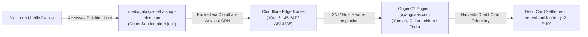

# Cloudflare Abuse & Infrastructure Phishing Takedown Request

**Case File Reference:** `SEC-2026-ECOM-005`  
**Recipient Authority:** Cloudflare Abuse, Trust & Safety Team (`abuse@cloudflare.com`)  
**Subject:** URGENT: Abuse/Phishing Report – Fraudulent E-Commerce Infrastructure proxied behind Cloudflare (`yiyangsaas.com`)  
**Priority:** High / Critical Financial Fraud  
**Classification:** `TLP:CLEAR`  
**Investigator:** `@stefanutc1`  
**Operational Status:** Formally Submitted & Tracked

<div align="center">

[](#)
[](#)
[](DNSC_TAKEDOWN_CONFIRMATION_178465.md)

</div>

---

## 1. Formal Incident Notification Statement

Dear Cloudflare Trust & Safety / Abuse Team,

I am writing to report active, malicious e-commerce phishing and credential theft operations utilizing Cloudflare's reverse proxy and CDN services to obfuscate origin infrastructure and facilitate financial fraud targeting European citizens.

The primary malicious domain operating as the command, control, and multi-tenant management backend for this syndicate is:
- **`yiyangsaas.com`** (Cloudflare Proxy IP: `104.16.145.247`, `104.16.146.247`)
- **Associated Phishing Ingress:** `mediagalaxy.voetbalshop-nlco.com`

---

## 2. Infrastructure Architecture & Threat Telemetry



### 2.1. The "Smoking Gun" TLS Certificate Pivot
Direct TLS handshakes on the Cloudflare front-end edge serving `mediagalaxy.voetbalshop-nlco.com` returned a Subject Alternative Name (SAN) and Common Name (CN) pointing directly to:
```text
Common Name (CN): yiyangsaas.com
Subject Alternative Names (SANs): yiyangsaas.com, *.yiyangsaas.com
Issuer: Cloudflare Inc ECC CA-3
```
WHOIS analysis indicates `yiyangsaas.com` is registered through **eName Technology Co., Ltd.** based in Yunnan, China, operating continuously as an underground SaaS kit for fraudulent online shopping storefronts.

---

## 3. Violations of Cloudflare Terms of Service (ToS)

This operation engages in direct violations of Cloudflare's Acceptable Use Policy:
1. **Phishing & Brand Impersonation:** Unlawful cloning of Romanian retail trademark **Media Galaxy** (Altex România S.A.).
2. **Financial Theft:** Unauthorized card charges generated via rogue merchant aggregator accounts (`morvethemi london`).
3. **Malicious Cloaking:** Deploying fake HTTP 200 maintenance screens to bypass automated security crawlers.

---

## 4. Action Requested

We formally request that Cloudflare Trust & Safety:
1. Immediately suspend Cloudflare proxying and caching services for the domain **`yiyangsaas.com`** and its subdomains.
2. Disclose the authoritative backend origin IP address and hosting provider to assist national cybercrime authorities in executing international takedowns.
3. Coordinate with the Romanian National Cyber Security Directorate under existing CSIRT frameworks referencing incident **`[D.N.S.C. #178465]`**.

Sincerely,  
**Security Operations & Incident Response Analyst**  
`@stefanutc1`
