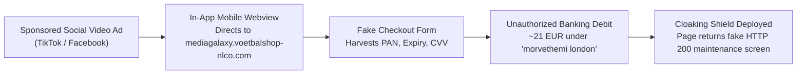

# Google Safe Browsing Malicious Entity Incident Report

**Case File Reference:** `SEC-2026-ECOM-005`  
**Target Authority:** Google Safe Browsing Team / Security Threat Submission Desk  
**Submission Category:** E-Commerce Brand Impersonation, Credential Harvesting & Financial Phishing  
**Classification:** `TLP:CLEAR`  
**Investigator:** `@stefanutc1`  
**Submission Status:** Submitted & Confirmed (DNSC #178465 Correlated)

---

## 1. Incident Overview & Threat Description

To the Google Safe Browsing Engineering Team,

We formally report an active, organized network of fraudulent e-commerce phishing entities operating across social media advertising platforms (specifically TikTok and Meta/Facebook) to impersonate **Media Galaxy** (Altex România S.A.), a major national electronics retailer.

The threat infrastructure misleads European consumers with heavily discounted household promotions, lures them through in-app webviews to an unauthorized cloned checkout portal, and executes unauthorized payment card debits under shell billing merchant descriptors (e.g., `morvethemi london`, `dreamwardrobe.online`).

---

## 2. Malicious Indicators of Compromise (IoCs) to Block

| Priority | Malicious Indicator / URL | Threat Role & Architectural Function | Recommended Action |
| :---: | :--- | :--- | :--- |
| `01` | `https://mediagalaxy.voetbalshop-nlco.com/en` | Phishing landing page & ad conversion endpoint | Block at browser level (Deceptive Site Ahead) |
| `02` | `mediagalaxy.voetbalshop-nlco.com` | Primary impersonation FQDN (Let's Encrypt SSL) | Add to global Safe Browsing Blacklist |
| `03` | `voetbalshop-nlco.com` | Base domain leveraged for disposable phishing subdomains | Flag base domain |
| `04` | `worvixglobal.com` | Mail sender & fake order confirmation dispatch (`noreply@email.worvixglobal.com`) | Blacklist domain & mail relay |
| `05` | `yiyangsaas.com` | Cloudflare-proxied backend SaaS phishing engine (`eName Technology Co., Ltd.`) | Flag as phishing C2 infrastructure |

---

## 3. Threat Flow & In-Browser Phishing Teardown

- **Brand Theft:** The web page renders authentic Media Galaxy logos, navigation ribbons, and product imagery scraped directly from legitimate Romanian infrastructure.
- **Cloaking Behavior:** Once a credit card is harvested or security auditing tools are detected, the server returns an HTTP 200 HTML maintenance page (*"Website is under maintenance"*), attempting to evade automated crawlers and dynamic sandbox evaluation.

---

## 4. Cross-Reference & National Coordination

This campaign has been formally reported to the **Romanian National Cyber Security Directorate (DNSC)** under incident ticket **`[D.N.S.C. #178465]`**, which confirmed the activation of PNRISC blacklisting and subsequent domain deactivation.

We request that Google Safe Browsing apply the appropriate red deceptive site warning to safeguard millions of Chrome and Android mobile users worldwide.
