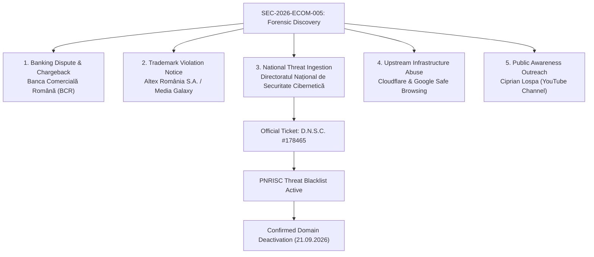

# Forensic Disclosures, National CSIRT Filings & Takedown Records

**Case File Reference:** `SEC-2026-ECOM-005`  
**Classification:** `TLP:CLEAR`  
**Target Entity:** Media Galaxy Impersonation / Chinese SaaS Fraud Funnel (`yiyangsaas.com`)  
**Lead Investigator:** `@stefanutc1`  
**Primary Outcome:** **Takedown Confirmed** by National Cyber Security Directorate ([`D.N.S.C. #178465`](DNSC_TAKEDOWN_CONFIRMATION_178465.md))

---

## 1. Overview & Disclosure Lifecycle

This directory archives the complete, verified legal and technical disclosure dossier compiled during the **Media Galaxy Brand Impersonation & E-Commerce Phishing Investigation** (`SEC-2026-ECOM-005`).

Each document tracks a specialized phase of the coordinated incident response effort, spanning domestic banking disputes, trademark violation warnings, national CSIRT escalations, international registrar abuse reports, and investigative public outreach.

---

## 2. Notification & Disclosure Master Index

| Document | Recipient & Counterpart | Operational Scope & Objective | Language | Status |
| :--- | :--- | :--- | :---: | :---: |
| **[`BCR_CHARGEBACK_FRAUD_DISCLOSURE.md`](./BCR_CHARGEBACK_FRAUD_DISCLOSURE.md)** | Banca Comercială Română (BCR) Fraud Ops | Formal card dispute script under Visa Condition 13.1 for unauthorized debit recovery (~21 EUR). | RO / EN | Filed / Tracking |
| **[`MEDIA_GALAXY_DISCLOSURE.md`](./MEDIA_GALAXY_DISCLOSURE.md)** | Media Galaxy / Altex Legal & SecOps | Direct trademark infringement notice and brand abuse intelligence brief. | RO / EN | Delivered |
| **[`DNSC_INCIDENT_NOTIFICATION.md`](./DNSC_INCIDENT_NOTIFICATION.md)** | Romanian National CSIRT (DNSC) | Formal CSIRT incident report with full IoCs for national threat feed ingestion. | RO / EN | Ingested |
| **[`DNSC_RESPONSE_178465.md`](./DNSC_RESPONSE_178465.md)** | Romanian National CSIRT (DNSC) | Official CSIRT acknowledgment: Ticket `#178465` opened, PNRISC blacklisting initiated. | RO / EN | Confirmed |
| **[`DNSC_TAKEDOWN_CONFIRMATION_178465.md`](./DNSC_TAKEDOWN_CONFIRMATION_178465.md)** | Romanian National CSIRT (DNSC) | Official takedown confirmation: Phishing host deactivated, ticket closed. | RO / EN | Remediated |
| **[`GOOGLE_SAFE_BROWSING_REPORT.md`](./GOOGLE_SAFE_BROWSING_REPORT.md)** | Google Safe Browsing Engineering | Malicious entity submission to deploy browser-level deceptive site warnings. | EN | Submitted |
| **[`CLOUDFLARE_ABUSE_REPORT.md`](./CLOUDFLARE_ABUSE_REPORT.md)** | Cloudflare Trust & Safety Desk | High-priority ToS abuse submission against backend C2 domain `yiyangsaas.com`. | EN | Submitted |
| **[`CIPRIAN_LOSPA_PROPOSAL.md`](./CIPRIAN_LOSPA_PROPOSAL.md)** | Ciprian Lospa (Investigative Journalist) | Case study presentation and dataset sharing for public consumer awareness video. | RO / EN | Pitched |

---

## 3. Key Telemetry Communicated Across All Authorities

- **Phishing Lure FQDN:** `mediagalaxy.voetbalshop-nlco.com` (Subdomain spoof on compromised Dutch domain).
- **Backend C2 Infrastructure:** `yiyangsaas.com` (Cloudflare-fronted SaaS platform, Yunnan, China).
- **Confirmation Mail Domain:** `worvixglobal.com` (`noreply@email.worvixglobal.com`, Zoho Mail MX).
- **Threat Actor Drop Inboxes:** `brekerfurught@outlook.com`, `MaryxBeckb96@gmail.com`.
- **Fraudulent Merchant Descriptor:** `morvethemi london` (~21 EUR debit charge).
