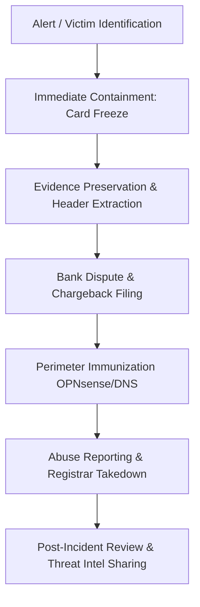

# Incident Response Playbook: E-Commerce Fraud & Financial Chargebacks
**Standard Operating Procedure (SOP):** IR-SOP-ECOM-004  
**Target Threat Category:** E-Commerce Brand Spoofing / Social Media Ad Phishing / Unauthorized Financial Transaction  
**Incident Reference:** `SEC-2026-ECOM-005` (Media Galaxy / TikTok Campaign)  
**Classification:** `TLP:CLEAR`

---

## 1. Workflow Architecture & Lifecycle



---

## 2. Phase 1: Identification & Immediate Triage

1. **Victim Interview & Timeline Reconstruction:**
   - **September 16, 08:17**: Phishing checkout completed via TikTok sponsored ad on `mediagalaxy.voetbalshop-nlco.com`.
   - **September 16, 20:00**: Compromise identified by analyst/family (~12h detection latency).
   - **September 16, 20:15 - 21:25**: Forensic reverse engineering & technical attribution conducted.
   - **September 16, 21:00 - 21:21**: Abuse takedowns filed to Cloudflare, Google Safe Browsing, and Media Galaxy / Altex legal.
   - **September 16, 21:21**: Formal incident notification dispatched to DNSC (National CSIRT).
   - **September 17, 01:00 - 01:25**: Secondary threat infrastructure and endpoint verification performed.
   - **September 17, 08:22**: Case dossier dispatched to Ciprian Lospa for public awareness.
   - **September 17, 18:00**: Formal phone dispute and chargeback intake with BCR support.
   - Exact amount charged: `~21 EUR` (descriptor: `morvethemi london`).
   - Funding flow: **BCR (Banca Comercială Română)** debit card directly -> Merchant transaction.
   - Information disclosed: Full Name (`[REDACTED]`), Email address, Shipping address, Card Number (PAN), Expiration Date, CVV, and secondary phishing OTP lure (`586571`).
2. **Determine Compromise Scope:**
   - Because physical/digital BCR card credentials (PAN, Expiry, CVV) were harvested by the phishing backend, identify whether persistent recurring tokens or pre-authorizations were registered against the account.

---

## 3. Phase 2: Containment & Financial Lockdown

1. **Freeze and Block the Compromised Card via George BCR:**
   - Open **George BCR App -> Cards**.
   - Select the affected debit card -> Tap **Freeze / Block (Blochează card)** immediately.
   - Request permanent card cancellation and reissuance of a new card with a fresh 16-digit PAN.
   - Check the George BCR transaction feed for any secondary pending debits or unexpected standing mandates.
2. **Review Account Security in George BCR:**
   - Verify that no unauthorized Open Banking tokens, new trusted devices, or e-banking credentials were compromised.
   - Confirm the exposure was strictly confined to card-not-present (CNP) payment details.
3. **Change Victim Email Password & Enable Passkeys / Hardware MFA:**
   - Because the attacker sent phishing lures attempting password resets (`Screenshot 2026-09-16 at 20.47.47.png`, code `586571`), revoke all active sessions on the victim's Google/Gmail account.
   - Enable FIDO2 / Passkey or Google Authenticator.

---

## 4. Phase 3: Financial Remediation & Chargeback Guide

### Visa & Mastercard Chargeback Rules
Under **Visa Dispute Condition 13.1 (Merchandise/Services Not Received)** and **Mastercard Reason Code 4853 (Recurring Transaction / No Delivery / Fraud)**:
- Cardholders are entitled to a full chargeback when merchandise was ordered from a merchant that fails to deliver or represents an impersonated business.
- Since the merchant descriptor displayed on the statement (`morvethemi london`) does not represent a legitimate retail business and the site disappeared into "maintenance" (`v***L The website is under maintenance`), the transaction qualifies under fraud.

### BCR Chargeback & Payment Dispute Filing Procedure
1. Call **BCR Support** (*2227 / +4021.407.42.00) or visit a local BCR branch.
2. Formally report an unauthorized commercial transaction resulting from an e-commerce phishing scam.
3. Cite the exact transaction: `~21 EUR` on 16 September 2026 under merchant descriptor `morvethemi london`.
4. Submit the formal dispute documentation (using [`disclosures/BCR_CHARGEBACK_FRAUD_DISCLOSURE.md`](../disclosures/BCR_CHARGEBACK_FRAUD_DISCLOSURE.md)).
5. When submitting proof, attach:
   - Screenshot of the fake confirmation email showing fake order ID `[229942-177457]`.
   - Screenshot of the landing page displaying maintenance (`Screenshot 2026-09-16 at 20.30.18.png`).
   - Screenshot showing the reply-to address was an attacker drop inbox (`brekerfurught@outlook.com` / `MaryxBeckb96@gmail.com`).
   - Account transaction statement export from George BCR.
6. Request and record the official claim / case registration number (Număr de înregistrare dosar de refuz la plată).
7. Submit the dispute statement:

#### Dispute Narrative Template (English):
```text
I am requesting an immediate chargeback under Visa/Mastercard Fraud Condition 13.1 / Code 4853 for the transaction of [AMOUNT] EUR processed on 16 September 2026 under the merchant descriptor "morvethemi london". 

The transaction was initiated following a fraudulent sponsored advertisement on TikTok impersonating the legitimate Romanian electronics retailer "Media Galaxy". The payment was captured through a deceptive web portal (mediagalaxy.voetbalshop-nlco.com) backed by a Chinese fraudulent SaaS infrastructure (yiyangsaas.com). 

Immediately after payment, the vendor failed to provide any valid merchant tracking, the website went offline displaying "under maintenance", and follow-up emails originated from disposable phishing domains (worvixglobal.com, info.mailapp-fly.com) using an unrelated Gmail address (MaryxBeckb96@gmail.com). The merchant descriptor is fabricated and does not correspond to any registered business entity. Evidence screenshots including email headers and WHOIS records are attached.
```

#### Dispute Narrative Template (Romanian):
```text
Solicit refuz la plată (chargeback) conform reglementărilor Visa/Mastercard pentru tranzacția în valoare de [SUMA] EUR din data de 16 Septembrie 2026 către comerciantul fraudulos înregistrat cu descrierea "morvethemi london".

Tranzacția a fost efectuată în urma accesării unei reclame sponsorizate pe TikTok care clona identitatea vizuală a retailerului oficial Media Galaxy. Pagina de plată a funcționat pe domeniul compromis mediagalaxy.voetbalshop-nlco.com, asociat unei infrastructuri de tip C2/SaaS din China (yiyangsaas.com). 

Imediat după procesarea plății, site-ul a fost oprit (afișând mesaj de mentenanță), iar confirmările de comandă au sosit de pe adrese false (noreply@email.worvixglobal.com, Reply-To: MaryxBeckb96@gmail.com), fără nicio dovadă de livrare a vreunui bun. Comerciantul nu există în mod legal. Anexez capturile de ecran cu antetele mesajelor și investigația tehnică a infrastructurii.
```

---

## 5. Phase 4: Eradication & Takedown Notifications

Send standardized abuse reports to the relevant infrastructure providers:

| Provider | Target IoC | Contact Email / Form | Action Requested |
| :--- | :--- | :--- | :--- |
| **Cloudflare** | `104.16.145.247`, `voetbalshop-nlco.com`, `yiyangsaas.com` | `abuse@cloudflare.com` / `https://abuse.cloudflare.com/` | Terminate reverse proxy & expose origin IP |
| **NameSilo** | `worvixglobal.com` | `abuse@namesilo.com` | Domain suspension (phishing) |
| **eName Technology** | `yiyangsaas.com` | `abuse@ename.com` | Domain suspension & abuse investigation |
| **Zoho Mail** | `mx.zoho.com` (for `worvixglobal.com`) | `abuse@zohocorp.com` | Disable fraudulent mail tenant |
| **Google Abuse** | `MaryxBeckb96@gmail.com` | `https://support.google.com/mail/contact/abuse` | Account suspension for fraud relay |
| **Microsoft Abuse** | `brekerfurught@outlook.com` | `abuse@outlook.com` | Account suspension for phishing |
| **DNSC (CERT-RO)** | Entire Campaign | `alerts@dnsc.ro` | National phishing alert & ISP sinkholing in Romania |
| **Altex / Media Galaxy Legal** | Brand Impersonation | `juridic@mediagalaxy.ro` | Brand protection & legal escalation |

---

## 6. Phase 5: Post-Incident Hardening & Lessons Learned

1. Enforce strict virtual card discipline:
   - For all social media / ad-driven purchases, utilize single-use disposable virtual cards with custom spend limits.
2. Maintain OPNsense Unbound DNS sinkhole blocks (`domains.txt`).
3. Deploy Suricata custom detection rules on gateway interfaces.
4. Report ad sponsor identity directly to TikTok Ad Quality & Safety team.
