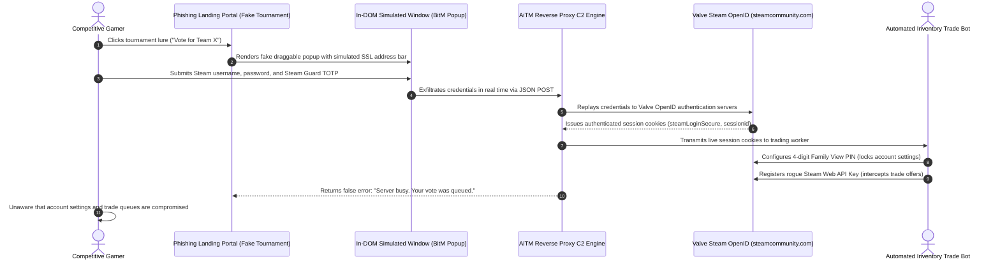
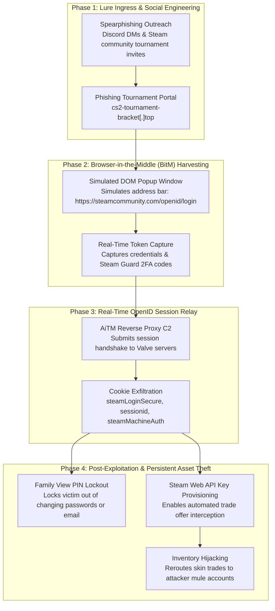

# Incident Analysis: Adversary-in-the-Middle (AiTM) Attack on Steam OpenID Authentication
**Case File Reference:** `SEC-2025-AITM-004`  
**Classification:** `TLP:CLEAR`  
**Investigation Date:** 22 November 2025  
**Primary Analyst:** `@stefanutc1`  

[](#)
[](#)
[](#)

---

## 1. Project Overview

This repository documents the forensic investigation, technical telemetry, and account takeover mechanics of an advanced **Adversary-in-the-Middle (AiTM)** and **Browser-in-the-Middle (BitM)** phishing campaign targeting competitive gaming ecosystems (Counter-Strike 2, Dota 2).

Threat actors distributed spearphishing lures across Discord and Steam community hubs inviting players to vote for competitive esports rosters on deceptive tournament hubs. Rather than redirecting targets to external domains, the platform rendered an in-page, high-fidelity simulated browser window replicating Valve's OpenID 2.0 authentication portal. The backend intercepted two-factor Steam Guard TOTP tokens, relayed session cookies (`steamLoginSecure`), established persistent account locks via **Steam Family View PINs**, and weaponized provisioned **Steam Web API keys** to execute automated inventory trade hijacking.

```text
/cyber/openid-mitm-phishing-forensics/
├── README.md               # Technical overview, sequence diagrams, and forensic IoCs
├── case_study.md           # Comprehensive technical case study and MITRE ATT&CK mapping
├── executive-summary.md    # High-level briefing on BitM OpenID harvesting
├── technical-analysis.md   # Reverse-proxy mechanics, cookie exfiltration, and PIN lockout
└── steam-report.md         # Valve incident report filing and defensive recommendations
```

---

## 2. Attack Lifecycle & Infrastructure Architecture

### 2.1 Browser-in-the-Middle (BitM) & Session Relay Sequence



---

### 2.2 Attack Lifecycle & Persistence Workflow



---

## 3. Deep-Dive Technical Findings

### 3.1 Browser-in-the-Middle (BitM) Mechanics
- **In-DOM Window Emulation**: Instead of invoking `window.open()`, which creates an inspectable external operating system window, the phishing script constructs an absolute-positioned HTML container (`<div class="modal-browser">`).
- **Simulated Chrome / Chromium Shell**: The container features rendered minimize/maximize buttons, a draggable title bar, a counterfeit address bar reading `https://steamcommunity.com/openid/login`, and an interactive green/grey SSL padlock that displays fake certificate details upon clicking.
- **Address Bar Obfuscation**: The victim never leaves the attacker's origin domain (`cs2-tournament-bracket[.]top`), but visually perceives a legitimate Valve authentication window.

### 3.2 Real-Time Session Cookie Relay (`technical-analysis.md`)
1. Client-side JavaScript bundles (`main.bundle.js`) intercept form inputs.
2. Credentials and 2FA tokens are dispatched via asynchronous `fetch()` requests to `/api/v2/auth/steam_callback`.
3. The backend proxy immediately negotiates an authenticated session against Valve's servers, capturing the high-value session cookies:
   - `steamLoginSecure`: Core bearer authentication cookie.
   - `sessionid`: CSRF prevention token required for state-changing calls.
   - `steamMachineAuth*`: Persistent device authorization tokens.

### 3.3 Post-Compromise Persistence & Trade Hijacking
1. **Automated Family View Lockout**: The attacker's script immediately activates Steam's parental control feature (**Family View**) using a random 4-digit PIN. This prevents the genuine account owner from revoking authorized sessions, changing credentials, or disabling Steam Guard.
2. **Steam Web API Key Registration**: The attacker queries `https://steamcommunity.com/dev/apikey` to generate an API key.
3. **Trade Interception (API Scamming)**: Whenever the victim attempts to trade high-value virtual items with trusted friends or commercial skin marketplaces, the bot detects the pending trade via the API, cancels it instantly, and sends an identical trade request from a cloned imposter profile to siphon the assets.

---

## 4. Indicators of Compromise (IoCs)

| Category | Identifier / Value | Threat Description |
| :--- | :--- | :--- |
| **Phishing Domain** | `cs2-tournament-bracket[.]top` | Ingress esports tournament voting portal. |
| **Phishing Domain** | `vote-league-cup[.]com` | Secondary phishing lure domain. |
| **Hosting ASN** | `AS202425` (Offshore Disposable Hosting) | Infrastructure provider ignoring DMCA and abuse notifications. |
| **SSL Provider** | Let's Encrypt R3 | Domain-validated certificates issued $<24$h prior to campaign launch. |
| **C2 Endpoints** | `/api/v2/auth/steam_callback` | Real-time credential and TOTP intake API. |
| **C2 Endpoints** | `/api/v2/stream/event` | Telemetry and automated session handoff endpoint. |
| **Stolen Tokens** | `steamLoginSecure`, `sessionid` | Valve authentication session cookies exfiltrated by threat actor. |

---

## 5. MITRE ATT&CK Matrix Mapping

| Tactic | Technique ID | Technique Name | Operational Context |
| :--- | :--- | :--- | :--- |
| **Initial Access** | `T1566.002` | **Phishing: Spearphishing Link** | Malicious tournament links distributed via Discord direct messages. |
| **Execution** | `T1204.001` | **User Execution: Malicious Link** | Victim navigates to counterfeit esports tournament portal. |
| **Credential Access** | `T1557.001` | **AiTM: Browser-in-the-Middle Relay** | Real-time relay of credentials and 2FA TOTP tokens via fake browser window. |
| **Persistence** | `T1098` | **Account Manipulation** | Provisioning rogue Web API keys and enforcing Family View PIN locks. |
| **Exfiltration** | `T1048` | **Exfiltration Over C2 Channel** | Stealing session cookies and transmitting them to automated trade bots. |
| **Impact** | `T1496` | **Resource Hijacking / Inventory Theft** | Automated rerouting of in-game cosmetic item trades to attacker mules. |

---

## 6. Defense-in-Depth Homelab Correlation

- **OPNsense Gateway (`192.168.1.1`):** Sinkholing newly registered domains (NRDs) under `.top` and `.com` containing gaming keywords (`cs2`, `tournament`, `steam`, `league`).
- **Suricata IDS:** Detection signatures flagging HTTP POST traffic directed to `/api/v2/auth/steam_callback`.
- **Wazuh SIEM (LXC 106):** Alerting on high-volume Discord desktop client DNS queries resolving to unranked external tournament domains.

---

## 7. Practical Security Guidelines: DOs and DON'Ts

### WHAT TO DO (DOs) - Immediate Defensive Actions

| Recommended Action | Detailed Instructions |
| :--- | :--- |
| **1. Verify genuine Steam OpenID behavior** | If you are already logged into Steam in your primary browser, a legitimate Steam OpenID prompt will **NEVER** ask for your username, password, or Steam Guard code. It will simply display your avatar and a green "Sign In" button. |
| **2. Drag the login window outside the browser tab** | If a login window opens, attempt to drag it outside of the web browser's viewport. If the popup cannot move outside the webpage boundaries, it is an in-DOM **Browser-in-the-Middle (BitM)** fake! |
| **3. Audit registered Steam Web API keys** | Navigate directly to [https://steamcommunity.com/dev/apikey](https://steamcommunity.com/dev/apikey). If an API key exists and you did not develop software yourself, **revoke it immediately**. |
| **4. Deauthorize all devices and rotate passwords** | Go to Steam Settings -> Security -> "Deauthorize all devices", change your account password, and update your Steam Guard authenticator. |
| **5. Contact Steam Support for Family View lockout** | If threat actors locked your account with a Family View PIN, submit an urgent recovery ticket to Valve Support with proof of original account ownership (e.g. CD keys, original payment card receipts). |

---

### WHAT NOT TO DO (DON'Ts) - Critical Traps to Avoid

| Critical Trap | Threat Impact |
| :--- | :--- |
| **DO NOT enter credentials on tournament voting pages** | Esports tournaments never require community members to vote by authenticating their full Steam credentials on third-party sites. |
| **DO NOT trust visual browser padlocks inside webpages** | Web developers can render fake padlock icons and address bars with simple CSS/SVG. Only trust the OS-level address bar provided by Safari, Chrome, or Firefox. |
| **DO NOT accept trades without checking Steam Guard confirmation details** | When confirming trades in the Steam Mobile App, verify the account creation date and registration details of the trade partner. If the original trade was canceled and a new one appeared, you are being API-scammed! |
| **DO NOT share Steam Guard SMS or Mobile Authenticator codes** | Valve support staff will never ask for Steam Guard codes under any circumstances. |
