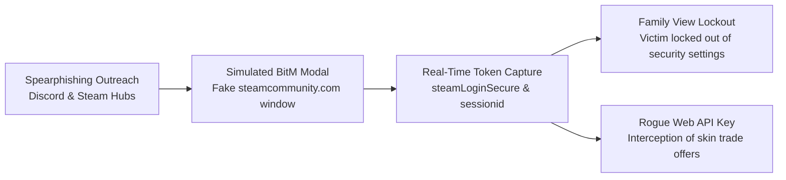

# Executive Threat Intelligence Briefing: Steam OpenID AiTM & BitM Campaign

**Case File Reference:** `SEC-2025-AITM-004`  
**Classification:** `TLP:CLEAR`  
**Incident Classification:** Adversary-in-the-Middle (AiTM) / Browser-in-the-Middle (BitM) Credential Harvesting  
**Investigation Date:** 22 November 2025  
**Primary Analyst:** `@stefanutc1`  
**Target Ecosystem:** Valve Steam Community / Competitive Gaming (CS2, Dota 2)

---

## 1. Executive Summary & Impact Analysis

On **22 November 2025**, an in-depth forensic investigation dissected an advanced **Adversary-in-the-Middle (AiTM)** and **Browser-in-the-Middle (BitM)** phishing campaign targeting esports players and competitive gaming enthusiasts. Threat actors distributed spearphishing lures across Discord and Steam community forums, inviting targets to vote for competitive teams participating in fake tournaments (e.g., `cs2-tournament-bracket[.]top`).

Instead of redirecting targets to external phishing domains where modern browser security protections might trigger warnings, the platform rendered an in-page, high-fidelity simulated browser window replicating Valve's OpenID 2.0 authentication interface (`steamcommunity.com/openid/login`). The backend intercepted valid credentials and Steam Guard two-factor (TOTP) codes in real time, acquired authenticated session tokens (`steamLoginSecure`), and executed an automated multi-stage post-exploitation routine:

1. **Family View PIN Lockout:** Threat actors provisioned an arbitrary 4-digit PIN, blocking the victim from accessing account settings, rotating passwords, or disassociating email addresses.
2. **Steam Web API Key Backdoor:** Attacker bots created an unauthorized Web API Key, enabling real-time monitoring of all incoming and outgoing trade proposals.
3. **Automated Inventory Hijacking:** Legitimate peer-to-peer trades were automatically canceled and re-created to duplicate attacker-controlled mule accounts.

---

## 2. Key Executive Indicators

| Dimension | Forensic Metric | Operational Detail |
| :--- | :--- | :--- |
| **Ingress Vector** | Discord DMs / Community Forums | Social engineering tournament voting lures |
| **Phishing Technology**| Browser-in-the-Middle (BitM) | Custom DOM element mimicking native OS window & address bar |
| **Captured Artifacts** | `steamLoginSecure`, `sessionid`, TOTP | Relayed synchronously via automated reverse proxy worker |
| **Primary Objective** | Inventory Trade Hijacking | Exfiltration of high-value virtual items (CS2 / Dota 2 skins) |
| **Defense Testing** | Air-Gapped Windows 10 VM | Disposable test accounts registered via throwaway emails |
| **Mitigation Status** | Incident Filed with Valve | Malicious domain and reverse proxy IP submitted for takedown |

---

## 3. Investigation Containment & Safety Protocol

> [!NOTE]
> All dynamic interaction, reverse engineering, and payload interception were conducted within an isolated Windows 10 virtual machine running on an air-gapped VirtualBox / Proxmox environment. Only synthetic, disposable test accounts were used. Zero personal credentials, payment methods, or real inventory assets were exposed.

---

## 4. Documentation Navigation

- **Detailed Technical Teardown:** [`technical-analysis.md`](technical-analysis.md)
- **Valve Security Incident Submission:** [`steam-report.md`](steam-report.md)
- **Comprehensive Case Study:** [`case_study.md`](case_study.md)
- **Top-Level Threat Directory:** [`../README.md`](../README.md)
