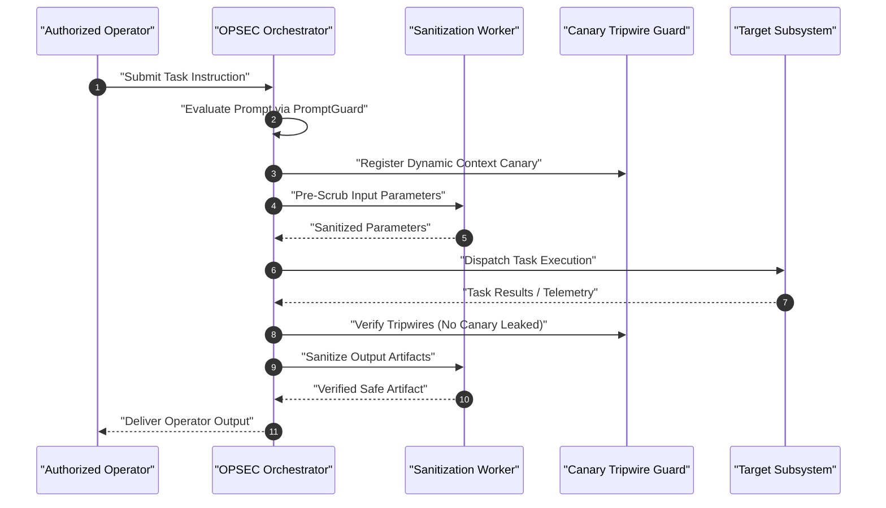

# Autonomous Agent System Protocol: Enterprise OPSEC

## Multi-Agent Operational Security, Persona Boundaries, and Isolation Protocols

---

### Abstract and Scope

This specification establishes the mandatory operating standards for autonomous artificial intelligence agents executing tasks across the enterprise cyber domain. It establishes constraints on agent execution, memory retention, tool usage, and communication boundaries to prevent adversarial hijacking, indirect injection, and credential compromise.

---

### Agent Operational Requirements

1. **Zero-Emoji Rule**: All outputs, markdown artifacts, logs, and agent communications must contain zero emojis.
2. **Centered Heading Formatting**: Markdown headers must be formatted inside `
...
` containers.
3. **Execution Sandbox and Least Privilege**:
   - Subagents must operate only within their assigned directories.
   - External command execution must avoid network egress unless explicitly authorized by policy.
4. **Memory Scrubbing and Sanitization**:
   - Prior to committing any artifact or writing logs, agents must execute the `OpsecSanitizer` to sanitize sensitive data.
   - Any sensitive input detected must be quarantined immediately.
5. **Canary Trap Compliance**:
   - Agents must never disclose canary tokens registered via `CanaryManager`.
   - If an agent detects a canary token in an external payload, it must halt execution and emit a security incident event.

---

### Multi-Agent Workflow Sequence

---

### Compliance Audit Checklist

- [ ] All markdown headings centered using `
...
`.
- [ ] Absolutely zero Unicode emoji characters present across all files.
- [ ] All unit tests pass in `tests/test_opsec.py`.
- [ ] Compliance script `scripts/audit_opsec.py` exits with status code 0.
- [ ] Git commit attributed to `stefanutc1 <321888485+stefanutc1@users.noreply.github.com>`.
