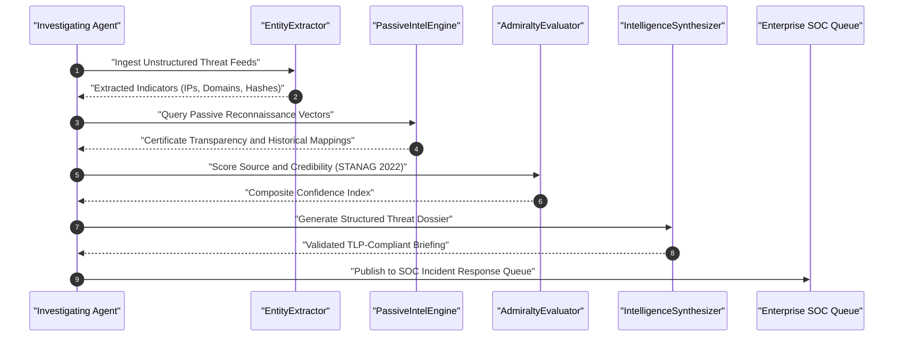

# Autonomous Agent System Protocol: Enterprise OSINT

## Multi-Agent Reconnaissance Orchestration, Admiralty Calibration, and Tradecraft Verification

---

### Abstract and Scope

This specification governs autonomous artificial intelligence agent interactions within open-source threat intelligence (OSINT) operations. It establishes execution guardrails, verification steps, and reporting standards to ensure that autonomous investigations produce verified, non-intrusive, and mathematically scored intelligence outputs.

---

### Mandatory Agent Operating Procedures

1. **Zero-Emoji Rule**: All outputs, logs, pull requests, and commit descriptions must contain zero emojis.
2. **Centered Heading Formatting**: Markdown headers must be placed inside `
...
`.
3. **Passive Reconnaissance Boundary**:
   - Agents must never execute active port scanners (e.g. Nmap SYN scans), web application fuzzers, or unauthorized penetration testing tools.
   - All collection must be conducted passively using public databases, search dorks, certificate transparency logs, and historical archives.
4. **Admiralty Grading Protocol**:
   - Every identified threat indicator or campaign attribution must be accompanied by an Admiralty code (NATO STANAG 2022).
   - Uncorroborated single-source claims must be graded F6 or E5 until validated by secondary channels.
5. **Output Synthesis and TLP Enforcement**:
   - Threat intelligence briefings must specify appropriate Traffic Light Protocol classification (TLP:CLEAR, TLP:GREEN, TLP:AMBER, TLP:RED).
   - Dossiers must be generated via `IntelligenceSynthesizer`.

---

### Autonomous Agent OSINT Pipeline

---

### Compliance Audit Checklist

- [ ] All markdown headings centered using `
...
`.
- [ ] Absolutely zero Unicode emoji characters across all files.
- [ ] All unit tests pass in `tests/test_osint.py`.
- [ ] Compliance script `scripts/audit_osint.py` exits with status code 0.
- [ ] Git commit attributed to `stefanutc1 <321888485+stefanutc1@users.noreply.github.com>`.
