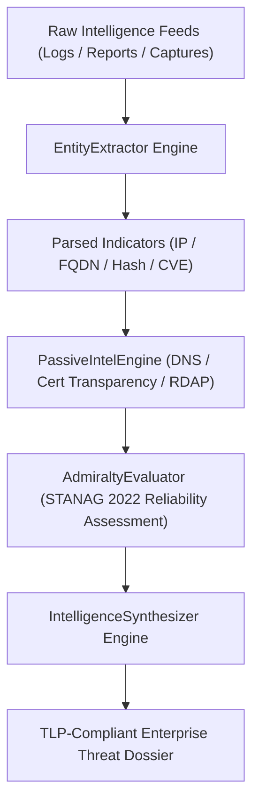

<div align="center">

# Enterprise Autonomous OSINT and Threat Intelligence Framework

</div>

<div align="center">

## Passive Reconnaissance, Admiralty Evaluation (STANAG 2022), and Indicator Synthesis

</div>

---

<div align="center">

### Executive Summary

</div>

The Enterprise Autonomous Open Source Intelligence (OSINT) framework provides an automated, non-intrusive collection, evaluation, and synthesis suite for enterprise cyber defense operations. Built to operate seamlessly within autonomous agent networks and security operations centers (SOC), the framework ingests raw observations, extracts technical indicators of compromise (IOCs), normalizes adversarial infrastructure footprints, and assigns standardized NATO Admiralty Code (STANAG 2022) credibility metrics.

Through deterministic parsing and rigorous non-invasive reconnaissance, the platform delivers verifiable, actionable threat dossiers while preserving operational security and operational boundaries.

---

<div align="center">

### Core Tenets of Enterprise OSINT Tradecraft

</div>

1. **Passive and Non-Intrusive Collection**: Operations rely exclusively on passive DNS cache telemetry, Certificate Transparency (CT) append-only logs, historical Wayback Machine snapshots, and public registries. Active port scanning and disruptive probes are strictly prohibited.
2. **NATO Admiralty System (STANAG 2022)**: Every piece of raw intelligence is evaluated across a two-dimensional matrix evaluating Source Reliability (A through F) and Information Credibility (1 through 6).
3. **Automated Entity and IOC Extraction**: High-throughput regex parsers extract and validate IPv4/IPv6 addresses, apex domains, FQDNs, Autonomous System Numbers (ASNs), CVE vulnerabilities, SHA256/MD5 binaries, and cryptocurrency transaction addresses.
4. **Structured Threat Synthesis**: Correlated telemetry is assembled into Traffic Light Protocol (TLP) compliant dossiers with confidence indexes and technical pivots for incident response teams.
5. **Zero-Emoji and Corporate Standards**: All communications, intelligence outputs, and documentation adhere to corporate standards with zero decorative emojis and centered header layouts.

---

<div align="center">

### NATO Admiralty System (STANAG 2022) Matrix

</div>

| Reliability of Source | Rating | Credibility of Information | Rating |
| :--- | :--- | :--- | :--- |
| **Completely Reliable** | **A** | **Confirmed by Other Sources** | **1** |
| **Usually Reliable** | **B** | **Probably True** | **2** |
| **Fairly Reliable** | **C** | **Possibly True** | **3** |
| **Not Usually Reliable** | **D** | **Doubtful** | **4** |
| **Unreliable** | **E** | **Improbable** | **5** |
| **Cannot Be Judged** | **F** | **Truth Cannot Be Judged** | **6** |

---

<div align="center">

### Architecture Overview

</div>



---

<div align="center">

### Repository Structure

</div>

```
cyber/osint/
├── AGENTS.md                  # Autonomous agent interaction protocols for OSINT investigations
├── CLAUDE.md                  # Claude-specific OSINT directives and operational guidelines
├── GEMINI.md                  # Gemini-specific OSINT directives and operational guidelines
├── README.md                  # Master architecture and technical specification
├── config/
│   ├── admiralty_matrix.json  # NATO STANAG 2022 scoring weights and definitions
│   └── osint_sources.json     # Intelligence source categories and IOC regex specifications
├── lib/
│   ├── __init__.py            # Python package initialization
│   ├── admiralty.py           # Admiralty System evaluation and confidence calculation
│   ├── entity_extractor.py    # Autonomous IOC and cyber entity extraction
│   ├── passive_intel.py       # Non-intrusive DNS and Certificate Transparency modeling
│   └── synthesis.py           # Threat intelligence dossier compilation engine
├── scripts/
│   ├── audit_osint.py         # Automated compliance and integrity audit script
│   └── osint_cli.py           # Command-line interface for extraction, scoring, and reconnaissance
└── tests/
    └── test_osint.py          # Comprehensive unit test suite
```

---

<div align="center">

### CLI Tooling and Operational Usage

</div>

The OSINT framework features a command-line interface (`osint_cli.py`):

<div align="center">

#### 1. Indicator of Compromise Extraction

</div>

```bash
# Extract and categorize indicators from raw forensic notes
python3 scripts/osint_cli.py extract --file incident_raw_notes.txt

# Extract from standard input stream
cat threat_dump.log | python3 scripts/osint_cli.py extract
```

<div align="center">

#### 2. Admiralty Code Scoring

</div>

```bash
# Evaluate source reliability and information credibility
python3 scripts/osint_cli.py score --code B2
```

<div align="center">

#### 3. Passive Infrastructure Profiling

</div>

```bash
# Generate Certificate Transparency queries and passive reconnaissance profile
python3 scripts/osint_cli.py recon --target malicious-subdomain.adversary-infra.com
```

<div align="center">

#### 4. Automated Threat Intelligence Dossier Synthesis

</div>

```bash
# Synthesize structured briefing with Admiralty score and IOC summary
python3 scripts/osint_cli.py synthesize \
  --title "Threat Actor Cobalt Mirage Infrastructure Pivot" \
  --code B2 \
  --tlp TLP:AMBER \
  --file threat_intel_feed.txt
```

---

<div align="center">

### Verification and Quality Assurance

</div>

The module contains automated unit tests and a strict compliance auditor:

```bash
# Execute unit test suite
python3 -m unittest tests/test_osint.py

# Execute automated compliance and zero-emoji auditor
python3 scripts/audit_osint.py
```
