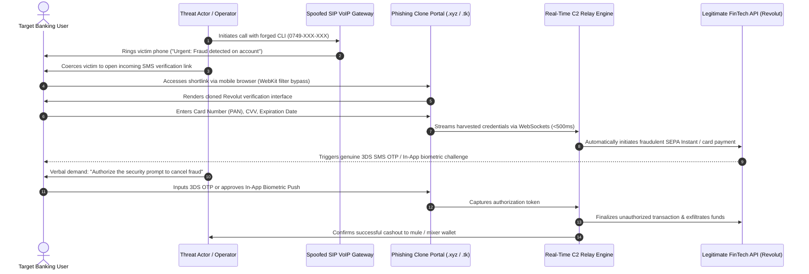
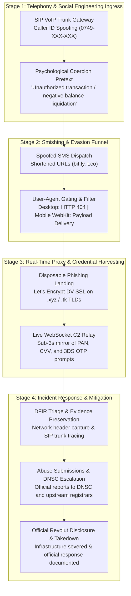

# Incident Analysis: Voice Phishing (Vishing) & Real-Time FinTech Credential Relay (Revolut)
**Case File Reference:** `SEC-2026-VISH-002`  
**Classification:** `TLP:CLEAR`  
**Investigation Date:** 10 August 2026  
**Primary Analyst:** `@stefanutc1`  

[](#)
[](#)
[](#)

---

## 1. Project Overview

This repository documents the forensic teardown, telephony infrastructure analysis, reverse-proxy credential relay mechanics, and official remediation of an aggressive **Voice Phishing (Vishing) and Smishing** campaign targeting European digital banking and FinTech users (specifically impersonating **Revolut**).

Threat actors leveraged international **SIP VoIP Caller ID spoofing** to inject legitimate-looking Romanian national mobile numbers (`0749-XXX-XXX`) into caller identification headers. Victims were subjected to high-urgency psychological coercion (fabricated unauthorized transactions, pending account liquidation fees, or negative balance penalties), directing them to disposable cloned banking portals that intercepted primary card credentials and real-time One-Time Passwords (OTP / 3D Secure).

> [!CAUTION]
> ### ⚠️ Threat Intelligence Alert: Upstream Revolut Data Exposure & Vishing Persistence (September 2026)
> Following investigative disclosures reported by [Financiarul.ro](https://financiarul.ro/tehnologie/revolut-a-divulgat-date-sensibile-ale-unor-clienti-dupa-solicitari/) and [TechCrunch](https://techcrunch.com/2026/09/12/revolut-confirms-customer-data-breach-through-fake-government-requests/), Revolut confirmed that sensitive customer dossiers and KYC records were disclosed to an unauthorized third party following fraudulent requests sent from a compromised government agency domain.
> 
> **Why Vishing Will Persist & Escalate:** Threat rings now possess verified user phone numbers, full names, dates of birth, residential addresses, transaction histories, and government ID scans (passports/licenses). Rather than untargeted spray-and-pray robocalls, attackers can stage **hyper-personalized spear-vishing calls**, citing real balance amounts, past merchants, and identity details to deceive even technically literate users into authorizing 3DS prompts or transfer approvals.


```text
/cyber/revolut-vishing-forensics/
├── README.md                 # Complete investigation overview, architecture diagrams, and IoCs
├── case_study.md             # In-depth technical teardown and MITRE ATT&CK mapping
├── executive-summary.md      # High-level incident overview and chronology
├── technical-analysis.md     # SIP manipulation, HTTP 302 redirection, and WebSocket relay
├── revolut-report.md         # Incident disclosure dossier submitted to Revolut Security
├── revolut-response.md       # Official response and security guidance received from Revolut
└── takedown.md               # Post-incident takedown verification and infrastructure remediation
```

---

## 2. Attack Lifecycle & Infrastructure Architecture

### 2.1 Attack Sequence & Real-Time Credential Relay



---

### 2.2 Attack Lifecycle & Incident Response Workflow



---

## 3. Threat Persistence Analysis: Revolut Government-Domain Breach & KYC Exfiltration (September 2026)

On September 12, 2026, financial and cybersecurity investigative outlets ([Financiarul.ro](https://financiarul.ro/tehnologie/revolut-a-divulgat-date-sensibile-ale-unor-clienti-dupa-solicitari/), citing [TechCrunch](https://techcrunch.com/2026/09/12/revolut-confirms-customer-data-breach-through-fake-government-requests/)) confirmed that **Revolut suffered an external data breach**, disclosing sensitive customer records and KYC archives to an unauthorized third party. This development provides critical intelligence explaining why voice phishing (vishing) operations targeting Revolut users remain persistent, recurring, and exceptionally dangerous.

### 3.1 Breach Anatomy & Government Impersonation Vector
- **Ingress Mechanism:** Threat actors executed an advanced external social engineering attack by compromising or spoofing the email domain of a legitimate government/law enforcement agency.
- **Fraudulent Information Requests:** The adversary submitted counterfeit legal/regulatory data requests (subpoenas / law enforcement information requests - LEIR). Believing the requests originated from a genuine regulatory body, Revolut personnel disclosed unredacted customer records.
- **Remediation Actions Taken:** Revolut severed communication, blocked the offending email address upon detecting the fraud, notified affected users, and alerted relevant law enforcement and data protection regulators. Revolut stated that core banking ledgers and customer funds were not directly accessed.
- **Target Profiling:** On-chain intelligence specialist and crypto researcher **ZachXBT** revealed that the compromised cohort heavily centered on **High-Net-Worth Individuals (HNWI)** and active crypto/FinTech asset holders.

### 3.2 Compromised Telemetry & Exfiltrated Datasets
The data exfiltrated directly equips fraud rings with the exact intelligence required to execute high-conviction social engineering:

| Exfiltrated Data Category | Specific Compromised Telemetry | Weaponization in Vishing Operations |
| :--- | :--- | :--- |
| **Contact & Routing Identifiers** | Verified mobile phone numbers, primary email addresses, residential postal addresses | Direct mapping of targets to Romanian SIP spoofing routes (`0749-XXX-XXX`). |
| **Personal Identifiers** | Full legal names, dates of birth, national ID / tax registry numbers | Vishing operators cite birthdates and residential addresses to establish instant institutional authority. |
| **Government Identity Documents** | High-resolution scanned copies of Passports and Driver's Licenses | Enables secondary identity theft, fraudulent SIM-swapping verification, and targeted credential harvesting. |
| **Biometric Verification** | Verification selfies and liveness check captures | Exploited for fraudulent account creation on third-party crypto and fiat off-ramps. |
| **Banking & Financial Metadata** | Official account statements, recent transaction history, card activity records | Operators quote real past transactions ("Did you authorize €120 at X?"), completely bypassing victim skepticism. |

### 3.3 The Causal Link: Why Vishing Will Persist and Escalate
The availability of this exfiltrated database fundamentally alters the threat model for Revolut users:
1. **From Cold Calling to Precision Spear-Vishing:** Standard vishing relies on unverified cold dials with generic scripts. Armed with exfiltrated transaction history and verified KYC details, attackers conduct hyper-targeted spear-vishing, greeting targets by their full name and quoting exact account details.
2. **Neutralizing Fraud Awareness:** Modern banking users are trained to be suspicious of callers who lack account context. When a caller recites the victim's partial passport number, date of birth, and recent merchant charges, the psychological defense barrier collapses.
3. **Infrastructure Re-spawning:** While specific disposable phishing domains (`.xyz`, `.top`) are continuously sinkholed and taken down, the exfiltrated offline database remains in the hands of threat actors. Attackers can provision new disposable infrastructure and continue dialing victims indefinitely.

---

## 4. Deep-Dive Technical Findings

### 4.1 SIP Telephony Exploitation & CLI Spoofing
- **P-Asserted-Identity Manipulation**: The adversary routed outbound traffic through unauthenticated international SIP trunk providers that permit raw injection into the `P-Asserted-Identity`, `Remote-Party-ID`, and `From` SIP headers.
- **National Number Masking**: The campaign injected Romanian mobile number allocations matching the `0749-XXX-XXX` prefix block to exploit regional trust.
- **Audio Engineering**: Threat operators operated from call centers with synthesized corporate background noise (subtle keyboard typing, simulated multi-operator murmur) to manufacture legitimacy and discourage out-of-band verification.

### 4.2 Dynamic Phishing Architecture & Defensive Evasion
1. **Multi-Hop Redirection**: Victims received SMS shortlinks resolving through intermediate HTTP 302 redirect chains to prevent static domain reputation flagging.
2. **Device-Specific Fingerprinting**: The ingress reverse-proxy inspected incoming `User-Agent` headers. Desktop crawlers, automated threat analysis sandboxes, and cloud ASN IP ranges received generic HTTP 404 or connection resets. Mobile WebKit and Android Chrome clients were routed to the active phishing DOM.
3. **Bi-Directional WebSocket Relay**: Stolen payment cards were submitted automatically to real financial merchant endpoints. When 3DS challenges or in-app push verifications were issued, the phishing backend dynamically injected an identical verification modal into the victim's browser within $<3$ seconds.

---

## 5. Indicators of Compromise (IoCs)

| Indicator Type | Value / Identifier | Threat Context |
| :--- | :--- | :--- |
| **Spoofed Caller ID** | `0749-XXX-XXX` | Romanian national mobile carrier prefix range used in vishing calls. |
| **Phishing Domain** | `revolut-security-verification[.]xyz` | Primary phishing landing domain. |
| **Phishing Domain** | `secure-revolut-app[.]top` | Secondary credential harvesting portal. |
| **Disposable TLDs** | `.xyz`, `.top`, `.tk`, `.ml`, `.gq` | High-churn TLDs leveraged with automated Let's Encrypt SSL. |
| **URL Shorteners** | `bit.ly/*`, `t.co/*` | Shortened links obfuscating initial redirection chains. |
| **Web Infrastructure** | Nginx Reverse Proxy + WebSockets | Low-latency credential relay backend. |
| **Target Application** | Revolut (Retail & Business accounts) | Impersonated brand and victim ecosystem. |
| **Breach Reference** | `TechCrunch / Financiarul.ro (12 Sept 2026)` | Upstream government-impersonation data disclosure incident. |

---

## 6. MITRE ATT&CK Matrix Mapping

| Tactic | Technique ID | Technique Name | Operational Context |
| :--- | :--- | :--- | :--- |
| **Reconnaissance** | `T1598` | **Phishing for Information** | Harvesting victim mobile phone numbers and banking profile hints. |
| **Reconnaissance** | `T1589.001` | **Gather Victim Identity: Credentials** | Exploiting exfiltrated KYC database records (PII, DOB, passports). |
| **Resource Development** | `T1583.001` | **Acquire Infrastructure: Domains** | Automated provisioning of low-cost, disposable `.xyz` and `.top` domains. |
| **Initial Access** | `T1566.004` | **Phishing: Voice (Vishing)** | Direct inbound voice calls using spoofed caller identity. |
| **Credential Access** | `T1556` | **Modify Authentication Process** | Real-time interception and relay of 3DS SMS OTP and push notifications. |
| **Impact** | `T1499` | **Financial Fraud / Account Takeover** | Immediate execution of SEPA Instant transfers to money mule networks. |

---

## 7. Official Revolut Advisory & Security Guidance

Following our formal disclosure report, Revolut provided official acknowledgement and security directives for public educational documentation (detailed in [`revolut-response.md`](revolut-response.md)):

> [!IMPORTANT]
> ### Official Revolut Security Directives:
> 1. **No Unscheduled Outbound Calls**: Revolut will never call you out of the blue without booking the call and confirming it with you in advance via the authenticated app.
> 2. **Never Disclose One-Time Passcodes (OTP)**: Never read out an SMS code, PIN, or password over the phone or chat. Official support agents will never ask for them.
> 3. **Reject "Safe Accounts"**: Financial institutions will never instruct you to move money to an external or "safe" account to protect it from fraud.
> 4. **Prohibit Remote Access Software**: Never download remote desktop tools (AnyDesk, TeamViewer, RustDesk) at the request of an inbound caller.
> 5. **Verify Strictly In-App**: In-app chat is the only authoritative, end-to-end authenticated support channel.

---

## 8. Defense-in-Depth Homelab Correlation

This investigation directly feeds detection engineering rules across the homelab infrastructure:
- **OPNsense Gateway (`192.168.1.1`):** Unbound DNS sinkholing (`0.0.0.0`) of all identified phishing domains and newly registered `.xyz` / `.top` FinTech typosquatting patterns.
- **Suricata IDS/IPS:** Ingress packet inspection for known WebSocket credential-relay signatures and suspicious HTTP redirection headers.
- **Wazuh SIEM (LXC 150):** Automated alerting on mobile device DNS queries resolving against high-risk disposable TLDs.

---

## 9. Practical Security Guidelines: DOs and DON'Ts

### 🛡️ WHAT TO DO (DOs) – Immediate Defensive Actions

| Recommended Action | Detailed Operational Procedure |
| :--- | :--- |
| **1. Hang up immediately on unsolicited banking calls** | If an inbound caller claims to represent your bank or FinTech provider regarding an "emergency", terminate the call immediately. Do not engage or argue. |
| **2. Freeze all payment cards in the official app** | Open the legitimate Revolut application on your mobile device and freeze all physical and virtual cards immediately to prevent secondary charges. |
| **3. Verify incidents exclusively via authenticated in-app chat** | Use the built-in Help / Support chat inside the Revolut app. In-app representatives have cryptographic proof of your identity and full access to internal audit logs. |
| **4. Report spoofed caller numbers to your national CSIRT** | Submit the spoofed phone numbers, timestamps, and received SMS links to national cyber authorities (e.g., [DNSC](https://dnsc.ro) via `alerte@dnsc.ro`). |
| **5. Enable Biometric Authentication & In-App Security** | Require FaceID / Fingerprint authorization for every outbound transaction and card detail view within your banking apps. |

---

### 🚫 WHAT NOT TO DO (DON'Ts) – Critical Mistakes to Avoid

| Critical Mistake | Threat Impact & Hazard |
| :--- | :--- |
| **❌ DO NOT read back SMS OTPs or verification codes** | An SMS verification code is meant exclusively for authorizing transactions. Reading it to a caller grants them immediate execution power over your funds. |
| **❌ DO NOT approve unsolicited in-app push notifications** | Threat actors attempt transactions that trigger legitimate mobile push notifications. Approving a prompt during a phone call finalizes the theft. |
| **❌ DO NOT click links received via SMS from unknown senders** | Banks do not distribute password reset or card verification links via unauthenticated SMS shortlinks. |
| **❌ DO NOT transfer money to "secure holding accounts"** | The concept of a "safe transitional account" is a 100% fraudulent social engineering construct. Money sent to an external IBAN is permanently lost. |
| **❌ DO NOT install remote support tools on your phone or PC** | Never install TeamViewer, AnyDesk, or screen-sharing software when instructed by an incoming caller. |
