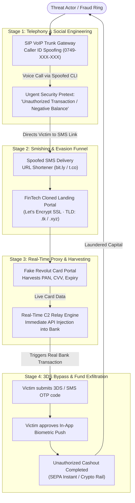

# Case Study: Advanced Voice Phishing (Vishing) & Real-Time Credential Relay Targeting FinTech Users (Revolut)

**Author:** @stefanutc1 
**Date:** 10 August 2026 
**Classification:** TLP:CLEAR / Technical Cyber Threat Intelligence 
**Target Analyzed:** Active social engineering, SIP telephony spoofing, and real-time reverse proxy infrastructure targeting Revolut banking accounts.

---

## 1. Executive Summary

This case study provides a technical teardown of an aggressive **Voice Phishing (Vishing)** and SMS-spoofing campaign targeting digital banking users across Romania and the European Union. Threat actors leveraged **SIP VoIP Caller ID Spoofing** to impersonate official anti-fraud representatives, manufacturing urgent security pretexts (e.g., unauthorized transactions or negative balance penalties) to force immediate user compliance.

Victims were guided to dynamically cloned banking verification portals that harvested Primary Account Numbers (PAN), CVVs, and expiry dates. The backend infrastructure intercepted real-time SMS One-Time Passwords (OTP / 3D Secure) and coerced victims into approving in-app biometric push notifications to execute fraudulent SEPA Instant transfers.

---

## 2. Attack Lifecycle & Infrastructure Diagram

---

## 3. Technical Breakdown of Telephony & Web Proxy Vectors

### 3.1 SIP Telephony Exploitation
- **Caller ID Manipulation**: The threat actors routed voice calls through foreign unauthenticated SIP trunking providers, injecting arbitrary Romanian mobile prefixes (`0749-XXX-XXX`) into the SIP `P-Asserted-Identity` and `From` headers.
- **Psychological Coercion**: Callers adopted an authoritative tone, citing internal fraud reference numbers and simulating background call center ambient noise to discourage independent verification.

### 3.2 Dynamic Phishing Proxy Architecture
1. The victim received an SMS containing a shortened URL that performed multi-hop HTTP 302 redirects.
2. The landing server analyzed the client's `User-Agent` string, serving the phishing payload exclusively to mobile WebKit/Chrome clients while serving HTTP 404 responses to desktop security scanners.
3. The page dynamically captured payment credentials and streamed them via WebSockets to the attacker's operator dashboard.
4. When the authentic banking system triggered a 3D Secure verification challenge, the phishing portal mirrored the prompt in $<3$ seconds, capturing the victim's OTP input.

---

## 4. Indicators of Compromise (IOCs)

| Category | Indicator / Detail | Threat Context |
| :--- | :--- | :--- |
| **Vishing CLI Prefix** | `0749-XXX-XXX` (Romanian national mobile range) | Spoofed phone numbers used for inbound social engineering. |
| **Phishing Domains** | `revolut-security-verification[.]xyz`, `secure-revolut-app[.]top` | Phishing hosts delivering cloned interfaces. |
| **Web Server Tech** | Nginx Reverse Proxy + Let's Encrypt DV SSL | Disposable VPS infrastructure with automated SSL provisioning. |
| **Traffic Filtering** | HTTP 302 redirection chains, mobile User-Agent gating | Evasion mechanisms targeting automated security sandbox crawlers. |

---

## 5. MITRE ATT&CK Mapping

| Phase | Tactic | Technique ID | Technique Description |
| :--- | :--- | :--- | :--- |
| **Reconnaissance** | Reconnaissance | `T1598` | **Phishing for Information**: Harvesting target mobile phone numbers. |
| **Resource Development** | Resource Dev | `T1583.001` | **Acquire Infrastructure: Domains**: Registering low-cost typosquatting TLDs. |
| **Initial Access** | Initial Access | `T1566.004` | **Phishing: Voice (Vishing)**: Authoritative phone call with spoofed Caller ID. |
| **Credential Access** | Credential Access | `T1556` | **Modify Authentication Process**: Real-time interception of 3DS OTP tokens. |
| **Impact** | Impact | `T1499` | **Financial Fraud / Account Takeover**: Unauthorized fund exfiltration. |

---

## 6. Upstream Breach Correlation & Vishing Persistence (September 2026)

On September 12, 2026, investigative reports ([Financiarul.ro](https://financiarul.ro/tehnologie/revolut-a-divulgat-date-sensibile-ale-unor-clienti-dupa-solicitari/), citing [TechCrunch](https://techcrunch.com/2026/09/12/revolut-confirms-customer-data-breach-through-fake-government-requests/)) confirmed that **Revolut suffered a significant customer data breach**. An unauthorized third party impersonating a legitimate government law enforcement agency submitted fraudulent legal requests for information, causing Revolut to disclose sensitive KYC files and personal records.

### Key Factors Driving Persistent Vishing Attacks:
- **Exfiltrated PII & Contact Records:** Attackers obtained verified phone numbers, residential addresses, dates of birth, and email addresses.
- **Compromised KYC & Financial Metadata:** High-resolution scans of passports, driving licenses, verification selfies, and bank transaction statements were exfiltrated.
- **Targeting High-Net-Worth Individuals (HNWI):** Crypto threat intelligence researcher **ZachXBT** highlighted that high-net-worth customers were specifically targeted.
- **Spear-Vishing Transformation:** This breach transforms vishing from random robo-dialing into lethal, targeted spear-vishing. Attackers can call verified numbers, recite the victim's full name, birth date, address, and recent transaction history, creating an overwhelming appearance of authenticity that lures victims into authorizing 3DS OTP challenges or in-app transfers.

---

## 7. Incident Response & Defensive Guidelines

1. **Bank Verification Policy**: Legitimate financial institutions will never instruct clients over the phone to disclose their CVV, transfer funds to "safety accounts", or read back SMS authorization codes.
2. **In-App Verification**: Users must verify all fraud inquiries exclusively through the authenticated in-app chat channel.
3. **Telephony Hardening**: Telecommunications carriers must enforce STIR/SHAKEN protocol standards to invalidate unauthenticated international SIP Caller ID spoofing.
4. **Assume Contact Data Is Compromised**: Due to upstream data disclosures, treat any inbound call citing your real name, birth date, or Revolut transaction details with extreme skepticism. Always hang up and verify in-app.
