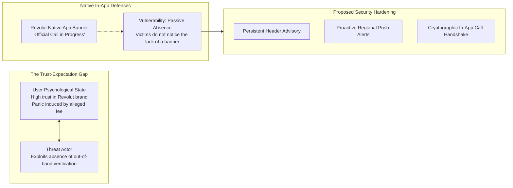

# FinTech Incident Disclosure & Countermeasure Report: Revolut Vishing

**Case File Reference:** `SEC-2026-VISH-002`  
**Classification:** `TLP:CLEAR`  
**Incident Reference:** FinTech Brand Impersonation & Real-Time OTP Exfiltration  
**Primary Analyst:** `@stefanutc1`  
**Target Financial Institution:** Revolut Bank UAB / Revolut Ltd  
**Date of Incident & Triage:** 10 August 2026  

---

## 1. Executive Summary & Problem Formulation

Modern financial technology (FinTech) services offer frictionless mobile onboarding and real-time payment settlement (SEPA Instant, internal peer-to-peer transfers). However, this rapid settlement velocity makes FinTech platforms an attractive target for organized criminal syndicates deploying hybrid **Voice Phishing (Vishing)** and real-time reverse proxy interception pipelines.

This report evaluates the systemic vulnerability in the user trust model exploited during the 10 August 2026 campaign, audits Revolut's native application defenses, and proposes architectural and UX countermeasures to mitigate phone spoofing risks.

---

## 2. Exploitation of the FinTech Trust Model

Threat actors capitalize on the high level of trust users place in mobile-first digital banking:
1. **The Fear-Authority Dilemma:** Threat actors impersonate internal compliance and fraud prevention officers. By quoting fake transaction amounts or impending regulatory fines, they strip the user of critical reasoning time.
2. **The "Help" Illusion:** The caller positions themselves as an ally attempting to "save" the user from an ongoing fraudulent charge, leading victims to treat suspicious requests (such as sharing one-time passcodes or clicking SMS links) as necessary recovery steps.
3. **Decoupled Verification:** Because legitimate banking communications often occur via email, push notification, and SMS, users struggle to distinguish fraudulent SMS shortlinks from legitimate operational messages.

---

## 3. Evaluation of Revolut Native Defenses

Revolut has implemented sophisticated client-side security measures. However, this investigation highlighted specific operational edge cases:

### 3.1. The "In-App Call Status" Feature
- **Mechanism:** When a legitimate Revolut customer support agent initiates a phone call, an encrypted WebSocket signal from Revolut's backend displays an active banner in the user's mobile app:  
  *“You are currently speaking with an official Revolut support specialist.”*
- **Forensic Finding:** While technologically robust, this defense relies on **negative inference** — users must recognize that the *absence* of this banner during a call signifies fraud. Less technical consumers frequently fail to open the application while engaged on a voice call, missing the indicator entirely.

---

## 4. Proposed Architectural & UX Countermeasures

To bridge the gap between technical defenses and human cognitive vulnerabilities, the following security controls are submitted:

### 4.1. Persistent Warning Banner (Contextual UI Control)
- **Implementation:** Display a non-intrusive, persistent warning banner in the mobile app cards tab:  
  *“Revolut will never call you to request card CVVs, one-time passcodes, or ask you to access external verification websites.”*
- **Impact:** Establishes a proactive baseline in the user's subconscious before an adversarial call is received.

### 4.2. Proactive Threat-Intelligence Push Notifications
- When national CSIRT feeds (e.g., DNSC in Romania) or carrier partners identify active telephone spoofing clusters (such as the `0749-XXX-XXX` range), the banking backend should dispatch localized warning pushes to users in that country.

### 4.3. Cryptographic In-Call Verification Code
- Introduce a mutual authentication prompt: During any official call, the banking app generates a rotating 3-word challenge or numeric token that the agent must verbally read to the customer before any transaction discussion proceeds.

---

## 5. Formal Communication & Disclosure Status

This report was compiled and shared with Revolut Security & Fraud Prevention teams, establishing actionable intelligence for automated rule tuning and user education initiatives.
