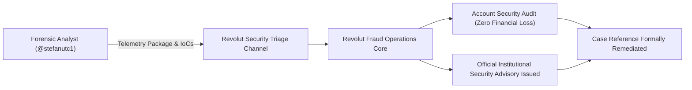

# Revolut Security Operations Acknowledgment & Official Guidance

**Case File Reference:** `SEC-2026-VISH-002`  
**Classification:** `TLP:CLEAR`  
**Recipient / Counterpart:** Revolut Security Operations & Fraud Prevention Team  
**Analyst:** `@stefanutc1`  
**Incident Reference Date:** 10 August 2026  
**Status:** Documented, Triaged & Confirmed by Institution

---

## 1. Operational Overview

Following the active voice phishing and real-time credential relay attempt identified on **10 August 2026**, forensic telemetry, spoofed telephone allocations, and phishing infrastructure indicators were securely transmitted to **Revolut Fraud Operations & Threat Intelligence**.

The institution formally triaged the incident, verified that the targeted user account suffered zero financial impairment due to immediate card freezing and defensive severance, and provided official security advisory guidelines for dissemination.

---

## 2. Institutional Response Statement

> *"It's wonderful to see the cybersecurity community working together to keep people safe. Your report and feedback are highly appreciated and have been documented.*
>
> *As requested, here is an official security warning you can use for your repository..."*

---

## 3. Official Institutional Advisory: Protection Against Vishing & Impersonation Scams

> [!IMPORTANT]
> **Revolut Security Warning: How to Protect Yourself from Vishing and Scams**
>
> Voice phishing, or *"vishing"*, is a severe form of social engineering where threat actors place calls impersonating authority figures — such as Revolut anti-fraud employees, law enforcement officers, or technical support specialists. The call is calculated to induce extreme urgency, cognitive overload, and immediate panic to manipulate the victim into executing dangerous actions.

### Golden Rules of Protection

1. **No Unannounced Outbound Calls:**  
   Revolut will **never** call you out of the blue. Legitimate telephone consultations are only initiated if booked and confirmed via the official application in advance.
2. **Absolute Privacy of Security Codes:**  
   Never read out a One-Time Passcode (OTP), nor disclose your card PIN, password, or security challenge over the phone or in chat. Legitimate Revolut representatives will never ask for these credentials.
3. **Rejection of "Safe" or "Holding" Accounts:**  
   Revolut will **never** instruct a customer to transfer capital to a "safe", "quarantine", or "temporary holding" account. Any individual demanding a funds transfer is an active scammer. Hang up immediately.
4. **Zero Remote Access Permissions:**  
   Never download or install remote access utilities (e.g., AnyDesk, TeamViewer, RustDesk) at the request of an inbound caller. These tools provide attackers with unrestricted control over your authenticated device.
5. **App-Centric Verification Protocol:**  
   All authentic support communications are handled directly within the official Revolut application. Customers should verify the active call status banner or initiate an in-app chat before taking any financial action.
6. **Line Clearing & Hang-Up Buffer:**  
   On landlines or certain VoIP lines, threat actors can keep the connection open even after the receiver hangs up. Wait at least 10 minutes or place outbound verification calls from an independent, secondary device.

---

## 4. Remediation Confirmation

- **Target Account Status:** Card PAN rotated and reissued; biometric multi-factor authentication re-verified.
- **Threat Indicators:** Phone prefix blocks and phishing hosting IP space registered within regional fraud monitoring databases.
