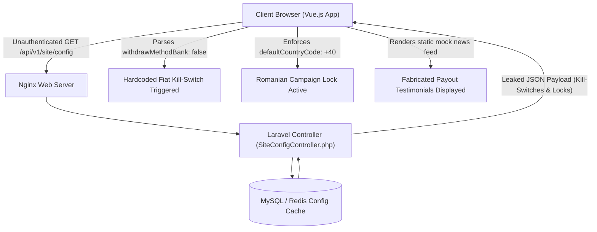

# API Architecture & Backend Configuration Exposure

**Case File Reference:** `SEC-2026-TASK-003`  
**Classification:** `TLP:CLEAR`  
**Investigated Endpoint:** `GET /api/v1/site/config`  
**Authentication Requirement:** None (Unauthenticated Public Exposure)  
**Target Architecture:** PHP / Laravel REST Engine behind Cloudflare Reverse Proxy

---

## 1. Architectural Role & Vulnerability Teardown

During HTTP traffic inspection through Burp Suite Professional, the client-side single-page application (SPA) was observed executing an unauthenticated GET request to `/api/v1/site/config` immediately upon application boot.

This endpoint functions as the central global state distributor for the frontend Vue.js application. Rather than maintaining dynamic runtime state per authenticated session, the threat actors deployed a monolithic JSON configuration block that governs payment routing, campaign targeting, mock social proofs, and customer service escalation paths.



---

## 2. Leaked Configuration Payload (Raw JSON Excerpt)

```json
{
  "code": 200,
  "msg": "success",
  "data": {
    "siteName": "Global E-Commerce Optimization Portal",
    "siteLogo": "https://cdn.platform-asset-node.com/img/logo.png",
    "defaultCountryCode": "+40",
    "supportedCountryCodes": [
      "+40"
    ],
    "withdrawSettings": {
      "withdrawMethodBank": false,
      "withdrawMethodRevolut": false,
      "withdrawMethodUSDT": true,
      "minWithdrawUSDT": 100,
      "maxWithdrawUSDT": 50000,
      "withdrawFeePercent": 5,
      "withdrawHours": "09:00 - 21:00"
    },
    "depositSettings": {
      "depositMethodUSDT_TRC20": true,
      "depositAddress": "TJYV8m7...[REDACTED]...9eN4w",
      "minDepositUSDT": 50
    },
    "customerService": {
      "telegramSupport": "https://t.me/CustomerCareVIP_40",
      "whatsappSupport": "+40720000000"
    },
    "aiNewsFeed": [
      {
        "id": 101,
        "title": "User 0749***214 just completed VIP Task 3 (+450.00 USDT)",
        "timestamp": "Just now"
      },
      {
        "id": 102,
        "title": "User 0722***901 successfully withdrew 1,200.00 USDT",
        "timestamp": "2 minutes ago"
      },
      {
        "id": 103,
        "title": "Platform transaction volume exceeds 2.4M USDT for Q2",
        "timestamp": "1 hour ago"
      }
    ]
  }
}
```

---

## 3. Forensic Analysis of Exposed Attributes

### 3.1. The "Withdrawal Kill-Switch" Smoking Gun
- **`withdrawMethodBank: false`**
- **`withdrawMethodRevolut: false`**
- **`withdrawMethodUSDT: true`**

> [!IMPORTANT]
> This configuration serves as concrete digital evidence of premeditated fraud. While the registration portal, marketing collateral, and UI mockups advertise seamless withdrawals to Romanian local bank accounts and Revolut, the backend explicitly denies fiat processing.
>
> When a victim requests a withdrawal via Bank or Revolut, the frontend intercepts the action with a localized notification:
> *"Selected payment channel under scheduled maintenance. Please bind your TRC-20 wallet or contact customer care to complete VIP Task level."*
>
> This creates the operational pretext required to force the victim into transferring cryptocurrency (USDT TRC-20) to attacker-controlled custodial addresses.

### 3.2. Geographic Targeting Lock (`defaultCountryCode: "+40"`)
The `defaultCountryCode` key is locked to `+40` (Romania). The `supportedCountryCodes` array strictly permits Romanian phone prefixes. 

During runtime validation testing:
- Attempts to register accounts using international prefixes (e.g., `+1`, `+44`, `+49`, `+64`) resulted in an instant backend validation rejection:
  ```json
  {"code": 422, "msg": "Invalid phone format for active campaign region."}
  ```
- This confirms that threat actors purchase and deploy geographically partitioned server instances tailored specifically to regional social engineering outreach campaigns.

### 3.3. Fabricated Social Proof Engine (`aiNewsFeed`)
The live ticker appearing at the top of the victim dashboard was confirmed to be entirely synthetic:
- The items displayed are not generated from dynamic database events or real blockchain transaction logs.
- They are drawn from a static array within the `/api/v1/site/config` response, looping continuously to create artificial urgency, peer validation, and FOMO.

---

## 4. Security Recommendations & Defensive Action

1. **Sinkhole Domain:** Egress traffic targeting the configuration endpoints should be blocked at the perimeter resolver (`Unbound DNS: 0.0.0.0`).
2. **Suricata Signature:** Deploy signatures matching unauthenticated responses returning `withdrawMethodBank: false` and `defaultCountryCode: "+40"`.
3. **Evidence Packaging:** The sanitized JSON response has been preserved with SHA256 checksum for submission to law enforcement and CSIRT agencies.
