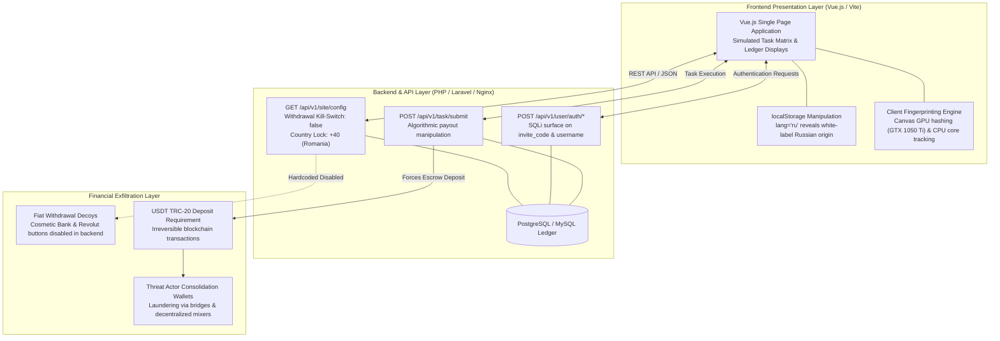

# Incident Analysis: Fraudulent Task Scam & Cryptocurrency Drainage Platform
**Case File Reference:** `SEC-2026-TASK-003`  
**Classification:** `TLP:CLEAR`  
**Investigation Date:** 17 April 2026  
**Primary Analyst:** `@stefanutc1`  

[](#)
[](#)
[](#)

---

## 1. Project Overview

This repository documents the forensic reverse engineering, backend API inspection, SQL injection surface analysis, and financial entrapment mechanics of a global **Task Scam / Pig Butchering platform**.

Organized fraud syndicates recruit victims through unsolicited WhatsApp, Telegram, and TikTok messages under the guise of flexible remote work ("optimizing e-commerce merchant ratings" or "app store reviews"). Victims are lured into registering on deceptive web applications using mandatory operator invitation codes (`888888`). While initial micro-tasks simulate rapid profit accumulation, attempting to withdraw funds reveals a hardcoded architectural lock requiring escalating **USDT (TRC-20) cryptocurrency deposits** that are permanently expropriated.

```text
/cyber/task-scam-infrastructure-analysis/
├── README.md               # Complete architectural analysis, API teardown, and IoCs
├── case_study.md           # Comprehensive forensic case study and threat actor profiling
├── API_exposure.md         # Detailed analysis of /api/v1/site/config kill-switch and parameters
├── SQLI.md                 # SQL Injection surface analysis on invite_code and username
├── fingerprinting.md       # Client-side hardware tracking and Canvas/WebGL fingerprinting
├── ui_manipulation.md      # Frontend state manipulation, Russian white-label localization leaks
└── investigation.md        # Investigative log and Burp Suite traffic analysis notes
```

---

## 2. Infrastructure Architecture & Fraudulent Data Flow

### 2.1 Technical Entrapment & Drainage Sequence

```mermaid
sequenceDiagram
    autonumber
    actor Victim as Target Consumer
    participant Recruiter as Threat Actor (Telegram / WhatsApp)
    participant UI as Vue.js Frontend WebApp
    participant API as Backend REST API (/api/v1/*)
    participant DB as Campaign Database & Ledger
    actor Bot as Blockchain Drain Engine (TRON TRC-20)

    Recruiter->>Victim: Unsolicited remote job offer + Invite Code "888888"
    Victim->>UI: Registers account using mobile number (+40 Romanian campaign)
    UI->>API: POST /api/v1/user/auth/register (invite_code: "888888")
    API->>DB: Stores victim profile; assigns initial simulated balance (e.g. 50 USDT)
    Victim->>UI: Completes simulated product evaluation tasks
    UI->>API: POST /api/v1/task/submit
    API->>UI: Returns fabricated commission gains (e.g. +$180 phantom balance)
    Victim->>UI: Attempts fiat cashout to Bank Account / Revolut
    UI->>API: GET /api/v1/site/config
    API-->>UI: Hardcoded kill-switch: withdrawMethodBank=false, withdrawMethodRevolut=false
    UI->>Victim: Error: "Fiat channel unavailable. VIP Task unlock requires 200 USDT deposit."
    Victim->>Bot: Transfers 200 USDT via TRC-20 to attacker address
    Bot->>API: Credit applied; immediately locks account with "Tax / Compliance Fee"
    Victim->>Recruiter: Inquires about withdrawal status
    Recruiter->>Victim: Demands secondary 500 USDT deposit; funds permanently lost
```

---

### 2.2 System Component Architecture



---

## 3. Deep-Dive Technical Findings

### 3.1 Unauthenticated Configuration Disclosure (`/api/v1/site/config`)
Interrogating the unauthenticated backend configuration endpoint disclosed the underlying operational rules of the scam infrastructure:

```json
{
  "code": 200,
  "data": {
    "siteName": "Global E-Commerce Task Hub",
    "defaultCountryCode": "+40",
    "withdrawMethodBank": false,
    "withdrawMethodRevolut": false,
    "minDepositUSDT": 50,
    "aiNewsFeed": [
      {
        "title": "Platform partners with top retailers",
        "date": "2026-08-01"
      }
    ]
  }
}
```

- **The Withdrawal Kill-Switch**: The backend explicitly sets `withdrawMethodBank: false` and `withdrawMethodRevolut: false`. Although the client UI displays sleek buttons for SEPA bank and Revolut cashouts, the backend rejects any non-crypto disbursement, trapping user funds.
- **Regional Targeting**: The `defaultCountryCode` parameter enforced `+40`, confirming deliberate targeting of the Romanian domestic market.
- **Fabricated Authority Feed**: The "AI NEWS" section is driven by static, hardcoded JSON objects with fabricated partner press releases designed to simulate corporate credibility.

### 3.2 SQL Injection (SQLi) Surface (`SQLI.md`)
- **Vulnerable Entry Points**: The `invite_code` parameter (validated as `888888` or `VIP999`) and the `username` parameter in `POST /api/v1/user/auth/login` exhibited clear signs of unparameterized string concatenation.
- **Time-Based Inference**: Injecting quote delimiters and sleep primitives produced measurable latency spikes in API responses, indicating unescaped query execution against campaign authentication tables.

### 3.3 Hardware Fingerprinting & Anti-Analysis (`fingerprinting.md`)
The web client executes aggressive fingerprinting stored in browser `localStorage`:
- **Canvas / WebGL Fingerprinting**: Renders invisible 2D/3D geometries to compute a unique hardware hash of the client's GPU (identifying the analysis environment's GTX 1050 Ti).
- **Hardware Architecture**: Queries `navigator.hardwareConcurrency` (2 cores in test sandbox) and OS architecture (`x86_64`).
- **Device Tracking UUIDs**: Persists `device_id` and `device_send` tokens across sessions to detect security researchers or multi-account bot probes.

### 3.4 White-Label Localization Leaks (`ui_manipulation.md`)
- Directly altering the `lang` key in browser `localStorage` to `ru` instantly translated the entire interface into Russian (`Регистрация`, `Авторизация`).
- Despite forcing Russian strings, the regional dialing prefix remained locked to `+40`, conclusively demonstrating that the platform is a commercial off-the-shelf white-label scam kit deployed by Russian-speaking developers and purchased by regional affiliate operators.

---

## 4. Indicators of Compromise (IoCs)

| Category | Identifier / Value | Threat Description |
| :--- | :--- | :--- |
| **API Endpoints** | `/api/v1/site/config` | Unauthenticated configuration disclosure endpoint exposing kill-switches. |
| **API Endpoints** | `/api/v1/user/auth/login`, `/register` | Authentication endpoints exhibiting SQL injection susceptibility. |
| **API Endpoints** | `/api/v1/task/submit` | Task execution endpoint returning fabricated commission values. |
| **Operator Invite Codes**| `888888`, `VIP999` | Referral identifiers linking victims to specific operator commission tiers. |
| **Targeted Crypto Rails**| USDT (Tether) over TRON (TRC-20) | Low-cost, fast settlement, irreversible blockchain layer. |
| **Technology Stack** | Vue.js SPA, PHP Laravel, Vite, Nginx | Signature software bundle used in Task Scam / Pig Butchering kits. |
| **Regional Dialing Lock**| `+40` (Romania) | Hardcoded national campaign restriction. |

---

## 5. MITRE ATT&CK Matrix Mapping

| Tactic | Technique ID | Technique Name | Operational Context |
| :--- | :--- | :--- | :--- |
| **Reconnaissance** | `T1592` | **Gather Victim Host Information** | Hardware profiling via Canvas, WebGL, and CPU core enumeration. |
| **Initial Access** | `T1566` | **Phishing: User Execution** | Unsolicited social media messages offering flexible high-yield work. |
| **Defense Evasion** | `T1027` | **Obfuscated Files or Information** | Minified client bundles, obfuscated UUID tracking, and CDN proxying. |
| **Impact** | `T1499` | **Financial Extortion / Resource Theft** | Irreversible extortion of cryptocurrency deposits through bogus withdrawal blockers. |

---

## 6. Defense-in-Depth Homelab Correlation

- **OPNsense Gateway (`192.168.1.1`):** Ingress DNS sinkholing of disposable Task Scam domains and TRON node API endpoints used by the scam kits.
- **Suricata IDS:** Alerting on unencrypted HTTP requests matching pattern `/api/v1/site/config` containing `withdrawMethodBank: false`.
- **Wazuh SIEM (LXC 150):** Correlation of endpoint browser logs connecting to high-risk task domains and tracking UUID exfiltration.

---

## 7. Practical Security Guidelines: DOs and DON'Ts

### 🛡️ WHAT TO DO (DOs) – Protective Actions

| Recommended Action | Detailed Instructions |
| :--- | :--- |
| **1. Recognize the Task Scam pattern immediately** | Any "job" that pays you to tap buttons, like products, rate videos, or "optimize algorithms" is 100% a fraudulent Ponzi / Pig Butchering trap. |
| **2. Cease all cryptocurrency deposits** | If a platform demands you deposit USDT, Bitcoin, or fiat to "unlock higher tasks", "pay tax", or "unfreeze your account", **stop immediately**. Depositing more will NEVER release previous funds. |
| **3. Block and report recruiters** | Report the WhatsApp or Telegram profiles to the platform's anti-spam desk and block the numbers immediately. |
| **4. Trace blockchain transactions on TRONSCAN** | Export the attacker's TRC-20 deposit address and transaction hashes (`txid`). Check on TRONSCAN / Etherscan to identify exchange deposit clusters (Binance, OKX, Bybit). |
| **5. File complaints with Exchange Compliance Desks** | If transaction hops reveal funds entering centralized exchanges, immediately submit an emergency fraud report with law enforcement case references to freeze the destination accounts. |

---

### 🚫 WHAT NOT TO DO (DON'Ts) – Critical Traps to Avoid

| Critical Trap | Threat Rationale |
| :--- | :--- |
| **❌ DO NOT pay "taxes", "security deposits", or "audit fees"** | Scammers will claim your balance is "under review" and require a 30% fee to release it. This is a secondary extortion attempt. |
| **❌ DO NOT trust "recovery agents" on social media** | Anyone contacting you on Telegram, Instagram, or Reddit claiming they can "hack into the blockchain" or "recover your lost USDT" is a secondary recovery scammer. Blockchain transactions cannot be reversed by third parties. |
| **❌ DO NOT believe initial micro-withdrawals** | Fraudsters intentionally allow a tiny initial withdrawal (e.g. $10 - $20) to build false trust and convince victims to deposit thousands later. |
| **❌ DO NOT provide personal identification (KYC) documents** | Do not upload ID cards, passports, or driver's licenses to task scam sites. They will be harvested and used to open fraudulent bank accounts or register new scam domains. |
