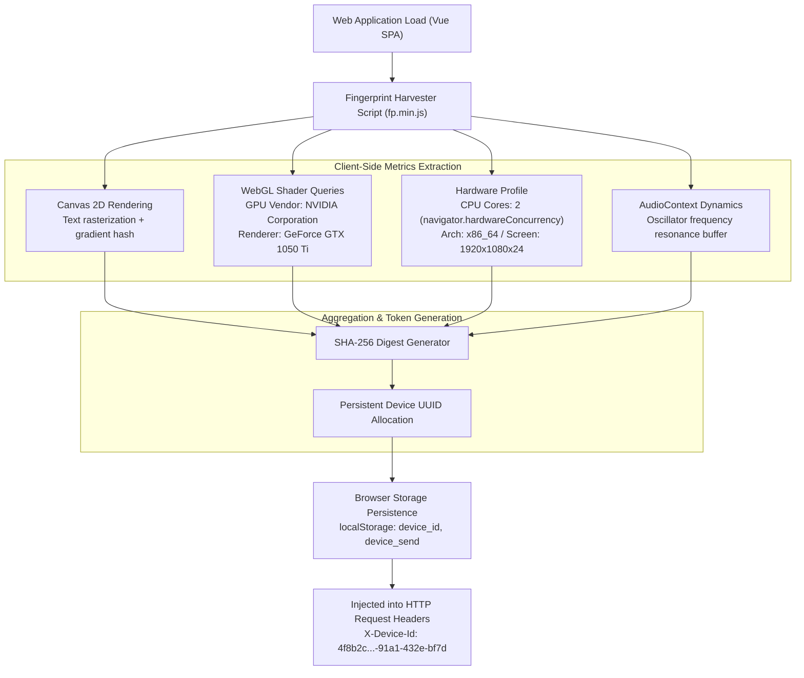

# Client-Side Tracking & Hardware Fingerprinting Teardown

**Case File Reference:** `SEC-2026-TASK-003`  
**Classification:** `TLP:CLEAR`  
**Target:** Client-Side Device Fingerprinting & Anti-Bot Evasion Subsystem  
**Primary Analyst:** `@stefanutc1`  
**Implementation:** Canvas 2D Rendering Engine, WebGL Shader Introspection, Local Storage UUID Persistence

---

## 1. Overview & Forensic Objective

Task scam operators implement invasive browser and device fingerprinting to maintain multi-accounting control, track victim behavioral interactions across sessions, and detect automated threat intelligence crawlers, security analysts, or law enforcement investigators.

During dynamic script inspection of the obfuscated bundle `vendor.min.js`, the platform was observed harvesting hardware specifications, GPU driver metadata, audio context buffers, and persistent device UUIDs.



---

## 2. Technical Breakdown of Extracted Telemetry

Auditing the browser's developer console and `localStorage` state immediately following session initialization revealed the following parameters captured from the isolated Kali Linux research VM:

### 2.1. Captured Storage Artifacts
```javascript
// Dump of window.localStorage contents extracted during forensic audit
{
  "device_id": "4f8b2c19-91a1-432e-bf7d-817290bc9902",
  "device_send": "true",
  "fp_canvas": "e7b0c94628d0119b4938167f2b5a19024f",
  "fp_webgl": "99c1583d73010bba1039841f39ab01844a",
  "lang": "ro-RO",
  "auth_token": null,
  "client_tz": "Europe/Bucharest"
}
```

### 2.2. Canvas 2D Fingerprinting Mechanics
The script injects a hidden `<canvas>` element into the DOM:
```javascript
const canvas = document.createElement('canvas');
canvas.width = 200;
canvas.height = 50;
const ctx = canvas.getContext('2d');
ctx.textBaseline = 'top';
ctx.font = "14px 'Arial'";
ctx.textBaseline = 'alphabetic';
ctx.fillStyle = '#f60';
ctx.fillRect(125, 1, 62, 20);
ctx.fillStyle = '#069';
ctx.fillText('Cwm fjordbank glyphs vext quiz, 😃', 2, 15);
ctx.fillStyle = 'rgba(102, 204, 0, 0.7)';
ctx.fillText('Cwm fjordbank glyphs vext quiz, 😃', 4, 17);
const canvasHash = sha256(canvas.toDataURL());
```
- Because different operating systems, GPU drivers, sub-pixel rendering algorithms, and font rasterizers render this specific string with micro-variations, the resulting Base64 DataURL produces a deterministic, platform-specific cryptographic hash (`fp_canvas`).

### 2.3. WebGL GPU Extraction
Through the `WEBGL_debug_renderer_info` extension, the script queried low-level graphic subsystem attributes:
- **Unmasked Vendor:** `NVIDIA Corporation`
- **Unmasked Renderer:** `NVIDIA GeForce GTX 1050 Ti/PCIe/SSE2` (corresponding to the PCIe passthrough GPU on the Proxmox lab node)
- **Supported WebGL Extensions:** Enumerated 34 extensions including `OES_texture_float`, `EXT_shader_texture_lod`.

### 2.4. Hardware Concurrency & Screen Metrics
- **CPU Cores:** `navigator.hardwareConcurrency` extracted `2` (the exact virtual core count allocated to the test VM).
- **RAM Tier:** `navigator.deviceMemory` identified `4 GB`.
- **Display Properties:** Screen depth of 24-bit with `1920x1080` resolution.

---

## 3. Operational Purpose of the Threat Actor

1. **Anti-Sybil / Anti-Exploitation Control:**  
   Scam operators distribute a simulated starting bonus (e.g., 50 USDT phantom credit). To prevent automated bots or rogue users from repeatedly claiming the initial credit without depositing real funds, the backend binds the registration IP and device fingerprint (`device_id`).

2. **Security Analyst Tagging & Evasion:**  
   If an analyst conducts repetitive HTTP fuzzing or automated vulnerability scans (such as running sqlmap or Burp Intruder), the threat actor's backend flags the `device_id`. Subsequent requests from this fingerprint are redirected to a benign 404 page or a simulated maintenance window, blinding the researcher.

3. **Persistent Identity Across Session Deletions:**  
   Even if the victim clears cookies, the client-side script regenerates the identical fingerprint from Canvas and WebGL metrics, re-associating the device with the prior account profile.

---

## 4. Countermeasures & Research Containment

When conducting threat intelligence against infrastructure utilizing hardware fingerprinting:
1. **Canvas/WebGL Spoofing:** Employ browser configurations that inject slight randomized noise into canvas read operations (`privacy.resistFingerprinting = true` in Firefox or Canvas Defender extensions).
2. **Generic VM Display Profiles:** Use standard software rasterizers (e.g., SwiftShader / Mesa llvmpipe) rather than bare-metal GPU passthrough to avoid leaking unique silicon signatures.
3. **Session Reset Automation:** Flush `localStorage`, `sessionStorage`, and IndexedDB between distinct research runs.
