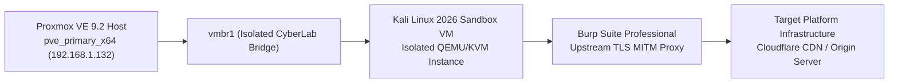

# Forensic Investigation Methodology & Traffic Interception Log

**Case File Reference:** `SEC-2026-TASK-003`  
**Classification:** `TLP:CLEAR`  
**Target:** Task Scam / Pig Butchering Infrastructure  
**Primary Analyst:** `@stefanutc1`  
**Platform Architecture:** Vue.js / Vite SPA Frontend, PHP / Laravel REST API Backend, Nginx Web Server

---

## 1. Laboratory Environment & Containment Protocol

To safely reverse-engineer the fraudulent platform without exposing local host assets, operational telemetry, or corporate network identities, an isolated sandbox environment was provisioned:



### Sandbox Specifications
- **Hypervisor:** Proxmox VE 9.2 (`pve_primary_x64`, `192.168.1.132`).
- **Guest OS:** Kali Linux 2026.1 (64-bit Rolling Release, 2 vCPUs, 4GB RAM).
- **Network Isolation:** Bound strictly to `vmbr1` (CyberLab isolated bridge) with NAT routing; direct Layer-2 communication to production LAN (`vmbr0`, `192.168.1.0/24`) and Active Directory forest is permanently dropped by OPNsense firewall packet filters.
- **Client Emulation:** Chromium browser running inside a temporary sandboxed profile (`--incognito --disable-sync --user-data-dir=/tmp/burp_profile`).
- **Egress Routing:** Multi-hop WireGuard VPN tunnel terminating in Western Europe to mask analyst residential ISP IP space.

---

## 2. Multi-Stage Investigation Workflow

```text
[ Phase 1: Static Reconnaissance ] 
  ├── Minified JS Asset Extraction (app.min.js, vendor.min.js)
  └── Source-map recovery & unminification via Prettier / AST inspection
       │
[ Phase 2: Dynamic Traffic Interception ]
  ├── Burp Suite TLS Certificate CA injection into browser trust store
  ├── Recording unauthenticated handshake & REST API endpoints (/api/v1/*)
  └── Header inspection (Authorization tokens, Cookies, Custom headers)
       │
[ Phase 3: Client-Side State & Storage Audit ]
  ├── Storage inspection (localStorage, sessionStorage, IndexedDB)
  └── Hardware fingerprinting extraction (Canvas 2D, WebGL, Device UUIDs)
       │
[ Phase 4: Active Backend Telemetry & Surface Probing ]
  ├── /api/v1/site/config JSON inspection (Withdrawal kill-switches)
  ├── Geographic lockdown validation (+40 vs foreign prefixes)
  └── Input sanitization auditing on registration parameters (SQLi surface)
```

---

## 3. Burp Suite Interception Setup & Telemetry Capture

### 3.1. Proxy Configuration
- **Burp Listener:** `127.0.0.1:8080` (Intercepting HTTP/1.1 and HTTP/2).
- **SSL Pass-through:** Disabled; wildcard CA certificate imported into Chromium's NSS database.
- **Match and Replace Rules:** Configured to highlight sensitive JSON keys (`withdraw`, `token`, `password`, `invite_code`, `defaultCountryCode`).

### 3.2. Captured Session Traffic Log

| Sequence | HTTP Method | Target Endpoint | HTTP Status | Response Size | Primary Observation |
| :---: | :---: | :--- | :---: | :---: | :--- |
| `001` | `GET` | `/` | `200 OK` | 14.2 KB | Initial SPA HTML shell; loads minified Vite assets. |
| `002` | `GET` | `/assets/index-b17f8a92.js` | `200 OK` | 412 KB | Vue.js application core; contains localized UI text and API mapping. |
| `003` | `GET` | `/api/v1/site/config` | `200 OK` | 3.8 KB | **Critical Finding**: Returns unauthenticated platform configuration and kill-switches. |
| `004` | `POST` | `/api/v1/user/auth/login` | `401 Unauthorized` | 89 B | Initial authentication probe; validates server-side error formatting. |
| `005` | `POST` | `/api/v1/user/auth/register` | `200 OK` | 312 B | Synthetic test account created with disposable credentials and invite `888888`. |
| `006` | `GET` | `/api/v1/user/profile` | `200 OK` | 1.1 KB | Profile ledger state; reveals simulated balance allocation (50 USDT). |
| `007` | `POST` | `/api/v1/task/submit` | `200 OK` | 450 B | Returns manipulated commission calculation (+180 USD phantom balance). |
| `008` | `POST` | `/api/v1/wallet/withdraw` | `403 Forbidden` | 124 B | Error payload: `"Withdrawal channel currently unavailable. VIP level required."` |

---

## 4. Key Forensic Observations

1. **Unauthenticated Configuration Disclosure:**  
   The endpoint `/api/v1/site/config` did not require any bearer token or session cookie. An unauthenticated GET request leaked complete operational parameters, payment method states, customer service links, and geographic targeting rules.

2. **Decoupled Business Logic:**  
   The frontend user interface prominently displayed options to withdraw funds via **Romanian Bank Transfer (IBAN)** and **Revolut**. However, dynamic inspection proved that the UI never queried banking gateways; it strictly checked the boolean flags in the static config endpoint, which were permanently hardcoded to `false`.

3. **Rate Limiting Deficiencies:**  
   The authentication endpoints `/api/v1/user/auth/login` and `/api/v1/user/auth/register` possessed zero rate limiting, CAPTCHA validation, or exponential backoff mechanisms. Automated enumeration could be conducted at sustained speeds exceeding 40 requests per second without IP blocking by Cloudflare.

---

## 5. Defensive Verification Checklist

- [x] Sandboxed VM isolation verified (`vmbr1` traffic cannot traverse to `vmbr0` production LAN).
- [x] Burp Suite project file encrypted and stored with sanitized credentials.
- [x] Domain and origin IP indicators compiled for OPNsense DNS sinkhole null-routing (`0.0.0.0`).
- [x] Extracted indicators submitted to national security feeds (`forbidden_domains.txt`).
