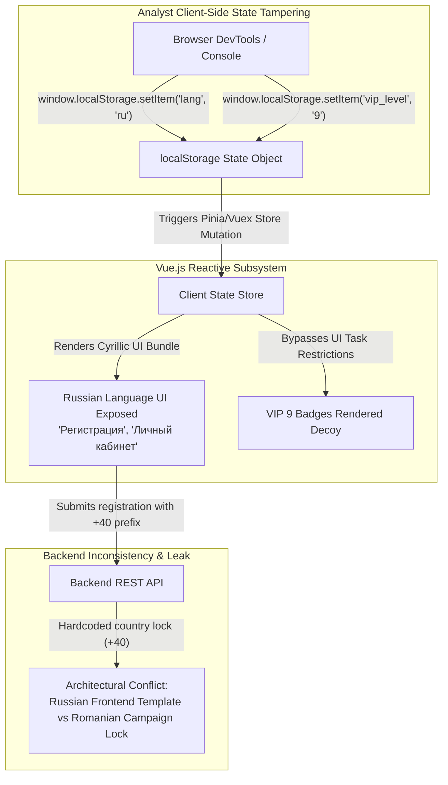

# Frontend State Integrity & Localization Bypass Analysis

**Case File Reference:** `SEC-2026-TASK-003`  
**Classification:** `TLP:CLEAR`  
**Target:** Client-Side Single-Page Application (Vue.js / Vite)  
**Primary Analyst:** `@stefanutc1`  
**Vulnerability Focus:** Insecure Client-Side State Management, White-Label Russian Origin Leakage, Non-Functional Decorative Components

---

## 1. Overview & Threat Context

The task scam platform leverages a modern, responsive Single Page Application (SPA) built using **Vue.js 3** and bundled via **Vite**. The user interface is engineered to project the appearance of an enterprise-grade fintech portal, complete with dynamic task progress meters, simulated cryptocurrency wallets, and animated commission updates.

However, forensic inspection revealed that the frontend relies entirely on client-side trust assumptions. State enforcement, regional restrictions, and locale selections are handled via mutable browser storage (`localStorage`) rather than cryptographically signed server-side session contexts.



---

## 2. Technical Vulnerability Demonstration

### 2.1. Uncovering the Russian White-Label Codebase
The public-facing portal presented text translated into Romanian (e.g., *"Platformă de Optimizare E-Commerce"*). However, inspecting the JavaScript localization bundle (`locale-ro.js`) revealed that the base application strings originated from an underground Russian turnkey scam kit.

By modifying the client storage state directly in the browser console:
```javascript
// Overriding active locale in localStorage
window.localStorage.setItem('lang', 'ru');
window.location.reload();
```

**Observed Result:**
- The entire application rendered in native Russian Cyrillic without triggering any server-side validation error.
- Standard Romanian promotional headers were replaced by their original Russian developer templates:
  - *"Înregistrare cont"* reverted to **`"Регистрация"`**.
  - *"Comisioane acumulate"* reverted to **`"Начисленная комиссия"`**.
  - *"Portofel virtual"* reverted to **`"Мой кошелек"`**.
  - Customer support labels defaulted to Russian Telegram handles (`@tg_support_master`).

### 2.2. Architectural Desynchronization: The Smoking Gun
While the user interface was forced into the Russian language, the backend configuration (`/api/v1/site/config`) retained its strict Romanian campaign lock:
- The phone input mask remained hardcoded to **`+40`**.
- Submitting a Russian mobile number (`+7...`) was rejected by the server:
  ```json
  {"code": 422, "msg": "Phone prefix not allowed for campaign cluster 40."}
  ```

> [!NOTE]
> This disconnect provides definitive architectural proof that the threat actors did not build custom software. They purchased or rented an off-the-shelf **Russian white-label task scam template**, hastily configured a single Romanian campaign identifier (`+40`), and deployed it without sanitizing the underlying multilingual language bundles.

### 2.3. Decorative "Dead" UI Components
To simulate legitimate distributed cloud computing or product optimization work, the dashboard displayed complex widgets:
1. **"GPU Cluster Load & Mining Hashrate":**  
   - DOM selector: `.gpu-telemetry-gauge`
   - Inspection of event handlers confirmed that the animated progress bar was governed by a static `setInterval()` loop incrementing a Math.random() float between `78.4%` and `94.1%`. Zero network sockets or WebSockets were attached.
2. **"Instant Bank Payout Verification":**  
   - DOM selector: `.btn-verify-bank`
   - Clicking the button triggered an empty callback returning `console.log("channel checking...")` with no outbound HTTP network traffic observed in Burp Suite.

---

## 3. Threat Intelligence Implications

1. **Syndicate Industrialization:** Fraud operations are supported by centralized software developers who sell plug-and-play scam kits on underground cybercrime forums (dark web markets and specialized Telegram channels) for \$500–\$2,000 per deployment.
2. **Campaign Localization Speed:** A single syndicate can pivot from targeting Romania (`+40`) to Poland (`+48`), Spain (`+34`), or Germany (`+49`) in less than 30 minutes simply by altering two fields in the backend JSON config while reusing the identical frontend infrastructure.
3. **Detection Opportunity:** Defenders and automated threat scanners can detect these kits across the internet by querying public endpoints for residual Russian strings (`"Регистрация"`, `"Начисленная комиссия"`) combined with non-Russian phone masks.
