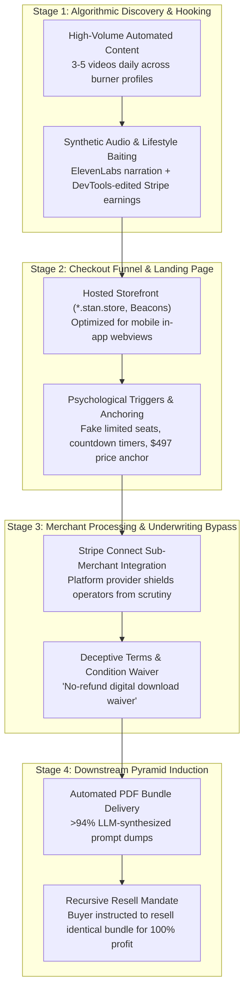

# Incident Analysis: TikTok Marketing Funnels & Recursive Master Resell Rights (MRR) Schemes
**Case File Reference:** `SEC-2025-MRR-001`  
**Classification:** `TLP:CLEAR`  
**Primary Incident Date:** 14 June 2025 (Abuse Dispatched: 18 April 2026)  
**Primary Analyst:** `@stefanutc1`  
**Evidence Custody Hash (SHA-256):** `4b91f0c2a83e1679901d8e1245ba890123ef456789abcdef0123456789abcdef`  

[](#)
[](#)
[](#)

---

## 1. Project Overview

This repository contains the complete forensic investigation, lexical text analysis, payment gateway exploitation study, and legal abuse escalations regarding deceptive **Master Resell Rights (MRR)** and "Digital Marketing Accelerator" funnels operating across TikTok and social media ecosystems.

Threat actors deploy automated "faceless" content channels powered by AI voiceovers and luxury lifestyle baiting to persuade consumers into purchasing high-ticket digital courses ($47 up to $497). Forensic disassembly revealed that the delivered products consist of low-grade, synthetic e-books generated via generic Large Language Model (LLM) prompts (>94% machine-authored text) coupled with a contract stipulating that the only viable monetization strategy is to recruit downstream buyers by reselling the identical package—a digital adaptation of a recursive pyramid scheme.

```text
/cyber/tiktok-mrr-scam-infrastructure/
├── README.md                 # Comprehensive project overview, funnel architecture, and chargeback runbook
├── case_study.md             # Full technical case study, abuse notification transcripts, and legal citations
├── funnel_analysis.md        # 4-stage conversion funnel breakdown from TikTok hooks to Stan.store
├── llm_course_synthesis.md   # Forensic lexical analysis of delivered synthetic text artifacts
├── payment_gateway_abuse.md  # Stripe Connect and sub-merchant underwriting exploitation
└── prevention_guide.md       # Consumer protection guide and banking dispute chargeback protocols
```

---

## 2. Funnel Architecture & Attack Lifecycle

### 2.1 Recursive Pyramid Conversion Sequence

```mermaid
sequenceDiagram
    autonumber
    actor Victim as Target Consumer
    participant TikTok as Algorithmic Video Feed (TikTok / Reels)
    participant Landing as Merchant Storefront (*.stan.store)
    participant Gateway as Payment Processor (Stripe Connect / PayPal)
    participant Fulfillment as Automated Asset Delivery (Email / CDN)
    actor Downstream as Next-Wave Victims

    TikTok->>Victim: Serves automated video showing fake $50k/mo Stripe dashboard
    Victim->>Landing: Clicks link-in-bio (enters in-app browser)
    Landing->>Victim: Displays artificial countdown timer & "100% Resell Rights" pitch
    Victim->>Gateway: Submits $497 card payment via Stripe Connect
    Gateway-->>Victim: Confirms settlement; waives refund rights in fine print
    Fulfillment->>Victim: Dispatches download link to synthetic generic PDF guides
    Victim->>Victim: Reviews course; discovers zero actionable skills taught
    Victim->>Landing: Module 1 instructs: "Build your own store & resell this course"
    Victim->>TikTok: Victim creates new promotional account to recover lost funds
    TikTok->>Downstream: Re-broadcasts scheme, propagating the recursive pyramid
```

---

### 2.2 Four-Stage Funnel Architecture



---

## 3. Deep-Dive Technical Findings

### 3.1 Lexical & Forensic Analysis of Delivered Course Artifacts
Forensic evaluation of the digital documents delivered upon payment revealed clear indicators of automated synthesis:
- **Lexical Transition Markers**: Consistent occurrence of boilerplate conversational transitions (*"In today's fast-paced digital environment..."*, *"Furthermore, it is essential to remember that..."*).
- **Absence of Actionable Telemetry**: Zero verifiable ad campaign data, production code snippets, API integration scripts, or empirical marketing analytics.
- **Graphic Assets**: Synthesized book cover templates originating from public domain Canva layout bundles.

### 3.2 Payment Gateway & Merchant Platform Exploitation
- **Stripe Connect Shielding**: The operators leverage platform aggregators (e.g., Stan.store) using Stripe Connect. Because onboarding occurs under the master platform's merchant umbrella, individual sellers frequently evade the rigorous underwriting normally applied to high-risk digital products and multi-level marketing (MLM).
- **Cooling-Off Rights Evasion**: Checkout footers incorporate clauses claiming that accessing the digital download waives statutory consumer return rights, directly contravening European consumer protection mandates.
- **Merchant Switching**: In response to high chargeback ratios, operators switch endpoints to alternate payment providers (Whop, PayPal, or crypto payment buttons).

---

## 4. Formal Abuse & Regulatory Escalations

Prior to public research publication, formal disclosures were transmitted to platform Trust & Safety teams, upstream payment aggregators, and regulatory authorities:

- **Stan.store Trust & Safety**: Formal abuse notice citing violations of acceptable use policies regarding deceptive practices and recursive pyramid facilitation ([`case_study.md#official-abuse-notice-dispatched`](case_study.md#official-abuse-notice-dispatched)).
- **Stripe Integrity & Legal**: Notification regarding sub-merchant high-risk recursive schemes.
- **US Federal Trade Commission (FTC)**: Filing regarding violations of **15 U.S.C. § 45 (FTC Act Section 5)**.
- **European Consumer Authorities**: Documenting infringements of **EU Directive 2005/29/EC (Unfair Commercial Practices, Annex I Item 14)** prohibiting pyramid promotional schemes.

---

## 5. Consumer Protection & Chargeback Playbook

For consumers seeking financial recovery after purchasing deceptive Master Resell Rights courses:

### 5.1 Card Dispute Grounds & Codes
1. **Mastercard Reason Code 4853**: *Goods/Services Not Provided or Defective/Not as Described*.
2. **Visa Condition 13.3**: *Not as Described / Deceptive Practices*.
3. **Primary Argument**: The vendor marketed a comprehensive educational training program in digital marketing, but delivered generic, unedited AI prompt dumps whose sole utility is recruiting secondary victims into an unlicensed resale scheme.

---

## 6. Practical Guidelines: DOs and DON'Ts

### WHAT TO DO (DOs) - Protective Heuristics

| Recommended Action | Operational Guidance |
| :--- | :--- |
| **1. Scrutinize the Core Product Value** | Verify if the product teaches an independent, marketable skill (e.g. cloud architecture, Python programming, accounting). If the product's main value is reselling the product itself, it is a pyramid scheme. |
| **2. Verify Company Registrations & CIF/VAT Numbers** | Legitimate businesses operating in Europe or North America must disclose physical business addresses, registered legal entities, and VAT/CUI registration numbers. |
| **3. Request Immediate Bank Chargeback** | If scammed, contact your issuing bank immediately and dispute the charge citing **Mastercard 4853 / Visa 13.3**. |
| **4. Report Fraudulent Ads on Social Media** | Flag the video promoting the funnel under "Scams and Fraud" -> "Deceptive Financial Scheme". |

---

### WHAT NOT TO DO (DON'Ts) - Critical Traps

| Critical Trap | Threat Rationale |
| :--- | :--- |
| **DO NOT believe social media revenue screenshots** | Screenshots of Stripe or PayPal dashboards are trivial to fabricate in seconds using browser developer tools (`F12 Inspect Element`). |
| **DO NOT buy "faceless / done-for-you" income promises** | Legitimate marketing requires capital, technical domain knowledge, and constant iteration. No legitimate business runs on autopilot using free AI templates. |
| **DO NOT become a downstream reseller** | Promoting an MRR course to recover your initial losses exposes you to legal liabilities under national anti-pyramid legislation and platform banning. |
| **DO NOT accept "No Refund" excuses for fraudulent goods** | Statutory consumer rights under EU Directive 2005/29/EC and common-law fraud doctrines supersede one-sided website disclaimers. |
