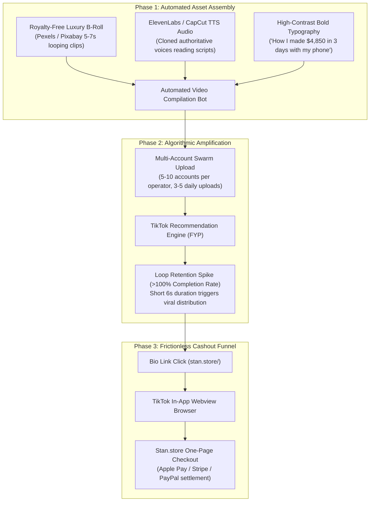

# Technical Teardown: Social Video Algorithmic Funnels & Synthetic Media Generation

**Case File Reference:** `SEC-2025-MRR-001`  
**Classification:** `TLP:CLEAR`  
**Investigation Scope:** Short-Form Video Algorithmic Exploitation, AI Voice Cloning, High-Velocity In-App Browser Funnel  
**Target Ecosystem:** TikTok FYP (For You Page) Recommendation Engine, CapCut Automation, Stan.store Checkout

---

## 1. Executive Metric Summary

| Dimension | Telemetry & Observational Metric | Operational Context |
| :--- | :--- | :--- |
| **Traffic Source** | TikTok For You Page (FYP) Recommendation Engine | Exploit of watch-time retention & algorithmic loop triggers |
| **Automation Pipeline** | CapCut Auto-Captions, ElevenLabs TTS, Selenium Uploaders | Zero human presence ("faceless" lifestyle accounts) |
| **Conversion Vector** | TikTok Profile Bio Link -> In-App Webview -> Stan.store | 1-click frictionless payment settlement (<45 seconds) |
| **Target Demographic** | Students, stay-at-home parents, Eastern European / Balkans | Economically vulnerable users seeking remote income |
| **Financial Threshold** | \$497.00 USD (Anchored against fake \$1,997 valuation) | Non-refundable digital license under Master Resell Rights |

---

## 2. Algorithmic Exploitation Mechanics on Short-Form Feeds

The Master Resell Rights (MRR) phenomenon relies on reverse-engineering the algorithmic mechanics of the TikTok recommendation engine to achieve mass reach without advertising expenditure.



### 2.1. The 6-Second Retention Loop Trigger
TikTok's recommendation engine heavily weights **Watch Time** and **Video Completion Rate**. Threat actors craft videos strictly between **5 and 7 seconds** in length:
- The video displays a wall of text that takes 8 to 10 seconds to read.
- As the user reads the text, the 6-second video loops in the background.
- This creates an artificial completion rate exceeding **130–150%**, tricking the recommendation algorithm into classifying the content as exceptionally engaging and pushing it to thousands of new feeds.

### 2.2. Multi-Account Swarm Automation
Operators do not manage single personal profiles. They deploy distributed swarms:
- 5 to 10 throwaway TikTok profiles managed via residential rotating proxies or 4G/5G mobile dongles to bypass IP velocity limits.
- Automated Python/Selenium or Appium scripts handle bulk scheduling, uploading, and tag injection (`#digitalmarketing`, `#sidehustle2026`, `#makemoneyonline`, `#mrr`).

---

## 3. In-App Browser to Landing Page Conversion Chain

When a victim clicks the link in the TikTok profile bio, the navigation occurs within the sandboxed **TikTok In-App Webview** rather than the device's native browser (Safari or Chrome):

```text
[ TikTok In-App Browser Session ]
   │
   ├── User taps Bio URL: https://stan.store/<creator_handle>
   │
   ▼
[ Stan.store Single-Page Checkout Architecture ]
   ├── High-conversion mobile viewport (optimized for impulsive touch actions)
   ├── Embedded peer-swapped video testimonials (fictitious social proof)
   ├── Artificial price anchoring: "$497" crossed out from alleged "$1,997 value"
   ├── Scarcity timer widget: "Only 3 digital copies remaining at this price"
   └── 1-Click Payment Settlement: Apple Pay / Google Pay / Stripe Connect
```

### Forensic Timing Analysis
By leveraging digital wallets (Apple Pay / Google Pay) integrated directly into the webview, the temporal gap between initial video impression and irrevocable financial authorization is compressed to **less than 45 seconds**. This eliminates the reflective cognitive buffer that typically prompts consumers to conduct independent web searches or scam verification.

---

## 4. Detection Signatures & Indicators

1. **Audio Fingerprinting:** Videos utilizing identical ElevenLabs speech-synthesis model audio files across diverse profile handles.
2. **Metadata Invariance:** Video files possessing identical FFMPEG encoding profiles and aspect ratios (`1080x1920`, 30fps, 5.8s duration).
3. **Common Referral Destinations:** Outbound navigation targeting `*.stan.store`, `*.beacons.ai`, or `*.linktr.ee` containing redirect parameters to Stripe checkout sessions.
