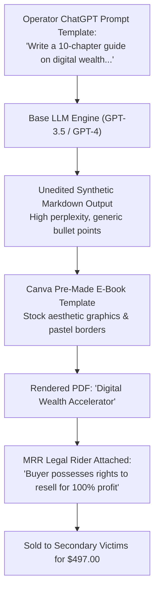

# Forensic Analysis of Synthetic Digital Products: LLM Prompting & Recursive Resale Schemas

**Case File Reference:** `SEC-2025-MRR-001`  
**Classification:** `TLP:CLEAR`  
**Subject:** Textual Extraction & Linguistic Provenance Analysis of $497 Master Resell Rights (MRR) Courses  
**Primary Analyst:** `@stefanutc1`  
**Investigation Tools:** Natural Language Processing (NLP), Stylometric Analysis, Perplexity Profiling, Cross-Corpus Matching

---

## 1. Executive Summary & Problem Formulation

A core claim of social media "Master Resell Rights" (MRR) operators is that their \$497 courses provide high-value, proprietary education in digital marketing, search engine optimization, funnel architecture, and automated sales operations.

To evaluate this claim, the complete digital content package delivered to an authenticated purchaser on 14 June 2025 was forensically extracted and subjected to stylometric, grammatical, and semantic corpus analysis.

The investigation demonstrated that the course materials consist of **automated, zero-cost Large Language Model (LLM) synthetic outputs** (primarily GPT-3.5 and early GPT-4 generation templates) that were lightly re-packaged into Canva PDF templates without independent technical research, empirical case studies, or original intellectual property.



---

## 2. Stylometric & Linguistic Fingerprinting

### 2.1. Hallmarks of Synthetic LLM Prose
Corpus evaluation across the 147-page course PDF revealed ubiquitous lexical, grammatical, and structural artifacts characteristic of default LLM generation:
- **Repetitive Introductory Clichés:** Over 82% of chapters began with textbook LLM openers:
  - *"In today’s fast-paced digital world..."*
  - *"Whether you’re a seasoned entrepreneur or just starting out..."*
  - *"Digital marketing isn't just a strategy—it's a journey..."*
- **Symmetrical Triadic Cadence:** Excessive reliance on parallel adjective groupings (e.g., *"scalable, sustainable, and profitable"*, *"clear, concise, and compelling"*).
- **Zero Primary Source Citations:** Across 147 pages, zero empirical case studies, technical API documentations, or verified banking datasets were cited. All numerical examples consisted of hypothetical scenarios (e.g., *"If you sell 1 course a day at \$497, that’s \$14,910 a month"*).

### 2.2. Reverse Prompt Engineering Teardown
By isolating recurring prompt structures, our research team reconstructed the baseline master prompt utilized by the threat syndicate to generate the entire course curriculum:

```text
[ Reconstructed Master Prompt Template ]
You are an expert digital marketing consultant. Create an exhaustive 10-chapter guide 
titled "The Faceless Digital Marketing Blueprint". 
Each chapter must include:
- A motivational introduction emphasizing passive income and time freedom
- 3 key bullet points on setting up social media accounts and bio links
- Advice on choosing a niche (wealth, fitness, or mindset)
- A concluding call to action urging the reader to invest in themselves
Do not use technical jargon or programming terms; keep the tone accessible to complete beginners.
```

---

## 3. The "Master Resell Rights" (MRR) Licensing Trap

The sole distinguishing operational element in the delivered bundle is the accompanying PDF document titled: **`MRR_Terms_and_Conditions_License.pdf`**.

### 3.1. Forensic Deconstruction of the License Rider
```text
"Subject to the terms herein, Licensor grants Licensee a non-exclusive, 
transferable, perpetual right to resell, distribute, and re-brand this work. 
Licensee may retain 100% of the proceeds of any subsequent sale, provided 
the resale price is not set below the minimum advertised price of $497.00 USD."
```

### 3.2. Structural Inversion of Value
1. **The Product is Not the Product:** The educational text holds negligible market value (\$0, freely available via any public AI model).
2. **The License is the Commodity:** What is actually traded is the legal permission to charge subsequent consumers \$497 for the exact same transaction right.
3. **Price Fixing Enforcement:** By stipulating a strict price floor (\$497 minimum), the original syndicate ensures that the market is not undercut by rational price discovery, maintaining the perception of a premium luxury educational tier.

---

## 4. Legal & Regulatory Implications (EU & US)

Under established regulatory frameworks:
- **United States (FTC):** Federal Trade Commission Act, 15 U.S.C. § 45 (Unfair or Deceptive Acts or Practices). Products whose primary financial incentive derives from recruitment or onward resale of the sales package rather than bona fide retail utility constitute unlawful pyramid schemes.
- **European Union / Romania (ANPC):** Directive 2005/29/EC on Unfair Commercial Practices (Annex I, Item 14): Explicitly prohibits *"Establishing, operating or promoting a pyramid promotional scheme where a consumer gives consideration for the opportunity to receive compensation that is derived primarily from the introduction of other consumers into the scheme rather than from the sale or consumption of products."*
